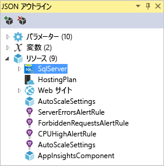
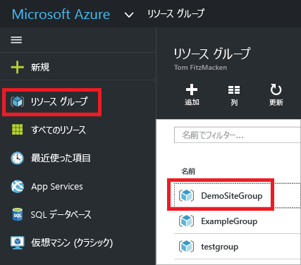
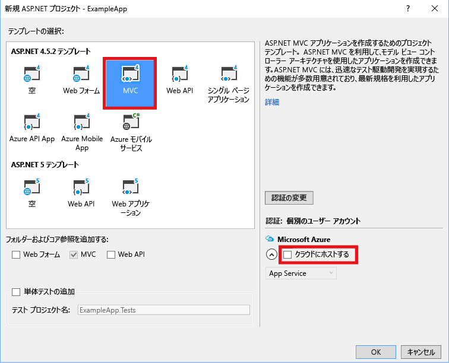
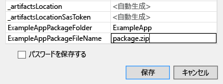

# Visual Studio での Azure リソース グループの作成とデプロイ
Visual Studio および [Azure SDK](https://azure.microsoft.com/downloads/)では、インフラストラクチャとコードを Azure にデプロイするプロジェクトを作成することができます。 たとえば、アプリ用に Web ホスト、Web サイト、およびデータベースを定義し、そのインフラストラクチャをコードと共にデプロイできます。 または、仮想マシン、仮想ネットワーク、およびストレージ アカウントを定義し、そのインフラストラクチャを、仮想マシンで実行するスクリプトと共にデプロイすることができます。 **Azure リソース グループ** デプロイ プロジェクトでは、必要なすべてのリソースを反復可能な単一の操作でデプロイできます。 リソースのデプロイと管理の詳細については、「[Azure Resource Manager の概要](resource-group-overview.md)」を参照してください。

Azure リソース グループ プロジェクトには、Azure にデプロイされるリソースを定義する Azure Resource Manager JSON テンプレートが含まれています。 リソース マネージャーのテンプレートの要素の詳細については、「 [Azure リソース マネージャーのテンプレートの作成](resource-group-authoring-templates.md)」を参照してください。 Visual Studio では、これらのテンプレートを編集することができ、テンプレートの操作を容易にするツールがサポートされています。

この記事では、Web アプリと SQL Database をデプロイします。 ただし手順は、リソースの種類に関係なくほぼ同じです。 仮想マシンおよびそれに関連するリソースも同じように簡単にデプロイできます。 Visual Studio では、一般的なシナリオのデプロイに適したさまざまなスターター テンプレートを多数用意しています。

この記事では Visual Studio 2017 を使っています。 Visual Studio 2015 Update 2 と Microsoft Azure SDK for .NET 2.9、または Visual Studio 2013 と Azure SDK 2.9 をご使用の場合、ここに記載した操作とほぼ同じです。 Azure SDK 2.6 以降のバージョンを使用できますが、この記事で説明しているユーザー インターフェイスとは操作が異なる場合があります。 手順を開始する前に、 [Azure SDK](https://azure.microsoft.com/downloads/) の最新バージョンをインストールすることを強くお勧めします。 

## Azure リソース グループ プロジェクトを作成する
この手順では、 **[Web アプリ + SQL]** テンプレートを使用して Azure リソース グループ プロジェクトを作成します。

1. Visual Studio で、**[ファイル]**、**[新しいプロジェクト]** の順に選択し、**[C#]** または **[Visual Basic]** を選択します。 次に **[クラウド]** を選択し、**[Azure リソース グループ]** プロジェクトを選択します。
   
    
2. Azure リソース マネージャーにデプロイするテンプレートを選択します。 デプロイするプロジェクトの種類に応じて、さまざまなオプションがあります。 この記事では、**[Web アプリ + SQL]** テンプレートを選択します。
   
    
   
    選択したテンプレートは出発点にすぎません。リソースを追加したり削除したりしてシナリオの要件を満たすことができます。
   
   > [!NOTE]
   > 使用できる一連のテンプレートが Visual Studio によってオンラインで取得されます。 その内容は変わる場合があります。
   > 
   > 
   
    Visual Studio では、Web アプリと SQL データベース用のリソース グループ デプロイ プロジェクトが作成されます。
3. 作成された内容を確認するには、デプロイ プロジェクト内のノードを表示します。
   
    
   
    この例では [Web アプリ + SQL] テンプレートを選択したため、次のファイルが表示されます。 
   
   | ファイル名 | Description |
   | --- | --- |
   | Deploy-AzureResourceGroup.ps1 |Azure リソース マネージャーにデプロイするために PowerShell コマンドを呼び出す PowerShell スクリプト。 **注** この PowerShell スクリプトは、テンプレートをデプロイするために Visual Studio によって使用されます。 このスクリプトに変更を加えると Visual Studio でのデプロイに影響するため、注意が必要です。 |
   | WebSiteSQLDatabase.json |Azure にデプロイするインフラストラクチャと、デプロイ中に指定できるパラメーターを定義した Resource Manager テンプレートです。 Resource Manager によってリソースが正しい順序でデプロイされるように、リソース間の依存性も定義されます。 |
   | WebSiteSQLDatabase.parameters.json |テンプレートで必要な値を含むパラメーター ファイルです。 パラメーターの値を渡すことによって各デプロイをカスタマイズします。 |
   
    すべてのリソース グループ デプロイ プロジェクトに、上記の基本的なファイルが含まれます。 他のプロジェクトには、他の機能をサポートするために追加のファイルが含まれることがあります。

## リソース マネージャーのテンプレートをカスタマイズする
デプロイするリソースが記述されている JSON テンプレートを変更すると、デプロイ プロジェクトをカスタマイズできます。 JSON とは JavaScript Object Notation の略であり、操作が簡単なシリアル化されたデータ形式です。 JSON ファイルでは、各ファイルの上部で参照されているスキーマが使用されます。 スキーマに関する理解を深めるには、スキーマをダウンロードして分析してください。 スキーマでは、有効な要素、フィールドの種類と形式、列挙値に使用できる値などが定義されています。 リソース マネージャーのテンプレートの要素の詳細については、「 [Azure リソース マネージャーのテンプレートの作成](resource-group-authoring-templates.md)」を参照してください。

テンプレートで作業するには、 **WebSiteSQLDatabase.json**を開きます。

Visual Studio エディターでは、Resource Manager テンプレートの編集に役立つツールを提供しています。 **[JSON アウトライン]** ウィンドウを使用すると、テンプレートで定義されている要素を簡単に確認できます。

アウトライン内の任意の要素を選択すると、テンプレートの該当部分に移動し、対応する JSON が強調表示されます。

リソースを追加するには、[JSON アウトライン] ウィンドウの上部にある **[リソースの追加]** ボタンを選択するか、または **[リソース]** を右クリックして **[新しいリソースの追加]** を選択します。

このチュートリアルでは、 **[ストレージ アカウント]** を選択し、それに名前を付けます。 数字と小文字のみで構成された 11 文字未満の名前を指定します。

リソースだけでなく、ストレージ アカウントの種類を示すパラメーターとストレージ アカウントの名前を示す変数も追加されています。

**storageType** パラメーターでは、許可する種類と既定の種類があらかじめ定義されています。 これらの値は、そのまま使用することも、シナリオに合わせて編集することもできます。 このテンプレートを使用して **Premium_LRS** ストレージ アカウントをデプロイするのをどのユーザーにも許可しない場合は、許可する種類からそれを削除します。 

    "storageType": {
      "type": "string",
      "defaultValue": "Standard_LRS",
      "allowedValues": [
        "Standard_LRS",
        "Standard_ZRS",
        "Standard_GRS",
        "Standard_RAGRS"
      ]
    }

Visual Studio では、テンプレートの編集時にどんなプロパティが使用できるのかを容易に理解できるように intellisense を提供しています。 たとえば、App Service プランのプロパティを編集するには、**HostingPlan** リソースに移動し、**properties** の値を追加します。 Intellisense では、使用できる値を示し、その値に関する説明を提供します。

**numberOfWorkers** は 1 に設定することができます。

    "properties": {
      "name": "[parameters('hostingPlanName')]",
      "numberOfWorkers": 1
    }

## リソース グループ プロジェクトを Azure にデプロイする
これでプロジェクトをデプロイする準備が整いました。 Azure リソース グループ プロジェクトをデプロイするとき、そのデプロイ先は Azure リソース グループとなります。 リソース グループとは、共通のライフサイクルを持ったリソースの論理上のまとまりです。

1. デプロイ プロジェクト ノードのショートカット メニューで **[デプロイ]** > **[New (新規)]** の順に選択します。
   
    ![メニュー項目 [配置]、[新しい配置]](./media/vs-azure-tools-resource-groups-deployment-projects-create-deploy/deploy.png)
   
    **[リソース グループに配置する]** ダイアログ ボックスが表示されます。
   
    ![[リソース グループに配置する] ダイアログ ボックス](./media/vs-azure-tools-resource-groups-deployment-projects-create-deploy/show-deployment.png)
2. **[リソース グループ]** ボックスの一覧で、既存のリソース グループを選択するか、新しいリソース グループを作成します。 リソース グループを作成するには、**[リソース グループ]** ボックスの一覧を開き、**[新規作成]** を選択します。
   
    ![[リソース グループに配置する] ダイアログ ボックス](./media/vs-azure-tools-resource-groups-deployment-projects-create-deploy/create-new-group.png)
   
    **[リソース グループの作成]** ダイアログ ボックスが表示されます。 グループの名前と場所を指定し、 **[作成]** ボタンを選択します。
   
    ![[リソース グループの作成] ダイアログ ボックス](./media/vs-azure-tools-resource-groups-deployment-projects-create-deploy/create-resource-group.png)
3. **[パラメーターの編集]** ボタンを選択すると、デプロイ用のパラメーターを編集できます。
   
    
4. 空のパラメーターの値を指定し、 **[保存]** ボタンを選択します。 対象となる空のパラメーターは、**hostingPlanName**、**administratorLogin**、**administratorLoginPassword**、**databaseName** です。
   
    **hostingPlanName** には、作成する [App Service プラン](../app-service/azure-web-sites-web-hosting-plans-in-depth-overview.md) の名前を指定します。 
   
    **administratorLogin** には、SQL Server 管理者のユーザー名を指定します。 **sa** や **admin** などの一般的な管理者名は使用しないようにしてください。 
   
    **administratorLoginPassword** には、SQL Server 管理者のパスワードを指定します。 **[パスワードをプレーンテキストとしてパラメーター ファイルに保存する]** オプションは安全ではないため、選択しないでください。 パスワードはプレーンテキストで保存されないため、デプロイ中にもう一度このパスワードを入力する必要があります。 
   
    **databaseName** には、作成するデータベースの名前を指定します。 
   
    ![[パラメーターの編集] ダイアログ ボックス](./media/vs-azure-tools-resource-groups-deployment-projects-create-deploy/provide-parameters.png)
5. **[デプロイ]** をクリックして、プロジェクトを Azure にデプロイします。 PowerShell コンソールが、Visual Studio インスタンスの外部で開きます。 PowerShell コンソールで SQL Server 管理者のパスワードの入力を求められた場合は、入力します。 **PowerShell コンソールが、他のアイテムの後ろに隠れていたり、タスクバーに最小化されたりしていることがあります。** その場合は、コンソールを見つけて選択し、パスワードを入力してください。
   
   > [!NOTE]
   > Azure PowerShell コマンドレットのインストールを求められる場合があります。 リソース グループを正しくデプロイするには、Azure PowerShell のコマンドレットが必要です。 メッセージが表示されたら、それらをインストールしてください。
   > 
   > 
6. デプロイには数分かかる場合があります。 **出力** ウィンドウに、デプロイの進行状況が表示されます。 デプロイが完了すると、最後に、デプロイが成功したことを示す次のようなメッセージが表示されます。
   
        ... 
        18:00:58 - Successfully deployed template 'websitesqldatabase.json' to resource group 'DemoSiteGroup'.
7. ブラウザーで、 [Azure Portal](https://portal.azure.com/) を開き、アカウントにサインインします。 リソース グループの内容を確認するには、 **[リソース グループ]** を選択し、デプロイしたリソース グループを選択します。
   
    
8. デプロイ済みのすべてのリソースが表示されます。 ストレージ アカウントの名前が、そのリソースを追加したときに指定したものとまったく同じにはならないことに注意してください。 ストレージ アカウントは一意である必要があります。 一意の名前を設定するために、指定した名前に文字列が自動的に追加されます。 
   
    
9. 変更を加えたうえでプロジェクトを再デプロイする場合は、Azure リソース グループ プロジェクトのショートカット メニューから既存のリソース グループを選択します。 ショートカット メニューの **[デプロイ]**を選択してから、デプロイしたリソース グループを選択します。
   
    

## インフラストラクチャでコードをデプロイする
この時点で、アプリ用のインフラストラクチャはデプロイ済みですが、実際のコードはプロジェクトでデプロイされていません。 この記事では、デプロイ時に Web アプリと SQL Database テーブルをデプロイする方法について説明します。 Web アプリではなく仮想マシンをデプロイする場合は、デプロイの一環としてマシン上で何らかのコードを実行します。 Web アプリのコードをデプロイするプロセスまたは仮想マシンを設定するプロセスは、ほぼ同じです。

1. Visual Studio ソリューションにプロジェクトを追加します。 ソリューションを右クリックして、**[追加]** > **[新しいプロジェクト]** の順に選択します。
   
    
2. **ASP.NET Web アプリケーション**を追加します。 
   
    
3. **[MVC]** を選択します。
   
    
4. Visual Studio によって Web アプリが作成されると、ソリューションに両方のプロジェクトが表示されます。
   
    
5. 次に、リソース グループ プロジェクトで新しいプロジェクトが認識されていることを確認する必要があります。 リソース グループ プロジェクト (AzureResourceGroup1) に戻ります。 **[参照]** を右クリックし、**[参照の追加]** を選択します。
   
    ![[参照の追加]](./media/vs-azure-tools-resource-groups-deployment-projects-create-deploy/add-new-reference.png)
6. 作成した Web アプリ プロジェクトを選択します。
   
    ![[参照の追加]](./media/vs-azure-tools-resource-groups-deployment-projects-create-deploy/add-reference.png)
   
    参照を追加することで、リソース グループ プロジェクトに Web アプリ プロジェクトをリンクし、3 つのキー プロパティを自動的に設定します。 これらのプロパティはその参照の **[プロパティ]** ウィンドウに表示されます。
   
      
   
    プロパティは次のとおりです。
   
   * **[追加のプロパティ]** には Azure Storage にプッシュされる Web デプロイ パッケージのステージングの場所が含まれます。 フォルダー (ExampleApp) とファイル (package.zip) をメモします。 これらの値は、アプリケーションをデプロイする際にパラメーターとして指定するため、知っておく必要があります。 
   * **[Include File Path (ファイル パスを含める)]** にはパッケージを作成するパスが含まれます。 **[Include Targets (ターゲットを含める)]** にはデプロイで実行するコマンドが含まれます。 
   * **Build;Package** の既定値を使用すると、デプロイでは、Web デプロイ パッケージ (package.zip) がビルドおよび作成されます。  
     
     パッケージを作成するのに必要な情報はプロパティから取得するので、デプロイで発行プロファイルは必要ありません。
7. WebSiteSQLDatabase.json に戻ってテンプレートにリソースを追加します。
   
    
8. 今回は **[Web App の Web 配置]**を選択します。 
   
    
9. リソース グループにリソース グループ プロジェクトを再デプロイします。 今回は、新しいパラメーターがいくつか存在します。 **_artifactsLocation** または **_artifactsLocationSasToken** の値は自動的に生成されるので、指定する必要はありません。 ただし、デプロイ パッケージが含まれているパスにフォルダーとファイル名を設定します (次の図の **ExampleAppPackageFolder** と **ExampleAppPackageFileName**)。 事前にメモしておいた値を参照プロパティに指定します (**ExampleApp** と **package.zip**)。
   
    
   
    **[成果物のストレージ アカウント]**には、このリソース グループでデプロイしたものを選択できます。
10. デプロイが完了したら、ポータルで Web アプリを選択します。 URL を選択して新しいサイトを参照します。
    
     
11. 既定の ASP.NET アプリが正しくデプロイされていることがわかります。
    
     

## 次のステップ
* ポータルを使用したリソース管理の詳細については、 [Azure Portal を使用した Azure リソースの管理](resource-group-portal.md)に関するページを参照してください。
* テンプレートの詳細については、「 [Azure Resource Manager のテンプレートの作成](resource-group-authoring-templates.md)」を参照してください。

