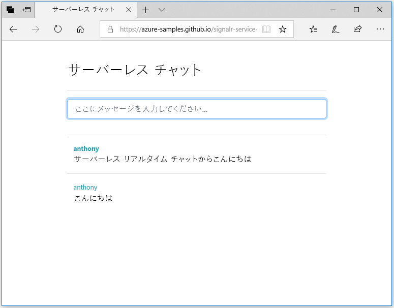

## Web アプリケーションの実行

1. 利便性のために、サンプルのシングルページ Web アプリケーションが GitHub で公開されています。 ブラウザーで [https://azure-samples.github.io/signalr-service-quickstart-serverless-chat/demo/chat-v2/](https://azure-samples.github.io/signalr-service-quickstart-serverless-chat/demo/chat-v2/) を開きます。

    > [!NOTE]
    > HTML ファイルのソースは [/docs/demo/chat-v2/index.html](https://github.com/Azure-Samples/signalr-service-quickstart-serverless-chat/blob/master/docs/demo/chat-v2/index.html) にあります。

1. 関数アプリのベース URL の入力を求められたら、「`http://localhost:7071`」と入力します。

1. 入力を求められたら、ユーザー名を入力します。

1. Web アプリケーションは関数アプリで *GetSignalRInfo* 関数を呼び出して、Azure SignalR Service に接続するための接続情報を取得します。 接続が完了すると、チャット メッセージ入力ボックスが表示されます。

1. メッセージを入力して Enter キーを押します。 アプリケーションは Azure Function アプリで *SendMessage* 関数にメッセージを送信します。次に、この関数が SignalR 出力バインディングを使用して、接続されているすべてのクライアントにメッセージをブロードキャストします。 すべてが正しく動作している場合、アプリケーションでメッセージが表示されます。

    

1. Web アプリケーションの別のインスタンスを、別のブラウザー ウィンドウで開きます。 送信したメッセージがアプリケーションのすべてのインスタンスで表示されることを確認します。

> [!IMPORTANT]
> HTML ページは HTTPS を使用して返されますが、ローカルの Azure Functions Runtime には HTTP が既定で使用されます。そのため、お使いのブラウザー (Firefox など) によって矛盾したコンテンツ ポリシーが強制され、Web ページから関数への要求がブロックされることがあります。 これを解決するためには、この制限がないブラウザーを使用するか、またはローカル HTTP サーバー (*/docs/demo/chat-v2* ディレクトリの [http-server](https://www.npmjs.com/package/http-server) など) を起動します。 *local.settings.json* の `CORS` 設定にオリジンが追加されていることを確認してください。