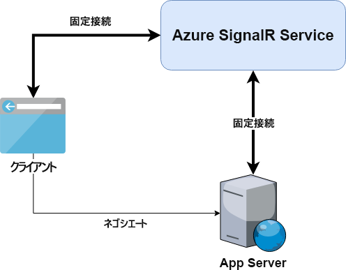

# <a name="azure-signalr-service-internals"></a>Azure SignalR Service の内部

Azure SignalR Service は、ASP.NET Core SignalR フレームワーク上に構築されています。 ASP.NET SignalR もプレビュー機能としてサポートしています。

> ASP.NET SignalR をサポートするために、Azure SignalR Service は ASP.NET Core フレームワーク上に ASP.NET SignalR のデータ プロトコルを再実装しています

コードを数行変更するだけで、ローカルの ASP.NET Core SignalR アプリケーションを簡単に移行して、SignalR Service と連携させることができます。

以下の図には、アプリケーション サーバーと SignalR Service を使用する場合の一般的なアーキテクチャが示されています。

セルフホステッド ASP.NET Core SignalR アプリケーションとの相違点についても説明します。



## <a name="server-connections"></a>サーバー接続

セルフホステッド ASP.NET Core SignalR アプリケーション サーバーはクライアントをリッスンし、クライアントに直接接続します。

SignalR Service を使用すると、アプリケーション サーバーは永続的なクライアント接続を受け入れる必要がなくなり、代わりに、次のようになります。

1. 各ハブの `negotiate` エンドポイントが Azure SignalR Service SDK によって公開されます。
1. このエンドポイントがクライアントのネゴシエーション要求に応答し、クライアントを SignalR Service にリダイレクトします。
1. 最終的に、クライアントが SignalR Service に接続されます。

詳しくは、「[クライアント接続](#client-connections)」を参照してください。

アプリケーション サーバーが起動すると、次のようになります。 
- ASP.NET Core SignalR の場合、Azure SignalR Service SDK により、SignalR Service への WebSocket 接続がハブあたり 5 個開かれます。 
- ASP.NET SignalR の場合、Azure SignalR Service SDK により、SignalR Service への WebSocket 接続がハブあたり 5 個と、WebSocket 接続がアプリケーションあたり 1 個開かれます。

5 個の WebSocket 接続は既定値です。[構成](https://github.com/Azure/azure-signalr/blob/dev/docs/use-signalr-service.md#connectioncount)内で変更できます。

クライアントとの間のメッセージは、これらの接続に多重化されます。

これらの接続は常に SignalR Service に接続されたままになります。 ネットワークの問題により、サーバー接続が切断された場合は、次のようになります。
- このサーバー接続を利用するすべてのクライアントが切断されます (詳しくは、「[クライアントとサーバー間のデータ転送](#data-transmit-between-client-and-server)」を参照してください)。
- サーバー接続が自動的に再接続を開始します。

## <a name="client-connections"></a>クライアント接続

SignalR Service を使用する場合、クライアントはアプリケーション サーバーではなく SignalR Service に接続します。
クライアントと SignalR Service の間の永続的な接続は、2 つの手順によって確立されます。

1. クライアントがアプリケーション サーバーにネゴシエート要求を送信します。 アプリケーション サーバーは、Azure SignalR Service SDK を使用して、SignalR Service の URL とアクセス トークンを含むリダイレクト応答を返します。

- ASP.NET Core SignalR の場合、標準的なリダイレクト応答は次のようになります。
    ```
    {
        "url":"https://test.service.signalr.net/client/?hub=chat&...",
        "accessToken":"<a typical JWT token>"
    }
    ```
- ASP.NET SignalR の場合、標準的なリダイレクト応答は次のようになります。
    ```
    {
        "ProtocolVersion":"2.0",
        "RedirectUrl":"https://test.service.signalr.net/aspnetclient",
        "AccessToken":"<a typical JWT token>"
    }
    ```

1. リダイレクト応答を受信すると、クライアントは新しい URL とアクセス トークンを使用して、通常の SignalR Service 接続プロセスを開始します。

詳しくは、ASP.NET Core SignalR の[トランスポート プロトコル](https://github.com/aspnet/SignalR/blob/release/2.2/specs/TransportProtocols.md)に関するページを参照してください。

## <a name="data-transmit-between-client-and-server"></a>クライアントとサーバー間のデータ転送

クライアントが SignalR Service に接続すると、サービス ランタイムによって、このクライアントに使用するサーバー接続が検索されます。
- この手順は 1 回だけ実行されます。クライアントとサーバー接続のマッピングは 1 対 1 です。
- このマッピングは、クライアントまたはサーバーが切断されるまで SignalR Service に保持されます。

この時点で、アプリケーション サーバーは新しいクライアントからの情報を含むイベントを受け取ります。 クライアントへの論理接続がアプリケーション サーバーに作成されます。 SignalR Service 経由でクライアントからアプリケーション サーバーへのデータ チャネルが確立されます。

SignalR Service により、クライアントからのデータはペアになっているアプリケーション サーバーに転送されます。 アプリケーション サーバーからのデータはマッピングされているクライアントに送信されます。

ご覧のように、Azure SignalR Service は基本的にアプリケーション サーバーとクライアント間の論理トランスポート層です。 すべての永続的な接続が SignalR Service にオフロードされます。
アプリケーション サーバーでは、ハブ クラス内でビジネス ロジックの処理のみを行う必要があります。クライアント接続について心配することはありません。