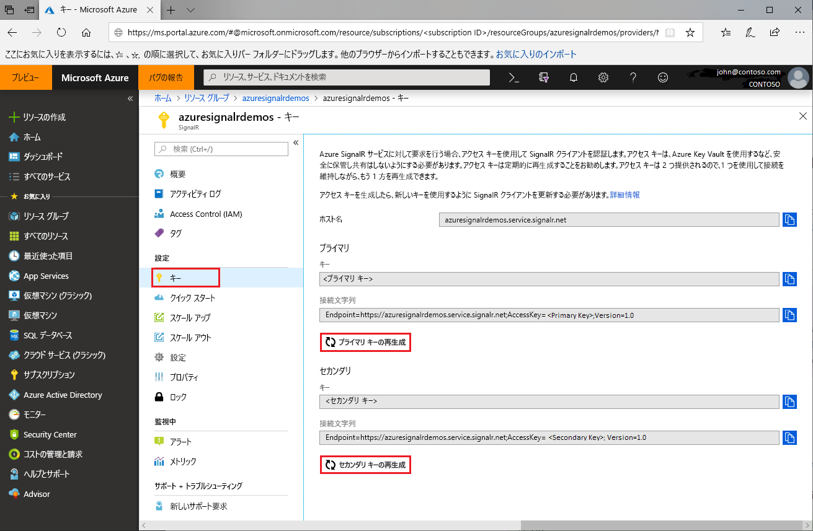

# Azure SignalR Service のアクセス キーのローテーション

それぞれの Azure SignalR Service インスタンスには、アクセス キーのペア (主キーとセカンダリ キー) が提供されます。 これらのキーは、サービスへの要求を行うときに SignalR クライアントを認証するために使用されます。 キーは、インスタンス エンドポイントの url に関連付けられます。 キーは安全に保ち、定期的にローテーションしてください。 アクセス キーは 2 つ提供されるため、1 つのキーを使用して接続を保ったままもう 1 つのキーを再生成できます。

## アクセス キーをローテーションする理由

セキュリティ上の理由とコンプライアンス要件により、開発者は定期的にアクセス キーをローテーションすることをお勧めします。

## アクセス キーを再生成する方法

1. [Azure portal](https://portal.azure.com/) に移動し、資格情報を使用してサインインします。

1. キーを再生成する Azure SignalR Service インスタンスで **[キー]** セクションを見つけます。

1. ナビゲーション メニューで **[キー]** をクリックします。

1. **[プライマリ キーの再生成]** または **[セカンダリ キーの再生成]** をクリックします。

新しいキーとそれに対応する接続文字列が作成されて表示されます。

 

キーは、[Azure CLI](/cli/azure/ext/signalr/signalr/key?view=azure-cli-latest#ext-signalr-az-signalr-key-renew) を使用して再生成することもできます。

## 新しい接続文字列を使用した構成の更新

1. 新しく生成された接続文字列をコピーします。

1. 新しい接続文字列を使用するようにすべての構成を更新します。

1. 必要に応じて、アプリケーションを再起動します。

## 強制的なアクセス キーの再生成

Azure SignalR Service では、特定の状況下で必須のアクセス キーの再生成が強制的に実行されることがあります。 このサービスでは、電子メールとポータル通知を使用して顧客への通知が行われます。 この通知を受信した場合やアクセス キーを原因とするサービス エラーが発生した場合は、このガイドの手順に従ってキーをローテーションしてください。

## 次の手順

適切なセキュリティ プラクティスとして、アクセス キーを定期的にローテーションすることをお勧めします。

このガイドでは、アクセス キーを再生成する方法について学習しました。 OAuth または Azure Functions を使用した認証に関する次のチュートリアルに進んでください。

> [!div class="nextstepaction"]
> [ASP.NET Core Identity と統合する](./signalr-authenticate-oauth.md)

> [!div class="nextstepaction"]
> [認証を使用してサーバーレスのリアルタイム アプリを構築する](./signalr-authenticate-azure-functions.md)