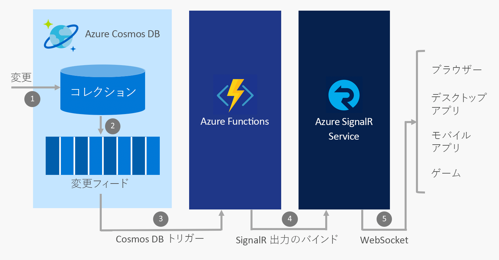

# Azure Functions および Azure SignalR サービスを使用してリアルタイム アプリをビルドする

Azure SignalR サービスと Azure Functions はどちらもインフラストラクチャを管理するのではなく、アプリケーションの構築に専念できる非常にスケーラブルなフルマネージド サービスであるため、2 つのサービスを併用してサーバーレス環境でリアルタイム通信を提供するのが一般的です。

## Azure サービスとのリアルタイム通信の統合

Azure Functions では、クラウド内でイベントが発生するたびにトリガーするコードを、JavaScript、C#、Java などの[いくつかの言語](../azure-functions/supported-languages.md)で記述できます。 これらのイベントの例は次のとおりです。

* HTTP と webhook の要求
* 定期的なタイマー
* 次のような Azure サービスからのイベント。
    - Event Grid
    - Event Hubs
    - Service Bus
    - Cosmos DB 変更フィード
    - ストレージ - BLOB およびキュー
    - Salesforce や SQL Server などの Logic Apps コネクタ

Azure Functions を使用してこれらのイベントを Azure SignalR サービスと統合することによって、イベントが発生したことを数千のクライアントに通知できます。

Azure Functions と Azure SignalR サービスで実装できるリアルタイム サーバーレス メッセージングの一般的なシナリオは、次のとおりです。

* IoT デバイスのテレメトリをリアルタイム ダッシュ ボードまたはマップ上で可視化します
* Cosmos DB のドキュメントを更新したときにアプリケーションのデータを更新します
* Salesforce で新しい注文が作成されたときにアプリ内通知を送信します

## Azure Functions における SignalR サービスのバインド

Azure Functions における SignalR サービスのバインドによって、Azure Function アプリは SignalR サービスに接続されているクライアントにメッセージを発行できます。 クライアントは、.NET、JavaScript、および Java で利用可能な SignalR クライアント SDK を使用してサービスに接続できます (他の言語も近いうちに利用可能になる予定です)。

### シナリオ例

SignalR サービスのバインドを使用する方法の例として、Azure Functions を使用して Azure Cosmos DB および SignalR サービスと統合し、Cosmos DB 変更フィードに新しいイベントが表示されたときにリアルタイム メッセージを送信することがあります。

1. Cosmos DB コレクションが変更されます
2. Cosmos DB 変更フィードに変更イベントが反映されます
3. Cosmos DB トリガーを使用する変更イベントによって Azure Functions がトリガーされます
4. SignalR サービスの出力バインドは、SignalR サービスにメッセージを発行します
5. SignalR サービスは、接続されているすべてのクライアントにメッセージを発行します

### 認証およびユーザー

SignalR サービスでは、すべてのクライアントや、単一のユーザーに属しているなどのクライアントのサブセットにのみメッセージをブロードキャストすることができます。 Azure Functions 向けの SignalR サービスのバインドは、App Service 認証と組み合わせることで、Azure Active Directory、Facebook、Twitter などのプロバイダーでユーザーを認証できます。 これらの認証されたユーザーにメッセージを直接送信できます。

## 次の手順

この記事では、SignalR サービスと Azure Functions を使用して、さまざまなサーバーレス リアルタイム メッセージング シナリオを有効にする方法についての概要を把握しました。 詳細については、これらのいずれかのクイック スタートを参照してください。

* [Azure SignalR サービス サーバーレス クイック スタート - C#](signalr-quickstart-azure-functions-csharp.md)
* [Azure SignalR サービス サーバーレス クイック スタート - JavaScript](signalr-quickstart-azure-functions-javascript.md)

