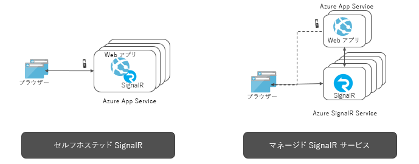

# Azure SignalR サービスとは

Azure SignalR サービスは、リアルタイムの Web 機能を HTTP 経由でアプリケーションに追加するプロセスを簡略化します。 このリアルタイム機能は、サービスが、接続されているクライアントにシングル ページ Web やモバイル アプリケーションなどのコンテンツの更新をプッシュできるようにします。 その結果、クライアントは、サーバーをポーリングしたり更新プログラムについて新しい HTTP 要求を送信したりしなくても更新されます。

この記事では、Azure SignalR サービスの概要について説明します。

## Azure SignalR サービスの用途

サーバーからクライアントにリアルタイムでデータをプッシュする必要があるすべてのシナリオで Azure SignalR Service を使用できます。

サーバーからのポーリングを通常必要とする従来のリアルタイム機能でも Azure SignalR Service を使用できます。

Azure SignalR Service は、リアルタイムでのコンテンツ更新を必要とするあらゆる種類のアプリケーションのために、さまざまな業界で使用されています。 Azure SignalR Service を使用するのに適した例をいくつか示します。

* **頻度の高いデータの更新:** ゲーム、投票、ポーリング、オークション。
* **ダッシュ ボードと監視:** 会社のダッシュボード、金融市場のデータ、売上の即時更新、マルチ プレイヤー ゲームのスコア ボード、および IoT 監視。
* **チャット:** ライブ チャット ルーム、チャット ボット、オンライン カスタマー サポート、リアルタイムのショッピング アシスタント、メッセンジャー、ゲーム内チャットなど。
* **地図上のリアルタイムの位置:** 物流の追跡、配送状態の追跡、輸送状態の更新、GPS アプリ。
* **対象を絞ったリアルタイムの広告:** パーソナライズされた読み取り時間のプッシュ型広告およびオファー、対話型広告。
* **コラボレーション アプリ:** 共同作成、ホワイトボード アプリ、チーム会議ソフトウェア。
* **プッシュ通知:** ソーシャル ネットワーク、電子メール、ゲーム、移動に関するアラート。
* **リアルタイムのブロードキャスト:** ライブ オーディオ/ビデオのブロードキャスト、ライブ キャプション、翻訳、イベント/ニュースのブロードキャスト。
* **IoT デバイスおよび接続されているデバイス:** リアルタイムの IoT メトリック、リモート制御、リアルタイムの状態、および場所の追跡。
* **オートメーション:** アップストリーム イベントからのリアルタイム トリガー。

## Azure SignalR Service を使用する利点とは

**標準ベース:**

SignalR では、リアルタイム Web アプリケーションの構築に使用される多くの手法の抽象化が提供されます。 [WebSocket](https://wikipedia.org/wiki/WebSocket) が最適なトランスポートですが、他のオプションを使用できないときは、[Server-Sent Events (SSE)](https://wikipedia.org/wiki/Server-sent_events) や長いポーリングなどの他の手法が使用されます。 SignalR はサーバーとクライアントでサポートされる機能に基づいて、適切なトランスポートを自動的に検出し、初期化します。

**ネイティブ ASP.NET Core のサポート:**

SignalR Service では、ASP.NET Core と ASP.NET によるネイティブ プログラミングを使用できます。 SignalR Service を使用して新しい SignalR アプリケーションを開発する場合も、既存の SignalR ベースのアプリケーションから SignalR Service に移行する場合も、必要な労力は最小限です。
SignalR Service は、ASP.NET Core の新しい機能であるサーバー側 Blazor もサポートしています。

**広範なクライアントのサポート:**

SignalR Service は、Web ブラウザー、モバイル ブラウザー、デスクトップ アプリ、モバイル アプリ、サーバー プロセス、IoT デバイス、ゲーム コンソールなど、幅広い範囲のクライアントに対応しています。 SignalR Service では、さまざまな言語の SDK が提供されています。 また、SignalR Service では、Web クライアントおよび多数の JavaScript フレームワークを使用できるようにするために、ネイティブの ASP.NET Core SDK や ASP.NET C# SDK に加えて、JavaScript クライアント SDK も提供されています。 Java クライアント SDK では、Android ネイティブ アプリなどの Java アプリケーションもサポートされます。 SignalR Service は、REST API をサポートしており、また Azure Functions および Event Grid との統合を通じてサーバーレスをサポートしています。

**大規模なクライアント接続を処理:**

SignalR Service は、大規模なリアルタイム アプリケーション向けに設計されています。 SignalR Service により、数百万のクライアント接続に対応するために複数のインスタンスが連携して動作できます。 このサービスは、シャーディング、高可用性、ディザスター リカバリーの目的で、複数のグローバル リージョンもサポートしています。

**SignalR をセルフホストする負担を解消:**

SignalR Service に切り替えると、セルフホスト型の SignalR アプリケーションと比較して、スケールとクライアント接続を処理するバック プレーンを管理する必要がなくなります。 また、このフル マネージド サービスにより、Web アプリケーションが簡素化され、ホスティングのコストを削減できます。 SignalR Service は、グローバルに展開する最高水準のデータ センターとネットワークを提供しており、数百万の接続に対応し、SLA を保証します。その一方で、Azure 標準のコンプライアンスとセキュリティをすべて提供しています。

**さまざまなメッセージング パターンに対応する豊富な API を提供:**

SignalR Service により、サーバーは、特定の接続やすべての接続にメッセージを送信すること、または特定のユーザーに属するか、任意のグループに割り当てられた接続のサブセットにメッセージを送信することができます。

## Azure SignalR Service の使用方法

Azure SignalR Service を使用してプログラミングを行うにはさまざまな方法があります。以下にいくつかの例を示します。

- **[ASP.NET Core SignalR アプリをスケールする](signalr-concept-scale-aspnet-core.md)** - Azure SignalR サービスを ASP.NET Core SignalR アプリケーションと統合し、数十万の接続までスケール アウトします。
- **[サーバーレスのリアルタイム アプリを構築する](signalr-concept-azure-functions.md)** - Azure Functions の Azure SignalR サービスとの統合を使用して、JavaScript、C#、Java などの言語でサーバーレスのリアルタイム アプリケーションを構築します。
- **[REST API を介してサーバーからクライアントにメッセージを送信する](https://github.com/Azure/azure-signalr/blob/dev/docs/rest-api.md)** - Azure SignalR サービスには、アプリケーションが、SignalR サービスで接続されているクライアントに、REST 対応の任意のプログラミング言語でメッセージを投稿できるようにする REST API が用意されています。
