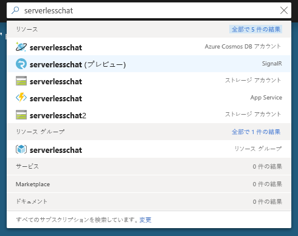
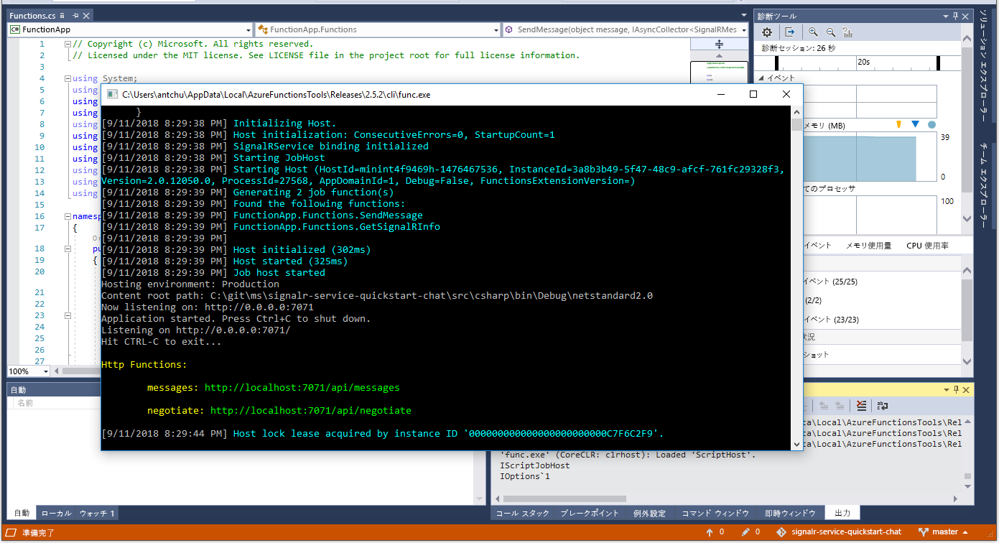

# クイック スタート:C\# を使用した Azure Functions と SignalR Service によるチャット ルームの作成

Azure SignalR Service を使用すると、アプリケーションにリアルタイム機能を簡単に追加できます。 Azure Functions は、インフラストラクチャを管理することなくコードを実行できるサーバーレス プラットフォームです。 このクイック スタートでは、SignalR Service および Functions を使用して、サーバーレスかつリアルタイムのチャット アプリケーションを構築する方法を説明します。

## 前提条件

まだ Visual Studio 2017 をインストールしていない場合は、**無料**の [Visual Studio 2017 Community エディション](https://www.visualstudio.com/downloads/)をダウンロードして使用できます。 Visual Studio のセットアップ中に、必ず **[Azure の開発]** を有効にしてください。

[!INCLUDE [quickstarts-free-trial-note](../../includes/quickstarts-free-trial-note.md)]

## Azure にログインする

Azure アカウントで Azure Portal (<https://portal.azure.com/>) にサインインします。

[!INCLUDE [Create instance](includes/signalr-quickstart-create-instance.md)]

[!INCLUDE [Clone application](includes/signalr-quickstart-clone-application.md)]

## Azure Function アプリを構成して実行する

1. Visual Studio を起動し、複製したリポジトリの *chat\src\csharp* フォルダーにあるソリューションを開きます。

1. Azure portal を開いているブラウザーのポータルの上部にある検索ボックスから、以前にデプロイした SignalR Service インスタンスの名前で検索し、インスタンスが正常に作成されたことを確認します。 インスタンスを選択して開きます。

    

1. **[Key]\(キー\)** を選択し、SignalR Service インスタンスの接続文字列を表示します。

1. プライマリ接続文字列を選択してコピーします。

1. Visual Studio に戻り、ソリューション エクスプローラーで、*local.settings.sample.json* の名前を *local.settings.json* に変更します。

1. **local.settings.json** で、**AzureSignalRConnectionString** 設定に接続文字列の値を貼り付けます。 ファイルを保存します。

1. **Functions.cs** を開きます。 この関数アプリには、HTTP によってトリガーされる関数が 2 つあります。

    - **GetSignalRInfo** - *SignalRConnectionInfo* 入力バインディングを使用し、有効な接続情報を生成して返却します。
    - **SendMessage** - 要求本文でチャット メッセージを受信し、*SignalR* 出力バインディングを使用して接続されているすべてのクライアント アプリケーションにメッセージをブロードキャストします。

1. **[デバッグ]** メニューの **[デバッグの開始]** を選択してアプリケーションを実行します。

    

[!INCLUDE [Run web application](includes/signalr-quickstart-run-web-application.md)]

[!INCLUDE [Cleanup](includes/signalr-quickstart-cleanup.md)]

## 次の手順

このクイック スタートでは、VS Code でリアルタイムのサーバーレス アプリケーションを構築して実行しました。 次は、VS Code から Azure Functions をデプロイする方法を詳しく学びます。

> [!div class="nextstepaction"]
> [VS Code で Azure Functions をデプロイする](https://code.visualstudio.com/tutorials/functions-extension/getting-started)