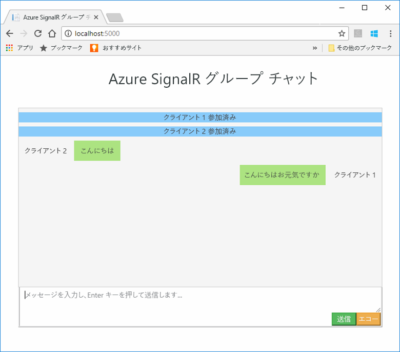
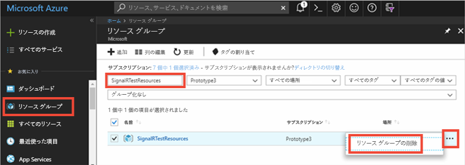

# <a name="quickstart-create-a-chat-room-with-signalr-service"></a>クイック スタート: SignalR Service を使ってチャット ルームを作成する

Microsoft Azure SignalR サービスは現在、[パブリック プレビュー](https://azure.microsoft.com/support/legal/preview-supplemental-terms/)の段階です。

Azure SignalR Service は、開発者がリアルタイムの機能を使って Web アプリケーションを簡単に作成できるようにするための Azure サービスです。 このサービスは、[SignalR for ASP.NET Core 2.0](https://docs.microsoft.com/aspnet/core/signalr/introduction) に基づいています。

この記事では、Azure SignalR Service の使用を開始する方法について説明します。 このクイック スタートでは、ASP.NET Core MVC Web App の Web アプリを使用してチャット アプリケーションを作成します。 このアプリでは、Azure SignalR Service との接続を確立して、リアルタイムのコンテンツ更新を可能にします。 Web アプリケーションはローカルでホストされ、複数のブラウザー クライアントに接続されます。 各クライアントは、他のすべてのクライアントにコンテンツ更新をプッシュできるようになります。 


このクイック スタートの手順は、任意のコード エディターを使用して実行できます。 ただし、推奨のエディターは [Visual Studio Code](https://code.visualstudio.com/) です (Windows、macOS、および Linux プラットフォームで使用できます)。

このチュートリアルのコードは、[GitHub リポジトリの AzureSignalR-samples](https://github.com/aspnet/AzureSignalR-samples/tree/master/samples/ChatRoom) からダウンロードできます。  また、このクイック スタートで使用されている Azure リソースは、「[Create a SignalR Service script (SignalR Service スクリプトの作成)](scripts/signalr-cli-create-service.md)」でも作成できます。



[!INCLUDE [quickstarts-free-trial-note](../../includes/quickstarts-free-trial-note.md)]


## <a name="prerequisites"></a>前提条件

* [.NET Core SDK](https://www.microsoft.com/net/download/windows) をインストールする
* github リポジトリの [AzureSignalR-sample](https://github.com/aspnet/AzureSignalR-samples) をダウンロードまたは複製する。 

## <a name="create-an-azure-signalr-resource"></a>Azure SignalR リソースの作成

[!INCLUDE [azure-signalr-create](../../includes/signalr-create.md)]

## <a name="create-an-aspnet-core-web-app"></a>ASP.NET Core Web アプリケーションの作成

このセクションでは、[.NET Core コマンド ライン インターフェイス (CLI)](https://docs.microsoft.com/dotnet/core/tools/) を使用して、新しい ASP.NET Core MVC Web アプリ プロジェクトを作成します。 Visual Studio ではなく .NET Core CLI を使用する利点は、Windows、macOS、および Linux プラットフォームで使用できるという点です。 

1. プロジェクト用の新規フォルダーを作成します。 このクイック スタートでは、*E:\Testing\chattest* フォルダーを使用しています。

2. 新しいフォルダーで次のコマンドを実行して、新しい ASP.NET Core MVC Web アプリ プロジェクトを作成します。

        dotnet new mvc


## <a name="add-secret-manager-to-the-project"></a>プロジェクトにシークレット マネージャーを追加します

このセクションでは、プロジェクトに[シークレット マネージャー ツール](https://docs.microsoft.com/aspnet/core/security/app-secrets)を追加します。 シークレット マネージャー ツールは、開発作業の機密データをプロジェクト ツリーの外部に格納します。 これにより、ソース コード内のアプリ シークレットが偶発的に共有されるのを防止できます。

1. *.csproj* ファイルを開きます。 `DotNetCliToolReference` 要素を追加して、*Microsoft.Extensions.SecretManager.Tools* を含めます。 また、`UserSecretsId` 要素を下記のように追加して、ファイルを保存します。

    *chattest.csproj:*

    ```xml
    <Project Sdk="Microsoft.NET.Sdk.Web">
    <PropertyGroup>
        <TargetFramework>netcoreapp2.0</TargetFramework>
        <UserSecretsId>SignalRChatRoomEx</UserSecretsId>
    </PropertyGroup>
    <ItemGroup>
        <PackageReference Include="Microsoft.AspNetCore.All" Version="2.0.0" />
    </ItemGroup>
    <ItemGroup>
        <DotNetCliToolReference Include="Microsoft.VisualStudio.Web.CodeGeneration.Tools" Version="2.0.0" />
        <DotNetCliToolReference Include="Microsoft.Extensions.SecretManager.Tools" Version="2.0.0" />
    </ItemGroup>
    </Project>    
    ```

## <a name="add-azure-signalr-to-the-web-app"></a>Web アプリに Azure SignalR を追加する

1. 次のコマンドを実行して、`Microsoft.Azure.SignalR` NuGet パッケージへの参照を追加します。

        dotnet add package Microsoft.Azure.SignalR -v 1.0.0-*

2. 次のコマンドを実行して、プロジェクトのパッケージを復元します。

        dotnet restore

3. シークレット マネージャーに、*Azure__SignalR__ConnectionString* という名前のシークレットを追加します。 このシークレットは階層的な構成値であり、プラットフォームによっては、コロン (:) が機能しない場合があります。 このシークレット例のように二重アンダースコア (__) は、すべてのプラットフォームでサポートされています。  このシークレットには、SignalR Service リソースにアクセスするための接続文字列が含められます。 *Azure__SignalR__ConnectionString* は、SignalR が接続を確立するために検索する、既定の構成キーです。 下記のコマンドの値を、SignalR Service リソースの接続文字列に置き換えてください。

    このコマンドは、*.csproj* ファイルと同じディレクトリで実行する必要があります。

    ```
    dotnet user-secrets set Azure__SignalR__ConnectionString "Endpoint=<Your endpoint>;AccessKey=<Your access key>;"    
    ```

    シークレット マネージャーは、ローカルでホストされているときの、Web アプリのテスト用にのみ使用されます。 この後のチュートリアルでは、Azure にチャット Web アプリをデプロイします。 この Web アプリが Azure にデプロイされた後は、シークレット マネージャーで接続文字列を保存するのではなく、アプリケーション設定を使用します。

4. *Startup.cs* を開き、`services.AddSignalR().AddAzureSignalR()` メソッドを呼び出して Azure SignalR Service を使うように、`ConfigureServices` メソッドを更新します。

    ```csharp
    public void ConfigureServices(IServiceCollection services)
    {
        services.AddMvc();
        services.AddSignalR().AddAzureSignalR();
    }
    ```

    このコードでは、`AddAzureSignalR()` にパラメーターを渡すのではなく、SignalR Service リソースの接続文字列に既定の構成キー (*Azure__SignalR__ConnectionString*) を使用しています。

5. また、*Startup.cs* で、`app.UseStaticFiles()` への呼び出しを次のコードに置き換えることで `Configure` メソッドを更新し、ファイルを保存します。

    ```csharp
    app.UseFileServer();
    app.UseAzureSignalR(routes =>
    {
        routes.MapHub<Chat>("/chat");
    });
    ```            

### <a name="add-a-hub-class"></a>ハブ クラスの追加

SignalR では、ハブはクライアントから呼び出せる一連のメソッドを公開する、コア コンポーネントです。 このセクションでは、次の 2 つのメソッドでハブ クラスを定義します。 

* `Broadcast`: このメソッドは、すべてのクライアントにメッセージをブロードキャストします。
* `Echo`: このメソッドは、メッセージを呼び出し元に返送します。

いずれのメソッドでも、ASP.NET Core SignalR SDK によって提供されている、`Clients` インターフェイスが使用されます。 このインターフェイスを使用すると、接続されているすべてのクライアントにアクセスし、それらのクライアントにコンテンツをプッシュできます。

1. プロジェクト ディレクトリに、*Hub* という名前の新しいフォルダーを追加します。 新しいフォルダーに、*Chat.cs* という名前の新しいハブ コード ファイルを追加します。

2. *Chat.cs* に次のコードを追加してハブ クラスを定義し、ファイルを保存します。 

    使用しているプロジェクト名が *chattest* ではない場合は、このクラスの名前空間を更新してください。

    ```csharp
    using Microsoft.AspNetCore.SignalR;

    namespace chattest
    {

        public class Chat : Hub
        {
            public void BroadcastMessage(string name, string message)
            {
                Clients.All.SendAsync("broadcastMessage", name, message);
            }

            public void Echo(string name, string message)
            {
                Clients.Client(Context.ConnectionId).SendAsync("echo", name, message + " (echo from server)");
            }
        }
    }
    ```

### <a name="add-the-web-app-client-interface"></a>Web アプリのクライアント インターフェイスを追加する

このチャット ルーム アプリのクライアント ユーザー インターフェイスは、*wwwroot* ディレクトリにある *index.html* というファイル内の、HTML と JavaScript で構成されることになります。

[samples リポジトリ](https://github.com/aspnet/AzureSignalR-samples/tree/master/samples/ChatRoom/wwwroot)の *wwwroot* フォルダーにある *index.html* ファイル (および *css*) と *scripts* フォルダーを、プロジェクトの *wwwroot* フォルダーにコピーしてください。

次に示すのは *index.html* のメイン コードです。 

```javascript
var connection = new signalR.HubConnectionBuilder()
                            .withUrl('/chat')
                            .build();
bindConnectionMessage(connection);
connection.start()
    .then(function () {
        onConnected(connection);
    })
    .catch(function (error) {
        console.error(error.message);
    });
```    

*index.html* 内のコードでは、`HubConnectionBuilder.build()` を呼び出して、Azure SignalR リソースへの HTTP 接続を行います。

接続が成功すると、その接続が `bindConnectionMessage` に渡され、受信されたコンテンツ プッシュ用のイベント ハンドラーがクライアントに追加されます。 

`HubConnection.start()` は、ハブとの通信を開始します。 通信が開始されると、`onConnected()` はボタン イベント ハンドラーを追加します。 これらのハンドラーが接続を使用することで、そのクライアントからすべての接続済みクライアントにコンテンツ更新をプッシュできるようになります。

## <a name="add-a-development-runtime-profile"></a>開発ランタイム プロファイルの追加

このセクションでは、ASP.NET Core の開発ランタイム環境を追加します。 ASP.NET Core のランタイム環境について詳しくは、「[複数の環境の使用](https://docs.microsoft.com/aspnet/core/fundamentals/environments)」をご覧ください。

1. プロジェクトに、*Properties* という名前の新しいフォルダーを作成します。

2. 作成したフォルダーに、次の内容の新しいファイルを *launchSettings.json* という名前で追加し、ファイルを保存します。

    ```json
    {
        "profiles" : 
        {
            "ChatRoom": 
            {
                "commandName": "Project",
                "launchBrowser": true,
                "environmentVariables": 
                {
                    "ASPNETCORE_ENVIRONMENT": "Development"
                },
                "applicationUrl": "http://localhost:5000/"
            }
        }
    }
    ```


## <a name="build-and-run-the-app-locally"></a>アプリをビルドし、ローカルで実行する

1. .NET Core CLI を使用してアプリケーションをビルドするには、コマンド シェルで次のコマンドを実行します。

        dotnet build

2. ビルドが正常に完了したら、次のコマンドを実行して、Web アプリをローカルで実行します。

        dotnet run

    このアプリは、開発ランタイム プロファイルの構成に従って、ポート 5000 上でローカルにホストされます。

        E:\Testing\chattest>dotnet run
        Hosting environment: Development
        Content root path: E:\Testing\chattest
        Now listening on: http://localhost:5000
        Application started. Press Ctrl+C to shut down.    

3. 2 つのブラウザー ウィンドウを起動し、各ブラウザーで `http://localhost:5000` に移動します。 名前の入力を求めるプロンプトが表示されます。 両方のクライアントのクライアント名を入力し、**[Send]** ボタンを使用して、両クライアント間でのメッセージ コンテンツのプッシュをテストします。

    


## <a name="clean-up-resources"></a>リソースのクリーンアップ

次のチュートリアルに進む場合は、このクイック スタートで作成したリソースを維持して、次のチュートリアルで再利用することができます。

クイック スタートのサンプル アプリケーションの使用を終える場合は、課金を避けるために、このクイック スタートで作成した Azure リソースを削除することができます。 

> [!IMPORTANT]
> いったん削除したリソース グループを元に戻すことはできません。リソース グループとそこに存在するすべてのリソースは完全に削除されます。 間違ったリソース グループやリソースをうっかり削除しないようにしてください。 このサンプルのホストとなるリソースを、保持するリソースが含まれている既存のリソース グループ内に作成した場合は、リソース グループを削除するのではなく、個々のブレードから各リソースを個別に削除することができます。
> 
> 

[Azure ポータル](https://portal.azure.com) にサインインし、 **[リソース グループ]** をクリックします。

**[名前でフィルター]** ボックスにリソース グループの名前を入力します。 このクイックスタートの手順では、*SignalRTestResources* という名前のリソース グループを使用しました。 結果一覧でリソース グループの **[...]** をクリックし、**[リソース グループの削除]** をクリックします。

   



リソース グループの削除の確認を求めるメッセージが表示されます。 確認のためにリソース グループの名前を入力し、**[削除]** をクリックします。
   
しばらくすると、リソース グループとそこに含まれているすべてのリソースが削除されます。


## <a name="next-steps"></a>次の手順

このクイック スタートでは、新しい Azure SignalR Service リソースを作成し、そのリソースとASP.NET Core Web アプリを使用して、接続されている複数のクライアントにコンテンツの更新をリアルタイムにプッシュしました。 Azure SignalR Server の使用についてさらに学習するには、認証を実演する次のチュートリアルに進んでください。

> [!div class="nextstepaction"]
> [Azure SignalR Service の認証](./signalr-authenticate-oauth.md)


