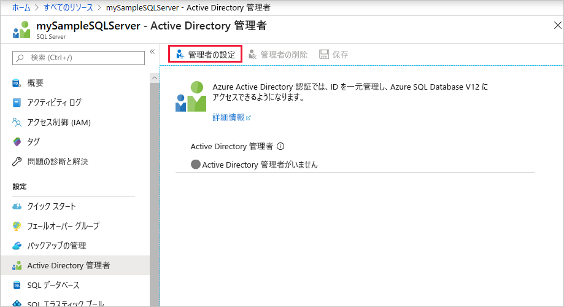
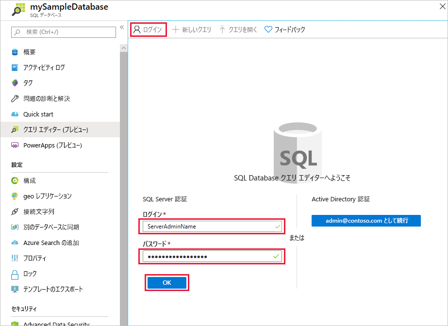

# <a name="quickstart-use-the-azure-portals-query-editor-preview-to-query-an-azure-sql-database"></a>クイック スタート:Azure portal のクエリ エディター (プレビュー) を使用して、Azure SQL Database のクエリを実行します
[!INCLUDE[appliesto-sqldb](../includes/appliesto-sqldb.md)]

クエリ エディターは、Azure SQL Database のデータベース、または Azure Synapse Analytics のデータ ウェアハウスに対して SQL クエリを実行するための Azure portal のツールです。

このクイック スタートでは、クエリ エディターを使用して、データベースに対して Transact-SQL (T-SQL) クエリを実行する方法について説明します。

## <a name="prerequisites"></a>前提条件

### <a name="create-a-database-with-sample-data"></a>サンプル データを使用してデータベースを作成する

このチュートリアルを完了するには、AdventureWorksLT サンプル データベースが必要です。 SQL Database に AdventureWorksLT サンプル データベースの作業コピーがない場合は、すばやく作成するのに次のクイックスタートが役立ちます。

[クイック スタート: Azure portal、PowerShell、Azure CLI を使用して Azure SQL Database にデータベースを作成する](single-database-create-quickstart.md)

### <a name="set-an-azure-active-directory-admin-for-the-server-optional"></a>サーバーの Azure Active Directory 管理者を設定する (オプション)

Azure Active Directory (Azure AD) 管理者を構成すると、単一の ID を使用して Azure portal とデータベースにサインインできます。 Azure AD を使用してクエリ エディターに接続する場合は、次の手順に従います。

このプロセスは省略可能であり、代わりに SQL 認証を使用してクエリ エディターに接続できます。

> [!NOTE]
> * 電子メール アカウント (たとえば、outlook.com、gmail.com、yahoo.com など) は、Azure AD 管理者としてはまだサポートされていません。 Azure AD でネイティブに作成されたユーザーか、Azure AD にフェデレーションされたユーザーのどちらかを必ず選択してください。
> * Azure AD 管理者サインインは、2 要素認証が有効になっているアカウントで機能しますが、クエリ エディターは 2 要素認証をサポートしていません。

1. Azure portal で、SQL データベース サーバーに移動します。

2. **[SQL Server]** メニューで、 **[Active Directory 管理者]** を選択します。

3. SQL Server の **[Active Directory 管理者]** ページのツール バーで、 **[管理者の設定]** を選択します。

    

4. **[管理者の追加]** ページで、検索ボックスにユーザーまたはグループを入力して検索し、それを管理者として選択した後、 **[選択]** ボタンを選択します。

5. SQL Server の **[Active Directory 管理者]** ページのツールバーに戻り、 **[保存]** を選択します。

## <a name="using-sql-query-editor"></a>SQL クエリ エディターの使用

1. [Azure portal](https://portal.azure.com/) にサインインして、クエリを実行するデータベースを選択します。

2. **[SQL データベース]** メニューで、 **[クエリ エディター (プレビュー)]** を選択します。

    

### <a name="establish-a-connection-to-the-database"></a>データベースへの接続を確立する

ポータルにサインインしている場合でも、データベースにアクセスするために資格情報を入力する必要があります。 お使いのデータベースに接続するには、SQL 認証または Azure Active Directory を使用できます。

#### <a name="connect-using-sql-authentication"></a>SQL 認証を使用して接続する

1. **[ログイン]** ページの **[SQL Server 認証]** で、データベースへのアクセス権を持つユーザーの **[ログイン]** と **[パスワード]** を入力します。 わからない場合は、データベース サーバーのサーバー管理者のログインとパスワードを使用します。

    

2. **[OK]** を選択します。

#### <a name="connect-using-azure-active-directory"></a>Azure Active Directory への接続

**[クエリ エディター (プレビュー)]** で、 **[Active Directory 認証]** セクションの **[ログイン]** ページを確認します。 認証は自動的に行われるため、データベースに対する Azure AD 管理者である場合、サインインしたことを示すメッセージが表示されます。 次に、[ *\<your user or group ID>* **として続行**] ボタンを選択します。 ページに、ログインが成功しなかったことが表示された場合、ページを更新する必要がある場合があります。

### <a name="query-a-database-in-sql-database"></a>SQL Database のデータベースに対してクエリを実行する

次の例のクエリは、AdventureWorksLT サンプル データベースに対して正常に実行されます。

#### <a name="run-a-select-query"></a>SELECT クエリを実行する

1. 次のクエリをクエリ エディターに貼り付けます。

   ```sql
    SELECT TOP 20 pc.Name as CategoryName, p.name as ProductName
    FROM SalesLT.ProductCategory pc
    JOIN SalesLT.Product p
    ON pc.productcategoryid = p.productcategoryid;
   ```

2. **[実行]** を選択して、 **[結果]** ウィンドウで出力を確認します。

   

3. 必要に応じて、クエリを .sql ファイルとして保存するか、返されたデータを .json、.csv、または .xml ファイルとしてエクスポートします。

#### <a name="run-an-insert-query"></a>INSERT クエリを実行する

[INSERT](/sql/t-sql/statements/insert-transact-sql/) T-SQL ステートメントを実行して、`SalesLT.Product` テーブルに新しい製品を追加します。

1. 前のクエリを次のクエリに置き換えます。

    ```sql
    INSERT INTO [SalesLT].[Product]
           ( [Name]
           , [ProductNumber]
           , [Color]
           , [ProductCategoryID]
           , [StandardCost]
           , [ListPrice]
           , [SellStartDate]
           )
    VALUES
           ('myNewProduct'
           ,123456789
           ,'NewColor'
           ,1
           ,100
           ,100
           ,GETDATE() );
   ```


2. **[実行]** を選択して、新しい行を `Product` テーブルに挿入します。 **メッセージ** ペインに、 **[クエリが成功しました: 影響を受ける行: 1]** と表示されます。


#### <a name="run-an-update-query"></a>UPDATE クエリを実行する

次の [UPDATE](/sql/t-sql/queries/update-transact-sql/) T-SQL ステートメントを実行して、新しい製品を変更します。

1. 前のクエリを次のクエリに置き換えます。

   ```sql
   UPDATE [SalesLT].[Product]
   SET [ListPrice] = 125
   WHERE Name = 'myNewProduct';
   ```

2. **[実行]** を選択して、`Product` テーブルの指定した行を更新します。 **メッセージ** ペインに、 **[クエリが成功しました: 影響を受ける行: 1]** と表示されます。

#### <a name="run-a-delete-query"></a>DELETE クエリを実行する

次の [DELETE](/sql/t-sql/statements/delete-transact-sql/) T-SQL ステートメントを実行して、新しい製品を削除します。

1. 前のクエリを次のクエリに置き換えます。

   ```sql
   DELETE FROM [SalesLT].[Product]
   WHERE Name = 'myNewProduct';
   ```

2. **[実行]** を選択して、`Product` テーブルの指定した行を削除します。 **メッセージ** ペインに、 **[クエリが成功しました: 影響を受ける行: 1]** と表示されます。


## <a name="troubleshooting-and-considerations"></a>トラブルシューティングと考慮事項

クエリ エディターを操作するときは次の点に注意してください。

### <a name="configure-local-network-settings"></a>ローカル ネットワーク設定の構成

クエリ エディターで、
 - *ローカル ネットワーク設定が原因で、クエリ エディターでクエリを発行できない可能性があります。ネットワーク設定の構成方法の手順については、こちらをクリックしてください*
 - *サーバーへの接続を確立できませんでした。ローカル ファイアウォールの構成またはネットワーク プロキシの設定に問題がある可能性があります*

これは、クエリ エディターではポート 443 と 1443 を通信に使用するためです。 これらのポートで送信 HTTPS トラフィックを有効にしていることを確認する必要があります。 以下の手順では、これを行う方法についてオペレーティング システム別に説明します。 ローカル ネットワークでこの接続を開く承認を付与するために、会社の IT 部門と協力することが必要な場合があります。

#### <a name="steps-for-windows"></a>Windows の手順

1. **[Windows Defender ファイアウォール]** を開きます
2. 左側のメニューで、 **[詳細設定]** を選択します
3. **[セキュリティが強化された Windows Defender ファイアウォール]** で、左側のメニューの **[送信の規則]** を選択します。
4. 右側のメニューの **[新しい規則...]** を選択します

**[新規の送信の規則ウィザード]** で、次の手順に従います。

1. 作成する規則の種類として **[ポート]** を選択します。 **[次へ]** を選択します
2. **[TCP]** を選択します
3. **[特定のリモート ポート]** を選択し、「443, 1443」と入力します。 その後、 **[次へ]** を選択します
4. "セキュリティで保護されている場合、接続を許可する" を選択します
5. **[次へ]** を選択してから、もう一度 **[次へ]** を選択します
5. "ドメイン"、"プライベート"、および "パブリック" をすべて選択したままにします
6. 規則に名前を付けます。たとえば、「Azure SQL クエリ エディターへのアクセス」のようにします。また、説明 (オプション) を指定します。 次に、 **[完了]** を選択します

#### <a name="steps-for-mac"></a>Mac の手順
1. **[システム環境設定]** (Apple メニュー > [システム環境設定]) を開きます。
2. **[セキュリティとプライバシー]** をクリックします。
3. **[ファイアウォール]** をクリックします。
4. ファイアウォールがオフの場合、最下部にある **[Click the lock to make changes]\(変更するにはカギをクリックします\)** をクリックし、 **[ファイアウォールを有効にする]** を選択します
4. **[ファイアウォールのオプション]** をクリックします。
5. **[セキュリティとプライバシー]** ウィンドウで、次のオプションを選択します: "Automatically allow signed software to receive incoming connections." (署名されたソフトウェアが着信接続を受信するのを自動的に許可します。)

#### <a name="steps-for-linux"></a>Linux の手順
次のコマンドを実行して iptables を更新します
  ```
  sudo iptables -A OUTPUT -p tcp --dport 443 -j ACCEPT
  sudo iptables -A OUTPUT -p tcp --dport 1443 -j ACCEPT
  ```

### <a name="connection-considerations"></a>接続に関する考慮事項

* クエリ エディターへのパブリック接続の場合、お使いのデータベースおよびデータ ウェアハウスにアクセスできるようにするには、[サーバーの許可されたファイアウォール規則に、アウトバウンド IP アドレスを追加する](firewall-create-server-level-portal-quickstart.md)必要があります。

* サーバーで Private Link 接続が設定されており、プライベートの Virtual Network 内の IP からクエリ エディターに接続している場合、クエリ エディターは、SQL データベース サーバーのファイアウォール規則にクライアント IP アドレスを追加しなくても機能します。

* クエリ エディターを使用するために必要な最も基本的な RBAC アクセス許可は、サーバーとデータベースへの読み取りアクセスです。 このレベルのアクセス権を持つユーザーなら誰でも、クエリ エディター機能にアクセスできます。 アクセスを特定のユーザーに制限するには、ユーザーが、Azure Active Directory または SQL 認証資格情報を使用してクエリ エディターにサインインできないようにする必要があります。 自分自身をサーバーの AAD 管理者として割り当てることができないか、SQL 管理者アカウントへのアクセスまたはその追加ができないユーザーは、クエリ エディターを使用できません。

* クエリ エディターは、`master` データベースへの接続をサポートしません。

* クエリ エディターは `ApplicationIntent=ReadOnly` でレプリカ データベースに接続できません

* "The X-CSRF-Signature header could not be validated" (X-CSRF-Signature ヘッダーを検証できませんでした) というエラー メッセージが表示された場合は、次のように対処して問題を解決してください。

    * コンピューターの時計が正しい時刻およびタイム ゾーンに設定されていることを確認します。 インスタンスの場所 (米国東部、太平洋など) のタイム ゾーンを検索して、コンピューターのタイム ゾーンを Azure に合わせてみることもできます。
    * プロキシ ネットワーク上にいる場合、要求ヘッダー "X-CSRF-Signature" が変更または削除されていないことを確認します。

### <a name="other-considerations"></a>その他の考慮事項

* **F5** キーを押してクエリ エディター ページを更新すると、操作中のクエリは失われます。

* クエリの実行には、5 分のタイムアウトがあります。

* geography データ型に関してクエリ エディターでサポートされるのは円柱投影のみです。

* データベース テーブルおよびビューに対して IntelliSense はサポートされていませんが、エディターでは、既に入力された名前のオートコンプリートがサポートされています。

## <a name="next-steps"></a>次のステップ

Azure SQL Database でサポートされる Transact-SQL (T-SQL) の詳細については、「[SQL Database への移行時に Transact-SQL の相違点を解決する](transact-sql-tsql-differences-sql-server.md)」を参照してください。
