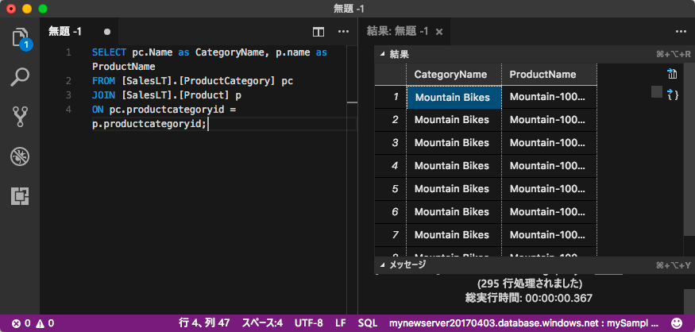

# <a name="quickstart-use-visual-studio-code-to-connect-and-query"></a>クイック スタート:Visual Studio Code を使って接続し、クエリを実行する 
[!INCLUDE[appliesto-sqldb-sqlmi](../includes/appliesto-sqldb-sqlmi.md)]

[Visual Studio Code](https://code.visualstudio.com/docs) は、Linux、macOS、Windows に対応するグラフィカル コード エディターです。 また、SQL Server インスタンス、Azure SQL Database、Azure SQL Managed Instance、Azure Synapse Analytics のデータベースに対してクエリを実行するための [mssql 拡張機能](https://aka.ms/mssql-marketplace)などの拡張機能をサポートしています。 このクイックスタートでは、Visual Studio Code を使って Azure SQL Database または Azure SQL Managed Instance に接続し、Transact-SQL ステートメントを実行してデータのクエリ、挿入、更新、および削除を実行する方法について説明します。

## <a name="prerequisites"></a>前提条件

- Azure SQL Database または Azure SQL Managed Instance のデータベース。 以下のいずれかのクイック スタートを使用して、Azure SQL Database でデータベースを作成し、構成できます。

  | アクション | Azure SQL データベース | Azure SQL Managed Instance |
  |:--- |:--- |:---|
  | 作成| [ポータル](single-database-create-quickstart.md) | [ポータル](../managed-instance/instance-create-quickstart.md) |
  || [CLI](scripts/create-and-configure-database-cli.md) | [CLI](https://medium.com/azure-sqldb-managed-instance/working-with-sql-managed-instance-using-azure-cli-611795fe0b44) |
  || [PowerShell](scripts/create-and-configure-database-powershell.md) | [PowerShell](../managed-instance/scripts/create-configure-managed-instance-powershell.md) |
  | 構成 | [サーバーレベルの IP ファイアウォール規則](firewall-create-server-level-portal-quickstart.md)| [仮想マシン (VM) からの接続](../managed-instance/connect-vm-instance-configure.md)|
  |||[オンプレミスからの接続](../managed-instance/point-to-site-p2s-configure.md)
  |データの読み込み|クイック スタートごとに読み込まれる Adventure Works|[Wide World Importers を復元する](../managed-instance/restore-sample-database-quickstart.md)
  |||[GitHub](https://github.com/Microsoft/sql-server-samples/tree/master/samples/databases/adventure-works) の [BACPAC](database-import.md) ファイルから Adventure Works を復元またはインポートする|
  |||

  > [!IMPORTANT]
  > この記事のスクリプトは、Adventure Works データベースを使用するように記述されています。 SQL マネージド インスタンスの場合は、Adventure Works データベースをインスタンス データベースにインポートするか、Wide World Importers データベースを使用するようにこの記事のスクリプトを修正する必要があります。

## <a name="install-visual-studio-code"></a>Visual Studio Code のインストール

必ず最新の [Visual Studio Code](https://code.visualstudio.com/Download) をインストールして [mssql 拡張機能](https://aka.ms/mssql-marketplace)を読み込んでおきます。 mssql 拡張機能のインストールのガイダンスについては、[Visual Studio Code のインストール](/sql/linux/sql-server-linux-develop-use-vscode#install-and-start-visual-studio-code)に関するページおよび「[Visual Studio Code 用 mssql](https://marketplace.visualstudio.com/items?itemName=ms-mssql.mssql)」を参照してください。

## <a name="configure-visual-studio-code"></a>Visual Studio Code を構成する

### <a name="macos"></a>**macOS**

macOS では、mssql 拡張機能で使用される .NET Core の前提条件として、OpenSSL をインストールする必要があります。 使用するターミナルを開き、次のコマンドを入力して、**brew** と **OpenSSL** をインストールします。

```bash
ruby -e "$(curl -fsSL https://raw.githubusercontent.com/Homebrew/install/master/install)"
brew update
brew install openssl
mkdir -p /usr/local/lib
ln -s /usr/local/opt/openssl/lib/libcrypto.1.0.0.dylib /usr/local/lib/
ln -s /usr/local/opt/openssl/lib/libssl.1.0.0.dylib /usr/local/lib/
```

### <a name="linux-ubuntu"></a>**Linux (Ubuntu)**

特別な構成は必要ありません。

### <a name="windows"></a>**Windows**

特別な構成は必要ありません。

## <a name="get-server-connection-information"></a>サーバーの接続情報を取得する

Azure SQL Database に接続するために必要な接続情報を取得します。 後の手順で、完全修飾サーバー名またはホスト名、データベース名、およびログイン情報が必要になります。

1. [Azure portal](https://portal.azure.com/) にサインインします。

2. **[SQL データベース]** または **[SQL マネージド インスタンス]** ページに移動します。

3. **[概要]** ページで、SQL データベースの場合は **[サーバー名]** の横の完全修飾サーバー名を確認し、SQL マネージド インスタンスの場合は **[ホスト]** の横の完全修飾サーバー名を確認します。 サーバー名またはホスト名をコピーするには、名前をポイントして **[コピー]** アイコンを選択します。

## <a name="set-language-mode-to-sql"></a>言語モードを SQL に設定

Visual Studio Code で、言語モードを **[SQL]** に設定し、mssql コマンドと T-SQL IntelliSense を有効にします。

1. 新しい Visual Studio Code ウィンドウを開きます。

2. **Ctrl**+**N** キーを押します。 新しいプレーンテキスト ファイルが開きます。

3. ステータス バーの右下隅の **[プレーン テキスト]** を選択します。

4. 開かれた **[言語モードの選択]** ドロップダウン メニューで、 **[SQL]** を選択します。

## <a name="connect-to-your-database"></a>データベースに接続する

Visual Studio Code を使用して、サーバーへの接続を確立します。

> [!IMPORTANT]
> 続行する前に、サーバーおよびサインインの情報が準備できていることを確認します。 接続プロファイル情報の入力を開始した後は、Visual Studio Code からフォーカスを移動すると、プロファイルの作成をやり直さなければならなくなります。

1. Visual Studio Code で、**Ctrl + Shift + P** キー (または **F1** キー) を押してコマンド パレットを開きます。

2. **[MS SQL:Connect]\(MS SQL: 接続\)** を選択して、**Enter** キーを押します。

3. **[接続プロファイルの作成]** を選択します。

4. プロンプトに従って、新しいプロファイルの接続プロパティを指定します。 それぞれの値を指定したら、**Enter** キーを押して続行します。

   | プロパティ       | 推奨値 | 説明 |
   | ------------ | ------------------ | ------------------------------------------------- |
   | **サーバー名** | 完全修飾サーバー名 | 例: **mynewserver20170313.database.windows.net** |
   | **データベース名** | mySampleDatabase | 接続先のデータベース。 |
   | **認証** | SQL ログイン| このチュートリアルでは、SQL 認証を使用します。 |
   | **ユーザー名** | ユーザー名 | サーバーを作成するために使用するサーバー管理者アカウントのユーザー名。 |
   | **パスワード (SQL ログイン)** | Password | サーバーを作成するために使用するサーバー管理者アカウントのパスワード。 |
   | **パスワードを保存しますか?** | はい、いいえ | パスワードを毎回入力する手間を省くには、 **[はい]** を選択します。 |
   | **このプロファイルの名前を入力してください** | プロファイル名 (**mySampleProfile** など) | 保存されたプロファイルによって、以降のログインでは、より速く接続できるようになります。 |

   成功した場合、プロファイルが作成され接続されたことを示す通知が表示されます。

## <a name="query-data"></a>クエリ データ

次の [SELECT](/sql/t-sql/queries/select-transact-sql) Transact-SQL ステートメントによるクエリを実行して、カテゴリごとに上位 20 個の製品を照会します。

1. エディター ウィンドウで、次の SQL クエリを貼り付けます。

   ```sql
   SELECT pc.Name as CategoryName, p.name as ProductName
   FROM [SalesLT].[ProductCategory] pc
   JOIN [SalesLT].[Product] p
   ON pc.productcategoryid = p.productcategoryid;
   ```

2. **Ctrl**+**Shift**+**E** キーを押してクエリを実行し、`Product` および `ProductCategory` テーブルからの結果を表示します。

    

## <a name="insert-data"></a>データの挿入

次の [INSERT](/sql/t-sql/statements/insert-transact-sql) Transact-SQL ステートメントを実行して、`SalesLT.Product` テーブルに新しい製品を追加します。

1. 前のクエリを次のクエリに置き換えます。

   ```sql
   INSERT INTO [SalesLT].[Product]
        ( [Name]
        , [ProductNumber]
        , [Color]
        , [ProductCategoryID]
        , [StandardCost]
        , [ListPrice]
        , [SellStartDate]
        )
     VALUES
        ('myNewProduct'
        ,123456789
        ,'NewColor'
        ,1
         ,100
         ,100
         ,GETDATE() );
   ```

2. **Ctrl**+**Shift**+**E** キーを押して、`Product` テーブルに新しい行を挿入します。

## <a name="update-data"></a>データの更新

次の [UPDATE](/sql/t-sql/queries/update-transact-sql) Transact-SQL ステートメントを実行して、追加された製品を更新します。

1. 前のクエリを次のクエリに置き換えます。

   ```sql
   UPDATE [SalesLT].[Product]
   SET [ListPrice] = 125
   WHERE Name = 'myNewProduct';
   ```

2. **Ctrl**+**Shift**+**E** キーを押して、`Product` テーブルの指定した行を更新します。

## <a name="delete-data"></a>データの削除

次の [DELETE](/sql/t-sql/statements/delete-transact-sql) Transact-SQL ステートメントを実行して、新しい製品を削除します。

1. 前のクエリを次のクエリに置き換えます。

   ```sql
   DELETE FROM [SalesLT].[Product]
   WHERE Name = 'myNewProduct';
   ```

2. **Ctrl**+**Shift**+**E** キーを押して、`Product` テーブルの指定した行を削除します。

## <a name="next-steps"></a>次のステップ

- SQL Server Management Studio を使用して接続と照会を行うには、「[クイック スタート: SSMS を使用して Azure SQL Database または Azure SQL Managed Instance に接続してクエリを実行する](connect-query-ssms.md)」を参照してください。
- Azure portal を使用して接続と照会を行うには、「[クイック スタート: Azure portal の SQL クエリ エディターを使って接続とデータの照会を行う](connect-query-portal.md)」を参照してください。
- Visual Studio Code の使用に関するMSDN マガジンの記事については、[MSSQL 拡張機能によるデータベース IDE の作成に関するブログの投稿](/archive/msdn-magazine/2017/june/data-points-visual-studio-code-create-a-database-ide-with-mssql-extension)を参照してください。