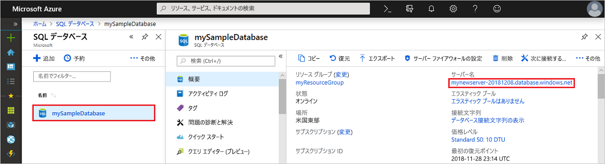

# クイック スタート:Azure Portal でサーバーレベルのファイアウォール規則を作成する
[!INCLUDE[appliesto-sqldb](../includes/appliesto-sqldb.md)]

このクイック スタートでは、Azure portal を使用して Azure SQL Database に[サーバーレベルのファイアウォール規則](firewall-configure.md)を作成して、[論理 SQL サーバー](logical-servers.md)、単一データベース、エラスティック プールとそのデータベースに接続できるようにする方法を説明します。 他の Azure リソースやオンプレミスのリソースから接続するためには、ファイアウォール規則が必要となります。 サーバーレベルのファイアウォール規則は、Azure SQL Managed Instance には適用されません。

## 前提条件

このクイック スタートでは、[Azure portal を使用した単一データベースの作成](single-database-create-quickstart.md)に関するページで作成したリソースを出発点として使用します。

## Azure portal にサインインする

[Azure portal](https://portal.azure.com/) にサインインします。

## サーバーレベルの IP ファイアウォール規則を作成する

 SQL Database は、単一およびプールされたデータベースに対して、サーバー レベルのファイアウォールを作成します。 このファイアウォールは、ファイアウォールを開くための IP ファイアウォール規則が作成されない限り、クライアント アプリケーションがサーバーまたはそのデータベースに接続できないようにします。 Azure の外部 IP アドレスからの接続については、接続できるようにする特定の IP アドレスまたはアドレス範囲を対象とするファイアウォール規則を作成します。 サーバーレベルおよびデータベースレベルの IP ファイアウォール規則の詳細については、[サーバーレベルおよびデータベースレベルの IP ファイアウォール規則](firewall-configure.md)に関するページを参照してください。

> [!NOTE]
> Azure SQL Database の通信は、ポート 1433 上で行われます。 企業ネットワーク内から接続しようとしても、ポート 1433 での送信トラフィックがネットワークのファイアウォールで禁止されている場合があります。 その場合、会社の IT 部門によってポート 1433 が開放されない限り、サーバーに接続することはできません。
> [!IMPORTANT]
> 0\.0.0.0 のファイアウォール規則では、すべての Azure サービスがサーバー レベルのファイアウォール規則をパススルーし、サーバーを介してデータベースへの接続を試行できます。

以下の手順に従い、クライアントの IP アドレスに対してサーバーレベルの IP ファイアウォール規則を作成し、その IP アドレスのみが Azure SQL Database ファイアウォールを介して外部接続できるようにします。

1. [データベース](#prerequisites)のデプロイが完了したら、左側のメニューから **[SQL データベース]** を選択し、次に **[SQL データベース]** ページで **[mySampleDatabase]** を選択します。 このデータベースの概要ページが開くと、完全修飾サーバー名 (**mynewserver-20170824.database.windows.net** など) や追加の構成オプションが表示されます。

2. この完全修飾サーバー名をコピーします。これは他のクイック スタートでサーバーとそのデータベースに接続するときに使用します。

   

3. ツール バーで **[サーバー ファイアウォールの設定]** を選択します。 サーバーの **[ファイアウォール設定]** ページが開きます。

   

4. ツール バーの **[クライアント IP の追加]** を選択し、現在の IP アドレスを新しいサーバーレベルの IP ファイアウォール規則に追加します。 サーバーレベルの IP ファイアウォール規則は、単一の IP アドレスまたは IP アドレスの範囲に対して、ポート 1433 を開くことができます。

   > [!IMPORTANT]
   > 既定では、すべての Azure サービスで、Azure SQL Database ファイアウォール経由のアクセスが無効になります。 すべての Azure サービスに対するアクセスを有効にする場合は、このページで **[オン]** を選択します。
   >

5. **[保存]** を選択します。 サーバーでポート 1433 を開いている現在の IP アドレスに対して、サーバーレベルの IP ファイアウォール規則が作成されます。

6. **[ファイアウォール設定]** ページを閉じます。

SQL Server Management Studio やその他の任意のツールを使用して、サーバーとそのデータベースに、前に作成したサーバー管理者アカウントを使用してこの IP アドレスから接続できるようになりました。

## リソースをクリーンアップする

データベースに接続してクエリを実行するためのさまざまな方法を紹介した「[次のステップ](#next-steps)」に進む場合は、これらのリソースを保存しておいてください。 一方、このクイック スタートで作成したリソースを削除する場合は、次の手順に従います。

1. Azure portal の左側のメニューで、 **[リソース グループ]** 、 **[myResourceGroup]** の順に選択します。
2. リソース グループのページで **[削除]** を選択し、テキスト ボックスに「**myResourceGroup**」と入力してから **[削除]** を選択します。

## 次のステップ

- これで、データベースが作成されたので、任意のツールまたは言語を使用して[接続し、クエリを実行](connect-query-content-reference-guide.md)できます。たとえば、以下が可能です。
  - [SQL Server Management Studio を使用して接続およびクエリを実行する](connect-query-ssms.md)
  - [Azure Data Studio を使用して接続およびクエリを実行する](/sql/azure-data-studio/quickstart-sql-database?toc=/azure/sql-database/toc.json)
- 初めてのデータベースを設計し、テーブルを作成して、データを挿入する方法については、次のいずれかのチュートリアルを参照してください。
  - [Azure SQL Database で SSMS を使用して最初の単一データベースを設計する](design-first-database-tutorial.md)
  - [Azure SQL Database に単一データベースを設計し、C# と ADO.NET で接続する](design-first-database-csharp-tutorial.md)
