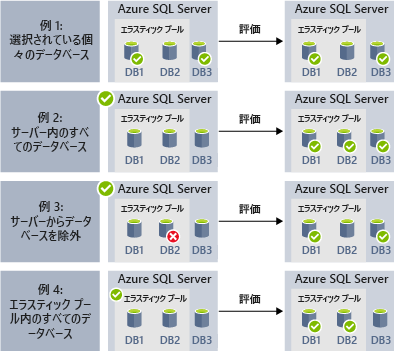
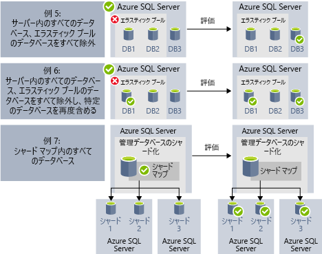

# エラスティック ジョブ (プレビュー) を使用して管理タスクを自動化する

[!INCLUDE[appliesto-sqldb](../includes/appliesto-sqldb.md)]

1 つまたは複数の Azure SQL Database に対して定期的に実行できるエラスティック ジョブを作成し、スケジュールすると、Transact-SQL (T-SQL) クエリを実行してメンテナンス タスクを行うことができます。 

ジョブの実行場所となるターゲット データベースまたはデータベースのグループを定義できるほか、ジョブを実行するスケジュールを定義できます。
ターゲット データベースにログインするタスクはジョブによって処理されます。 データベースのグループ全体に対して実行される Transact-SQL スクリプトの定義、保守、維持も行います。

すべてのジョブでは、実行の状態が記録されます。また、エラーが発生した場合に操作が自動で再試行されます。

## いつエラスティック ジョブを使用するか

次に、エラスティック ジョブによる自動化が利用できるシナリオをいくつか示します。

- 管理タスクの自動化とスケジュール (平日に毎日、業務時間後に実行するなど)
  - スキーマの変更、資格情報の管理、パフォーマンス データの収集、テナント (顧客) テレメトリの収集をデプロイします。
  - 参照データ (全データベースに共通の情報) を更新したり、Azure Blob Storage からデータを読み込んだりします。
- データベース コレクションを対象として (ピーク外の時間などに) 定期的に実行するジョブを構成します。
  - データベース セットのクエリ結果をリアルタイムで中央のテーブルに収集します。 パフォーマンス クエリを継続的に実行して、その他のタスクの実行をトリガーするように構成できます。
- レポート用データの収集
  - データベースのコレクションから 1 つのテーブルにデータを集約します。
  - 顧客の製品利用統計情報収集など、大規模なデータセット全体に対して、時間がかかるデータ処理クエリを実行します。 結果は 1 つの対象テーブルに収集され、分析に使用されます。
- データの移動 

### 他のプラットフォームでの自動化

各種プラットフォームでは、次のジョブ スケジューリング テクノロジを検討してください。

- **エラスティック ジョブ** は、Azure SQL Database の 1 つまたは複数のデータベース上でカスタム ジョブを実行するジョブ スケジューリング サービスです。
- **SQL Agent ジョブ** は、SQL Server でタスクの自動化に引き続き使用される SQL Agent サービスによって実行されるほか、Azure SQL Managed Instance にも含まれています。 SQL エージェント ジョブは、Azure SQL Database では利用できません。

エラスティック ジョブは、[Azure SQL Database](sql-database-paas-overview.md) と [Azure SQL Database エラスティック プール](elastic-pool-overview.md)のほか、[シャード マップ](elastic-scale-shard-map-management.md)の Azure SQL Database をターゲットにできます。

SQL Server と Azure SQL Managed Instance における T-SQL スクリプト ジョブの自動化では、[SQL Agent](job-automation-managed-instances.md) を検討してください。 

Azure Synapse Analytics における T-SQL スクリプト ジョブの自動化では、[Azure Data Factory に基づく](../../synapse-analytics/data-integration/concepts-data-factory-differences.md)[パイプラインと定期的なトリガー](../../synapse-analytics/data-integration/concepts-data-factory-differences.md)を検討してください。

SQL Agent (SQL Server で利用できるほか、SQL Managed Instance にも含まれています) と Database Elastic Job エージェント (Azure Synapse Analytics、Azure SQL Managed Instance、Azure SQL Database、SQL Server のデータベースで T-SQL を実行できる) の間には、いくつかの点で違いがあります。

| |エラスティック ジョブ |SQL エージェント |
|---------|---------|---------|
|**スコープ** | ジョブ エージェントと同じ Azure クラウド内に存在する Azure SQL Database やデータ ウェアハウスの任意の数のデータベース。 サーバー、サブスクリプション、またはリージョンが異なっていてもターゲットとすることができます。   ターゲット グループを構成するメンバーには、個々のデータベースまたはデータ ウェアハウスのほか、サーバー、プール、またはシャード マップに含まれるすべてのデータベースを指定できます (ジョブの実行時に動的に列挙されます)。 | SQL エージェントと同じインスタンス内の個々のデータベース。 SQL Server エージェントのマルチサーバー管理機能を使用すると、マスター (またはターゲット) インスタンスがジョブの実行を調整できます。ただし、この機能は SQL Managed Instance では利用できません。 |
|**サポートされる API とツール** | ポータル、PowerShell、T-SQL、Azure Resource Manager | T-SQL、SQL Server Management Studio (SSMS) |
 
## エラスティック ジョブのターゲット

**エラスティック ジョブ** は、多数のデータベースを対象に T-SQL スクリプトを並列実行できる機能です。一定のスケジュールに従って実行することも、オンデマンドで実行することもできます。

スケジュールされたジョブの実行対象とするデータベースの組み合わせは問いません。個々のデータベースだけでなく、サーバー上のデータベースすべて、エラスティック プール内のデータベースすべて、シャードマップを自由に指定してジョブを実行できます。さらに、特定のデータベースをジョブの対象としたり、逆に対象から除外したりできる柔軟性も備わっています。 多数のサーバーやプールにまたがるジョブだけでなく、異なるサブスクリプションのデータベースを対象としたジョブの実行も可能です。 実行時にはサーバーとプールが動的に列挙されるので、実行時にターゲット グループに存在するデータベースに漏れなくジョブを実行できます。

次の図は、種類がさまざまに異なるターゲット グループに対してジョブ エージェントがジョブを実行するようすを示したものです。

### エラスティック ジョブのコンポーネント

|コンポーネント | 説明 (詳しい情報は表の下に記載しています) |
|---------|---------|
|[**エラスティック ジョブ エージェント**](#elastic-job-agent) | ジョブの実行と管理を目的として作成する Azure リソースです。 |
|[**ジョブ データベース**](#elastic-job-database) | ジョブ エージェントがジョブの関連データや定義などを格納するために使用する、Azure SQL Database のデータベースです。 |
|[**ターゲット グループ**](#target-group) | ジョブの実行の対象となるサーバー、プール、データベース、シャード マップをまとめたものを指します。 |
|[**ジョブ**](#elastic-jobs-and-job-steps) | ジョブは処理の 1 単位で、1 つ以上のジョブ ステップから成ります。 ジョブ ステップでは、実行する T-SQL スクリプトのほか、スクリプトの実行に必要な詳細情報を指定します。 |

#### エラスティック ジョブ エージェント

ジョブを作成、実行、および管理するための Azure リソースを、エラスティック ジョブ エージェントといいます。 エラスティック ジョブ エージェントは、ポータルで作成する Azure リソースです (このほか、[PowerShell](elastic-jobs-powershell-create.md) と REST による作成もサポートされています)。

**エラスティック ジョブ エージェント** を作成するには、Azure SQL Database の既存のデータベースが必要です。 エージェントはこの既存の Azure SQL Database を "[*ジョブ データベース*](#elastic-job-database)" として構成することになります。

エラスティック ジョブ エージェントは無料です。 ジョブ データベースについては、Azure SQL Database のデータベースと同じ料金が発生します。

#### エラスティック ジョブ データベース

"*ジョブ データベース*" は、ジョブの定義のほか、ジョブの実行状態や実行履歴の追跡に使用するものです。 同時に、エージェントのメタデータ、ログ、結果、およびジョブの定義の保管場所としての役割も果たします。さらに、"*ジョブ データベース*" には、便利なストアド プロシージャや、T-SQL を使ったジョブの作成、実行、管理に役立つデータベース オブジェクトが多数格納されます。

現時点のプレビューでは、エラスティック ジョブ エージェントを作成する際に Azure SQL Database の既存のデータベース (S0 以降) が必要になります。

"*ジョブ データベース*" となるデータベースは、データが入っておらず、サービス目標が Azure SQL Database S0 以上であることが条件となります。 "*ジョブ データベース*" で推奨されるサービス目標は S1 以上ですが、最適な選択はジョブのパフォーマンスに関するニーズ (ジョブ ステップの数、ジョブ ターゲットの数、ジョブの実行頻度) に依存します。 

ジョブ データベースに対する操作が予想よりも遅い場合は、Azure portal または [sys.dm_db_resource_stats](/sql/relational-databases/system-dynamic-management-views/sys-dm-db-resource-stats-azure-sql-database) DMV を使用して、パフォーマンスが低下している期間に、データベースのパフォーマンスと、ジョブ データベースのリソース使用率を[監視](monitor-tune-overview.md#azure-sql-database-and-azure-sql-managed-instance-resource-monitoring)します。 CPU、データ IO、ログ書き込みなどのリソースの使用率が100% に近づいており、パフォーマンス低下の期間と相関している場合は、ジョブ データベースのパフォーマンスが十分に向上するまで、([DTU モデル](service-tiers-dtu.md)または[仮想コア モデル](service-tiers-vcore.md)) でデータベースをより高いサービス目標に段階的にスケーリングすることを検討してください。

##### エラスティック ジョブ データベースのアクセス許可

ジョブ エージェントの作成時には、"*ジョブ データベース*" にスキーマとテーブルのほか、*jobs_reader* と呼ばれるロールが作成されます。 このロールには作成時に次のアクセス許可が割り当てられるので、管理者が従来よりも細かくアクセスを制御してジョブを監視できるようになっています。

|ロール名 |"jobs" スキーマのアクセス許可 |"jobs_internal" スキーマのアクセス許可 |
|---------|---------|---------|
|**jobs_reader** | SELECT | なし |

> [!IMPORTANT]
> "*ジョブ データベース*" のデータベース管理者としてのアクセス権を付与する際には、セキュリティ面の影響を考慮するようにしてください。 悪意のあるユーザーがジョブを作成または編集できるアクセス権を取得すると、保存されている資格情報を使ってそのユーザーの管理下にあるデータベースに接続するジョブを (新規に、または既存のジョブの編集により) 作成される可能性があります。そのような事態が起これば、悪意のあるユーザーが資格情報のパスワードを自由に設定できる状況が発生しかねません。

#### ターゲット グループ

"*ターゲット グループ*" は、ジョブ ステップの実行対象となる一連のデータベースを定義したものです。 ターゲット グループに含めることができるものは次のとおりです (数や組み合わせは問いません)。

- **論理 SQL サーバー** - サーバーを指定した場合には、ジョブの実行時点でそのサーバーに存在するデータベースがすべて、グループのメンバーとなります。 ジョブの実行前にグループのメンバーを列挙して更新できるように、マスター データベース資格情報を指定する必要があります。 論理サーバーの詳細については、[Azure SQL Database および Azure Synapse Analytics におけるサーバーの概要](logical-servers.md)に関するページを参照してください。
- **エラスティック プール** - エラスティック プールを指定した場合には、ジョブの実行時点でそのエラスティック プールに存在するデータベースがすべて、グループのメンバーとなります。 サーバーの場合と同じく、ジョブの実行前にグループを更新できるように、マスター データベース資格情報を指定する必要があります。
- **単一のデータベース** - データベースを個別に指定してグループのメンバーとすることができます。
- **シャード マップ** - シャード マップのデータベース。

> [!TIP]
> サーバーまたはプールが含まれるターゲット グループの場合には、ジョブの実行時に "*動的列挙*" によりグループ内のデータベースが再評価されます。 動的列挙は、**ジョブの実行時にサーバーまたはプールに存在するデータベース全部に漏れなくジョブを実行** するための処理です。 プールまたはサーバーのメンバーが頻繁に変わるシナリオでは、実行時にデータベースの一覧を再評価することが特に有用です。

プールとデータベースは個別にグループのメンバーとしたり、グループから除外したりできます。 このため、作成するターゲット グループのメンバーとなるデータベースの組み合わせは自由に調節できます。 たとえば、ターゲット グループにサーバーを追加した後で、エラスティック プール内の特定のデータベース (またはプール全体) をグループから除外することができます。

ターゲット グループには、複数のサブスクリプションのデータベースをメンバーに追加できます。また、グループ内のデータベースのリージョンが異なっていても問題ありません。 ただし、ジョブの実行が複数のリージョンにまたがる場合には、実行が同一のリージョン内にとどまる場合よりも待ち時間が長くなる点に注意してください。

次の例は、ジョブ実行時に異なるターゲット グループ定義を動的に列挙して、ジョブを実行するデータベースを決定する方法を示しています。

**例 1** は、個々 のデータベースの一覧で構成されるターゲット グループを示しています。 このターゲット グループを使用してジョブ ステップを実行すると、ジョブ ステップのアクションがこれらのデータベースのそれぞれで実行されます。 
**例 2** は、サーバーをターゲットとして含むターゲット グループを示しています。 このターゲット グループを使用してジョブ ステップを実行すると、サーバーが動的に列挙され、現在サーバーに入っているデータベースの一覧が判定されます。 ジョブ ステップのアクションは、これらのデータベースのそれぞれで実行されます。 
**例 3** は "*例 2*" と似たターゲット グループを示していますが、個々のデータベースが明示的に除外されています。 ジョブ ステップのアクションは、除外されたデータベースでは実行 "*されません*"。 
**例 4** は、エラスティック プールをターゲットとして含むターゲット グループを示しています。 "*例 2*" と同様に、プールはジョブ実行時に動的に列挙され、プール内のデータベースの一覧が判定されます。
  

**例 5** と **例 6** は、包含ルールと除外ルールを使用してサーバー、エラスティック プール、およびデータベースを結合できる高度なシナリオを示しています。 
**例 7** は、シャード マップ内のシャードをジョブ実行時にも評価できることを示しています。

> [!NOTE]
> ジョブ データベース自体は、ジョブのターゲットにすることができます。 このシナリオでは、ジョブ データベースは他のターゲット データベースと同様に処理されます。 ジョブ ユーザーを作成して、ジョブ データベースに十分なアクセス許可を付与する必要があります。また、ジョブ ユーザーのデータベース スコープの資格情報は、他のターゲット データベースの場合と同様に、ジョブ データベースにも存在する必要があります。

#### エラスティック ジョブとジョブ ステップ

"*ジョブ*" は処理の 1 単位です。一定のスケジュールに基づいて実行することもあれば、1 回限りのジョブとして実行することもあります。 ジョブは、いくつかの "*ジョブ ステップ*" で構成されます。

各ジョブ ステップでは、実行する T-SQL スクリプト、そのスクリプトの対象となるターゲット グループ (複数可)、ジョブ エージェントがターゲット データベースに接続する際に必要になる資格情報の 3 つを指定します。 ジョブ ステップにはそれぞれカスタマイズが可能なタイムアウト値と再試行ポリシーが設定されているほか、オプションで出力パラメーターを指定できます。

#### ジョブの出力

それぞれのターゲット データベースに実行したジョブ ステップの結果は詳細が記録されるので、指定したテーブルにスクリプトの出力を取り込むことができます。 ジョブから返されたデータはいずれも、保存先となるデータベースを指定できます。

#### ジョブ履歴

エラスティック ジョブの実行履歴は、"*ジョブ データベース*" の [テーブル jobs.job_executions を照会](elastic-jobs-tsql-create-manage.md#monitor-job-execution-status)することで確認できます。 記録から 45 日が経過した実行履歴については、システムのクリーンアップ ジョブにより削除されます。 45 日が経過する前に履歴を削除する場合には、"*ジョブ データベース*" で **sp_purge_history** ストアド プロシージャを呼び出してください。

#### ジョブの状態

エラスティック ジョブの実行は、"*ジョブ データベース*" の [テーブル jobs.job_executions を照会](elastic-jobs-tsql-create-manage.md#monitor-job-execution-status)することで確認できます。 

### エージェントのパフォーマンス、容量、および制約

エラスティック ジョブでは、実行時間の長いジョブの完了を待っている間に消費する計算リソースを最小限に抑えます。

データベースから成るターゲット グループの大きさと、ジョブについて希望する実行時間 (同時に実行する worker の数) に応じて、エージェントが "*ジョブ データベース*" に要求する計算量とパフォーマンスが変わります (ターゲットとジョブの数が増えるほど、要求される計算量が増大します)。

現在、コンカレント ジョブの上限は 100 件です。

#### ジョブを原因とするターゲット データベースのパフォーマンス低下を防ぐ

SQL エラスティック プール内のデータベースにジョブを実行しているときにリソースに対する負荷が大きくなりすぎないようにするために、ジョブを構成して同時にジョブの実行対象とするデータベースの数に制限を設けることができます。

## 次のステップ

- [エラスティック ジョブの作成と管理の方法](elastic-jobs-overview.md)
- [PowerShell を使用したエラスティック ジョブの作成と管理](elastic-jobs-powershell-create.md)
- [Transact-SQL を使用したエラスティック ジョブの作成と管理](elastic-jobs-tsql-create-manage.md)
