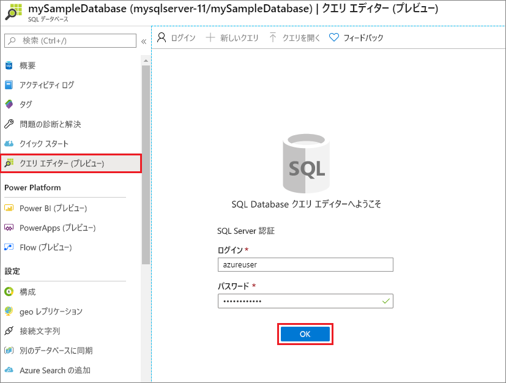
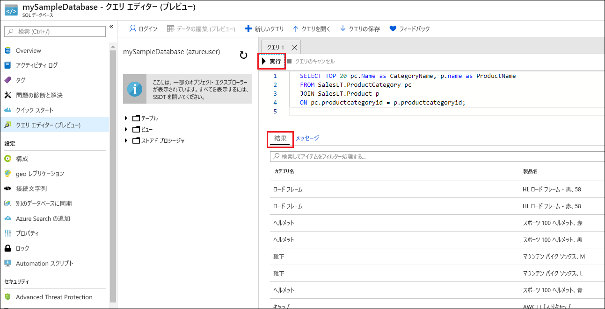

# <a name="quickstart-create-an-azure-sql-database-single-database"></a>クイック スタート:Azure SQL Database の単一データベースを作成する

このクイックスタートでは、Azure portal、PowerShell スクリプト、または Azure CLI スクリプトを使用して、Azure SQL Database に[単一データベース](single-database-overview.md)を作成します。 次に、Azure portal で **クエリ エディター** を使用して、データベースに対してクエリを実行します。


## <a name="prerequisite"></a>前提条件

- 有効な Azure サブスクリプション アカウントがない場合は、[無料アカウントを作成](https://azure.microsoft.com/free/)してください。

## <a name="create-a-single-database"></a>単一データベースを作成する

このクイックスタートでは、[サーバーレス コンピューティング レベル](serverless-tier-overview.md)で単一データベースを作成します。

# <a name="portal"></a>[ポータル](#tab/azure-portal)

Azure portal で単一データベースを作成するため、このクイックスタートは、Azure SQL のページから開始します。

1. [[Select SQL Deployment option]\(SQL デプロイ オプションの選択\)](https://portal.azure.com/#create/Microsoft.AzureSQL) ページを参照します。
1. **[SQL データベース]** で、 **[リソースの種類]** を **[単一データベース]** に設定し、 **[作成]** を選択します。

   

1. **[SQL データベースの作成]** フォームの **[基本]** タブにある **[プロジェクトの詳細]** で、目的の Azure **[サブスクリプション]** を選択します。
1. **[リソース グループ]** で、 **[新規作成]** を選択し、「*myResourceGroup*」と入力して、 **[OK]** を選択します。
1. **[データベース名]** に「*mySampleDatabase*」と入力します。
1. **[サーバー]** で、 **[新規作成]** を選択し、 **[新しいサーバー]** フォームに次の値を入力します。
   - **[サーバー名]** : 「*mysqlserver*」と入力し、一意にするためにいくつかの文字を追加します。 サーバー名は、サブスクリプション内で一意ではなく、Azure のすべてのサーバーに対してグローバルに一意である必要があるため、正確なサーバー名をここに示すことはできません。 mysqlserver12345 のように入力してから、利用可能かどうかをポータルで確認できます。
   - **サーバー管理者ログイン**:「*azureuser*」と入力します。
   - **パスワード**:要件を満たすパスワードを入力し、 **[パスワードの確認入力]** フィールドにもう一度入力します。
   - **[場所]** :ドロップダウン リストから場所を選択します。

   **[OK]** を選択します。

1. **[SQL エラスティック プールを使用しますか?]** を **[いいえ]** に設定したままにします。
1. **[コンピューティングとストレージ]** で、 **[データベースの構成]** を選択します。
1. このクイックスタートではサーバーレス データベースを使用しているので、 **[サーバーレス]** を選択し、 **[適用]** を選択します。 

      

1. **ページの下部にある [Next: Networking]\(次へ: ネットワーク\)** を選択します。

   ![新しい SQL データベース - [基本] タブ](./media/single-database-create-quickstart/new-sql-database-basics.png)

1. **[ネットワーク]** タブの **[接続方法]** で、 **[パブリック エンドポイント]** を選択します。
1. **[ファイアウォール規則]** で、 **[現在のクライアント IP アドレスを追加する]** を **[はい]** に設定します。 **[Azure サービスおよびリソースにこのサーバー グループへのアクセスを許可する]** を **[いいえ]** に設定したままにします。
1. **ページの下部にある [Next: Additional settings]\(次へ: 追加設定\)** を選択します。

   ![[ネットワーク] タブ](./media/single-database-create-quickstart/networking.png)
  

1. **[追加設定]** タブにある **[データ ソース]** セクションの **[既存のデータを使用します]** で、 **[サンプル]** を選択します。 これにより、AdventureWorksLT サンプル データベースが作成され、空のデータベースではなく、クエリと実験に使用するテーブルとデータが用意されます。
1. 必要に応じて、[Azure Defender for SQL](../database/azure-defender-for-sql.md) を有効にします。
1. 必要に応じて、[メンテナンス期間](../database/maintenance-window.md)を設定して、ご利用のデータベースに対して計画メンテナンスが最適なタイミングで実行されるようにします。
1. ページの下部にある **[確認と作成]** を選択します。

   ![[追加設定] タブ](./media/single-database-create-quickstart/additional-settings.png)

1. **[確認と作成]** ページで、確認後、 **[作成]** を選択します。

# <a name="azure-cli"></a>[Azure CLI](#tab/azure-cli)

## <a name="launch-azure-cloud-shell"></a>Azure Cloud Shell を起動する

Azure Cloud Shell は無料のインタラクティブ シェルです。この記事の手順は、Azure Cloud Shell を使って実行することができます。 一般的な Azure ツールが事前にインストールされており、アカウントで使用できるように構成されています。 

Cloud Shell を開くには、コード ブロックの右上隅にある **[使ってみる]** を選択します。 [https://shell.azure.com](https://shell.azure.com) に移動して、別のブラウザー タブで Cloud Shell を起動することもできます。 **[コピー]** を選択してコードのブロックをコピーし、Cloud Shell に貼り付けます。その後、**Enter** キーを押してそれを実行します。

## <a name="set-parameter-values"></a>パラメーターの値を設定する

次の値は、データベースと必要なリソースを作成するために、後続のコマンドで使用されます。 サーバー名は、すべての Azure でグローバルに一意である必要があるため、サーバー名の作成に $RANDOM 関数が使用されます。 IP アドレス範囲の 0.0.0.0 の値を、お使いの環境に合わせて置き換えます。

```azurecli-interactive
# Set the resource group name and location for your server
resourceGroupName=myResourceGroup
location=eastus

# Set an admin login and password for your database
adminlogin=azureuser
password=Azure1234567!

# Set a server name that is unique to Azure DNS (<server_name>.database.windows.net)
serverName=server-$RANDOM

# Set the ip address range that can access your database
startip=0.0.0.0
endip=0.0.0.0
```

## <a name="create-a-resource-group"></a>リソース グループを作成する

[az group create](/cli/azure/group) コマンドを使用して、リソース グループを作成します。 Azure リソース グループとは、Azure リソースのデプロイと管理に使用する論理コンテナーです。 次の例では、*myResourceGroup* という名前のリソース グループを *eastus* に作成します。

```azurecli-interactive
az group create --name $resourceGroupName --location $location
```

## <a name="create-a-server"></a>サーバーの作成

[az sql server create](/cli/azure/sql/server) コマンドを使用してサーバーを作成します。

```azurecli-interactive
az sql server create \
    --name $serverName \
    --resource-group $resourceGroupName \
    --location $location  \
    --admin-user $adminlogin \
    --admin-password $password
```


## <a name="configure-a-firewall-rule-for-the-server"></a>サーバーのファイアウォール規則を構成する

[az sql server firewall-rule create](/cli/azure/sql/server/firewall-rule) コマンドを使用してファイアウォール規則を作成します。

```azurecli-interactive
az sql server firewall-rule create \
    --resource-group $resourceGroupName \
    --server $serverName \
    -n AllowYourIp \
    --start-ip-address $startip \
    --end-ip-address $endip
```


## <a name="create-a-single-database-with-azure-cli"></a>Azure CLI を使用して単一データベースを作成する

[az sql db create](/cli/azure/sql/db) コマンドを使用してデータベースを作成します。 次のコードを使用して作成します。


```azurecli-interactive
az sql db create \
    --resource-group $resourceGroupName \
    --server $serverName \
    --name mySampleDatabase \
    --sample-name AdventureWorksLT \
    --edition GeneralPurpose \
    --compute-model Serverless \
    --family Gen5 \
    --capacity 2
```


# <a name="powershell"></a>[PowerShell](#tab/azure-powershell)

Windows PowerShell を使用して、リソース グループ、サーバー、単一データベースを作成できます。

## <a name="launch-azure-cloud-shell"></a>Azure Cloud Shell を起動する

Azure Cloud Shell は無料のインタラクティブ シェルです。この記事の手順は、Azure Cloud Shell を使って実行することができます。 一般的な Azure ツールが事前にインストールされており、アカウントで使用できるように構成されています。 

Cloud Shell を開くには、コード ブロックの右上隅にある **[使ってみる]** を選択します。 [https://shell.azure.com](https://shell.azure.com) に移動して、別のブラウザー タブで Cloud Shell を起動することもできます。 **[コピー]** を選択してコードのブロックをコピーし、Cloud Shell に貼り付けます。その後、**Enter** キーを押してそれを実行します。

## <a name="set-parameter-values"></a>パラメーターの値を設定する

次の値は、データベースと必要なリソースを作成するために、後続のコマンドで使用されます。 サーバー名は、すべての Azure でグローバルに一意である必要があるため、サーバー名の作成に Get-Random コマンドレットが使用されます。 IP アドレス範囲の 0.0.0.0 の値を、お使いの環境に合わせて置き換えます。

```azurepowershell-interactive
   # Set variables for your server and database
   $resourceGroupName = "myResourceGroup"
   $location = "eastus"
   $adminLogin = "azureuser"
   $password = "Azure1234567!"
   $serverName = "mysqlserver-$(Get-Random)"
   $databaseName = "mySampleDatabase"

   # The ip address range that you want to allow to access your server
   $startIp = "0.0.0.0"
   $endIp = "0.0.0.0"

   # Show randomized variables
   Write-host "Resource group name is" $resourceGroupName
   Write-host "Server name is" $serverName
```


## <a name="create-resource-group"></a>リソース グループの作成

[New-AzResourceGroup](/powershell/module/az.resources/new-azresourcegroup) を使用して Azure リソース グループを作成します。 リソース グループとは、Azure リソースのデプロイと管理に使用する論理コンテナーです。

```azurepowershell-interactive
   Write-host "Creating resource group..."
   $resourceGroup = New-AzResourceGroup -Name $resourceGroupName -Location $location -Tag @{Owner="SQLDB-Samples"}
   $resourceGroup
```


## <a name="create-a-server"></a>サーバーの作成

[New-AzSqlServer](/powershell/module/az.sql/new-azsqlserver) コマンドレットを使用してサーバーを作成します。

```azurepowershell-interactive
  Write-host "Creating primary server..."
   $server = New-AzSqlServer -ResourceGroupName $resourceGroupName `
      -ServerName $serverName `
      -Location $location `
      -SqlAdministratorCredentials $(New-Object -TypeName System.Management.Automation.PSCredential `
      -ArgumentList $adminLogin, $(ConvertTo-SecureString -String $password -AsPlainText -Force))
   $server
```

## <a name="create-a-firewall-rule"></a>ファイアウォール規則を作成する

[New-AzSqlServerFirewallRule](/powershell/module/az.sql/new-azsqlserverfirewallrule) コマンドレットを使用して、サーバーのファイアウォール規則を作成します。

```azurepowershell-interactive
   Write-host "Configuring server firewall rule..."
   $serverFirewallRule = New-AzSqlServerFirewallRule -ResourceGroupName $resourceGroupName `
      -ServerName $serverName `
      -FirewallRuleName "AllowedIPs" -StartIpAddress $startIp -EndIpAddress $endIp
   $serverFirewallRule
```


## <a name="create-a-single-database-with-powershell"></a>PowerShell を使用して単一データベースを作成する

[New-AzSqlDatabase](/powershell/module/az.sql/new-azsqldatabase) コマンドレットを使用して、単一データベースを作成します。

```azurepowershell-interactive
   Write-host "Creating a gen5 2 vCore serverless database..."
   $database = New-AzSqlDatabase  -ResourceGroupName $resourceGroupName `
      -ServerName $serverName `
      -DatabaseName $databaseName `
      -Edition GeneralPurpose `
      -ComputeModel Serverless `
      -ComputeGeneration Gen5 `
      -VCore 2 `
      -MinimumCapacity 2 `
      -SampleName "AdventureWorksLT"
   $database
```

---


## <a name="query-the-database"></a>データベースのクエリを実行する

データベースを作成したら、Azure portal で **クエリ エディター (プレビュー)** を使用してデータベースに接続し、データに対してクエリを実行します。

1. ポータルで、**SQL データベース** を検索して選択し、リストからデータベースを選択します。
1. データベースのページで、左側のメニューの **[クエリ エディター (プレビュー)]** を選択します。
1. サーバー管理者のログイン情報を入力し、 **[OK]** を選択します。

   

1. **[クエリ エディター]** ウィンドウに次のクエリを入力します。

   ```sql
   SELECT TOP 20 pc.Name as CategoryName, p.name as ProductName
   FROM SalesLT.ProductCategory pc
   JOIN SalesLT.Product p
   ON pc.productcategoryid = p.productcategoryid;
   ```

1. **[実行]** を選択し、 **[結果]** ウィンドウでクエリの結果を確認します。

   

1. **[クエリ エディター]** ページを閉じ、未保存の編集を破棄するかどうかを確認するプロンプトが表示されたら **[OK]** をクリックします。

## <a name="clean-up-resources"></a>リソースをクリーンアップする

リソース グループ、サーバー、および単一データベースを保持して、次の手順に進み、さまざまな方法でデータベースに接続してクエリを実行する方法を学習します。

これらのリソースの使用が完了したら、作成したリソース グループを削除することができます。これにより、サーバーとその中の単一データベースも削除されます。

### <a name="portal"></a>[ポータル](#tab/azure-portal)

Azure portal を使用して **myResourceGroup** とそのすべてのリソースを削除するには、次の手順に従います。

1. ポータルで、 **[リソース グループ]** を検索して選択し、一覧から **[myResourceGroup]** を選択します。
1. [リソース グループ] ページで、 **[リソース グループの削除]** を選択します。
1. **[リソース グループ名を入力してください]** に「*myResourceGroup*」を入力し、 **[削除]** を選択します。

### <a name="azure-cli"></a>[Azure CLI](#tab/azure-cli)

リソース グループとそのすべてのリソースを削除するには、自分のリソース グループの名前を使用して次の Azure CLI コマンドを実行します。

```azurecli-interactive
az group delete --name $resourceGroupName
```

### <a name="powershell"></a>[PowerShell](#tab/azure-powershell)

リソース グループとそのすべてのリソースを削除するには、自分のリソース グループの名前を使用して次の PowerShell コマンドレットを実行します。

```azurepowershell-interactive
Remove-AzResourceGroup -Name $resourceGroupName
```

---

## <a name="next-steps"></a>次のステップ

さまざまなツールと言語を使用してデータベースを[接続してクエリを実行](connect-query-content-reference-guide.md)します。
> [!div class="nextstepaction"]
> [SQL Server Management Studio を使用して接続およびクエリを実行する](connect-query-ssms.md)
>
> [Azure Data Studio を使用して接続およびクエリを実行する](/sql/azure-data-studio/quickstart-sql-database?toc=/azure/sql-database/toc.json)

クラウドの支出を最適化して節約しますか?

> [!div class="nextstepaction"]
> [Cost Management を使用してコスト分析を開始する](../../cost-management-billing/costs/quick-acm-cost-analysis.md?WT.mc_id=costmanagementcontent_docsacmhorizontal_-inproduct-learn)