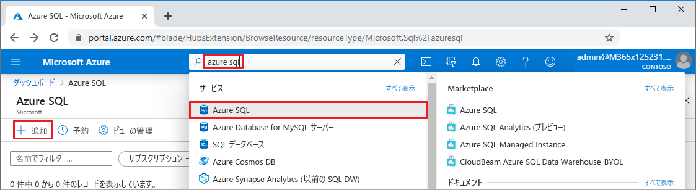
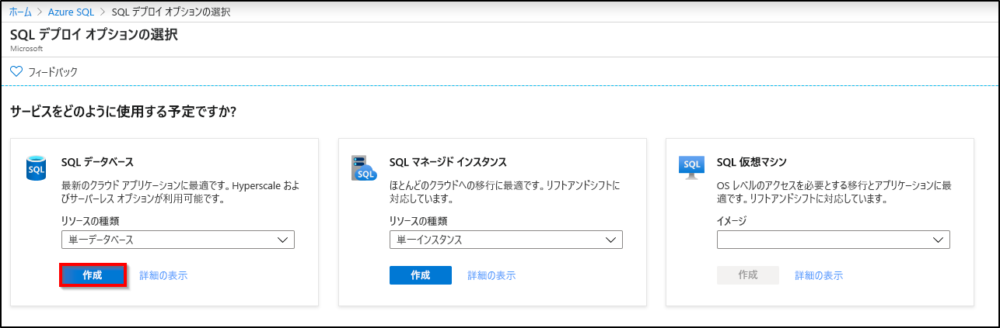
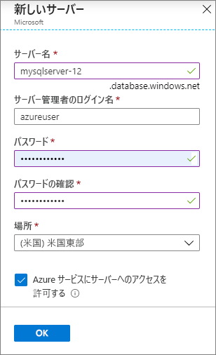

このステップでは、AdventureWorksLT サンプル データを使用する[論理 SQL サーバー](../database/logical-servers.md)と[単一データベース](../database/single-database-overview.md)を作成します。 データベースを作成するには、Azure portal のメニューと画面を使用するか、Azure Cloud Shell で Azure CLI または PowerShell スクリプトを使用します。

どの方法を使用する場合でも、サーバーレベルのファイアウォール規則を、サーバーへのアクセスに使用するコンピューターのパブリック IP アドレスを許可するように設定する必要があります。 サーバーレベルのファイアウォール規則を作成する方法の詳細については、[サーバーレベルのファイアウォール規則の作成](../database/firewall-create-server-level-portal-quickstart.md)に関するページをご覧ください。 また、データベースレベルのファイアウォール規則を作成することもできます。 [データベースレベルのファイアウォール規則の作成](/sql/relational-databases/system-stored-procedures/sp-set-database-firewall-rule-azure-sql-database)に関するページをご覧ください。

# <a name="portal"></a>[ポータル](#tab/azure-portal)

Azure portal でリソース グループ、サーバー、単一データベースを作成するには、次の手順を行います。

1. [ポータル](https://portal.azure.com)にサインインします。
1. 検索バーで **Azure SQL** を検索して、選択します。
1. **[Azure SQL]** ページで、 **[追加]** を選択します。

   

1. **[SQL デプロイ オプションを選択する]** ページで、 **[SQL データベース]** タイルを選択して、 **[リソースの種類]** で **[単一データベース]** を選択します。 **[詳細の表示]** を選択すると、さまざまなデータベースの詳細情報が表示されます。
1. **［作成］** を選択します

   

1. **[SQL データベースの作成]** フォームの **[基本]** タブにある **[プロジェクトの詳細]** で、適切な Azure **[サブスクリプション]** を選択します (まだ選択されていない場合)。
1. **[リソース グループ]** で、 **[新規作成]** を選択し、「*myResourceGroup*」と入力して、 **[OK]** を選択します。
1. **[データベースの詳細]** で、 **[データベース名]** に「*mySampleDatabase*」と入力します。
1. **[サーバー]** で、 **[新規作成]** を選択し、 **[新しいサーバー]** フォームに次のように入力します。
   - **[サーバー名]** : 「*mysqlserver*」と入力します。さらに、一意にするためにいくつかの文字を入力します。
   - **サーバー管理者ログイン**:「*azureuser*」と入力します。
   - **パスワード**:要件を満たすパスワードを入力し、 **[パスワードの確認入力]** フィールドにもう一度入力します。
   - **[場所]** :ドロップ ダウンを表示して、 **[(米国) 米国東部]** などの場所を選択します。

   **[OK]** を選択します。

   

   サーバーとそのデータベースにログインできるように、サーバー管理者ログインとパスワードを記録します。 ログインまたはパスワードを忘れた場合は、データベースを作成した後、 **[SQL サーバー]** ページでログイン名を取得するか、パスワードをリセットできます。 **[SQL サーバー]** ページを開くには、データベースの **[概要]** ページでサーバー名を選択します。

1. **[Compute + storage]\(計算とストレージ\)** で、既定値を構成する必要がある場合は、 **[データベースの構成]** を選択します。

   **[構成]** ページで、必要に応じて次の操作を行うことができます。
   - **[コンピューティング レベル]** を **[プロビジョニング済み]** から **[サーバーレス]** に変更する。
   - **[仮想コア]** と **[データの最大サイズ]** の設定を確認および変更する。
   - **[構成の変更]** を選択してハードウェアの世代を変更する。

   変更した後、 **[適用]** を選択します。

1. **ページの下部にある [Next: Networking]\(次へ: ネットワーク\)** を選択します。

   ![新しい SQL データベース - [基本] タブ](./media/sql-database-create-single-database/new-sql-database-basics.png)

1. **[ネットワーク]** タブの **[接続方法]** で、 **[パブリック エンドポイント]** を選択します。
1. **[ファイアウォール規則]** で、 **[現在のクライアント IP アドレスを追加する]** を **[はい]** に設定します。
1. **ページの下部にある [Next: Additional settings]\(次へ: 追加設定\)** を選択します。

   ![[ネットワーク] タブ](./media/sql-database-create-single-database/networking.png)
  
   ファイアウォール設定の詳細については、[[Azure サービスおよびリソースにこのサーバーへのアクセスを許可する]](../database/network-access-controls-overview.md) および[プライベート エンドポイントの追加](../database/private-endpoint-overview.md)に関するページを参照してください。

1. **[追加設定]** タブにある **[データ ソース]** セクションの **[既存のデータを使用します]** で、 **[サンプル]** を選択します。
1. 必要に応じて、[Azure Defender for SQL](../database/azure-defender-for-sql.md) を有効にします。
1. 必要に応じて、[メンテナンス期間](../database/maintenance-window.md)を設定して、ご利用のデータベースに対して計画メンテナンスが最適なタイミングで実行されるようにします。
1. ページ下部にある **[確認と作成]** を選択します。

   ![[追加設定] タブ](./media/sql-database-create-single-database/additional-settings.png)

1. 設定を確認したら、 **[作成]** を選択します。

# <a name="azure-cli"></a>[Azure CLI](#tab/azure-cli)

Azure コマンド ライン インターフェイス (Azure CLI) を使用して、Azure リソース グループ、サーバー、単一データベースを作成できます。 Azure Cloud Shell を使用しない場合、コンピューターに [Azure CLI をインストール](/cli/azure/install-azure-cli)します。

Azure Cloud Shell で次のコード サンプルを実行するには、コード サンプルのタイトル バーで **[テスト]** を選択します。 Cloud Shell が開いたら、コード サンプルのタイトル バーで **[コピー]** を選択し、コード サンプルを Cloud Shell ウィンドウに貼り付けます。 コードで、`<Subscription ID>` をお使いの Azure サブスクリプション ID に置き換え、`$startip` と `$endip` では、`0.0.0.0` をご使用のコンピューターのパブリック IP アドレスに置き換えます。

画面に表示されるプロンプトに従って、Azure にサインインし、コードを実行します。

上部のバーで [Cloud Shell] アイコンを選択して、Azure portal から Azure Cloud Shell を使用することもできます。

   

ポータルで初めて Cloud Shell を使用する場合は、 **[ようこそ]** ダイアログで **[Bash]** を選択します。 以降のセッションでは、Bash 環境で Azure CLI を使用します。また、Cloud Shell コントロール バーから **[Bash]** を選択することができます。

次の Azure CLI コードでは、サーバーにアクセスするためのリソース グループ、サーバー、単一データベース、サーバーレベル IP ファイアウォール規則を作成します。 後でこれらのリソースを管理できるように、生成されたリソース グループとサーバーの名前を必ず記録しておいてください。

```azurecli-interactive
#!/bin/bash

# Sign in to Azure and set execution context (if necessary)
az login
az account set --subscription <Subscription ID>

# Set the resource group name and location for your server
resourceGroupName=myResourceGroup-$RANDOM
location=westus2

# Set an admin login and password for your database
adminlogin=azureuser
password=Azure1234567

# Set a server name that is unique to Azure DNS (<server_name>.database.windows.net)
servername=server-$RANDOM

# Set the ip address range that can access your database
startip=0.0.0.0
endip=0.0.0.0

# Create a resource group
az group create \
    --name $resourceGroupName \
    --location $location

# Create a server in the resource group
az sql server create \
    --name $servername \
    --resource-group $resourceGroupName \
    --location $location  \
    --admin-user $adminlogin \
    --admin-password $password

# Configure a server-level firewall rule for the server
az sql server firewall-rule create \
    --resource-group $resourceGroupName \
    --server $servername \
    -n AllowYourIp \
    --start-ip-address $startip \
    --end-ip-address $endip

# Create a gen5 2 vCore database in the server
az sql db create \
    --resource-group $resourceGroupName \
    --server $servername \
    --name mySampleDatabase \
    --sample-name AdventureWorksLT \
    --edition GeneralPurpose \
    --family Gen5 \
    --capacity 2 \
```

前述のコードでは、次の Azure CLI コマンドを使用しています。

| command | 説明 |
|---|---|
| [az account set](/cli/azure/account#az_account_set) | サブスクリプションを現在のアクティブなサブスクリプションとして設定します。 |
| [az group create](/cli/azure/group#az_group_create) | すべてのリソースを格納するリソース グループを作成します。 |
| [az sql server create](/cli/azure/sql/server#az_sql_server_create) | データベースとエラスティック プールをホストするサーバーを作成します。 |
| [az sql server firewall-rule create](/cli/azure/sql/server/firewall-rule##az_sql_server_firewall_rule_create) | サーバーレベルのファイアウォール規則を作成します。 |
| [az sql db create](/cli/azure/sql/db#az_sql_db_create) | データベースを作成します。 |

他の Azure SQL Database の Azure CLI サンプルについては、[Azure CLI サンプル](../database/az-cli-script-samples-content-guide.md)に関するページをご覧ください。

# <a name="powershell"></a>[PowerShell](#tab/azure-powershell)

Windows PowerShell を使用して、リソース グループ、サーバー、単一データベースを作成できます。 Azure Cloud Shell を使用しない場合、[Azure PowerShell モジュールをインストール](/powershell/azure/install-az-ps)します。

[!INCLUDE [updated-for-az](../../../includes/updated-for-az.md)]

Azure Cloud Shell で次のコード サンプルを実行するには、コードのタイトル バーで **[テスト]** を選択します。 Cloud Shell が開いたら、コード サンプルのタイトル バーで **[コピー]** を選択し、コード サンプルを Cloud Shell ウィンドウに貼り付けます。 コードで、`<Subscription ID>` をお使いの Azure サブスクリプション ID に置き換え、`$startIp` と `$endIp` では、`0.0.0.0` をご使用のコンピューターのパブリック IP アドレスに置き換えます。

画面に表示されるプロンプトに従って、Azure にサインインし、コードを実行します。

上部のバーで [Cloud Shell] アイコンを選択して、Azure portal から Azure Cloud Shell を使用することもできます。

   

ポータルから初めて Cloud Shell を使用する場合は、 **[ようこそ]** ダイアログで **[PowerShell]** を選択します。 以降のセッションでは、PowerShell を使用します。また、Cloud Shell コントロール バーからこれを選択することもできます。

次の PowerShell コードでは、サーバーにアクセスするための Azure リソース グループ、サーバー、単一データベース、ファイアウォール規則を作成します。 後でこれらのリソースを管理できるように、生成されたリソース グループとサーバーの名前を必ず記録しておいてください。

   ```powershell-interactive
   # Set variables for your server and database
   $subscriptionId = '<SubscriptionID>'
   $resourceGroupName = "myResourceGroup-$(Get-Random)"
   $location = "West US"
   $adminLogin = "azureuser"
   $password = "Azure1234567"
   $serverName = "mysqlserver-$(Get-Random)"
   $databaseName = "mySampleDatabase"

   # The ip address range that you want to allow to access your server
   $startIp = "0.0.0.0"
   $endIp = "0.0.0.0"

   # Show randomized variables
   Write-host "Resource group name is" $resourceGroupName
   Write-host "Server name is" $serverName

   # Connect to Azure
   Connect-AzAccount

   # Set subscription ID
   Set-AzContext -SubscriptionId $subscriptionId

   # Create a resource group
   Write-host "Creating resource group..."
   $resourceGroup = New-AzResourceGroup -Name $resourceGroupName -Location $location -Tag @{Owner="SQLDB-Samples"}
   $resourceGroup

   # Create a server with a system wide unique server name
   Write-host "Creating primary server..."
   $server = New-AzSqlServer -ResourceGroupName $resourceGroupName `
      -ServerName $serverName `
      -Location $location `
      -SqlAdministratorCredentials $(New-Object -TypeName System.Management.Automation.PSCredential `
      -ArgumentList $adminLogin, $(ConvertTo-SecureString -String $password -AsPlainText -Force))
   $server

   # Create a server firewall rule that allows access from the specified IP range
   Write-host "Configuring firewall for primary server..."
   $serverFirewallRule = New-AzSqlServerFirewallRule -ResourceGroupName $resourceGroupName `
      -ServerName $serverName `
      -FirewallRuleName "AllowedIPs" -StartIpAddress $startIp -EndIpAddress $endIp
   $serverFirewallRule

   # Create General Purpose Gen4 database with 1 vCore
   Write-host "Creating a gen5 2 vCore database..."
   $database = New-AzSqlDatabase  -ResourceGroupName $resourceGroupName `
      -ServerName $serverName `
      -DatabaseName $databaseName `
      -Edition GeneralPurpose `
      -VCore 2 `
      -ComputeGeneration Gen5 `
      -MinimumCapacity 2 `
      -SampleName "AdventureWorksLT"
   $database
   ```

前述のコードでは、次の PowerShell コマンドレットを使用しています。

| command | Notes |
|---|---|
| [New-AzResourceGroup](/powershell/module/az.resources/new-azresourcegroup) | すべてのリソースを格納するリソース グループを作成します。 |
| [New-AzSqlServer](/powershell/module/az.sql/new-azsqlserver) | データベースとエラスティック プールをホストするサーバーを作成します。 |
| [New-AzSqlServerFirewallRule](/powershell/module/az.sql/new-azsqlserverfirewallrule) | サーバーレベルのファイアウォール規則をサーバーに作成します。 |
| [New-AzSqlDatabase](/powershell/module/az.sql/new-azsqldatabase) | データベースを作成します。 |

Azure SQL Database の他の PowerShell サンプルについては、[Azure PowerShell サンプル](../database/powershell-script-content-guide.md) に関するページをご覧ください。

---
