# クイック スタート:SQL Managed Instance のマネージド インスタンスを作成する
[!INCLUDE[appliesto-sqlmi](../includes/appliesto-sqlmi.md)]

このクイックスタートでは、[Azure SQL Managed Instance](sql-managed-instance-paas-overview.md) のマネージド インスタンスを Azure portal で作成する方法について説明します。

> [!IMPORTANT]
> 制限については、[サポートされているリージョン](resource-limits.md#supported-regions)と[サポートされているサブスクリプションの種類](resource-limits.md#supported-subscription-types)に関するセクションを参照してください。

## マネージド インスタンスを作成する

マネージド インスタンスを作成するには、次の手順に従います。 

### Azure portal にサインインする

Azure サブスクリプションをお持ちでない場合は、[無料アカウントを作成](https://azure.microsoft.com/free/)してください。

1. [Azure portal](https://portal.azure.com/) にサインインします。
1. Azure portal の左側のメニューにある **[Azure SQL]** を選択します。 **[Azure SQL]** が一覧にない場合は、 **[すべてのサービス]** を選択し、検索ボックスに「**Azure SQL**」と入力します。
1. **[+ 追加]** を選択して、 **[Select SQL deployment option]\(SQL デプロイ オプションの選択\)** ページを開きます。 **[SQL マネージド インスタンス]** タイルの **[詳細の表示]** を選択すると、Azure SQL Managed Instance に関する追加情報を表示できます。
1. **［作成］** を選択します

   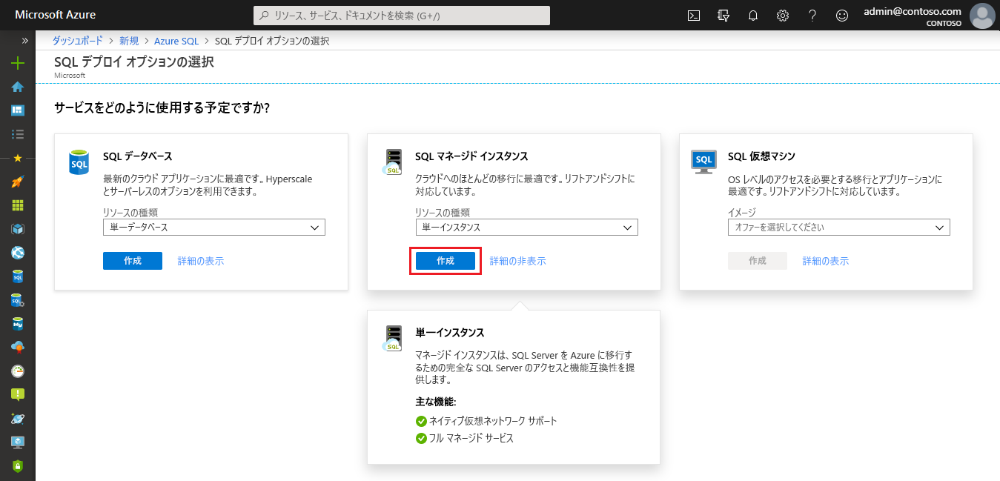

4. **[Create Azure SQL Managed Instance]\(Azure SQL Managed Instance の作成\)** プロビジョニング フォーム上のタブを使用して、必須の情報と任意の情報を追加します。 以下のセクションで、これらのタブについて説明します。

### [基本] タブ

- **[基本]** タブで必須情報を記入します。これは、マネージド インスタンスをプロビジョニングするために必要な最小限の情報セットです。

   ![マネージド インスタンスを作成するための [基本] タブ](./media/instance-create-quickstart/mi-create-tab-basics.png)

   このタブで必要となる情報については、次の表を参考にしてください。

   | 設定| 推奨値 | 説明 |
   | ------ | --------------- | ----------- |
   | **サブスクリプション** | 該当するサブスクリプション。 | 新しいリソースを作成するアクセス許可を与えるサブスクリプション。 |
   | **リソース グループ** | 新規または既存のリソース グループ。|有効なリソース グループ名については、[名前付け規則と制限](/azure/architecture/best-practices/resource-naming)に関するページを参照してください。|
   | **マネージド インスタンス名** | 有効な名前。|有効な名前については、[名前付け規則と制限事項](/azure/architecture/best-practices/resource-naming)に関するページを参照してください。|
   | **リージョン** |マネージド インスタンスの作成先となるリージョン。|リージョンについては、「[Azure リージョン](https://azure.microsoft.com/regions/)」を参照してください。|
   | **マネージド インスタンス管理者ログイン** | 有効なユーザー名。 | 有効な名前については、[名前付け規則と制限事項](/azure/architecture/best-practices/resource-naming)に関するページを参照してください。 "serveradmin" は予約済みのサーバー レベルのロールであるため、使用しないでください。|
   | **パスワード** | 有効なパスワード。| パスワードは 16 文字以上で、[定義された複雑さの要件](../../virtual-machines/windows/faq.md#what-are-the-password-requirements-when-creating-a-vm)を満たす必要があります。|

- **[マネージド インスタンスの構成]** を選択して、コンピューティング リソースとストレージ リソースのサイズを指定し、価格レベルを確認します。 スライダーまたはテキスト ボックスを使用して、記憶域のサイズと仮想コアの数を指定します。 完了したら、 **[適用]** を選択して選択内容を保存します。 

   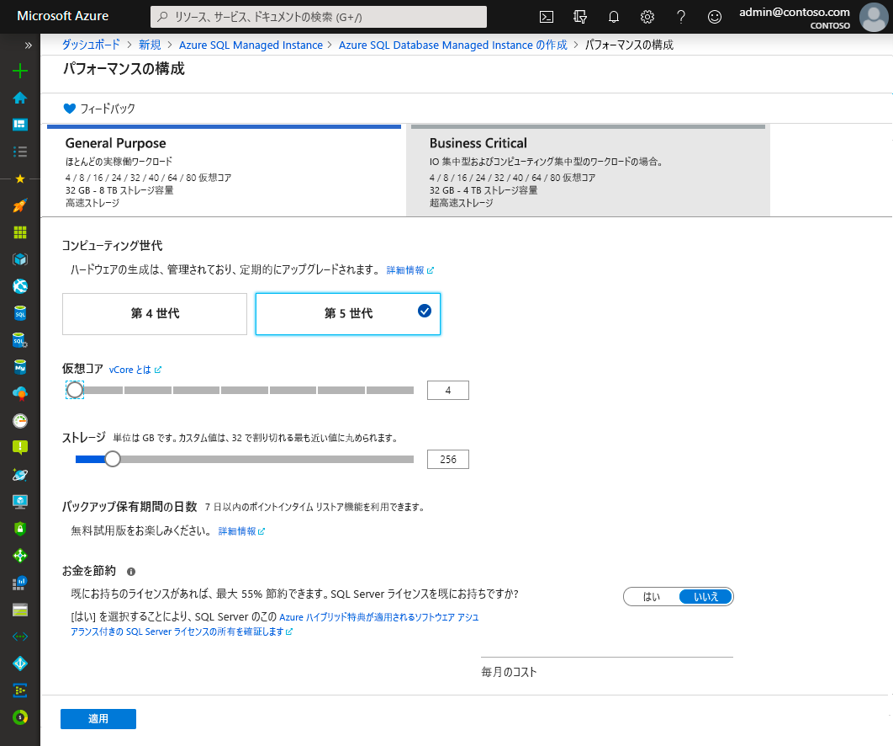

- SQL Managed Instance を作成する前に選択内容を確認するには、 **[確認と作成]** を選択してください。 または、ネットワーク オプションを構成します。これを行うには、 **[次へ: ネットワーク]** を選択します。

### [ネットワーク] タブ

- **[ネットワーク]** タブにオプションの情報を記入します。この情報を省略すると、ポータルによって既定の設定が適用されます。

   ![マネージド インスタンスを作成するための [ネットワーク] タブ](./media/instance-create-quickstart/mi-create-tab-networking.png)

   このタブで必要となる情報については、次の表を参考にしてください。

   | 設定| 推奨値 | 説明 |
   | ------ | --------------- | ----------- |
   | **仮想ネットワーク** | **[新しい仮想ネットワークの作成]** または有効な仮想ネットワークとサブネットを選択します。| ネットワークまたはサブネットが使用できない場合は、新しいマネージド インスタンスのターゲットとして選択する前に、[ネットワーク要件を満たすように変更する](vnet-existing-add-subnet.md)必要があります。 SQL Managed Instance のネットワーク環境を構成するための要件については、[SQL Managed Instance の仮想ネットワークの構成](connectivity-architecture-overview.md)に関する記事を参照してください。 |
   | **接続の種類** | 接続の種類として、プロキシまたはリダイレクトを選択します。|接続の種類の詳細については、[Azure SQL Managed Instance の接続の種類](../database/connectivity-architecture.md#connection-policy)に関するセクションを参照してください。|
   | **パブリック エンドポイント**  | **[有効化]** を選択します。 | パブリック データ エンドポイントを介してマネージド インスタンスにアクセスできるようにするには、このオプションを有効にする必要があります。 | 
   | **許可するアクセス元** (**パブリック エンドポイント**が有効な場合) | いずれかのオプションを選択します。   |ポータルでの操作により、パブリック エンドポイントを使用するセキュリティ グループを構成できます。     実際のシナリオに基づいて、次のいずれかのオプションを選択します。   <ul> <li>**Azure サービス**:Power BI または別のマルチテナント サービスから接続する場合は、このオプションをお勧めします。 </li> <li> **インターネット**:マネージド インスタンスを迅速に作成する必要がある場合にテスト目的で使用します。 運用環境ではお勧めしません。 </li> <li> **アクセスなし**:このオプションでは**拒否**セキュリティ規則が作成されます。 パブリック エンドポイントを介してマネージド インスタンスにアクセスできるようにするには、この規則を変更します。 </li> </ul>   パブリック エンドポイントのセキュリティの詳細については、[パブリック エンドポイントで安全に Azure SQL Managed Instance を使用する](public-endpoint-overview.md)方法に関するページを参照してください。|

- マネージド インスタンスを作成する前に、 **[確認と作成]** を選択して、選択内容を確認できます。 または、さらにカスタム設定を構成します。これを行うには、 **[次へ: 追加設定]** を選択します。

### 追加設定

- **[追加設定]** タブにオプションの情報を記入します。この情報を省略すると、ポータルによって既定の設定が適用されます。

   ![マネージド インスタンスを作成するための [追加設定] タブ](./media/instance-create-quickstart/mi-create-tab-additional-settings.png)

   このタブで必要となる情報については、次の表を参考にしてください。

   | 設定| 推奨値 | 説明 |
   | ------ | --------------- | ----------- |
   | **照合順序** | マネージド インスタンスに対して使用する照合順序を選択します。 SQL Server からデータベースを移行する場合は、`SELECT SERVERPROPERTY(N'Collation')` を使用してソースの照合順序を確認し、その値を使用してください。| 照合順序の詳細については、「[サーバーの照合順序の設定または変更](https://docs.microsoft.com/sql/relational-databases/collations/set-or-change-the-server-collation)」を参照してください。|   
   | **タイム ゾーン** | マネージド インスタンスで監視するタイム ゾーンを選択します。|詳細については、[タイム ゾーン](timezones-overview.md)に関するページを参照してください。|
   | **フェールオーバー セカンダリとして使用する** | **[はい]** を選択します。 | マネージド インスタンスをフェールオーバー グループのセカンダリとして使用するには、このオプションを有効にします。|
   | **プライマリ SQL Managed Instance** ( **[フェールオーバー セカンダリとして使用する]** が **[はい]** に設定されている場合) | 作成しているマネージド インスタンスと同じ DNS ゾーンに参加することになる既存のプライマリ マネージド インスタンスを選択します。 | この手順により、フェールオーバー グループの作成後の構成が有効になります。 詳細については、[マネージド インスタンスをフェールオーバー グループに追加する方法に関するチュートリアル](failover-group-add-instance-tutorial.md)を参照してください。|

## 確認と作成

1. マネージド インスタンスを作成する前に、 **[確認と作成]** タブを選択して、選択内容を確認します。

   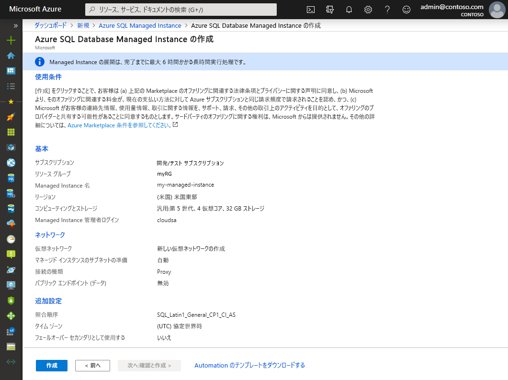

1. **[作成]** を選択して、マネージド インスタンスのプロビジョニングを開始します。

> [!IMPORTANT]
> マネージト インスタンスのデプロイは、実行時間の長い操作です。 サブネットへの最初のインスタンスのデプロイは、通常、既存のマネージド インスタンスが含まれるサブネットへのデプロイよりもはるかに長い時間がかかります。 平均的なプロビジョニング時間については、[SQL Managed Instance の管理操作](sql-managed-instance-paas-overview.md#management-operations)に関するセクションを参照してください。

## デプロイの進行状況を監視する

1. **[通知]** アイコンを選択してデプロイの状態を表示します。

   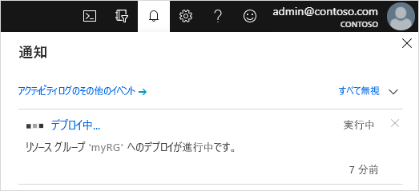

1. 通知内の **[デプロイを実行しています]** を選択して [SQL Managed Instance] ウィンドウを開き、デプロイの進行状況を詳しく監視します。 

> [!TIP]
> Web ブラウザーを閉じているか、[デプロイの進行状況] 画面から移動している場合は、次の手順に従ってその画面を見つけます。
> 1. Azure portal で、SQL Managed Instance のデプロイ先となるリソース グループを ( **[基本]** タブで) 開きます。
> 2. **[デプロイ]** を選択します。
> 3. 進行中の SQL Managed Instance のデプロイ操作を選択します。

> [!IMPORTANT]
> - SQL Managed Instance の作成は実行時間の長い操作であり、特定の状況によっては、一度に数時間かかることがあります。 一般的な作成時間については、「[管理操作の所要時間](management-operations-overview.md#management-operations-duration)」を参照してください。
> - 同じサブネット内の他のマネージド インスタンスに対する実行時間の長い復元操作やスケーリング操作など、影響の大きい操作が他に存在する場合、SQL Managed Instance の作成の開始が遅れる可能性があります。 詳細については、「[管理操作の相互影響](management-operations-overview.md#management-operations-cross-impact)」を参照してください。
> - マネージド インスタンスの作成の状態を取得できるようにするには、リソース グループに対する**読み取りアクセス許可**が必要です。 このアクセス許可がない場合、またはマネージド インスタンスの作成プロセス中にこのアクセス許可を取り消した場合は、リソース グループのデプロイの一覧に SQL Managed Instance が表示されない可能性があります。
>

## 作成されたリソースを表示する

マネージド インスタンスが正常にデプロイされた後、作成されたリソースを確認するには、次の手順に従います。

1. マネージド インスタンスのリソース グループを開きます。 

   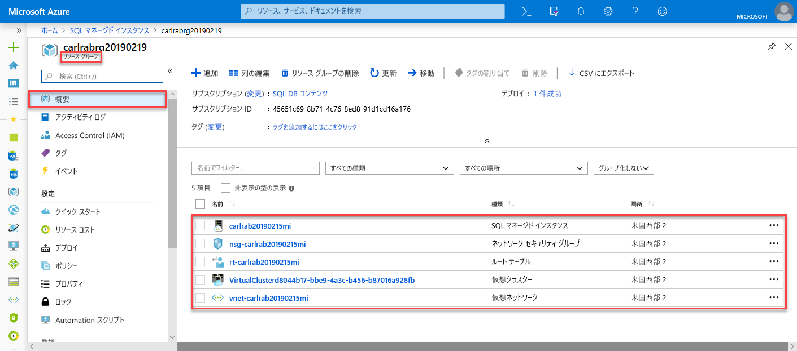

## ネットワークの設定を表示して微調整する

ネットワークの設定を必要に応じて微調整するには、次の点を調査します。

1. ルート テーブルを選択して、作成されたユーザー定義ルート (UDR) を確認します。

   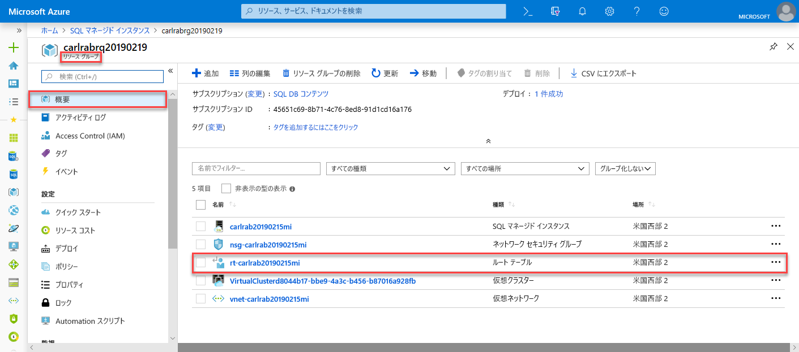

2. ルート テーブルで、SQL Managed Instance の仮想ネットワークから、またはその内部でトラフィックをルーティングするエントリを確認します。 ルート テーブルを手動で作成または構成する場合は、これらのエントリを SQL Managed Instance のルート テーブルに確実に作成します。

   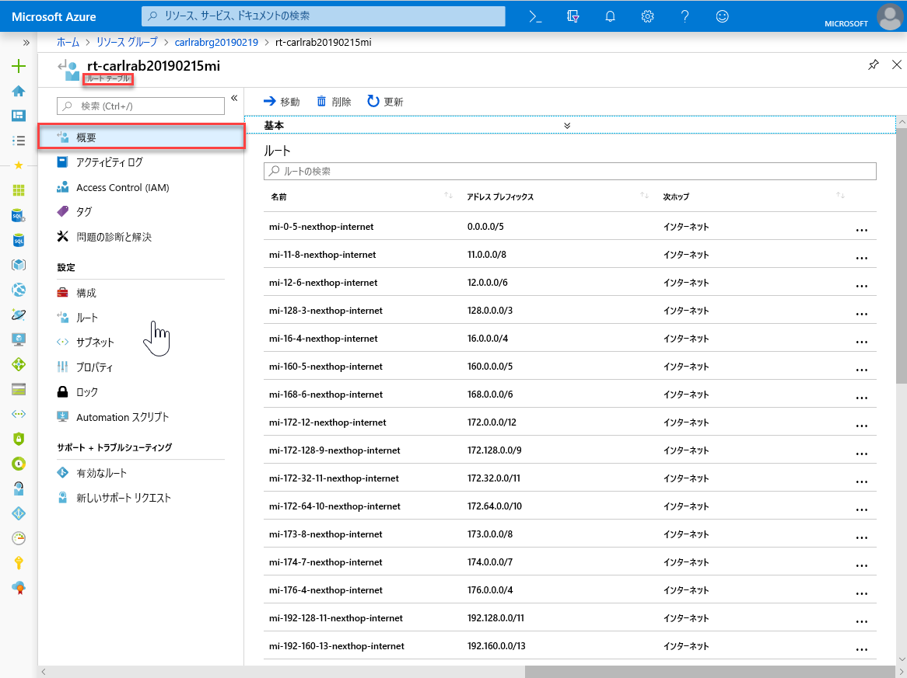

3. リソース グループに戻り、ネットワーク セキュリティ グループを選択します。

   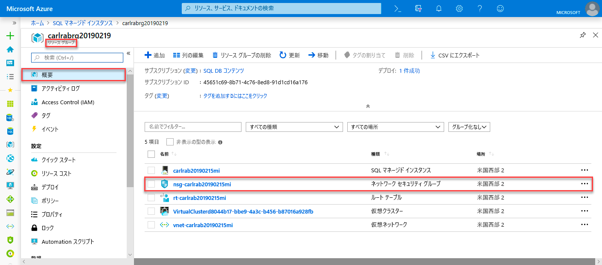

4. 受信および送信セキュリティ規則を確認します。 

   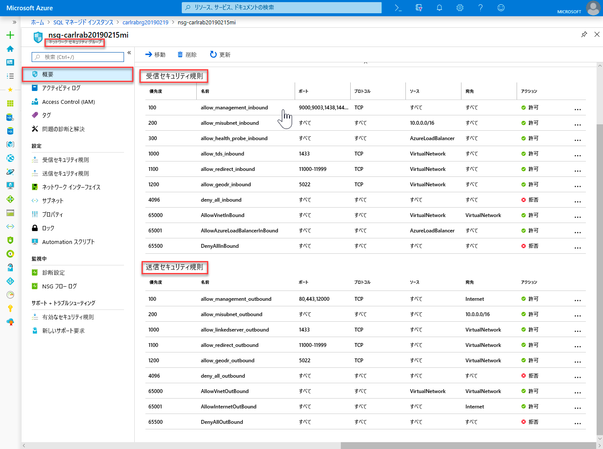

> [!IMPORTANT]
> SQL Managed Instance 用のパブリック エンドポイントを構成した場合は、パブリック インターネットから SQL Managed Instance に接続できるよう、ポートを開放してネットワーク トラフィックを許可する必要があります。 詳細については、[SQL Managed Instance 用のパブリック エンドポイントの構成](public-endpoint-configure.md#allow-public-endpoint-traffic-on-the-network-security-group)に関するセクションを参照してください。
>

## SQL Managed Instance への接続情報を取得する

SQL Managed Instance に接続するには、次の手順に従って、ホスト名と完全修飾ドメイン名 (FQDN) を取得します。

1. リソース グループに戻り、マネージド インスタンスを選択します。

   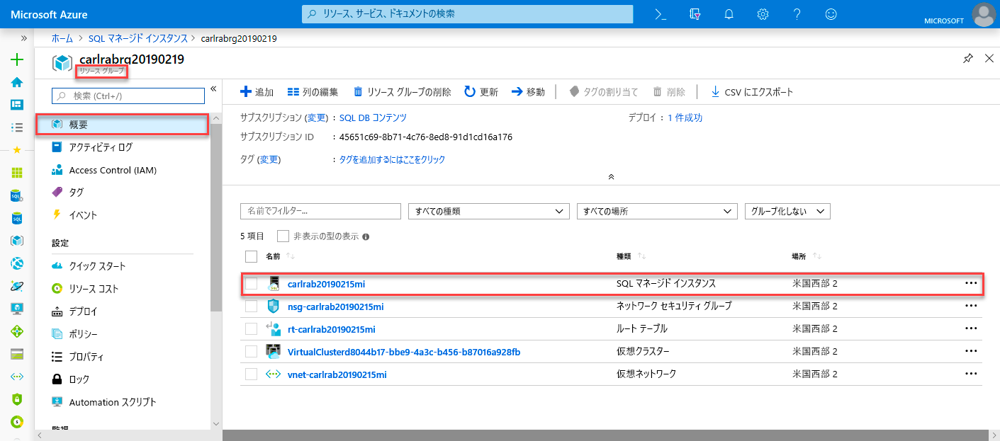

2. **[概要]** タブで、 **[ホスト]** プロパティを探します。 次のクイック スタートで使用するマネージド インスタンスのホスト名をコピーします。

   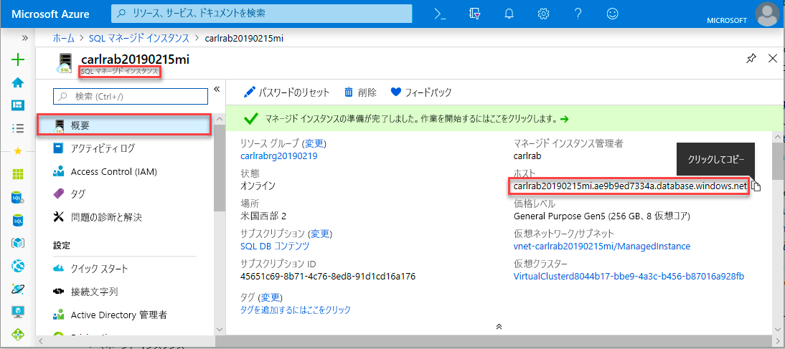

   コピーされた値は、SQL Managed Instance への接続に使用できる完全修飾ドメイン名 (FQDN) を表します。 たとえば、このアドレスは *your_host_name.a1b2c3d4e5f6.database.windows.net* のような形式になります。

## 次のステップ

SQL Managed Instance に接続する方法を学習する
- アプリケーションの接続オプションの概要については、[SQL Managed Instance にアプリケーションを接続する](connect-application-instance.md)方法に関するページを参照してください。
- Azure 仮想マシンから SQL Managed Instance に接続する方法を説明するクイックスタートについては、[Azure 仮想マシン接続の構成](connect-vm-instance-configure.md)に関するページを参照してください。
- ポイント対サイト接続を使用してオンプレミスのクライアント コンピューターから SQL Managed Instance に接続する方法を説明するクイックスタートについては、[ポイント対サイト接続の構成](point-to-site-p2s-configure.md)に関する記事を参照してください。

既存の SQL Server データベースをオンプレミスから SQL Managed Instance に復元する 
- [移行用の Azure Database Migration Service](../../dms/tutorial-sql-server-to-managed-instance.md) を使用してデータベース バックアップ ファイルから復元します。 
- [T-SQL RESTORE コマンド](restore-sample-database-quickstart.md)を使用してデータベース バックアップ ファイルから復元します。

組み込みのトラブルシューティング インテリジェンスを使用した SQL Managed Instance データベースの高度なパフォーマンス監視については、[Azure SQL Analytics を使用した Azure SQL Managed Instance の監視](../../azure-monitor/insights/azure-sql.md)に関するページを参照してください。
