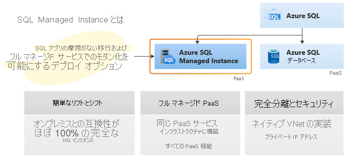

# Azure SQL Managed Instance とは
[!INCLUDE[appliesto-sqlmi](../includes/appliesto-sqlmi.md)]

Azure SQL Managed Instance はインテリジェントでスケーラブルなクラウド データベース サービスであり、幅広い SQL Server データベース エンジンとの互換性と、フル マネージドの常に最新のサービスとしてのプラットフォームのすべての利点を兼ね備えています。 SQL Managed Instance には、最新の SQL Server (Enterprise Edition) データベース エンジンとの 100% 近い互換性が備わっており、一般的なセキュリティ上の懸念事項に対処するネイティブの[仮想ネットワーク (VNet)](../../virtual-network/virtual-networks-overview.md) の実装と、SQL Server の既存のお客様にとって有利な[ビジネス モデル](https://azure.microsoft.com/pricing/details/sql-database/)を提供します。 SQL Managed Instance により、既存の SQL Server の顧客は最小限のアプリケーションおよびデータベースの変更のみで、オンプレミスのアプリケーションをクラウドに移行 (リフト アンド シフト) することができます。 これと同時に、SQL Managed Instance では、管理のオーバーヘッドと TCO を大幅に削減するすべての PaaS 機能 (自動的な修正プログラムの適用およびバージョン更新、[自動バックアップ](../database/automated-backups-overview.md)、[高可用性](../database/high-availability-sla.md)) を維持します。

Azure SQL Managed Instance を初めてお使いの方は、[Azure SQL ビデオ シリーズ](https://channel9.msdn.com/Series/Azure-SQL-for-Beginners?WT.mc_id=azuresql4beg_azuresql-ch9-niner)の *Azure SQL Managed Instance* に関するビデオをご覧ください。
> [!VIDEO https://channel9.msdn.com/Series/Azure-SQL-for-Beginners/Azure-SQL-Managed-Instance-Overview-6-of-61/player]

> [!IMPORTANT]
> 現在 SQL Managed Instance が提供されているリージョンの一覧については、「[サポートされているリージョン](resource-limits.md#supported-regions)」を参照してください。

次の図では、SQL Managed Instance の主な機能について概説します。

Azure SQL Managed Instance は、多数のアプリをオンプレミスまたは IaaS、自作、あるいは ISV 提供の環境からフル マネージド PaaS クラウド環境に、できるだけ手間をかけずに移行しようとしているお客様向けに設計されています。 完全に自動化された [Azure Data Migration Service](../../dms/tutorial-sql-server-to-managed-instance.md#create-an-azure-database-migration-service-instance) の利用により、顧客は既存の SQL Server インスタンスを SQL Managed Instance に移行 (リフト アンド シフト) することができます。その結果、VNet のネイティブ サポートにより SQL Server との互換性が維持され、顧客のインスタンスの完全な分離が実現します。 移行オプションとツールの詳細については、[SQL Server から Azure SQL Managed Instance への移行の概要](../migration-guides/managed-instance/sql-server-to-managed-instance-overview.md)に関するページを参照してください。  ソフトウェア アシュアランスに基づき、[SQL Server 用の Azure ハイブリッド特典](https://azure.microsoft.com/pricing/hybrid-benefit/)を利用して、顧客の既存のライセンスを SQL Managed Instance の割引料金に交換できます。 高度なセキュリティと豊富なプログラミング サーフェスを必要とする SQL Server インスタンスにとって、SQL Managed Instance はクラウド内における最適な移行先です。

> [!TIP]
> Azure SQL を改善するために、 [アンケートにご協力ください。](https://aka.ms/AzureSQLSurvey)

## 主な機能

SQL Managed Instance では、Azure SQL Database と SQL Server データベース エンジンのそれぞれで利用可能な最高の機能が組み合わされています。

> [!IMPORTANT]
> SQL Managed Instance では、オンライン操作、計画の自動修正、その他のエンタープライズ パフォーマンス拡張機能など、最新バージョンの SQL Server のすべての機能が実行されます。 使用可能な機能の比較については、[Azure SQL Managed Instance と SQL Server の機能の比較](../database/features-comparison.md)に関するページを参照してください。

| **PaaS の特典** | **ビジネス継続性** |
| --- | --- |
|ハードウェアの購入と管理が不要  基になるインフラストラクチャを管理するための管理オーバーヘッドが不要  迅速なプロビジョニングとサービスのスケーリング  自動的に行われる修正プログラムの適用とバージョンのアップグレード  その他の PaaS データ サービスとの統合 |99.99% アップタイム SLA   組み込みの[高可用性](../database/high-availability-sla.md)  [自動バックアップ](../database/automated-backups-overview.md)によるデータの保護  顧客が構成可能なバックアップの保有期間  ユーザーによって開始される[バックアップ](/sql/t-sql/statements/backup-transact-sql?preserve-view=true&view=azuresqldb-mi-current)  [データベースのポイントインタイム リストア](../database/recovery-using-backups.md#point-in-time-restore)機能 |
|**セキュリティとコンプライアンス** | **管理**|
|分離環境 ([VNet 統合](connectivity-architecture-overview.md)、シングル テナント サービス、専用のコンピューティングおよびストレージ)  [透過的なデータ暗号化 (TDE)](/sql/relational-databases/security/encryption/transparent-data-encryption-azure-sql) [Azure Active Directory (Azure AD) 認証](../database/authentication-aad-overview.md)、シングル サインオンのサポート   <a href="/sql/t-sql/statements/create-login-transact-sql?view=azuresqldb-mi-current&preserve-view=true">Azure AD サーバー プリンシパル (ログイン)</a>   Azure SQL Database と同じコンプライアンス標準に準拠  [SQL 監査](auditing-configure.md)  [Advanced Threat Protection](threat-detection-configure.md) |サービスのプロビジョニングとスケーリングを自動化するための Azure Resource Manager API  手動でのサービスのプロビジョニングとスケーリングに対応する Azure Portal の機能  データ移行サービス

> [!IMPORTANT]
> Azure SQL Managed Instance は、多くのコンプライアンス標準に対して認定されています。 詳細については、[Microsoft Azure コンプライアンス認証](https://servicetrust.microsoft.com/ViewPage/MSComplianceGuideV3?command=Download&downloadType=Document&downloadId=44bbae63-bf4d-4e3b-9d3d-c96fb25ec363&tab=7027ead0-3d6b-11e9-b9e1-290b1eb4cdeb&docTab=7027ead0-3d6b-11e9-b9e1-290b1eb4cdeb_FAQ_and_White_Papers)に関するページを参照してください。**SQL Database** の下で、最新の SQL Managed Instance コンプライアンス証明書の一覧を入手できます。

SQL Managed Instance の主な機能を次の表に示します。

|機能 | 説明|
|---|---|
| SQL Server のバージョン/ビルド | SQL Server データベース エンジン (最新の安定版) |
| 管理される自動バックアップ | はい |
| インスタンスおよびデータベースに対する組み込みの監視とメトリック | はい |
| 自動的に行われるソフトウェア修正プログラムの適用 | はい |
| 最新のデータベース エンジンの機能 | はい |
| データベースごとのデータ ファイル数 (ROWS) | 複数 |
| データベースごとのログ ファイル数 (LOG) | 1 |
| VNet - Azure Resource Manager デプロイ | はい |
| VNet - クラシック デプロイ モデル | いいえ |
| ポータルのサポート | はい|
| 組み込み統合サービス (SSIS) | いいえ - SSIS は [Azure Data Factory PaaS](../../data-factory/tutorial-deploy-ssis-packages-azure.md) に含まれます。 |
| 組み込み Analysis Service (SSAS) | いいえ - SSAS は別の [PaaS](../../analysis-services/analysis-services-overview.md) です。 |
| 組み込みレポート サービス (SSRS) | いいえ - 代わりに [Power BI のページ分割されたレポート](/power-bi/paginated-reports/paginated-reports-report-builder-power-bi)を使用するか、Azure VM で SSRS をホストしてください。 SQL Managed Instance では SSRS をサービスとして実行できませんが、SQL Server 認証を使用して、Azure 仮想マシンにインストールされているレポート サーバーに対して [SSRS カタログ データベース](/sql/reporting-services/install-windows/ssrs-report-server-create-a-report-server-database#database-server-version-requirements)をホストできます。 |
|||

## 仮想コアベースの購入モデル

SQL Managed Instance の[仮想コアベースの購入モデル](../database/service-tiers-vcore.md)では、柔軟性、管理性、透明性が実現されており、オンプレミスのワークロード要件をクラウドに容易に移行できます。 このモデルでは、ワークロードの必要性に基づいて、コンピューティング、メモリ、ストレージを変更できます。 また、仮想コア モデルは SQL Server 用の [Azure ハイブリッド特典](https://azure.microsoft.com/pricing/hybrid-benefit/)による最大 55% の割引の対象となります。

仮想コア モデルでは、ハードウェアの世代を選択できます。

- **Gen4** 論理 CPU は、Intel® E5-2673 v3 (Haswell) 2.4 GHz プロセッサ、付属 SSD、物理コア、コアあたり 7 GB の RAM、8 から 24 個の仮想コアのコンピューティング サイズに基づいています。
- **Gen5** 論理 CPU は、Intel® E5-2673 v4 (Broadwell) 2.3 GHz、Intel® SP-8160 (Skylake) および Intel® 8272CL (Cascade Lake) 2.5 GHz プロセッサ、高速 NVMe SSD、ハイパースレッド論理コア、4 から 80 コアのコンピューティング サイズに基づいています。

ハードウェアの世代の違いについて詳しくは、[SQL Managed Instance のリソース制限](resource-limits.md#hardware-generation-characteristics)に関する記事をご覧ください。

## サービス階層

SQL Managed Instance は 2 つのサービス レベルで利用できます。

- **General Purpose**:一般的なパフォーマンスと I/O 待ち時間要件を持つアプリケーション用に設計されています。
- **Business Critical**:短い I/O 待ち時間要件で、基盤となるメンテナンス操作がワークロードに与える影響が最小限のアプリケーション用に設計されています。

どちらのサービス階層も 99.99% の可用性を保証し、ストレージ サイズとコンピューティング能力を個別に選択することができます。 Azure SQL Managed Instance の高可用性アーキテクチャの詳細については、[高可用性と Azure SQL Managed Instance](../database/high-availability-sla.md) に関するページを参照してください。

### 汎用のサービス階層

次のリストで、General Purpose サービス レベルの主な特徴を説明します。

- 標準的なパフォーマンス要件を持つ大部分のビジネス アプリケーション向けに設計
- 高パフォーマンスの Azure Blob Storage (8 TB)
- 信頼性の高い Azure Blob Storage と [Azure Service Fabric](../../service-fabric/service-fabric-overview.md) に基づく、組み込みの[高可用性](../database/high-availability-sla.md#basic-standard-and-general-purpose-service-tier-locally-redundant-availability)

詳しくは、[General Purpose レベルでのストレージ レイヤー](https://medium.com/azure-sqldb-managed-instance/file-layout-in-general-purpose-azure-sql-managed-instance-cf21fff9c76c)と [SQL Managed Instance (General Purpose) のストレージ パフォーマンスのベスト プラクティスおよび考慮事項](/archive/blogs/sqlcat/storage-performance-best-practices-and-considerations-for-azure-sql-db-managed-instance-general-purpose)に関するページを参照してください。

サービス レベルの違いについて詳しくは、[SQL Managed Instance のリソース制限](resource-limits.md#service-tier-characteristics)に関する記事をご覧ください。

### Business Critical サービス レベル

Business Critical サービス レベルは、I/O 要件の高いアプリケーション向けに構築されています。 複数の分離されたレプリカを使用して、障害に対する最高の回復力を提供します。

次のリストで、Business Critical サービス レベルの主な特徴を説明します。

- 最高のパフォーマンスと HA の要件を持つビジネス アプリケーション向けに設計されています。
- 超高速のローカル SSD ストレージ (Gen4 で最大 1 TB、Gen5 で最大 4 TB) が付属します
- [Always On 可用性グループ](/sql/database-engine/availability-groups/windows/always-on-availability-groups-sql-server)と [Azure Service Fabric](../../service-fabric/service-fabric-overview.md) に基づく、組み込みの[高可用性](../database/high-availability-sla.md#premium-and-business-critical-service-tier-locally-redundant-availability)
- レポートやその他の読み取り専用ワークロードに使用できる、組み込みの追加の[読み取り専用データベース レプリカ](../database/read-scale-out.md)
- 高パフォーマンス要件のワークロードに使用することができる[インメモリ OLTP](../in-memory-oltp-overview.md)  

サービス レベルの違いについて詳しくは、[SQL Managed Instance のリソース制限](resource-limits.md#service-tier-characteristics)に関する記事を参照してください。

## 管理操作

Azure SQL Managed Instance には、新しいマネージド インスタンスを自動的にデプロイしたり、インスタンスのプロパティを更新したり、不要になったインスタンスを削除したりする際に使用できる管理操作が用意されています。 管理操作の詳細については、[マネージド インスタンスの管理操作の概要](management-operations-overview.md)に関するページを参照してください。

## 高度なセキュリティとコンプライアンス

SQL Managed Instance には、Azure プラットフォームと SQL Server データベース エンジンによって提供される高度なセキュリティ機能が搭載されています。

### セキュリティ分離

SQL Managed Instance では、Azure プラットフォーム上での他のテナントからのセキュリティ分離が追加されています。 セキュリティ分離:

- Azure ExpressRoute または VPN Gateway を使った、オンプレミス環境への[ネイティブ仮想ネットワークの実装](connectivity-architecture-overview.md)と接続。
- 既定のデプロイでは、SQL エンドポイントはプライベート IP アドレスでのみ公開されるため、プライベート Azure ネットワークまたはハイブリッド ネットワークから安全に接続できます。
- 専用の基になるインフラストラクチャ (コンピューティング、ストレージ) を備えたシングル テナント。

次の図では、アプリケーションのさまざまな接続オプションについて概説します。

  

サブネット レベルでの VNet 統合およびネットワーク ポリシーの適用の詳細については、[マネージド インスタンスの VNet アーキテクチャ](connectivity-architecture-overview.md)に関する記事と、[マネージド インスタンスへのアプリケーションの接続](connect-application-instance.md)に関する記事をご覧ください。

> [!IMPORTANT]
> 複数のマネージド インスタンスを同じサブネットに配置すると追加のメリットが得られるので、セキュリティ要件で許可されている場合は常にそのように配置します。 同じサブネット内に複数のインスタンスを配置すると、ネットワーク インフラストラクチャのメンテナンスが大幅に簡素化され、インスタンスのプロビジョニング時間が短縮されます。これは、長いプロビジョニング時間は、サブネット内で最初のマネージド インスタンスをデプロイするコストに関連するためです。

### セキュリティ機能

Azure SQL Managed Instance は、データを保護するために使用できる一連の高度なセキュリティ機能を提供します。

- [SQL Managed Instance の監査](auditing-configure.md)では、データベース イベントが追跡されて、Azure ストレージ アカウント内の監査ログ ファイルにイベントが書き込まれます。 監査により、規定遵守の維持、データベース活動の理解、およびビジネス上の懸念やセキュリティ違犯の疑いを示す差異や異常に対する洞察が容易になります。
- 移動中のデータの暗号化 - SQL Managed Instance では、トランスポート層セキュリティを使用して移動中のデータの暗号化を実現することにより、データがセキュリティで保護されます。 トランスポート層セキュリティに加えて、SQL Managed Instance では [Always Encrypted](/sql/relational-databases/security/encryption/always-encrypted-database-engine) を使用して、転送中、保存中、およびクエリの処理中の機密データが保護されます。 Always Encrypted は、重要なデータの盗難を伴う侵害に対するデータ セキュリティを提供します。 たとえば、クレジット カード番号は、Always Encrypted によって常に暗号化されてデータベースに格納されます。暗号化はクエリ処理中も行われます。復号化は、データを処理する必要がある承認されたスタッフまたはアプリケーションが使用するときに実行することができます。
- [Advanced Threat Protection](threat-detection-configure.md) では、サービスに組み込まれたセキュリティ インテリジェンスの追加レイヤーを提供することにより、[監査](auditing-configure.md)が補完されます。このレイヤーでは、データベースにアクセスしたりデータベースを悪用したりしようとする、異常で有害な可能性がある動作が検出されます。 不審なアクティビティ、潜在的な脆弱性、SQL インジェクション攻撃や、異常なデータベース アクセス パターンについて、アラートが送信されます。 Advanced Threat Protection のアラートは [Azure Security Center](https://azure.microsoft.com/services/security-center/) でご確認いただけます。 不審なアクティビティの詳細と、脅威の調査や危険性の軽減のために推奨される対処方法が提供されます。  
- [動的データ マスク](/sql/relational-databases/security/dynamic-data-masking)では、特権のないユーザーに対して機微なデータをマスクすることでデータの公開を制限します。 動的データ マスクでは、公開する機微なデータの量を指定することで、機微なデータに対する未承認のアクセスを防ぐことができ、アプリケーション レイヤーへの影響は最小限に抑えられます。 これはポリシー ベースのセキュリティ機能です。これにより、データベース内のデータはそのままで、指定されたデータベース フィールドに対するクエリの結果セットで機微なデータを非表示にすることができます。
- [行レベルセキュリティ](/sql/relational-databases/security/row-level-security) (RLS) を使用して、クエリを実行しているユーザーの特性 (グループのメンバーシップや実行コンテキストなど) に基づいて、データベース テーブル内の行へのアクセスを制御できます。 RLS により、アプリケーションでのセキュリティの設計とコーディングが簡略化されます。 RLS を使用すると、データ行のアクセスに対して制限を実装できます。 たとえば、ワーカーが自分の部署に関連するデータ行にのみアクセスできるようにしたり、データ アクセスを関連するデータにのみ制限したりできます。
- [透過的なデータ暗号化 (TDE)](/sql/relational-databases/security/encryption/transparent-data-encryption-azure-sql) では、SQL Managed Instance のデータ ファイルが暗号化されます。これは、保存データの暗号化として知られています。 TDE は、データとログ ファイルの I/O 暗号化と複合化をリアルタイムで実行します。 暗号化は、復旧中に、可用性のためのデータベース ブート レコードに格納されるデータベース暗号化キー (DEK) を使用します。 透過的なデータ暗号化でマネージド インスタンス内のすべてのデータベースを保護することができます。 TDE は、記憶域メディアの盗難を防ぐために多くのコンプライアンス基準で要求されている、SQL Server での実証済みの保存データ暗号化テクノロジです。

暗号化されたデータベースの SQL Managed Instance への移行は、Azure Database Migration Service またはネイティブの復元によってサポートされています。 暗号化されたデータベースをネイティブの復元を使用して移行する予定がある場合は、既存の TDE 証明書を SQL Server インスタンスから SQL Managed Instance に移行する手順が必要です。 移行オプションについて詳しくは、[SQL Managed Instance への SQL Server の移行](migrate-to-instance-from-sql-server.md)に関する記事をご覧ください。

## Azure Active Directory の統合

SQL Managed Instance では、従来の SQL Server データベース エンジン ログインと、Azure AD に統合されたログインがサポートされています。 Azure AD サーバー プリンシパル (ログイン) (**パブリック プレビュー**) は、オンプレミス環境で使用されているオンプレミス データベース ログインの Azure クラウド版です。 Azure AD サーバー プリンシパル (ログイン) を使用すると、Azure AD テナントからユーザーとグループを、まさにインスタンス スコープのプリンシパルとして指定でき、同じマネージド インスタンス内の複数データベース間のクエリなど、インスタンスレベルの任意の操作を実行できます。

Azure AD サーバー プリンシパル (ログイン) を作成するための新しい構文 **FROM EXTERNAL PROVIDER** が導入されます。 構文の詳細については、<a href="/sql/t-sql/statements/create-login-transact-sql?view=azuresqldb-mi-current&preserve-view=true">CREATE LOGIN</a> を参照し、[SQL Managed Instance に対する Azure Active Directory 管理者のプロビジョニング](../database/authentication-aad-configure.md#provision-azure-ad-admin-sql-managed-instance)に関する記事を確認してください。

### Azure Active Directory との統合と多要素認証

SQL Managed Instance では、[Azure Active Directory 統合](../database/authentication-aad-overview.md)によって、データベース ユーザーとその他の Microsoft サービスの ID を一元的に管理することができます。 この機能は、アクセス許可の管理を簡略化し、セキュリティを強化します。 Azure Active Directory では、シングル サインオン プロセスをサポートすると同時に、データとアプリケーションのセキュリティを強化するための[多要素認証](../database/authentication-mfa-ssms-configure.md)がサポートされています。

### 認証

SQL Managed Instance 認証とは、データベースへの接続時にユーザーが自分の ID を証明する方法のことです。 SQL Managed Instance では、次の 2 種類の認証がサポートされます。  

- **SQL 認証**:

  この認証方法では、ユーザー名とパスワードを使用します。
- **Azure Active Directory 認証**:

  この認証方法では、Azure Active Directory で管理されている ID を使用し、管理、統合されたドメインをサポートしています。 [可能であれば](/sql/relational-databases/security/choose-an-authentication-mode)、Active Directory 認証 (統合セキュリティ) を使用します。

### 承認

承認とは、Azure SQL Managed Instance のデータベース内でユーザーにどのような操作が許可されるかを示すものであり、ユーザー アカウントのデータベース ロールのメンバーシップとオブジェクト レベルのアクセス許可によって制御されます。 SQL Managed Instance には、SQL Server 2017 と同じ承認機能があります。

## データベース移行

SQL Managed Instance のターゲットは、オンプレミスまたは IaaS データベース実装からのデータベースの一括移行を使用するユーザー シナリオです。 SQL Managed Instance では、移行ガイドで説明されているいくつかのデータベース移行オプションがサポートされています。 詳細については、[SQL Server から Azure SQL Managed Instance への移行の概要](../migration-guides/managed-instance/sql-server-to-managed-instance-overview.md)に関するページを参照してください。

### バックアップと復元  

移行のアプローチでは、Azure Blob Storage への SQL バックアップが活用されます。 Azure ストレージ BLOB に格納されたバックアップは、[T-SQL RESTORE コマンド](/sql/t-sql/statements/restore-statements-transact-sql?preserve-view=true&view=azuresqldb-mi-current)を使用して、マネージド インスタンスに直接復元できます。

- Wide World Importers - Standard データベースのバックアップ ファイルを復元する方法を説明したクイック スタートについては、[バックアップ ファイルをマネージド インスタンスに復元する](restore-sample-database-quickstart.md)方法に関するページを参照してください。 このクイック スタートでは、バックアップ ファイルを Azure BLOB ストレージにアップロードし、Secure Access Signature (SAS) キーを使用してセキュリティで保護する必要があることが説明されています。
- URL からの復元については、「[URL からのネイティブ復元](../migration-guides/managed-instance/sql-server-to-managed-instance-guide.md#backup-and-restore)」を参照してください。

> [!IMPORTANT]
> マネージド インスタンスからのバックアップは、別のマネージド インスタンスにのみ復元できます。 SQL Server インスタンスに復元したり、Azure SQL Database に復元したりすることはできません。

### Database Migration Service

Azure Database Migration Service は、複数のデータベース ソースから Azure データ プラットフォームへのシームレスな移行を最小限のダウンタイムで実現できるように設計された、フル マネージドのサービスです。 このサービスは、既存のサード パーティ製データベースと SQL Server データベースを、Azure SQL Database、Azure SQL Managed Instance、および Azure VM 上の SQL Server に移動するために必要なタスクを合理化します。 [Database Migration Service を使用してオンプレミスのデータベースを SQL Managed Instance に移行する方法](../../dms/tutorial-sql-server-to-managed-instance.md)に関するページを参照してください。

## サポートされている SQL 機能

SQL Managed Instance では段階的リリース計画に基づいて、最新の SQL Server バージョンとの 100% 近いセキュリティ、外部からのアクセス互換性を実現することを目的としています。 機能と比較の一覧については、[SQL Managed Instance 機能の比較](../database/features-comparison.md)に関するページを参照してください。SQL Managed Instance と SQL Server における T-SQL の相違点の一覧については、[SQL Managed Instance と SQL Server における T-SQL の相違点](transact-sql-tsql-differences-sql-server.md)に関するページを参照してください。

SQL Managed Instance では、SQL Server 2008 データベースとの下位互換性がサポートされています。 SQL Server 2005 データベース サーバーからの直接の移行がサポートされており、移行された SQL Server 2005 データベースの互換性レベルは SQL Server 2008 のレベルに更新されます。
  
次の図では、SQL Managed Instance でのセキュリティ、外部からのアクセス互換性について概説します。  

### SQL Server オンプレミスと SQL Managed Instance の主な相違点

SQL Managed Instance には、クラウド内で常に最新の状態が維持されることによる利点があります。これは、SQL Server の一部の機能が使用されなくなったり、削除されたり、代替機能が用意されたりする可能性があることを意味します。 特定の機能の動作がやや異なること、または完全には制御できない環境でサービスが実行されていることをツールで認識することが必要な特定のケースがあります。

主な相違点:

- 高可用性は、[Always On 可用性グループ](/sql/database-engine/availability-groups/windows/always-on-availability-groups-sql-server)と近いテクノロジを使用して構築され、事前に定義されています。
- 自動バックアップおよびポイントインタイム リストアのみが存在します。 顧客は自動バックアップ チェーンに影響を及ぼさない `copy-only` バックアップを開始できます。
- 完全な物理パスは指定できないため、該当するすべてのシナリオを異なる方法でサポートする必要があります。たとえば、RESTORE DB は WITH MOVE をサポートせず、CREATE DB では物理パスを使用できず、BULK INSERT は Azure BLOB にしか機能しません。
- SQL Managed Instance では、Windows 認証に代わるクラウドでの別の手段として、[Azure AD 認証](../database/authentication-aad-overview.md)がサポートされています。
- SQL Managed Instance では、インメモリ OLTP オブジェクトを含むデータベース用の XTP ファイル グループおよびファイルが自動的に管理されます。
- SQL Managed Instance では SQL Server Integration Services (SSIS) がサポートされており、SSIS パッケージを格納する SSIS カタログ (SSISDB) をホストできますが、パッケージは Azure Data Factory のマネージド Azure-SSIS Integration Runtime (IR) で実行されます。 [Data Factory での Azure-SSIS IR の作成](../../data-factory/create-azure-ssis-integration-runtime.md)に関する記事を参照してください。 SSIS の機能を比較するには、「[SQL Database と SQL Managed Instance を比較する](../../data-factory/create-azure-ssis-integration-runtime.md#comparison-of-sql-database-and-sql-managed-instance)」を参照してください。

### 管理機能

SQL Managed Instance では、システム管理者が管理タスクに費やす時間が短くなります。これはサービスによってタスクが自動化されたり、タスクが大幅に簡素化されたりするためです。 たとえば、[OS/RDBMS のインストールおよび修正プログラムの適用](../database/high-availability-sla.md)、[動的なインスタンスのサイズ変更および構成](../database/single-database-scale.md)、[バックアップ](../database/automated-backups-overview.md)、[データベース レプリケーション](replication-between-two-instances-configure-tutorial.md) (システム データベースを含む)、[高可用性の構成](../database/high-availability-sla.md)、正常性および[パフォーマンス監視](../../azure-monitor/insights/azure-sql.md)データ ストリームの構成などです。

詳細については、[SQL Managed Instance のサポートされている機能とサポートされていない機能の一覧](../database/features-comparison.md)および [SQL Managed Instance と SQL Server の T-SQL の相違点](transact-sql-tsql-differences-sql-server.md)に関するページを参照してください。

### マネージド インスタンスをプログラムで識別する

次の表には、Transact-SQL を介してアクセスできるプロパティをいくつか示します。これらのプロパティを使用することで、目的のアプリケーションが SQL Managed Instance で動作していることを検出し、重要なプロパティを取得することができます。

|プロパティ|値|解説|
|---|---|---|
|`@@VERSION`|Microsoft SQL Azure (RTM) - 12.0.2000.8 2018-03-07 Copyright (C) 2018 Microsoft Corporation|この値は SQL Database の値と同じです。 これは、SQL エンジンのバージョン 12 (SQL Server 2014) を示しているわけでは **ありません**。 SQL Managed Instance では、常に最新の安定した SQL エンジン バージョンが実行されます。これは、SQL Server の使用可能な最新の RTM バージョン以上です。  |
|`SERVERPROPERTY ('Edition')`|SQL Azure|この値は SQL Database の値と同じです。|
|`SERVERPROPERTY('EngineEdition')`|8|この値では、マネージド インスタンスが一意に識別されます。|
|`@@SERVERNAME`, `SERVERPROPERTY ('ServerName')`|次の形式による完全なインスタンス DNS 名:`<instanceName>`.`<dnsPrefix>`.database.windows.net。ここで、`<instanceName>` は顧客が指定する名前です。`<dnsPrefix>` は名前の中で自動生成される部分であり、グローバルな DNS 名の一意性を保証します (例: "wcus17662feb9ce98")|例: my-managed-instance.wcus17662feb9ce98.database.windows.net|

## 次のステップ

- 最初のマネージド インスタンスを作成する方法については、[クイック スタート ガイド](instance-create-quickstart.md)を参照してください。
- 機能比較一覧については、[SQL 共通機能](../database/features-comparison.md)に関する記事をご覧ください。
- VNet の構成の詳細については、[SQL Managed Instance VNet の構成](connectivity-architecture-overview.md)に関するページを参照してください。
- マネージド インスタンスを作成し、バックアップ ファイルからデータベースを復元するためのクイック スタートについては、[マネージド インスタンスの作成](instance-create-quickstart.md)に関するページを参照してください。
- Azure Database Migration Service を使用して移行する方法のチュートリアルについては、[Database Migration Service を使用した SQL Managed Instance の移行](../../dms/tutorial-sql-server-to-managed-instance.md)に関するページを参照してください。
- 組み込みのトラブルシューティング インテリジェンスを使用した SQL Managed Instance データベースの高度なパフォーマンス監視については、[Azure SQL Analytics を使用した Azure SQL Managed Instance の監視](../../azure-monitor/insights/azure-sql.md)に関するページを参照してください。
- 料金情報については、[SQL Database の価格](https://azure.microsoft.com/pricing/details/sql-database/managed/)に関する記事を参照してください。