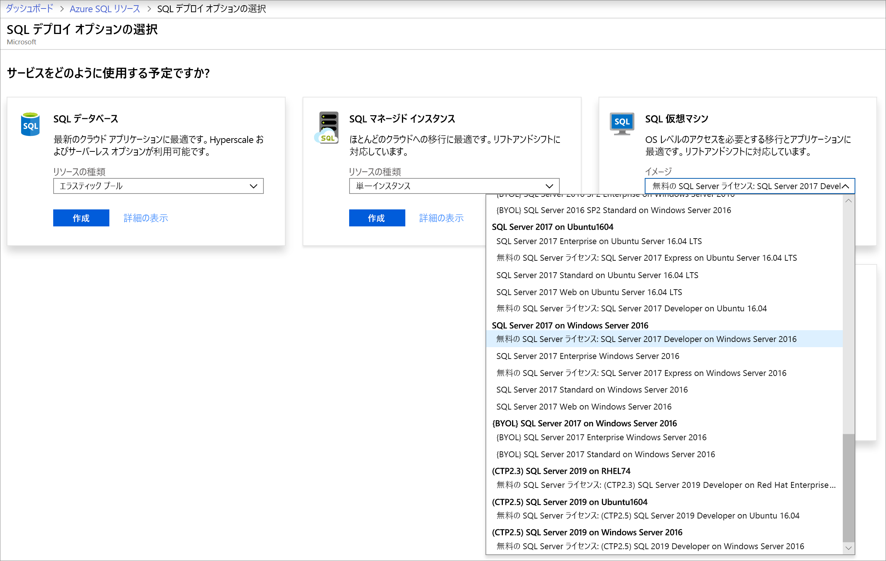
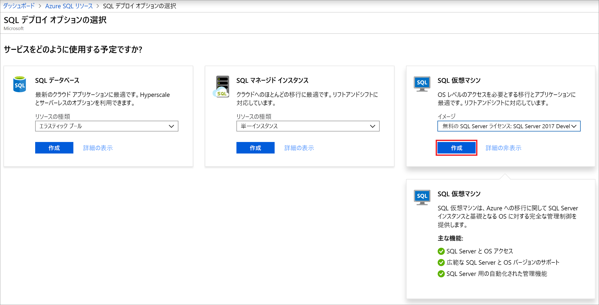
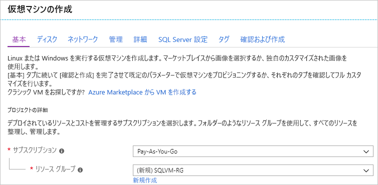
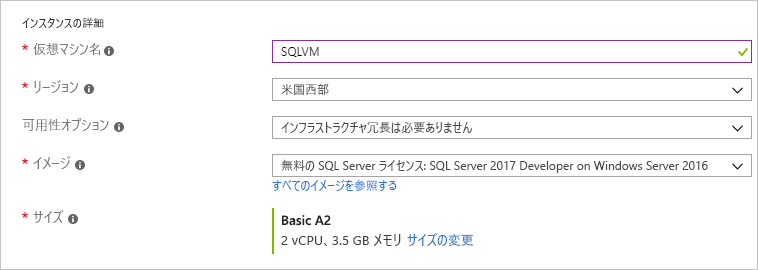
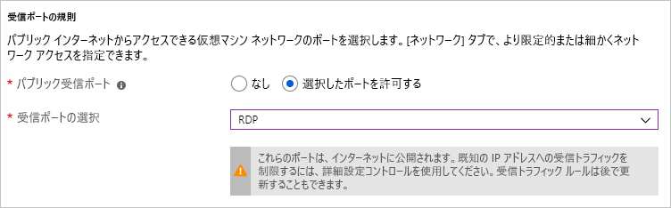
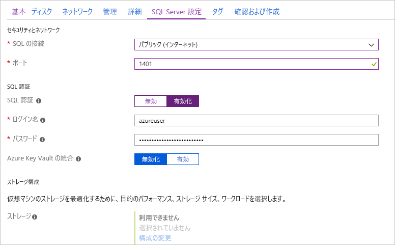
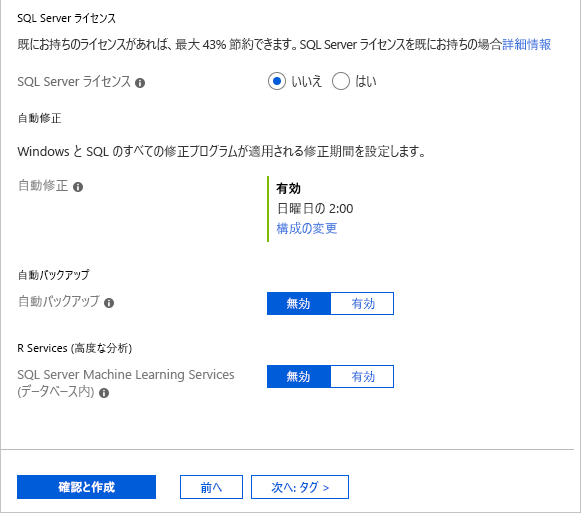
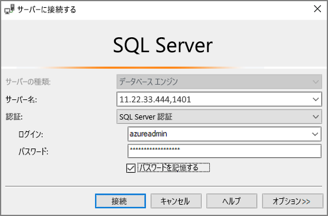

# クイック スタート:Azure portal で Windows 仮想マシン上に SQL Server 2017 を作成する

[!INCLUDE[appliesto-sqlvm](../../includes/appliesto-sqlvm.md)]

> [!div class="op_single_selector"]
> * [Windows](sql-vm-create-portal-quickstart.md)
> * [Linux](../linux/sql-vm-create-portal-quickstart.md)

このクイック スタートでは、Azure portal で SQL Server 仮想マシン (VM) を作成する方法について説明しています。

  > [!TIP]
  > - このクイック スタートでは、SQL VM を迅速にプロビジョニングしてそこに接続する方法について説明します。 その他の SQL VM プロビジョニング オプションについては、[Azure portal での Windows VM 上への SQL Server のプロビジョニング ガイド](create-sql-vm-portal.md)を参照してください。
  > - SQL Server の仮想マシンに関するご質問については、[よくあるご質問](frequently-asked-questions-faq.md)に関するページをご覧ください。

## Azure サブスクリプションを取得する

Azure サブスクリプションをお持ちでない場合は、開始する前に [無料アカウント](https://azure.microsoft.com/free/?WT.mc_id=A261C142F) を作成してください。

## SQL Server VM イメージを選択する

1. アカウントを使用して [Azure portal](https://portal.azure.com) にサインインします。

1. Azure portal の左側のメニューで **[Azure SQL]** を選択します。 **[Azure SQL]** が一覧にない場合は、 **[すべてのサービス]** を選択し、検索ボックスに「*Azure SQL*」と入力します。
1. **[+ 追加]** を選択して、 **[Select SQL deployment option]\(SQL デプロイ オプションの選択\)** ページを開きます。 **[SQL 仮想マシン]** タイル上の **[詳細の表示]** を選択することで、追加情報を表示できます。
1. **Free SQL Server License: ドロップダウンから SQL Server 2017 Developer on Windows Server 2016** イメージを選択します。

   

1. **［作成］** を選択します

   

## 基本的な詳細を指定する

**[基本]** タブで次の情報を指定します。

1. **[プロジェクトの詳細]** セクションで Azure サブスクリプションを選択し、 **[新規作成]** を選択して新しいリソース グループを作成します。 名前として「_SQLVM-RG_」と入力します。

   

1. **[インスタンスの詳細]** で、以下の操作を行います。
    1. **[仮想マシン名]** に「_SQLVM_」と入力します。 
    1. **[リージョン]** で場所を選択します。 
    1. このクイック スタートでは、 **[可用性オプション]** の設定を _[インフラストラクチャ冗長は必要ありません]_ のままにしておきます。 可用性オプションの詳細については、[可用性](../../../virtual-machines/availability.md)に関するページを参照してください。 
    1. **[イメージ]** の一覧で、_Free SQL Server License:SQL Server 2017 Developer on Windows Server 2016_ という名前のイメージを選択します。 
    1. 仮想マシンの **[サイズ]** で **[サイズの変更]** を選択し、 **[A2 Basic]** プランを選択します。 予期しない課金を防ぐために、利用を終了したリソースは必ずクリーンアップしてください。 

   

1. **[管理者アカウント]** で、ユーザー名 (_azureuser_ など) とパスワードを指定します。 パスワードは 12 文字以上で、[定義された複雑さの要件](../../../virtual-machines/windows/faq.md#what-are-the-password-requirements-when-creating-a-vm)を満たす必要があります。

   ![[Administrator account] (管理者アカウント)](./media/sql-vm-create-portal-quickstart/basics-administrator-account.png)

1. **[受信ポートの規則]** で **[選択したポートを許可する]** を選択し、ドロップダウンから **[RDP (3389)]** を選択します。 

   

## SQL Server の設定

**[SQL Server の設定]** タブで、以下のオプションを構成します。

1. **[セキュリティとネットワーク]** で、 **[SQL の接続]** に _[パブリック (インターネット)]_ を選択します。また、パブリック シナリオでよく知られているポート番号が使用されることを避けるために、ポートを `1401` に変更します。 
1. **[SQL 認証]** で **[有効]** を選択します。 VM 用に構成したのと同じユーザー名とパスワードが SQL ログイン資格情報に設定されます。 [**Azure Key Vault の統合**](azure-key-vault-integration-configure.md)の既定の設定を使用します。 **ストレージ構成** は基本的な SQL Server VM イメージでは使用できません。ただし、他のイメージに使用可能なオプションに関する詳細情報を [ストレージ構成](storage-configuration.md#new-vms)に関するページで見つけることができます。  

   

1. 必要に応じて、他の設定を変更し、 **[確認および作成]** を選択します。 

   

## SQL Server VM を作成する

**[確認および作成]** タブで概要を確認し、 **[作成]** を選択して、この VM に対して指定した SQL Server、リソース グループ、およびリソースを作成します。

Azure Portal でデプロイを監視できます。 画面の上部にある **[通知]** ボタンをクリックすると、デプロイの基本的な状態が表示されます。 デプロイには数分かかることがあります。 

## SQL Server への接続

1. ポータルで、仮想マシンのプロパティの **[概要]** セクションにある、SQL Server VM の **[パブック IP アドレス]** を見つけます。

1. インターネットに接続された別のコンピューターで、[SQL Server Management Studio (SSMS)](/sql/ssms/download-sql-server-management-studio-ssms) を開きます。

1. **[サーバーへの接続]** または **[データベース エンジンへの接続]** ダイアログ ボックスで、 **[サーバー名]** の値を編集します。 VM のパブリック IP アドレスを入力します。 コンマを追加し、新しい VM を構成するときに指定したカスタム ポートの **1401** を追加します。 たとえば、「 `11.22.33.444,1401` 」のように入力します。

1. **[認証]** ボックスで、 **[SQL Server 認証]** を選択します。

1. **[ログイン]** ボックスに、有効な SQL ログインの名前を入力します。

1. **[パスワード]** ボックスに、ログインのパスワードを入力します。

1. **[接続]** を選択します。

    

## VM にリモート ログインする

リモート デスクトップを使用して SQL Server 仮想マシンに接続するには、次の手順に従います。

[!INCLUDE [Connect to SQL Server VM with remote desktop](../../../../includes/virtual-machines-sql-server-remote-desktop-connect.md)]

SQL Server 仮想マシンに接続した後は、SQL Server Management Studio を起動し、ローカル管理者の資格情報を使用して Windows 認証で接続できます。 SQL Server 認証を有効にした場合は、プロビジョニングの間に構成した SQL のログインとパスワードを使用して SQL 認証で接続することもできます。

マシンにアクセスすると、要件に基づいてマシンと SQL Server の設定を直接変更することができます。 たとえば、ファイアウォールの設定を構成したり、SQL Server の構成設定を変更したりできます。

## リソースをクリーンアップする

SQL VM を継続的に実行する必要がない場合は、使用中でないときに停止することで、不要な料金の発生を回避できます。 仮想マシンに関連付けらているすべてのリソースは、関連付けられているリソース グループをポータルで削除することで完全に削除することもできます。 これを行うと仮想マシンも完全に削除されるため、このコマンドは注意して使用してください。 詳細については、「 [ポータルを使用した Azure リソースの管理](../../../azure-resource-manager/management/manage-resource-groups-portal.md)」を参照してください。

## 次のステップ

このクイック スタートでは、Azure portal で SQL Server 2017 仮想マシンを作成しました。 新しい SQL Server にデータを移行する方法の詳細については、次の記事を参照してください。

> [!div class="nextstepaction"]
> [SQL VM にデータベースを移行する](migrate-to-vm-from-sql-server.md)