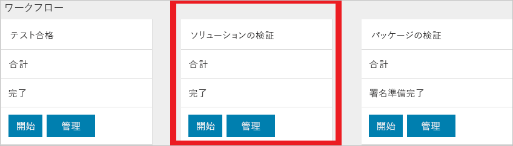

# クイック スタート: サービスとしての検証ポータルを使用して初めてのテストをスケジュールする

[!INCLUDE [Azure_Stack_Partner](./includes/azure-stack-partner-appliesto.md)]

ハードウェアをチェックする初めてのテストをサービスとしての検証 (VaaS) ポータルでスケジュールする方法について説明します。 検証テストを実行する前に、その対象となる Azure Stack ソリューションにローカル エージェントをデプロイしておく必要があります。

このクイック スタートでは、ソリューションを追加してテストを実行します。

## 前提条件

このクイック スタートの作業に進む前に、次の要件を満たす必要があります。
 - サービスとしての検証アカウント。 その手順については、「[Set up your validation as a service account (サービスとしての検証アカウントの設定)](azure-stack-vaas-set-up-account.md)」を参照してください。  
- ご利用のシステムにローカル エージェントがインストールされていること。 その手順については、「[ローカル エージェントおよびテスト用仮想マシンのデプロイ](azure-stack-vaas-test-vm.md)」を参照してください。

## 新しいソリューションの追加

1. [検証ポータル](https://azurestackvalidation.com)にサインインします。

      

2. **[新しいソリューション]** を選択します。
3. ソリューションの名前を入力し、**[保存]** を選択します。

## ソリューション検証ワークフローの作成

1. ソリューション名を選択します。
2. **[Solution Validations]\(ソリューションの検証\)** タイルの **[管理]** を選択します。

    

## ソリューション ワークフローの作成

1. **[New solution validation]\(新しいソリューション検証\)** を選択します。
2. 検証の名前を入力します。
3. **[最小]** または **[最大]** を選択します。  
    - **最小**  
    ソリューションは、サポートされる最小ノード数で構成されます。  
    - **[最大]**  
    ソリューションは、サポートされる最大ノード数で構成されます。
4. 環境パラメーターを追加します。 詳細については、「[環境パラメーターの追加](#add-environmental-parameters)」を参照してください。
5. 共通のテスト パラメーターを追加します。 詳細については、「[共通のテスト パラメーターの追加](#add-common-test-parameters)」を参照してください。

    テストの定義によっては、共通のパラメーター以外に値を入力しなければならない場合があります。または、共通のパラメーターの値を上書きすることもできます。
6. **[送信]** をクリックするとテストがスケジュールされます。

## 環境パラメーターの追加

次の環境パラメーターを追加します。

| テスト パス情報 | 必須 | 説明 |
| --- | --- | --- | --- |
| Azure Stack のビルド | 必須 | Azure Stack のビルド番号 (例: 20170501.1)。この値は、有効な Azure Stack のビルド番号またはバージョンであることが必要です (例: 1.0.170330.9) |
| テナント ID | 必須 | Active Directory のテナント ID。 GUID を指定してください (例: ECA23256-6BA0-4F27-8E4D-AFB02F088363) |
| リージョン | 必須 | Azure Stack のデプロイ リージョン |
| テナントの Resource Manager エンドポイント | 必須 | テナントの Azure Resource Manager 操作のエンドポイント (例: https://management.loc-ext.domain.com) |
| 管理者の Resource Manager エンドポイント | 必要なし | テナントの Azure Resource Manager 操作のエンドポイント (例: https://management.loc-ext.domain.com) |
| 外部 FQDN | 必要なし | エンドポイントのサフィックスとして使用される外部の完全修飾ドメイン名  (例: local.azurestack.external、redmond.contoso.com) |
| ノードの数 | 必須 | ソリューション内のノード数。 |

## 共通のテスト パラメーターの追加

次に示した共通のテスト パラメーターを追加します。

| テスト パス情報 | 必須 | 説明 |
| --- | --- | --- |
| テナント ユーザー名 | 必須 | テナント ユーザー名 (例: tenant@contoso.onmicrosoft.com) |
| テナント パスワード | 必須 | テナントのパスワード。 |
| サービス管理者のユーザー名 | 必要なし | テナント ユーザー名 (例: tenant@contoso.onmicrosoft.com) |
| サービス管理者のパスワード | 必要なし | サービス管理者のユーザー名 (例: serviceadmin@contoso.onmicrosoft.com) |
| クラウド管理者のユーザー名 | 必要なし | Azure Stack ドメイン管理者アカウント (例: contoso\cloudadmin) |
| クラウド管理者のパスワード | 必要なし | |
|  診断接続文字列 | 必要なし | テストの実行中に診断ログがコピーされる Azure Storage アカウントの SAS URI。 「[Create an Azure storage blob to store logs (ログを格納する Azure Storage Blob の作成)](azure-stack-vaas-set-up-account.md#create-an-azure-storage-blob-to-store-logs)」を参照してください。   **[診断接続文字列]** 共通パラメーターの値はサービスによって格納され、ワークフロー内でこのパラメーターを使うすべてのテストに、スケジュールされたタイミングで与えられます。 SAS URL の有効期限まで 30 日を切ると、共通パラメーター ページで新しい SAS URL を入力するよう求められます。 |
| タグ - 名前 | 必要なし |  ワークフローにラベルを付けるために、わかりやすいタグを入力できます。 これがタグの名前になります。 |
| タグ - 値 | 必要なし | ワークフローにラベルを付けるために、わかりやすいタグを入力できます。 これがタグの値になります。 |

## 次の手順

- [新しい Azure Stack ソリューションの検証](azure-stack-vaas-validate-solution-new.md)  
- [Azure Stack のサービスとしての検証](https://docs.microsoft.com/azure/azure-stack/partner)について、さらに詳しい情報をご覧ください。
