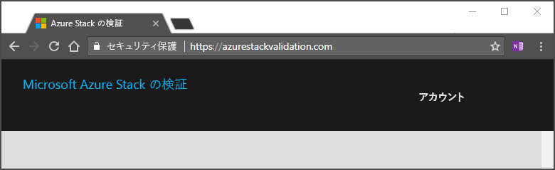

# サービスとしての検証アカウントを設定する

[!INCLUDE [Azure_Stack_Partner](./includes/azure-stack-partner-appliesto.md)]

サービスとしての検証 (VaaS) は、Microsoft Azure Stack パートナーに提供される Azure サービスです。Microsoft との共同エンジニアリング契約の下で、市場展開を目的として Azure Stack ソリューションの設計、開発、検証、販売、デプロイ、サポートを行うパートナーが対象となります。

サービスとしての検証に使用するシステムを準備する方法について説明します。 Azure Active Directory インスタンスの設定など、VaaS を使用するための準備として必要なタスクを行います。 

具体的なタスクは次のとおりです。

- ログを格納する Azure Storage Blob を作成する
- ローカル エージェントをデプロイする
- テスト対象の Azure Stack インスタンスにテスト イメージの仮想マシンをダウンロードする

## Azure Active Directory テナント ID を作成する

1. [Azure portal](https://portal.azure.com) に Azure Active Directory テナントを作成するか、または既存のテナントを使用します。

    テナントは、VaaS 専用に作成することをお勧めします。その際、ContosoVaaS@onmicrosoft.com など、わかりやすい名前を付けてください。 パートナーの組織内でだれが VaaS を使用できるかは、そのパートナーがテナントのロールベースのアクセス制御 (RBAC) 機能を使って管理します。  
    
    詳しくは、「[Azure AD ディレクトリの管理](https://docs.microsoft.com/azure/active-directory/active-directory-administer)」をご覧ください。

    > [!Note]  
    > 新しい Azure Active Directory テナントの作成について詳しくは、「[Azure AD を使ってみる](https://docs.microsoft.com/azure/active-directory/get-started-azure-ad)」をご覧ください。

2. このサービスの使用責任者となる社内のメンバーをテナントに追加します。 テナント内の各ユーザーには、VaaS へのアクセス レベルを制御するために、次のいずれかのロールを割り当てます。

    | ロール名 | 説明 |
    |---------------------|------------------------------------------|
    | Owner | すべてのリソースへのフル アクセス権が与えられます。 |
    | Reader | すべてのリソースを表示できますが、編集することはできません。 |
    | Test Contributor | テスト リソースを管理できます。 |
    | Catalog Contributor | ソリューション発行リソースを管理できます。 |

## テナントを設定する

**Azure Stack Validation Service** アプリケーションでテナントを設定します。 

1. テナントについて次の情報を Microsoft (vaashelp@microsoft.com) に送信します。

    | データ | 説明 |
    |--------------------------------|---------------------------------------------------------------------------------------------|
    | 組織名 | 組織の正式名称。 |
    | Azure AD テナント ディレクトリ名 | 登録する Azure AD テナント ディレクトリ名。 |
    | Azure AD テナント ディレクトリ ID | Azure AD テナント ディレクトリに関連付けられている GUID。  Azure AD テナント ディレクトリ ID の見つけ方については、「[テナント ID を取得する](https://docs.microsoft.com/azure/azure-resource-manager/resource-group-create-service-principal-portal#get-tenant-id)」を参照してください。 |

    

2. ご利用のテナントで VaaS ポータルを使用できるという確認が Azure Stack チームから得られます。

3. テナントの全体管理者の資格情報を使って [VaaS ポータル](https://azurestackvalidation.com/
)にサインインします。 **[マイ アカウント]** を選択します。

    

3. VaaS へのアクセスを許可するサイトのダイアログが表示されます。 利用規約に同意して続行してください。

## ユーザー ロールを割り当てる

ユーザー ロールを割り当てるには、次の手順に従います。

1. [Azure Portal](https://portal.azure.com) にサインインします。
2. **[ID]** グループで **[すべてのサービス]** > **[Azure Active Directory]** を選択します。
3. **[エンタープライズ アプリケーション]** > **[Azure Stack Validation Service]** アプリケーションを選択します。
4. **[ユーザーとグループ]** を選択します。 **[Azure Stack Validation Service - Users and group]\(Azure Stack Validation Service - ユーザーとグループ\)** ブレードに、アプリケーションを使用するためのアクセス許可と共にユーザーが一覧表示されます。
5. 割り当てを追加するには、**[+ ユーザーの追加]** を選択します。

## ログを格納する Azure Storage Blob を作成する

検証テストの実行中、VaaS によって診断ログが作成されます。 ログの格納先となる Azure Blob service の SAS URL が必要です。 また、OEM カスタマイズ パッケージの格納先としてストレージ アカウントが使用されることもあります。

以降、Azure Storage アカウントの SAS (Storage as a Service) URI を設定して生成する方法を順を追って説明しています。VaaS ポータルからテストを開始するとき、ポータルのどこでストレージ アカウントを指定するかについても触れています。

### Azure のストレージ アカウントの作成

1. ストレージ アカウントを作成するには、「[ストレージ アカウントの作成](../../storage/common/storage-quickstart-create-account.md)」の手順に従います。

2. ストレージ アカウントの種類を選ぶ際は、アカウントの種類として **[Blob Storage]** を選択します。

### ストレージ アカウントの SAS URL を生成する

1. 先ほど作成したストレージ アカウントに移動します。

2. ブレードの **[設定]** で **[Shared Access Signature]** を選択します。

3. **使用できるサービスのオプション**から **[Blob]** チェック ボックスだけをオンにします。それ以外のチェック ボックスはオフにしてください。

4. **[使用できるリソースの種類]** の **[サービス]**、**[コンテナー]、**[オブジェクト]** の各チェック ボックスをオンにします。

5. **[与えられているアクセス許可]** の **[読み取り]**、**[書き込み]**、**[リスト]**、**[追加]**、**[作成]** の各チェック ボックスをオンにします。それ以外のチェック ボックスはオフにしてください。

6. **[開始時間]** を現在の時刻に設定し、**[終了時刻]** を現在の時刻から 3 か月後に設定します。

7. **[Generate SAS and connection string]\(SAS と接続文字列の生成\)** を選択し、**[Blob service の SAS URL]** 文字列を保存します。

> [!Note]  
> URL の生成時に設定した終了時刻になると、SAS URL の有効期限が切れます。 デバッグを担当する製品チームに URL を共有する際は、あらかじめ URL に十分な有効期間を確保してください。つまりテストのスケジュールを設定するとき、URL の有効期間が 30 日以上となるようにしてください。

## 次の手順

- VaaS ローカル エージェントを使ってハードウェアをチェックします。 その手順については、「[ローカル エージェントおよびテスト用仮想マシンのデプロイ](azure-stack-vaas-test-vm.md)」をご覧ください。
- [Azure Stack のサービスとしての検証](https://docs.microsoft.com/azure/azure-stack/partner)について、さらに詳しい情報をご覧ください。