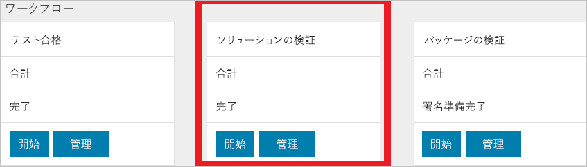
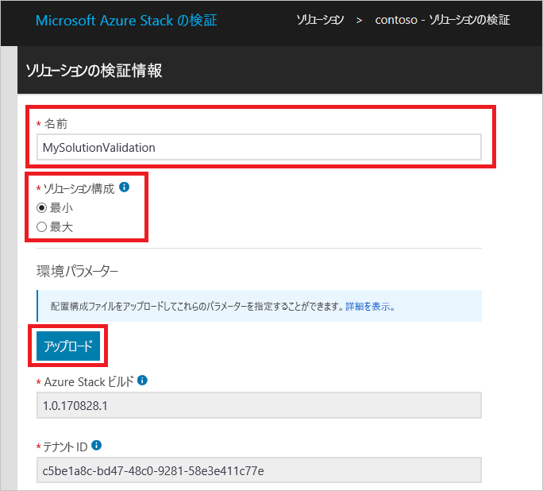
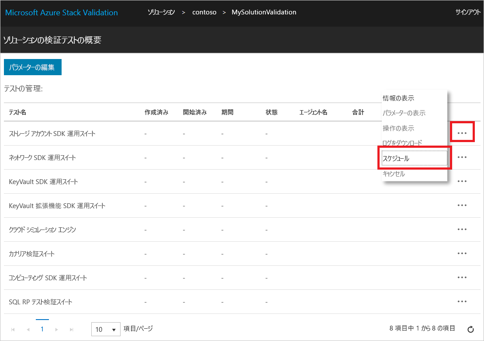

# 新しい Azure Stack ソリューションの検証

[!INCLUDE [Azure_Stack_Partner](./includes/azure-stack-partner-appliesto.md)]

**ソリューションの検証**ワークフローを使用して新しい Azure Stack ソリューションを認定する方法を学習します。

Azure Stack ソリューションは、Windows Server ロゴ認定要件に合格した後に Microsoft とパートナーとの間で共同で合意されたハードウェア部品表 (BoM) です。 ハードウェア BoM に変更があった場合は、ソリューションの再認定が必要になります。 ソリューションを再認定するタイミングについては、チーム [vaashelp@microsoft.com](mailto:vaashelp@microsoft.com) までお問い合わせください。

ソリューションを認定するために、ソリューションの検証ワークフローは 2 回実行してください。 1 回目は、サポートされる "*最小*" 構成で実行します。 2 回目は、サポートされる "*最大*" 構成で実行します。 両方の構成ですべてのテストに合格したソリューションが Microsoft によって認定されます。

[!INCLUDE [azure-stack-vaas-workflow-validation-completion](includes/azure-stack-vaas-workflow-validation-completion.md)]

## ソリューションの検証ワークフローの作成

1. [!INCLUDE [azure-stack-vaas-workflow-step_select-solution](includes/azure-stack-vaas-workflow-step_select-solution.md)]
2. **[Solution Validations]\(ソリューションの検証\)** タイルの **[開始]** を選択します。

    

3. [!INCLUDE [azure-stack-vaas-workflow-step_naming](includes/azure-stack-vaas-workflow-step_naming.md)]
4. **ソリューション構成**を選択します。
    - **[最小]**: ソリューションは、サポートされる最小ノード数で構成されます。
    - **[最大]**: ソリューションは、サポートされる最大ノード数で構成されます。
5. [!INCLUDE [azure-stack-vaas-workflow-step_upload-stampinfo](includes/azure-stack-vaas-workflow-step_upload-stampinfo.md)]

    

6. [!INCLUDE [azure-stack-vaas-workflow-step_test-params](includes/azure-stack-vaas-workflow-step_test-params.md)]

    > [!NOTE]
    > 環境パラメーターは、ワークフローを作成した後は変更できません。

7. [!INCLUDE [azure-stack-vaas-workflow-step_tags](includes/azure-stack-vaas-workflow-step_tags.md)]
8. [!INCLUDE [azure-stack-vaas-workflow-step_submit](includes/azure-stack-vaas-workflow-step_submit.md)]
    テストの概要ページにリダイレクトされます。

## ソリューションの検証テストの実行

**ソリューションの検証テストの概要**ページには、検証を完了するために必要なテストの一覧が表示されます。

[!INCLUDE [azure-stack-vaas-workflow-validation-section_schedule](includes/azure-stack-vaas-workflow-validation-section_schedule.md)]

## 次の手順

- [VaaS ポータルでのテストの監視と管理](azure-stack-vaas-monitor-test.md)