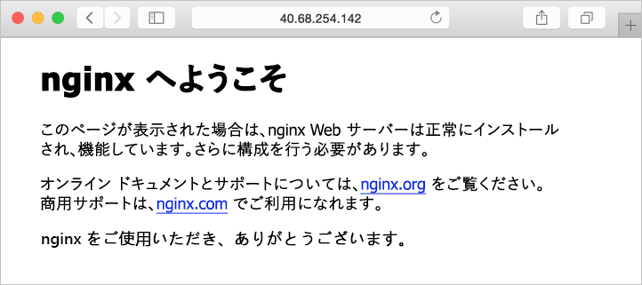

# <a name="quickstart-create-a-linux-server-virtual-machine-by-using-azure-cli-in-azure-stack"></a>クイック スタート: Azure Stack で Azure CLI を使用して Linux サーバー仮想マシンを作成する

*適用先: Azure Stack 統合システムと Azure Stack 開発キット*

Azure CLI を使用して、Ubuntu Server 16.04 LTS 仮想マシンを作成できます。 この記事の手順に従って仮想マシンを作成し、使用します。 この記事では、以下のことを実行する手順も示します。

* リモート クライアントを使用して仮想マシンに接続する。
* NGINX Web サーバーをインストールし、既定のホーム ページを表示します。
* 使用されていないリソースをクリーンアップします。

## <a name="prerequisites"></a>前提条件

* **Azure Stack Marketplace 内の Linux イメージ**

   Azure Stack Marketplace には、既定では Linux イメージが含まれていません。 必要な **Ubuntu Server 16.04 LTS** イメージを提供する Azure Stack オペレーターを取得します。 オペレーターは、「[Azure から Azure Stack に Marketplace の項目をダウンロードする](../azure-stack-download-azure-marketplace-item.md)」という記事に記載されている手順を使用できます。

* リソースを作成して管理するため、Azure Stack には Azure CLI の特定のバージョンが必要です。 Azure Stack 用に構成された Azure CLI がない場合は、[開発キット](azure-stack-connect-azure-stack.md#connect-to-azure-stack-with-remote-desktop)または Windows ベースの外部クライアント ([VPN 経由で接続](azure-stack-connect-azure-stack.md#connect-to-azure-stack-with-vpn)している場合) にサインインし、[Azure CLI のインストールと構成](azure-stack-version-profiles-azurecli2.md)の手順に従います。

* Windows ユーザー プロファイルの .ssh ディレクトリに保存された id_rsa.pub という名前の SSH 公開キー。 SSH キーの作成の詳細については、[Windows での SSH キーの作成](../../virtual-machines/linux/ssh-from-windows.md)に関するページを参照してください。

## <a name="create-a-resource-group"></a>リソース グループの作成

リソース グループは、Azure Stack リソースのデプロイと管理を行うことができる論理コンテナーです。 開発キットまたは Azure Stack 統合システムから、[az group create](/cli/azure/group#az-group-create) コマンドを実行してリソース グループを作成します。

>[!NOTE]
 値は、コード例のすべての変数に割り当てられます。 ただし、必要に応じて新しい値を割り当てることができます。

次の例では、myResourceGroup という名前のリソース グループをローカルの場所に作成します。

```cli
az group create --name myResourceGroup --location local
```

## <a name="create-a-virtual-machine"></a>仮想マシンの作成

[az vm create](/cli/azure/vm#az-vm-create) コマンドを使用して仮想マシンを作成します。 次の例では、myVM という名前の VM を作成します。 この例では、管理ユーザーの名前に Demouser、ユーザー パスワードに Demouser@123 を使用します。 これらの値を、環境に適した内容に更新します。

```cli
az vm create \
  --resource-group "myResourceGroup" \
  --name "myVM" \
  --image "UbuntuLTS" \
  --admin-username "Demouser" \
  --admin-password "Demouser@123" \
  --use-unmanaged-disk \
  --location local
```

**PublicIpAddress** パラメーターでパブリック IP アドレスが返されます。 このアドレスをメモしておきます。このアドレスは、後で仮想マシンにアクセスする際に必要になります。

## <a name="open-port-80-for-web-traffic"></a>Web トラフィック用にポート 80 を開く

この仮想マシンは IIS Web サーバーを実行することになるので、インターネット トラフィックに対してポート 80 を開く必要があります。 [az vm open-port](/cli/azure/vm#open-port) コマンドを使用して、目的のポートを開きます。

```cli
az vm open-port --port 80 --resource-group myResourceGroup --name myVM
```

## <a name="use-ssh-to-connect-to-the-virtual-machine"></a>SSH を使用して仮想マシンに接続する

SSH がインストールされたクライアント コンピューターから、仮想マシンに接続します。 Windows クライアントを使用している場合は、[Putty](http://www.putty.org/) を使用して接続を作成できます。 仮想マシンに接続するには、次のコマンドを使用します。

```bash
ssh <publicIpAddress>
```

## <a name="install-the-nginx-web-server"></a>NGINX Web サーバーのインストール

パッケージ リソースを更新し、最新の NGINX パッケージをインストールするため、次のスクリプトを実行します。

```bash
#!/bin/bash

# update package source
apt-get -y update

# install NGINX
apt-get -y install nginx
```

## <a name="view-the-nginx-welcome-page"></a>NGINX のようこそページの表示

NGINX がインストールされ、仮想マシン上のポート 80 が開かれたので、その仮想マシンのパブリック IP アドレスを使用して Web サーバーにアクセスできます。 Web ブラウザーを開き、```http://<public IP address>``` を参照します。



## <a name="clean-up-resources"></a>リソースのクリーンアップ

不要になったリソースをクリーンアップします。 これらのリソースを削除するには、[az group delete](/cli/azure/group#az-group-delete) コマンドを使用できます。 リソース グループとそのすべてのリソースを削除するには、次のコマンドを実行します。

```cli
az group delete --name myResourceGroup
```

## <a name="next-steps"></a>次の手順

このクイック スタートでは、Web サーバーがインストールされた基本の Linux サーバー仮想マシンをデプロイしました。 Azure Stack 仮想マシンの詳細については、「[Azure Stack の仮想マシンに関する考慮事項](azure-stack-vm-considerations.md)」に進んでください。
