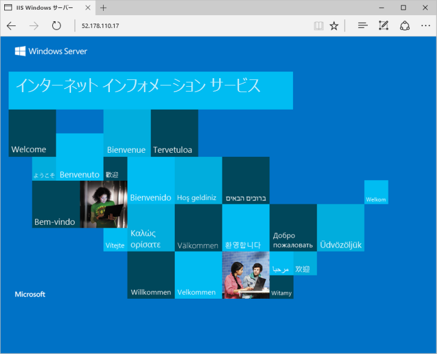

# <a name="quickstart-create-a-windows-server-virtual-machine-by-using-azure-cli-in-azure-stack"></a>クイック スタート: Azure Stack で Azure CLI を使用して Windows Server 仮想マシンを作成する

*適用先: Azure Stack 統合システムと Azure Stack Development Kit*

Azure CLI を使用して Windows Server 2016 仮想マシンを作成できます。 この記事の手順に従って仮想マシンを作成し、使用します。 この記事では、以下の手順についても説明します。

* リモート クライアントを使用して仮想マシンに接続する。
* IIS Web サーバーをインストールし、既定のホーム ページを表示する。
* リソースをクリーンアップする。

## <a name="prerequisites"></a>前提条件

* Azure Stack オペレーターが Azure Stack Marketplace に **Windows Server 2016** のイメージを追加していることを確認します。

* リソースを作成して管理するため、Azure Stack には Azure CLI の特定のバージョンが必要です。 Azure Stack 用に Azure CLI を構成していない場合は、[Azure CLI のインストールと構成](azure-stack-version-profiles-azurecli2.md)の手順に従います。

## <a name="create-a-resource-group"></a>リソース グループの作成

リソース グループは、Azure Stack リソースのデプロイと管理を行うことができる論理コンテナーです。 Azure Stack 環境から、[az group create](/cli/azure/group#az-group-create) コマンドを実行してリソース グループを作成します。

>[!NOTE]
 値は、コード例のすべての変数に割り当てられます。 ただし、必要に応じて新しい値を割り当てることができます。

次の例では、myResourceGroup という名前のリソース グループをローカルの場所に作成します。

```cli
az group create --name myResourceGroup --location local
```

## <a name="create-a-virtual-machine"></a>仮想マシンの作成

仮想マシン (VM) を作成するには、[az vm create](/cli/azure/vm#az-vm-create) コマンドを使用します。 次の例では、myVM という名前の VM を作成します。 この例では、管理ユーザーの名前に Demouser、ユーザー パスワードに Demouser@123 を使用します。 これらの値を、環境に適した内容に更新します。

```cli
az vm create \
  --resource-group "myResourceGroup" \
  --name "myVM" \
  --image "Win2016Datacenter" \
  --admin-username "Demouser" \
  --admin-password "Demouser@123" \
  --use-unmanaged-disk \
  --location local
```

VM が作成されると、出力の **PublicIPAddress** パラメーターには仮想マシンのパブリック IP アドレスが含まれます。 このアドレスをメモしておきます。このアドレスは、後で仮想マシンにアクセスする際に必要になります。

## <a name="open-port-80-for-web-traffic"></a>Web トラフィック用にポート 80 を開く

この VM は IIS Web サーバーを実行することになるので、インターネット トラフィックに対してポート 80 を開く必要があります。

[az vm open-port](/cli/azure/vm#open-port) コマンドを使用して、ポート 80 を開きます。

```cli
az vm open-port --port 80 --resource-group myResourceGroup --name myVM
```

## <a name="connect-to-the-virtual-machine"></a>仮想マシンへの接続

次のコマンドを使用して、仮想マシンへのリモート デスクトップ接続を作成します。 "パブリック IP アドレス" を仮想マシンの IP アドレスに置き換えます。 求められたら、仮想マシンに使用したユーザー名とパスワードを入力します。

```
mstsc /v <Public IP Address>
```

## <a name="install-iis-using-powershell"></a>PowerShell を使用した IIS のインストール

仮想マシンにログインすると、PowerShell を使用して IIS をインストールできます。 仮想マシン上で PowerShell を起動し、次のコマンドを実行します。

```powershell
Install-WindowsFeature -name Web-Server -IncludeManagementTools
```

## <a name="view-the-iis-welcome-page"></a>IIS のようこそページの表示

任意の Web ブラウザーを使用して、IIS の既定のウェルカム ページを確認します。 前のセクションで指定したパブリック IP アドレスを使用して、既定のページにアクセスします。



## <a name="clean-up-resources"></a>リソースのクリーンアップ

不要になったリソースをクリーンアップします。 [az group delete](/cli/azure/group#az-group-delete) コマンドを使用して、リソース グループ、仮想マシン、およびすべての関連リソースを削除します。

```cli
az group delete --name myResourceGroup
```

## <a name="next-steps"></a>次の手順

このクイック スタートでは、基本の Windows Server 仮想マシンをデプロイしました。 Azure Stack 仮想マシンの詳細については、「[Azure Stack の仮想マシンに関する考慮事項](azure-stack-vm-considerations.md)」に進んでください。
