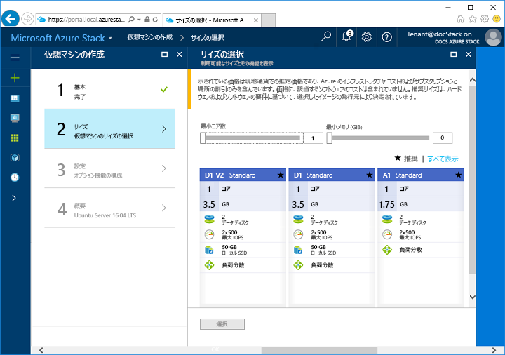
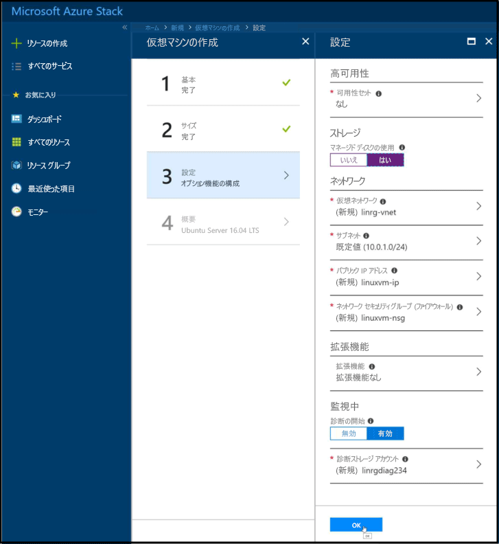

# <a name="quickstart-create-a-linux-server-virtual-machine-with-the-azure-stack-portal"></a>クイック スタート: Azure Stack ポータルで Linux サーバー仮想マシンを作成する

*適用先: Azure Stack 統合システムと Azure Stack 開発キット*

Azure Stack ポータルを使用して、Ubuntu Server 16.04 LTS 仮想マシンを作成できます。 この記事の手順に従って仮想マシンを作成し、使用します。 この記事では、以下のことを実行する手順も示します。

* リモート クライアントを使用して仮想マシンに接続する。
* NGINX Web サーバーをインストールする。
* リソースをクリーンアップする。

## <a name="prerequisites"></a>前提条件

* **Azure Stack Marketplace 内の Linux イメージ**

   Azure Stack Marketplace には、既定では Linux イメージが含まれていません。 Linux サーバー仮想マシンを作成する前に、Azure Stack オペレーターが、必要な **Ubuntu Server 16.04 LTS** イメージを提供していることを確認してください。 オペレーターは、「[Azure から Azure Stack に Marketplace の項目をダウンロードする](../azure-stack-download-azure-marketplace-item.md)」という記事に記載されている手順を使用できます。

* **SSH クライアントへのアクセス**

   Azure Stack Development Kit (ASDK) を使用している場合は、SSH クライアントにアクセスできない可能性があります。 クライアントが必要な場合は、SSH クライアントが含まれるパッケージがいくつかあります。 たとえば、PuTTY には SSH クライアントと SSH キージェネレーター (puttygen.exe) が含まれています。 利用できるパッケージの詳細については、Azure の関連記事「[How to Use SSH keys with Windows on Azure](https://docs.microsoft.com/azure/virtual-machines/linux/ssh-from-windows#windows-packages-and-ssh-clients)」(Azure 上の Windows で SSH キーを使用する方法) を参照してください。

   このクイック スタートでは、PuTTY を使用して SSH キーを生成し、Linux サーバー仮想マシンに接続します。 PuTTY をダウンロードしてインストールするには、[http://www.putty.org/](http://www.putty.org) にアクセスします。

## <a name="create-an-ssh-key-pair"></a>SSH キー ペアの作成

この記事のすべての手順を完了するには、SSH キー ペアが必要です。 既存の SSH キー ペアがある場合は、この手順をスキップできます。

1. PuTTY のインストール フォルダー (既定の場所は ```C:\Program Files\PuTTY```) に移動し、```puttygen.exe``` を実行します。
2. [PuTTY Key Generator] ウィンドウで、**[Type of key to generate] \(生成するキーの種類)** が **[RSA]** に設定され、**[Number of bits in a generated key] \(生成されるキーのビット数)** が **[2048]** に設定されていることを確認します。 準備ができたら、**[Generate]\(生成\)** をクリックします。

   

3. キーを生成するには、PuTTY Key Generator ウィンドウでマウス カーソルをランダムに移動します。
4. キーの生成が完了したら、**[Save public key] \(公開キーを保存する)** および **[Save private key] \(秘密キーを保存する)** をクリックしてキーをファイルに保存します。

   

## <a name="sign-in-to-the-azure-stack-portal"></a>Azure Stack ポータルへのサインイン

Azure Stack ポータルにサインインします。 Azure Stack ポータルのアドレスは、接続している Azure Stack 製品によって異なります。

* Azure Stack Development Kit (ASDK) の場合は、https://portal.local.azurestack.external にアクセスします。
* Azure Stack 統合システムの場合は、Azure Stack オペレーターによって提供された URL にアクセスします。

## <a name="create-the-virtual-machine"></a>仮想マシンの作成

1. Azure Stack ポータルの左上隅にある **[リソースの作成]** をクリックします。

2. **[コンピューティング]**、**[Ubuntu Server 16.04 LTS]** の順に選択します。
3. **Create** をクリックしてください。

4. 仮想マシンの情報を入力します。 **[認証の種類]** には **[SSH 公開キー]** を選択します。 保存した SSH 公開キーを貼り付け、**[OK]** をクリックします。

   >[!NOTE]
 キーの先頭または末尾の空白を削除します。

   

5. 仮想マシンとして **[D1_V2]** を選択します。

   

6. **[設定]** ページで、既定値をそのままにして **[OK]** をクリックします。

7. **[概要]** ページで、**[OK]** をクリックして仮想マシンの展開を開始します。

## <a name="connect-to-the-virtual-machine"></a>仮想マシンへの接続

1. 仮想マシンのページで **[接続]** をクリックします。 これにより、仮想マシンに接続するために必要な SSH 接続文字列が表示されます。

   

2. PuTTY を開きます。
3. **[PuTTY Configuration]\(PuTTY の構成\)** 画面で、**[Category]\(カテゴリ\)** ウィンドウを使用して上下にスクロールします。 **[SSH]** までスクロールして **[SSH]** を展開し、**[Auth]\(認証\)** をクリックします。**[参照]** をクリックし、保存した秘密キー ファイルを選択します。

   

4. **[Category]\(カテゴリ\)** ウィンドウで上にスクロールし、**[Session]\(セッション\)** をクリックします。
5. **[Host Name (or IP address)]\(ホスト名 (または IP アドレス)\)** ボックスで、Azure Stack ポータルに表示されている接続文字列を貼り付けます。 この例では、この文字列は ```asadmin@192.168.102.34``` です。

   

6. **[開く]** をクリックして、仮想マシンへのセッションを開きます。

   

## <a name="install-the-nginx-web-server"></a>NGINX Web サーバーのインストール

次の bash コマンドを使用してパッケージ ソースを更新し、仮想マシンに最新の NGINX パッケージをインストールします。

```bash
#!/bin/bash

# update package source
sudo apt-get -y update

# install NGINX
sudo apt-get -y install nginx
```

NGINX のインストールが完了したら、SSH セッションを終了して Azure Stack ポータルの仮想マシンの [概要] ページを開きます。

## <a name="open-port-80-for-web-traffic"></a>Web トラフィック用にポート 80 を開く

受信トラフィックと送信トラフィックのセキュリティは、ネットワーク セキュリティ グループ (NSG) で確保します。 Azure Stack ポータルから仮想マシンが作成されると、SSH 接続用のポート 22 上の受信規則が作成されます。 この仮想マシンは Web サーバーをホストするため、ポート 80 上で Web トラフィックを許可するには NSG 規則を作成する必要があります。

1. 仮想マシンの **[概要]** ページで、**[リソース グループ]** の名前をクリックします。
2. 仮想マシンの**ネットワーク セキュリティ グループ**を選択します。 NSG は **[種類]** 列で確認できます。
3. 左側のメニューの **[設定]** で、**[受信セキュリティ規則]** をクリックします。
4. **[追加]** をクリックします。
5. **[名前]** で「**http**」と入力します。 **[ポート範囲]** が 80 に設定されていることと、**[アクション]** が **[許可]** に設定されていることを確認します。
6. **[OK]**

## <a name="view-the-nginx-welcome-page"></a>NGINX のようこそページの表示

NGINX がインストールされ、仮想マシン上のポート 80 が開かれたので、その仮想マシンのパブリック IP アドレスを使用して Web サーバーにアクセスできます。 (パブリック IP アドレスは仮想マシンの [概要] ページに表示されます)。

Web ブラウザーを開き、```http://<public IP address>``` を参照します。


## <a name="clean-up-resources"></a>リソースのクリーンアップ

不要になったリソースをクリーンアップします。 仮想マシンとそのリソースを削除するには、仮想マシン ページでリソース グループを選択し、**[削除]** をクリックします。

## <a name="next-steps"></a>次の手順

このクイック スタートでは、Web サーバーがインストールされている基本の Linux サーバー仮想マシンを展開しました。 Azure Stack 仮想マシンの詳細については、「[Azure Stack の仮想マシンに関する考慮事項](azure-stack-vm-considerations.md)」に進んでください。
