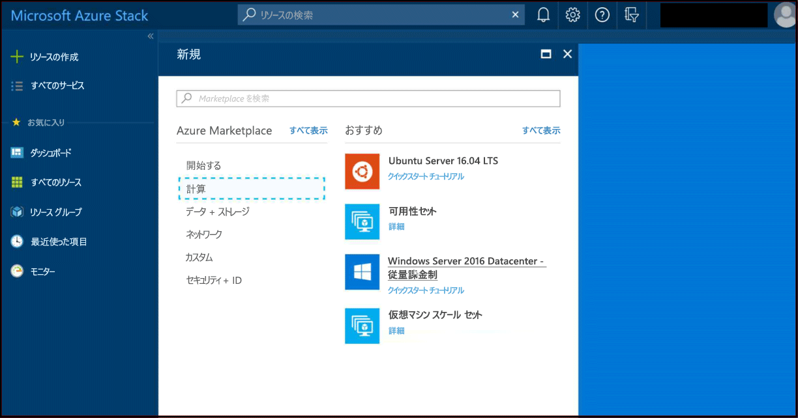
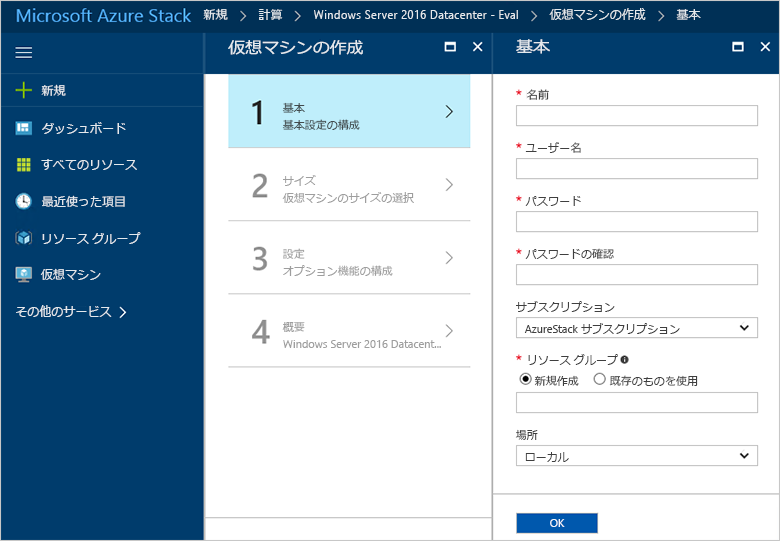
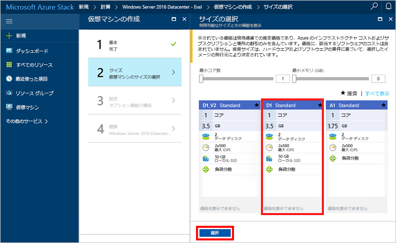
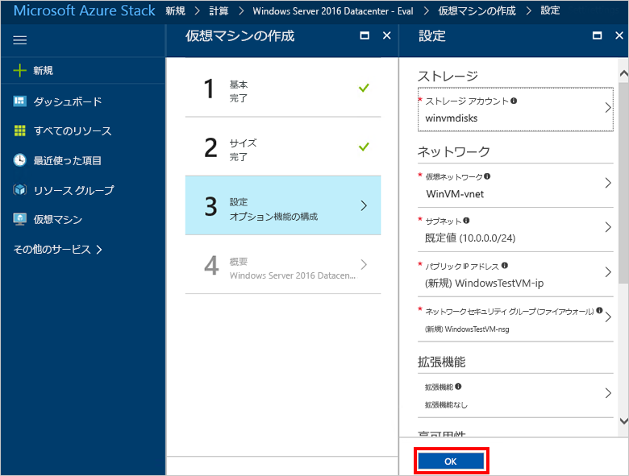

# Azure Stack ポータルで Windows 仮想マシンを作成する

Azure Stack ポータルを使用して Windows 仮想マシンを作成できます。 ポータルは、リソースを作成、構成、および管理できるブラウザーベースのユーザー インターフェイスです。

## Azure Stack ポータルへのサインイン

Azure Stack ポータルにサインインします。 Azure Stack ポータルのアドレスは、接続している Azure Stack 製品によって異なります。

* Azure Stack Development Kit (ASDK) の場合は、https：//portal.local.azurestack.external にアクセスします。
* Azure Stack 統合システムの場合は、Azure Stack オペレーターによって提供された URL にアクセスします。

## 仮想マシンの作成

1. **[新規]** > **[Compute]** > **[Windows Server 2016 Datacenter Eval]** > **[作成]** の順にクリックします。 **Windows Server 2016 Datacenter Eval** エントリが表示されない場合は、Azure Stack オペレータに問い合わせてください。 「[Add the Windows Server 2016 VM image to the Azure Stack marketplace](../azure-stack-add-default-image.md)」(Windows Server 2016 VM イメージの Azure Stack Marketplace への追加) の記事の説明に従って、マーケットプレースに追加するように求めます。 
    
2. **[基本]** で、**[名前]**、**[ユーザー名]**、**[パスワード]** を入力します。 **[サブスクリプション]**を選択します。 **リソース グループ**を作成するか、既存のリソース グループを選択し、**[場所]** を選択して、**[OK]** をクリックします。

    
3. **[サイズの選択]** で、**[D1 Standard]**、 > **[選択]** の順にクリックします。
    
4. **[設定]** で、既定値を受け入れて、**[OK]** をクリックします。
    
5. **[概要]** で、**[OK]** をクリックして仮想マシンを作成します。 
    
6. 新しい仮想マシンを表示するには、**[すべてのリソース]** をクリックして仮想マシンを検索し、仮想マシン名をクリックします。
    

## リソースのクリーンアップ

仮想マシンが必要なくなったら、リソース グループ、仮想マシン、およびすべての関連リソースを削除します。 そのためには、仮想マシン ページでリソース グループを選択し、**[削除]** をクリックします。

## 次のステップ
このクイック スタートでは、簡単な Windows 仮想マシンをデプロイしました。 Azure Stack 仮想マシンの詳細については、「[Azure Stack の仮想マシンに関する考慮事項](azure-stack-vm-considerations.md)」に進んでください。
