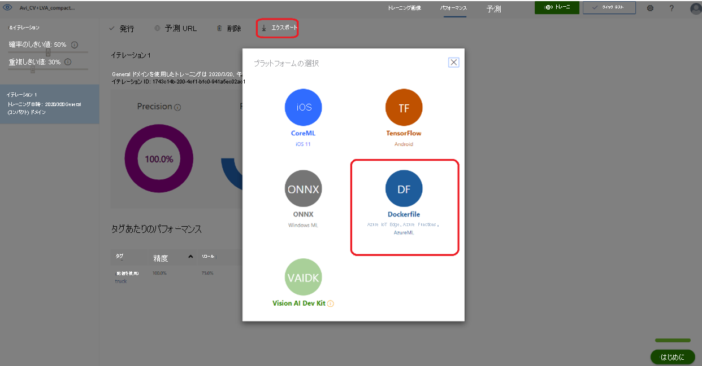

# <a name="tutorial-analyze-live-video-with-azure-video-analyzer-on-iot-edge-and-azure-custom-vision"></a>チュートリアル: Azure Video Analyzer on IoT Edge と Azure Custom Vision を使用してライブ ビデオを分析する

[!INCLUDE [header](includes/edge-env.md)]

このチュートリアルでは、Azure [Custom Vision](https://azure.microsoft.com/services/cognitive-services/custom-vision-service/) を使用して、おもちゃのトラックを検出できるコンテナー化されたモデルを構築し、Azure Video Analyzer on Azure IoT Edge の [AI 拡張機能](../analyze-live-video-without-recording.md#analyzing-video-using-a-custom-vision-model)を使用して、ライブ ビデオ ストリームからおもちゃのトラックを検出するためにそのモデルをエッジにデプロイする方法について説明します。

ここでは、Custom Vision の機能を集約して、いくつかの画像をアップロードしてラベル付けすることでコンピューター ビジョン モデルを構築してトレーニングする方法について説明します。 データ サイエンス、機械学習、AI の知識は必要ありません。 また、Video Analyzer の機能のほか、簡単にカスタム モデルをコンテナーとしてエッジにデプロイし、シミュレートされたライブ ビデオ フィードを分析する方法についても説明します。

::: zone pivot="programming-language-csharp"
[!INCLUDE [header](includes/analyze-live-video-custom-vision/csharp/header.md)]
::: zone-end

::: zone pivot="programming-language-python"
[!INCLUDE [header](includes/analyze-live-video-custom-vision/python/header.md)]
::: zone-end

このチュートリアルでは、次の操作方法について説明します。

- 関連リソースを設定する。
- おもちゃのトラックを検出するための Custom Vision モデルをクラウドに構築してエッジにデプロイする。
- HTTP 拡張を使用したパイプラインを作成して Custom Vision モデルにデプロイする。
- サンプル コードを実行する。
- 結果を確認して解釈する。

[Azure サブスクリプション](../../../guides/developer/azure-developer-guide.md#understanding-accounts-subscriptions-and-billing)をお持ちでない場合は、開始する前に[無料アカウント](https://azure.microsoft.com/free/?ref=microsoft.com&utm_source=microsoft.com&utm_medium=docs&utm_campaign=visualstudio)を作成してください。

## <a name="suggested-pre-reading"></a>推奨される事前読み取り

開始する前に、次の記事に目を通してください。

- [Video Analyzer on IoT Edge の概要](../overview.md)
- [Azure Custom Vision の概要](../../../cognitive-services/custom-vision-service/overview.md)
- [Video Analyzer on IoT Edge の用語](../terminology.md)
- [パイプラインの概念](../pipeline.md)
- [ビデオ記録を行わない Video Analyzer](../analyze-live-video-without-recording.md)
- [チュートリアル:IoT Edge モジュールを開発する](../../../iot-edge/tutorial-develop-for-linux.md)
- [deployment.*.template.json を編集する方法](https://github.com/microsoft/vscode-azure-iot-edge/wiki/How-to-edit-deployment.*.template.json)

## <a name="prerequisites"></a>前提条件

* マシンに [Docker がインストール](https://docs.docker.com/desktop/#download-and-install)されている。

::: zone pivot="programming-language-csharp"
[!INCLUDE [prerequisites](includes/analyze-live-video-custom-vision/csharp/prerequisites.md)]
::: zone-end

::: zone pivot="programming-language-python"
[!INCLUDE [prerequisites](includes/analyze-live-video-custom-vision/python/prerequisites.md)]
::: zone-end


## <a name="review-the-sample-video"></a>サンプル ビデオを確認する

このチュートリアルでは、[おもちゃの車の推論ビデオ](https://avamedia.blob.core.windows.net/public/t2.mkv) ファイルを使用してライブ ストリームをシミュレートします。 このビデオは、[VLC media player](https://www.videolan.org/vlc/) などのアプリケーションを使用して確認できます。 [Ctrl+N](https://avamedia.blob.core.windows.net/public/t2.mkv) キーを押し、**おもちゃの車の推論ビデオ** へのリンクを貼り付けて、再生を開始します。 ビデオを見ると、36 秒の時点でおもちゃのトラックがビデオに出てくることがわかります。 このカスタム モデルは、この特定のおもちゃのトラックを検出するようにトレーニングされています。

> [!VIDEO https://www.microsoft.com/videoplayer/embed/RE4LPwK]

このチュートリアルでは、Video Analyzer on IoT Edge を使用して、このようなおもちゃのトラックを検出し、関連付けられた推論イベントを IoT Edge ハブに発行します。

## <a name="overview"></a>概要


この図は、このチュートリアルでのシグナルの流れを示しています。 [エッジ モジュール](https://github.com/Azure/video-analyzer/tree/main/edge-modules/sources/rtspsim-live555)は、リアルタイム ストリーミング プロトコル (RTSP) サーバーをホストする IP カメラをシミュレートします。 [RTSP ソース](../pipeline.md#rtsp-source) ノードは、このサーバーからビデオ フィードをプルし、[HTTP 拡張プロセッサ](../pipeline.md#http-extension-processor)ノードにビデオ フレームを送信します。

HTTP 拡張ノードは、プロキシの役割を果たします。 これは、`samplingOptions` フィールドを使用して設定された受信ビデオフ レームをサンプリングし、ビデオ フレームを指定された画像の種類に変換します。 その後、Custom Vision を使用して構築されたおもちゃのトラックの検出モデルにその画像を中継します。 HTTP 拡張プロセッサ ノードは、検出結果を収集し、イベントを [Azure IoT Hub メッセージ シンク](../pipeline.md#iot-hub-message-sink) ノードに発行します。これにより、それらのイベントが [IoT Edge ハブ](../../../iot-fundamentals/iot-glossary.md#iot-edge-hub)に送信されます。

## <a name="build-and-deploy-a-custom-vision-toy-detection-model"></a>Custom Vision のおもちゃ検出モデルを構築してデプロイする

Custom Vision という名前が示唆するように、これを使用して、独自のカスタム オブジェクト検出器または分類器をクラウドに構築できます。 これには、コンテナーを介してクラウドまたはエッジにデプロイできる Custom Vision モデルを構築するためのシンプルで使いやすい、直感的なインターフェイスが用意されています。

おもちゃのトラックの検出器を構築するには、「[クイックスタート: Custom Vision の Web サイトでオブジェクト検出器を構築する](../../../cognitive-services/custom-vision-service/get-started-build-detector.md)」を参照してください。

> [!IMPORTANT]
> この Custom Vision モジュールでは、**Intel x86 および amd64** アーキテクチャだけがサポートされています。 続行する前に、エッジ デバイスのアーキテクチャを確認してください。

その他のメモ:

- このチュートリアルでは、このクイックスタート記事の[「前提条件」セクション](../../../cognitive-services/custom-vision-service/get-started-build-detector.md#prerequisites)にあるサンプル画像を使用しないでください。 ここでは、代わりに特定の画像セットを使用して、おもちゃの検出器の Custom Vision モデルを構築しました。 [これらの画像](https://avamedia.blob.core.windows.net/public/ToyCarTrainingImages.zip)は、[クイックスタート](../../../cognitive-services/custom-vision-service/get-started-build-detector.md)で[トレーニング画像を選択する](../../../cognitive-services/custom-vision-service/get-started-build-detector.md#choose-training-images)よう求められたときに使用してください。
- クイック スタートの画像へのタグ付けに関するセクションでは、図に示されているおもちゃのトラックに "delivery truck" というタグを付けていることを確認してください。
- Custom Vision プロジェクトの作成時に、ドメインのオプションとして General(compact) を選択するようにしてください。

完了したら、 **[パフォーマンス]** タブの **[エクスポート]** ボタンを使用して、モデルを Docker コンテナーにエクスポートできます。コンテナー プラットフォームの種類として Linux を選択するようにしてください。 これは、コンテナーが実行されるプラットフォームです。 コンテナーをダウンロードするコンピューターは、Windows でも Linux でもかまいません。 次の手順は、Windows コンピューターにダウンロードされたコンテナー ファイルに基づいています。



1. `<projectname>.DockerFile.Linux.zip` という名前の zip ファイルがローカル コンピューターにダウンロードされている必要があります。
2. Docker がインストールされているかどうかを確認します。 されていない場合は、お使いの Windows デスクトップ用の [Docker](https://docs.docker.com/get-docker/) をインストールします。
3. ダウンロードしたファイルを任意の場所に解凍します。 コマンド ラインを使用して、解凍したフォルダー ディレクトリにアクセスします。 app\labels.txt と app\model.pb という 2 つのファイルが表示されます。
4. [Video Analyzer リポジトリ](https://github.com/Azure/video-analyzer)をクローンし、コマンド ラインを使用して edge-modules\extensions\customvision\avaextension フォルダーに移動します。
5. 手順 3 の labels.txt および model.pb ファイルを edge-modules\extensions\customvision\avaextension フォルダーにコピーします。 同じフォルダーで、

   次のコマンドを実行します。

   1. `docker build -t cvtruck .`

      このコマンドは、多くのパッケージをダウンロードし、Docker 画像を構築して、それに `cvtruck:latest` をタグ付けします。

      > [!NOTE]
      > 成功した場合は、`Successfully built <docker image id>` および `Successfully tagged cvtruck:latest` というメッセージが表示されます。 このビルド コマンドが失敗した場合は、もう一度試してください。 場合によっては、最初は依存関係パッケージがダウンロードされないことがあります。
   2. `docker image ls`

      このコマンドは、新しいイメージがローカル レジストリにあるかどうかを確認します。
   
## <a name="set-up-your-development-environment"></a>開発環境を設定する

::: zone pivot="programming-language-csharp"
[!INCLUDE [setup development environment](./includes/set-up-dev-environment/csharp/csharp-set-up-dev-env.md)]
::: zone-end

::: zone pivot="programming-language-python"
[!INCLUDE [setup development environment](./includes/set-up-dev-environment/python/python-set-up-dev-env.md)]
::: zone-end

## <a name="examine-the-sample-files"></a>サンプル ファイルを詳しく調べる

::: zone pivot="programming-language-csharp"
[!INCLUDE [examine-sample-files](includes/analyze-live-video-custom-vision/csharp/examine-sample-files.md)]
::: zone-end

::: zone pivot="programming-language-python"
[!INCLUDE [examine-sample-files](includes/analyze-live-video-custom-vision/python/examine-sample-files.md)]
::: zone-end

## <a name="generate-and-deploy-the-deployment-manifest"></a>配置マニフェストを生成してデプロイする

1. Visual Studio Code で、src/cloud-to-device-console-app/operations.json に移動します。
2. `pipelineTopologySet` で、次に該当することを確認します。<br/>
   `"pipelineTopologyUrl" : "https://raw.githubusercontent.com/Azure/video-analyzer/main/pipelines/live/topologies/httpExtension/topology.json"`
3. `livePipelineSet` で、以下を確認します。

   1. `"topologyName" : "InferencingWithHttpExtension"`
   2. パラメーター配列の先頭に `{"name": "inferencingUrl","value": "http://cv/score"},` を追加します。
   3. `rtspUrl` パラメーター値を `"rtsp://rtspsim:554/media/t2.mkv"` に変更します。
4. `pipelineTopologyDelete` で、`"name": "InferencingWithHttpExtension"` を確認します。
5. src/edge/ deployment.customvision.template.json ファイルを右クリックし、 **[Generate IoT Edge Deployment Manifest]\(IoT Edge デプロイ マニフェストの生成\)** を選択します。

   ![[Generate IoT Edge Deployment Manifest]\(IoT Edge デプロイ マニフェストの生成\) を示すスクリーンショット。](./media/custom-vision/deployment-template-json.png)

   この操作により、deployment.customvision.amd64.json という名前のマニフェスト ファイルが src/edge/config フォルダーに作成されます。
6. src/edge/ deployment.customvision.template.json ファイルを開き、`registryCredentials` JSON ブロックを見つけます。 このブロックでは、Azure コンテナー レジストリのアドレスと共に、そのユーザー名とパスワードを確認できます。
7. コマンド ラインで次の手順を実行して、ローカルの Custom Vision コンテナーを Azure Container Registry インスタンスにプッシュします。

   1. 次のコマンドを実行して、レジストリにサインインします。

      `docker login <address>`

      認証を求められたら、ユーザー名とパスワードを入力します。

      > [!NOTE]
      > このパスワードはコマンド ラインに表示されません。
   2. 次のコマンドを使用して画像にタグを付けます。<br/>
      `docker tag cvtruck <address>/cvtruck`.
   3. 次のコマンドを使用して画像をプッシュします。<br/>
      `docker push <address>/cvtruck`.

      成功した場合は、コマンド ラインにその画像の SHA と共に `Pushed` と表示されます。
   4. また、Azure portal で Azure Container Registry インスタンスをチェックすることによって確認することもできます。 ここでは、リポジトリの名前がタグと共に表示されます。
8. 左下隅の **[Azure IoT Hub]** ペインの横にある **[その他のアクション]** アイコンを選択して、IoTHub 接続文字列を設定します。 この文字列は、appsettings.json ファイルからコピーできます (Visual Studio Code 内で適切な IoT ハブを確実に構成するために推奨されるもう 1 つの方法として、[[Select IoT Hub]\(IoT ハブの選択\) コマンド](https://github.com/Microsoft/vscode-azure-iot-toolkit/wiki/Select-IoT-Hub)の使用があります)。

   ![[Set IoT Hub Connection String]\(IoT ハブ接続文字列を設定\) を示すスクリーンショット。](./media/custom-vision/connection-string.png)
9. 次に、src/edge/config/deployment.customvision.amd64.json を右クリックし、 **[Create Deployment for Single Device]\(単一デバイスのデプロイの作成\)** を選択します。

   ![[Create Deployment for Single Device]\(単一デバイスのデプロイの作成\) を示すスクリーンショット](./media/custom-vision/deployment-amd64-json.png)
10. その後、IoT Hub デバイスを選択するよう求められます。 ドロップダウン リストから **ava-sample-iot-edge-device** を選択します。
11. 30 秒ほど経過したら、左下のセクションで Azure IoT ハブを更新します。 エッジ デバイスに次のモジュールがデプロイされた状態になります。

    - Edge ハブ (モジュール名: **edgeHub**)
    - Edge エージェント (モジュール名: **edgeAgent**)
    - Video Analyzer (モジュール名: **avaedge**)
    - RTSP シミュレーター (モジュール名: **rtspsim**。ライブ ビデオ フィードのソースとして機能する RTSP サーバーをシミュレートします)
    - Custom Vision (モジュール名: **cv**。おもちゃのトラックの検出モデルに基づいています)

これらの手順により、Custom Vision モジュールが追加されました。 

## <a name="run-the-sample-program"></a>サンプル プログラムを実行する

このチュートリアルのトポロジをブラウザーで開くと、`inferencingUrl` の値が `http://cv/score` に設定されていることがわかります。 この設定は、推論サーバーがライブ ビデオでおもちゃのトラック (ある場合) を検出した後に結果を返すことを意味します。

1. Visual Studio Code で **[拡張機能]** タブを開き (または **Ctrl + Shift + X** キーを押し)、Azure IoT Hub を検索します。
2. 右クリックして、 **[拡張機能の設定]** を選択します。

   ![[拡張機能の設定] を示すスクリーンショット。](./media/custom-vision/extensions-tab.png)
3. **[Show Verbose Message]\(詳細メッセージの表示\)** を検索して有効にします。

   ![[Show Verbose Message]\(詳細メッセージの表示\) を示すスクリーンショット。](./media/custom-vision/show-verbose-message.png)
4.  ::: zone pivot="programming-language-csharp"
    [!INCLUDE [header](includes/common-includes/csharp-run-program.md)]
    ::: zone-end

    ::: zone pivot="programming-language-python"
    [!INCLUDE [header](includes/common-includes/python-run-program.md)]
    ::: zone-end  

5. operations.json コードは、ダイレクト メソッド `livePipelineList` および `livePipelineList` の呼び出しから始まります。 前のクイックスタートを完了した後にリソースをクリーンアップした場合、このプロセスは空のリストを返した後に一時停止します。 続行するには、**Enter** キーを押します。

   **[ターミナル]** ウィンドウに、次の一連のダイレクト メソッド呼び出しが表示されます。

   - 前述の `pipelineTopologyUrl` を使用する `pipelineTopologySet` の呼び出し。
   - 次の本文を使用する `livePipelineSet` の呼び出し。

   ```
        {
          "@apiVersion": "1.1",
          "name": "Sample-Pipeline-1",
          "properties": {
            "topologyName": "InferencingWithHttpExtension",
            "description": "Sample pipeline description",
            "parameters": [
              { 
                "name": "inferencingUrl",
                "value": "http://cv/score"
              },
              {
                "name": "rtspUrl",
                "value": "rtsp://rtspsim:554/media/t2.mkv"
              },
              {
                "name": "rtspUserName",
                "value": "testuser"
              },
              {
                "name": "rtspPassword",
                "value": "testpassword"
              }
            ]
          }
        }
   ```

   - パイプラインとビデオのフローをアクティブにする `livePipelineActivate` の呼び出し。
   - アクティブなパイプラインを示す `livePipelineList` の 2 回目の呼び出し。

6. **[ターミナル]** ウィンドウの出力が、 **[続行するには Enter キーを押してください]** というプロンプトで一時停止されます。 **Enter** キーはまだ押さないでください。 上へスクロールして、呼び出したダイレクト メソッドの JSON 応答のペイロードを確認します。
7. Visual Studio Code の **[出力]** ウィンドウに切り替えます。 Video Analyzer on IoT Edge モジュールから IoT ハブに送信されているメッセージが表示されます。 このチュートリアルの次のセクションでは、これらのメッセージについて説明します。
8. パイプラインは引き続き実行され、結果が出力されます。 RTSP シミュレーターによって、ソース ビデオがループ処理され続けます。 パイプラインを停止するには、 **[ターミナル]** ウィンドウに戻り、**Enter** キーを押します。 次の一連の呼び出しによって、リソースがクリーンアップされます。

   - `livePipelineDeactivate` の呼び出しによって、パイプラインが非アクティブ化されます。
   - `livePipelineDelete` の呼び出しによって、パイプラインが削除されます。
   - `pipelineTopologyDelete` の呼び出しによって、トポロジが削除されます。
   - `pipelineTopologyList` の最後の呼び出しによって、リストが空であることが示されます。

## <a name="interpret-the-results"></a>結果を解釈する

パイプラインを実行すると、HTTP 拡張プロセッサ ノードから IoT Hub メッセージ シンク ノードを介して IoT ハブに結果が渡されます。 **[出力]** ウィンドウに表示されるメッセージには、body セクションと `applicationProperties` セクションが含まれています。 詳細については、「[IoT Hub メッセージを作成し、読み取る](../../../iot-hub/iot-hub-devguide-messages-construct.md)」を参照してください。

次のメッセージでは、Video Analyzer モジュールによって、アプリケーションのプロパティと本文の内容が定義されます。

### <a name="mediasessionestablished-event"></a>MediaSessionEstablished イベント

パイプラインのインスタンスが作成されると、RTSP ソース ノードは、rtspsim-live555 コンテナーで実行されている RTSP サーバーへの接続を試みます。 接続に成功すると、次のイベントが出力されます。


```
[IoTHubMonitor] [9:42:18 AM] Message received from [avasample-iot-edge-device/avaedge]:
{
  "body": {
    "sdp&quot;: &quot;SDP:\nv=0\r\no=- 1586450538111534 1 IN IP4 XXX.XX.XX.XX\r\ns=Matroska video+audio+(optional)subtitles, streamed by the LIVE555 Media Server\r\ni=media/camera-300s.mkv\r\nt=0 0\r\na=tool:LIVE555 Streaming Media v2020.03.06\r\na=type:broadcast\r\na=control:*\r\na=range:npt=0-300.000\r\na=x-qt-text-nam:Matroska video+audio+(optional)subtitles, streamed by the LIVE555 Media Server\r\na=x-qt-text-inf:media/camera-300s.mkv\r\nm=video 0 RTP/AVP 96\r\nc=IN IP4 0.0.0.0\r\nb=AS:500\r\na=rtpmap:96 H264/90000\r\na=fmtp:96 packetization-mode=1;profile-level-id=4D0029;sprop-parameter-sets=XXXXXXXXXXXXXXXXXXXXXX\r\na=control:track1\r\n"
  },
  "applicationProperties": {
    "dataVersion": "1.0",
    "topic": "/subscriptions/{subscriptionID}/resourceGroups/{name}/providers/microsoft.media/videoanalyzers/{ava-account-name}",
    "subject": "/edgeModules/avaedge/livePipelines/Sample-Pipeline-1/sources/rtspSource",
    "eventType": "Microsoft.VideoAnalyzers.Diagnostics.MediaSessionEstablished",
    "eventTime": "2021-04-09T09:42:18.1280000Z"
  }
}
```

このメッセージでは、以下の詳細に注目します。

- このメッセージは、診断イベントです。 `MediaSessionEstablished` は、RTSP ソース ノード (subject) が RTSP シミュレーターと接続され、シミュレートされたライブ フィードの受信を開始したことを示します。
- `properties` 内の `subject` は、メッセージがパイプラインの RTSP ソース ノードから生成されたことを示しています。
- `properties` 内のイベントの種類は、このイベントが診断イベントであることを示します。
- イベント時刻は、イベントの発生時刻を示します。
- body には、診断イベントに関するデータが含まれています。 このケースでは、データは[セッション記述プロトコル (SDP)](https://en.wikipedia.org/wiki/Session_Description_Protocol) の詳細で構成されています。

### <a name="inference-event"></a>推論イベント

HTTP 拡張プロセッサ ノードは、Custom Vision コンテナーから推論結果を受け取り、その結果を推論イベントとして IoT Hub メッセージ シンク ノードを介して出力します。


```
{
  "body": {
    "timestamp": 145892470449324,
    "inferences": [
      {
        "type": "entity",
        "entity": {
          "tag": {
            "value": "delivery truck",
            "confidence": 0.20541823
          },
          "box": {
            "l": 0.6826309,
            "t": -0.01415127,
            "w": 0.3135161,
            "h": 0.94683206
          }
        }
      },
      {
        "type": "entity",
        "entity": {
          "tag": {
            "value": "delivery truck",
            "confidence": 0.14967085
          },
          "box": {
            "l": 0.33310884,
            "t": 0.03174839,
            "w": 0.13532706,
            "h": 0.54967254
          }
        }
      },
      {
        "type": "entity",
        "entity": {
          "tag": {
            "value": "delivery truck",
            "confidence": 0.1352181
          },
          "box": {
            "l": 0.48884687,
            "t": 0.44746214,
            "w": 0.025887,
            "h": 0.05414263
          }
        }
      }
    ]
  },
  "properties": {
    "topic": "/subscriptions/...",
    "subject": "/edgeModules/avaedge/livePipelines/Sample-Pipeline-1/processors/httpExtension",
    "eventType": "Microsoft.VideoAnalyzer.Analytics.Inference",
    "eventTime": "2021-05-14T21:24:09.436Z",
    "dataVersion": "1.0"
  },
  "systemProperties": {
    "iothub-connection-device-id": "avasample-iot-edge-device",
    "iothub-connection-module-id": "avaedge",
    "iothub-connection-auth-method": "{\"scope\":\"module\",\"type\":\"sas\",\"issuer\":\"iothub\",\"acceptingIpFilterRule\":null}",
    "iothub-connection-auth-generation-id": "637563926153483223",
    "iothub-enqueuedtime": 1621027452077,
    "iothub-message-source": "Telemetry",
    "messageId": "96f7f0b5-728d-4e3e-a7bb-4e3198c58726",
    "contentType": "application/json",
    "contentEncoding": "utf-8"
  }
```

上記のメッセージに含まれる次の情報に注意してください。

- `properties` 内の subject は、メッセージの生成元となった、パイプライン内のノードを参照しています。 この場合、このメッセージは HTTP 拡張プロセッサから生成されます。
- `properties` 内のイベントの種類は、これが分析推論イベントであることを示しています。
- イベント時刻は、イベントの発生時刻を示します。
- body には、分析イベントに関するデータが含まれています。 この場合、イベントは推論イベントであるため、body には predictions という推論の配列が含まれています。
- inferences セクションには、フレーム内でおもちゃのデリバリー トラック (タグは "delivery truck") が見つかる予測のリストが含まれています。 ご存じのとおり、"delivery truck" は、おもちゃのトラック用にトレーニングされたカスタム モデルに指定したカスタム タグです。 このモデルは、さまざまな確率の信頼度スコアで入力ビデオ内のおもちゃのトラックを推論して特定します。

## <a name="clean-up-resources"></a>リソースをクリーンアップする

他のチュートリアルやクイックスタートに取り組む予定がある場合は、作成したリソースをそのまま残しておいてください。 それ以外の場合は、Azure portal にアクセスして、ご利用のリソース グループに移動し、このチュートリアルで使用したリソース グループを選択して、すべてのリソースを削除してください。

## <a name="next-steps"></a>次のステップ

上級ユーザー向けのその他の課題を確認します。

- RTSP シミュレーターを使用する代わりに、RTSP をサポートする [IP カメラ](https://en.wikipedia.org/wiki/IP_camera)を使用します。 RTSP をサポートする IP カメラは、[ONVIF 準拠製品](https://www.onvif.org/conformant-products/)のページで検索できます。 プロファイル G、S、または T に準拠しているデバイスを探します。
- Azure Linux VM ではなく、AMD64 または x64 Linux デバイスを使用してください。 このデバイスは、IP カメラと同じネットワーク内にある必要があります。 [Linux への Azure IoT Edge ランタイムのインストール](../../../iot-edge/how-to-install-iot-edge.md)に関するページの手順を参照できます。

次に、「[初めての IoT Edge モジュールを Linux 仮想デバイスにデプロイする](../../../iot-edge/quickstart-linux.md)」の手順に従って、デバイスを Azure IoT Hub に登録します。  
