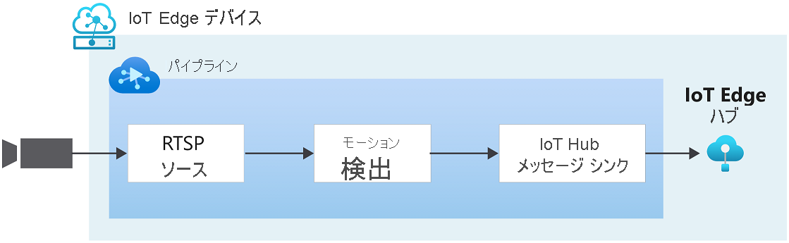

# クイック スタート:モーションの検出とイベントの生成

[!INCLUDE [header](includes/edge-env.md)]

このクイックスタートでは、Azure Video Analyzer の基本的な操作手順について説明します。 IoT Edge デバイスとして Azure VM を使用すると共に、シミュレートしたライブ ビデオ ストリームを使用します。 セットアップ手順の完了後、ビデオ パイプラインを通じて、シミュレートされたライブ ビデオ ストリームを実行できます。そのストリーム内のあらゆるモーションが検出およびレポートされます。 次の図は、そのパイプラインをグラフィカルに表したものです。

> [!div class="mx-imgBorder"]
> :::image type="content" source="./media/get-started-detect-motion-emit-events/motion-detection.svg" alt-text="モーションの検出":::

::: zone pivot="programming-language-csharp"
[!INCLUDE [header](includes/detect-motion-emit-events-quickstart/csharp/header.md)]
::: zone-end

::: zone pivot="programming-language-python"
[!INCLUDE [header](includes/detect-motion-emit-events-quickstart/python/header.md)]
::: zone-end

## 前提条件

::: zone pivot="programming-language-csharp"
[!INCLUDE [prerequisites](./includes/common-includes/csharp-prerequisites.md)]
::: zone-end

::: zone pivot="programming-language-python"
[!INCLUDE [prerequisites](./includes/common-includes/python-prerequisites.md)]
::: zone-end

## Azure リソースの設定

[!INCLUDE [resources](./includes/common-includes/azure-resources.md)]

## 概要

この図は、このクイックスタートでのシグナルの流れを示しています。 [エッジ モジュール](https://github.com/Azure/video-analyzer/tree/main/edge-modules/sources/rtspsim-live555)は、リアルタイム ストリーミング プロトコル (RTSP) サーバーをホストする IP カメラをシミュレートします。 [RTSP ソース](../pipeline.md#rtsp-source) ノードは、このサーバーからビデオ フィードをプルし、[モーション検出プロセッサ](../pipeline.md#motion-detection-processor) ノードにビデオ フレームを送信します。 モーション検出プロセッサ ノードを使用すると、ライブ ビデオのモーションを検出できます。 受信したビデオ フレームを調べ、ビデオに動きがあるかどうかを判断します。 モーションが検出されると、ビデオ フレームをパイプラインの次のノードに渡し、イベントを出力します。 最後に、生成されたすべてのイベントは IoT ハブ メッセージ シンクに送信され、そこで IoT Hub に公開されます。

## 開発環境を設定する

::: zone pivot="programming-language-csharp"
[!INCLUDE [setup development environment](./includes/set-up-dev-environment/csharp/csharp-set-up-dev-env.md)]
::: zone-end

::: zone pivot="programming-language-python"
[!INCLUDE [setup development environment](./includes/set-up-dev-environment/python/python-set-up-dev-env.md)]
::: zone-end

## サンプル ビデオを確認する

::: zone pivot="programming-language-csharp"
[!INCLUDE [review-sample-video](./includes/detect-motion-emit-events-quickstart/csharp/review-sample-video.md)]
::: zone-end

::: zone pivot="programming-language-python"
[!INCLUDE [review-sample-video](./includes/detect-motion-emit-events-quickstart/python/review-sample-video.md)]
::: zone-end

## サンプル ファイルを詳しく調べる

::: zone pivot="programming-language-csharp"
[!INCLUDE [examine-sample-files](./includes/detect-motion-emit-events-quickstart/csharp/examine-sample-files.md)]
::: zone-end

::: zone pivot="programming-language-python"
[!INCLUDE [examine-sample-files](./includes/detect-motion-emit-events-quickstart/python/examine-sample-files.md)]
::: zone-end

## 配置マニフェストを生成してデプロイする

::: zone pivot="programming-language-csharp"
[!INCLUDE [generate-deploy-deployment-manifest](./includes/detect-motion-emit-events-quickstart/csharp/generate-deploy-deployment-manifest.md)]
::: zone-end

::: zone pivot="programming-language-python"
[!INCLUDE [generate-deploy-deployment-manifest](./includes/detect-motion-emit-events-quickstart/python/generate-deploy-deployment-manifest.md)]
::: zone-end

## イベントの監視の準備をする

::: zone pivot="programming-language-csharp"
[!INCLUDE [prepare-monitor-events](./includes/detect-motion-emit-events-quickstart/csharp/prepare-monitor-events.md)]
::: zone-end

::: zone pivot="programming-language-python"
[!INCLUDE [prepare-monitor-events](./includes/detect-motion-emit-events-quickstart/python/prepare-monitor-events.md)]
::: zone-end

## サンプル プログラムを実行する

::: zone pivot="programming-language-csharp"
[!INCLUDE [run-sample-program](./includes/detect-motion-emit-events-quickstart/csharp/run-sample-program.md)]
::: zone-end

::: zone pivot="programming-language-python"
[!INCLUDE [run-sample-program](./includes/detect-motion-emit-events-quickstart/python/run-sample-program.md)]
::: zone-end

## 結果を解釈する

::: zone pivot="programming-language-csharp"
[!INCLUDE [interpret-results](includes/detect-motion-emit-events-quickstart/csharp/interpret-results.md)]
::: zone-end

::: zone pivot="programming-language-python"
[!INCLUDE [interpret-results](includes/detect-motion-emit-events-quickstart/python/interpret-results.md)]
::: zone-end

## リソースをクリーンアップする

他のクイックスタートに取り組む場合は、作成したリソースをそのまま残しておきます。 それ以外の場合は、Azure portal で、ご利用のリソース グループに移動し、このクイックスタートを実行したリソース グループを選択して、そのリソースをすべて削除してください。

## 次のステップ

- [独自のモデルを使用したライブ ビデオの分析](analyze-live-video-use-your-model-http.md)に関するクイックスタートに従って、AI をライブ ビデオ フィードに適用します。
- 上級ユーザー向けのその他の課題を確認します。

  - RTSP シミュレーターを使用する代わりに、RTSP をサポートする [IP カメラ](https://en.wikipedia.org/wiki/IP_camera)を使用します。 RTSP をサポートする IP カメラは、[ONVIF 準拠製品](https://www.onvif.org/conformant-products/)のページで見つけることができます。 プロファイル G、S、または T に準拠しているデバイスを探します。
  - Azure では、Linux VM を使用するのではなく、AMD64 または x64 Linux デバイスを使用します。 このデバイスは、IP カメラと同じネットワーク内にある必要があります。 [Linux への Azure IoT Edge ランタイムのインストール](../../../iot-edge/how-to-install-iot-edge.md?preserve-view=true&view=iotedge-2020-11)に関するページの手順に従います。 次に、「[初めての IoT Edge モジュールを Linux 仮想デバイスにデプロイする](../../../iot-edge/quickstart-linux.md?preserve-view=true&view=iotedge-2020-11)」の手順に従って、デバイスを Azure IoT Hub に登録します。
