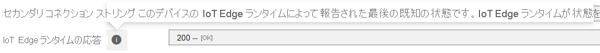

# <a name="quickstart-get-started-with-video-analyzer-in-the-portal"></a>クイック スタート: ポータルで Video Analyzer の使用を開始する

  
または、[ポータル を使用した Video Analyzer ライブ パイプラインの使用の開始](../cloud/get-started-livepipelines-portal.md)に関するページを参照してください。

---

このクイックスタートでは、Azure Video Analyzer の基本的な操作手順について説明します。 Azure portal を使用して、Azure Video Analyzer アカウントとそれに付随するリソースを作成します。 その後、Video Analyzer エッジ モジュールとリアルタイム ストリーミング プロトコル (RTSP) カメラ シミュレーター モジュールを Azure IoT Edge デバイスにデプロイします。

セットアップ手順の完了後に、パイプラインを通じてシミュレートされたライブ ビデオ ストリームを実行できます。そのストリーム内のモーションはすべて検出されて報告されます。 次の図は、そのパイプラインをグラフィカルに表したものです。

> [!div class="mx-imgBorder"]
> :::image type="content" source="./media/get-started-detect-motion-emit-events/motion-detection.svg" alt-text="モーションを検出して報告するパイプラインの図。":::

## <a name="prerequisites"></a>前提条件

- 有効な Azure サブスクリプション アカウントがない場合は、[無料アカウントを作成](https://azure.microsoft.com/free/)してください。

  [!INCLUDE [the video analyzer account and storage account must be in the same subscription and region](../includes/note-account-storage-same-subscription.md)]

- 管理者特権を持っている IoT Edge デバイス:
  - [IoT Edge デバイスへのデプロイ](deploy-iot-edge-device.md)
  - [IoT Edge for Linux on Windows にデプロイする](deploy-iot-edge-linux-on-windows.md)
- [Azure IoT Tools](https://marketplace.visualstudio.com/items?itemName=vsciot-vscode.azure-iot-tools) 拡張機能が搭載された [Visual Studio Code](https://code.visualstudio.com/)。

[!INCLUDE [install-docker-prompt](./includes/common-includes/install-docker-prompt.md)]

## <a name="prepare-your-iot-edge-device"></a>IoT Edge デバイスを準備する

Azure Video Analyzer モジュールは、特権のないローカル ユーザー アカウントを使用して IoT Edge デバイス上で実行されるように構成する必要があります。 このモジュールには、アプリケーションの構成データを格納するための特定のローカル フォルダーが必要となります。 RTSP カメラ シミュレーター モジュールには、ライブ ビデオ フィードの合成に使用するビデオ ファイルが必要です。

IoT Edge デバイスで次のコマンドを実行します。

`bash -c "$(curl -sL https://aka.ms/ava-edge/prep_device)"`

そのコマンド内の prep-device スクリプトにより、入力および構成フォルダーの作成、ビデオ入力ファイルのダウンロード、および適切な特権を設定したユーザー アカウントの作成というタスクが自動化されます。 コマンドが正常に完了した後、次のフォルダーがエッジ デバイス上に作成されているはずです。

- _/home/localedgeuser/samples_
- _/home/localedgeuser/samples/input_
- _/var/lib/videoanalyzer_
- _/var/media_

_/home/localedgeuser/samples/input\* フォルダー内のビデオ (_.mkv) ファイルは、ライブ ビデオのシミュレートに使用されます。

## <a name="create-azure-resources"></a>Azure リソースを作成する

次の手順では、必要な Azure リソース (Video Analyzer アカウント、ストレージ アカウント、ユーザーに割り当てられたマネージド ID) を作成します。 その後、オプションのコンテナー レジストリを作成し、Video Analyzer エッジ モジュールを Video Analyzer アカウントに登録できます。

Video Analyzer アカウントを作成する場合は、Azure ストレージ アカウントを関連付ける必要があります。 Video Analyzer を使用してカメラからライブ ビデオを記録する場合、そのデータはストレージ アカウント内のコンテナーに BLOB として格納されます。 次のように、マネージド ID を使用して、Video Analyzer アカウントにストレージ アカウントへの適切なアクセス権を付与する必要があります。

[!INCLUDE [the video analyzer account and storage account must be in the same subscription and region](../includes/note-account-storage-same-subscription.md)]

### <a name="create-a-video-analyzer-account-in-the-azure-portal"></a>Azure Portal で Video Analyzer アカウントを作成する

1. [Azure Portal](https://portal.azure.com/) にサインインします。
1. 上部にある検索バーで、「**Video Analyzer**」と入力します。
1. **[サービス]** で **[Video Analyzer]** を選択します。
1. **[追加]** を選択します。
1. **[Create Video Analyzer account]\(Video Analyzer アカウントを作成する\)** セクションで、これらの必要な値を入力します。

   - **サブスクリプション**: Video Analyzer アカウントを作成するために使用するサブスクリプションを選びます。
   - **リソース グループ**: Video Analyzer アカウントを作成するリソース グループを選ぶか、 **[新規作成]** を選択してリソース グループを作成します。
   - **Video Analyzer account name\(Video Analyzer アカウント名\)** : Video Analyzer アカウントの名前を入力します。 その名前は、スペースを入れず、すべて小文字または数字を使用し、3 から 24 文字の長さにする必要があります。
   - **場所**: Video Analyzer アカウントをデプロイする場所を選びます (例: **米国西部 2**)。
   - **ストレージ アカウント**: ストレージ アカウントを作成します。 [Standard 汎用 v2](../../../storage/common/storage-account-overview.md#types-of-storage-accounts) ストレージ アカウントを選択することをお勧めします。
   - **[ユーザー ID]** : 新しいユーザー割り当てマネージド ID を作成し、名前を付けます。

1. フォームの下部にある **[確認と作成]** を選択します。

### <a name="create-a-container-registry"></a>コンテナー レジストリの作成

1. **[リソースの作成]**  >  **[コンテナー]**  >  **[コンテナー レジストリ]** の順に選択します。
1. **[基本]** タブで、 **[リソース グループ]** と **[レジストリ名]** の値を入力します。 前のセクションと同じリソース グループを使用します。 レジストリ名は Azure 内で一意であり、5 から 50 文字の英数字を含める必要があります。
1. 残りの設定は既定値のままにします。 次に、 **[Review + create]\(確認と作成\)** を選択します。 設定を確認した後、 **[作成]** を選択します。

## <a name="deploy-edge-modules"></a>エッジ モジュールをデプロイする

### <a name="deploy-the-video-analyzer-edge-module"></a>Video Analyzer エッジ モジュールをデプロイする

1. Video Analyzer アカウントに移動します。
1. **[エッジ]** ペインで **[エッジ モジュール]** を選択します。
1. **[エッジ モジュールの追加]** を選択し、新しいエッジ モジュールの名前として「**avaedge**」と入力し、 **[追加]** を選択します。
1. 画面の右側に **[Copy the provisioning token]\(プロビジョニング トークンのコピー\)** ページが表示されます。 **[Recommended desired properties for IoT module deployment]\(IoT モジュールのデプロイに推奨される必要なプロパティ\)** の下に次のスニペットをコピーします。 後の手順で必要になります。
   ```JSON
     {
         "applicationDataDirectory": "/var/lib/videoanalyzer",
         "ProvisioningToken": "XXXXXXX",
         "diagnosticsEventsOutputName": "diagnostics",
         "operationalEventsOutputName": "operational",
         "logLevel": "information",
         "LogCategories": "Application,Events",
         "allowUnsecuredEndpoints": true,
         "telemetryOptOut": false
     }
   ```
1. Azure IoT Hub アカウントに移動します。
1. **[デバイスの自動管理]** の下にある **[IoT Edge]** を選択します。
1. IoT Edge デバイスの **[デバイス ID]** の値を選択します。
1. **[Set modules]\(モジュールの設定\)** を選びます。
1. **[追加]** を選択し、ドロップダウン メニューから **[IoT Edge モジュール]** を選びます。
1. **[IoT Edge モジュール名]** に「**avaedge**」と入力します。
1. 次の行をコピーし、 **[イメージの URI]** フィールドに貼り付けます: `mcr.microsoft.com/media/video-analyzer:1`
1. **[環境変数]** を選択します。
1. **[名前]** で、「**LOCAL_USER_ID**」と入力します。 **[値]** で、「**1010**」と入力します。
1. **[名前]** の 2 行目に、「**LOCAL_GROUP_ID**」と入力します。 **[値]** で、「**1010**」と入力します。
1. **[コンテナーの作成オプション]** を選択し、次の行をコピーして貼り付けます。
   ```json
   {
     "HostConfig": {
       "LogConfig": {
         "Type": "",
         "Config": {
           "max-size": "10m",
           "max-file": "10"
         }
       },
       "Binds": [
         "/var/media/:/var/media/",
         "/var/lib/videoanalyzer/:/var/lib/videoanalyzer"
       ],
       "IpcMode": "host",
       "ShmSize": 1536870912
     }
   }
   ```
1. **[モジュール ツインの設定]** を選択し、Video Analyzer アカウントの **[Copy the provisioning token]\(プロビジョニング トークンのコピー\)** ページから先ほどコピーしたスニペットを貼り付けます。
   ```JSON
     {
         "applicationDataDirectory": "/var/lib/videoanalyzer",
         "ProvisioningToken": "XXXXXXX",
         "diagnosticsEventsOutputName": "diagnostics",
         "operationalEventsOutputName": "operational",
         "logLevel": "information",
         "LogCategories": "Application,Events",
         "allowUnsecuredEndpoints": true,
         "telemetryOptOut": false
     }
   ```
1. 画面の下部にある **[追加]** を選択します。
1. **[ルート]** を選択します。
1. **[名前]** で、「**AVAToHub**」と入力します。 **[値]** で、「`FROM /messages/modules/avaedge/outputs/* INTO $upstream`」と入力します。
1. **[確認と作成]** を選択してから、 **[作成]** を選択して **avaedge** エッジ モジュールをデプロイします。

### <a name="deploy-the-edge-module-for-the-rtsp-camera-simulator"></a>RTSP カメラ シミュレーターのエッジ モジュールをデプロイする

1. IoT Hub アカウントに移動します。
1. **[デバイスの自動管理]** の下にある **[IoT Edge]** を選択します。
1. IoT Edge デバイスの **[デバイス ID]** の値を選択します。
1. **[Set modules]\(モジュールの設定\)** を選びます。
1. **[追加]** を選択し、ドロップダウン メニューから **[IoT Edge モジュール]** を選びます。
1. **[IoT Edge モジュール名]** に「**rtspsim**」と入力します。
1. 次の行をコピーし、 **[イメージの URI]** フィールドに貼り付けます: `mcr.microsoft.com/ava-utilities/rtspsim-live555:1.2`
1. **[コンテナーの作成オプション]** を選択し、次の行をコピーして貼り付けます。
   ```json
   {
     "HostConfig": {
       "Binds": ["/home/localedgeuser/samples/input:/live/mediaServer/media"]
     }
   }
   ```
1. 画面の下部にある **[追加]** を選択します。
1. **[確認と作成]** を選択してから、 **[作成]** を選択して **rtspsim** エッジ モジュールをデプロイします。

### <a name="verify-your-deployment"></a>デプロイを確認する

デバイスの詳細ページで、**avaedge** と **rtspsim** の各モジュールが、 **[デプロイで指定]** と **[デバイス別に報告]** の両方として一覧表示されていることを確認します。

モジュールがデバイス上で開始され、IoT Hub に報告されるまで、しばらく時間がかかる場合があります。 ページを更新して、最新の状態を表示します。 状態コード **200 -- OK** は、[IoT Edge ランタイム](../../../iot-edge/iot-edge-runtime.md)が正常であり、正常に動作していることを意味します。



## <a name="set-up-your-development-environment"></a>開発環境を設定する

### <a name="obtain-your-iot-hub-connection-string"></a>IoT ハブの接続文字列を取得する

1. Azure portal で、IoT Hub アカウントに移動します。
1. 左側のペインで **[共有アクセス ポリシー]** を見つけ、それを選択します。
1. **iothubowner** という名前のポリシーを選択します。
1. **[プライマリ接続文字列]** の値をコピーします。 これは `HostName=xxx.azure-devices.net;SharedAccessKeyName=iothubowner;SharedAccessKey=XXX` のようになります。

### <a name="connect-to-iot-hub"></a>IoT Hub への接続

1. Visual Studio Code を開き、 **[表示]**  >  **[エクスプローラー]** の順に選択します。 または、Ctrl + Shift + E キーを押します。
1. **[エクスプローラー]** タブの左下隅で、 **[Azure IoT Hub]** を選択します。
1. **[その他のオプション]** アイコンを選択して、コンテキスト メニューを表示します。 次に、 **[Set IoT Hub Connection String]\(IoT Hub 接続文字列を設定する\)** を選択します。
1. 入力ボックスが表示されたら、IoT Hub 接続文字列を入力します。
1. 30 秒ほど経過したら、左下のセクションで Azure IoT Hub を更新します。 次のモジュールが配置されているデバイスの ID が表示されます。

   - Video Analyzer エッジ モジュール (モジュール名 **avaedge**)
   - RTSP シミュレーター (モジュール名: **rtspsim**)

   > [!div class="mx-imgBorder"]
   > :::image type="content" source="./media/get-started-detect-motion-emit-events/modules-node.png" alt-text="展開された Modules ノードを示すスクリーンショット。":::

> [!TIP]
> エッジ デバイス (ARM64 デバイスなど) に[手動で Video Analyzer をデプロイ](deploy-iot-edge-device.md)した場合は、そのデバイスの [Azure IoT Hub] の下にモジュールが表示されます。 そのモジュールを選択して、次の手順に進むことができます。

### <a name="prepare-to-monitor-the-modules"></a>モジュールの監視の準備をする

このクイック スタートを使用すると、イベントが IoT Hub に送信されます。 それらのイベントを確認するには、次の手順に従います。

1. Visual Studio Code で、 **[拡張機能]** タブを開き (または Ctrl + Shift + X キーを押し)、**Azure IoT Hub** を検索します。
1. IoT Hub 拡張機能を右クリックし、 **[拡張機能の設定]** を選択します。

   > [!div class="mx-imgBorder"]
   > :::image type="content" source="./media/get-started-detect-motion-emit-events/extension-settings.png" alt-text="[拡張機能の設定] の選択を示すスクリーンショット。":::

1. **[Show Verbose Message]\(詳細メッセージの表示\)** を検索して有効にします。

   > [!div class="mx-imgBorder"]
   > :::image type="content" source="./media/get-started-detect-motion-emit-events/verbose-message.png" alt-text="[Show Verbose Message]\(詳細メッセージの表示\) が有効になっているスクリーンショット。":::

1. Visual Studio Code の **[エクスプローラー]** ペインを開き、左下隅にある **[Azure IoT Hub]** を探します。
1. **[デバイス]** ノードを展開します。
1. デバイス ID を右クリックし、 **[組み込みイベント エンドポイントの監視を開始します]** を選択します。

   > [!NOTE]
   > IoT Hub の組み込みのエンドポイント情報を入力するよう求められる場合があります。 この情報を入手するには、Azure portal で IoT Hub アカウントに移動し、左側のペインで **[組み込みのエンドポイント]** を探します。 それを選択し、 **[イベント ハブ互換エンドポイント]** セクションを探します。 ボックス内のテキストをコピーして使用します。 エンドポイントは次のようになります。
   >
   > ```
   > Endpoint=sb://iothub-ns-xxx.servicebus.windows.net/;SharedAccessKeyName=iothubowner;SharedAccessKey=XXX;EntityPath=<IoT Hub name>
   > ```

## <a name="use-direct-method-calls"></a>ダイレクト メソッドの呼び出しを使用する

この時点で、Video Analyzer エッジ モジュールによって公開されるダイレクト メソッドを呼び出して、ライブ ビデオ ストリームを分析できます。 [Video Analyzer のダイレクト メソッド](direct-methods.md)に関するページを読み、このモジュールによって提供されるすべてのダイレクト メソッドを確認してください。 ダイレクト メソッドのスキーマについては、[こちら](https://github.com/Azure/azure-rest-api-specs/blob/master/specification/videoanalyzer/data-plane/VideoAnalyzer.Edge/preview/1.0.0/AzureVideoAnalyzerSdkDefinitions.json)を参照してください。

### <a name="enumerate-pipeline-topologies"></a>パイプライン トポロジを列挙する

この手順により、モジュール内のすべての[パイプライン トポロジ](../pipeline.md)が列挙されます。

1. **avaedge** モジュールを右クリックし、ショートカット メニューから **[Invoke Module Direct Method]\(モジュールのダイレクト メソッドを呼び出す\)** を選択します。
1. 編集ボックスに「**pipelineTopologyList**」と入力して、Enter キーを押します。
1. 次の JSON ペイロードをコピーし、編集ボックスに貼り付けてから、Enter キーを押します。

   ```json
   {
     "@apiVersion": "1.1"
   }
   ```

数秒以内に、 **[出力]** ウィンドウに次の応答が表示されます。

```
[DirectMethod] Invoking Direct Method [pipelineTopologyList] to [deviceId/avaedge] ...
[DirectMethod] Response from [deviceId/avaedge]:
{
  "status": 200,
  "payload": {
    "value": []
  }
}
```

パイプライン トポロジが作成されていないため、この応答は予期されたものです。

### <a name="set-a-pipeline-topology"></a>パイプライン トポロジを設定する

前述と同じ手順を使用して、`pipelineTopologySet` を呼び出し、次の JSON をペイロードとして使用してパイプライン トポロジを設定できます。 _MotionDetection_ という名前のパイプライン トポロジを作成します。

```json
{
  "@apiVersion": "1.1",
  "name": "MotionDetection",
  "properties": {
    "description": "Analyzing live video to detect motion and emit events",
    "parameters": [
      {
        "name": "rtspUrl",
        "type": "string",
        "description&quot;: &quot;rtspUrl"
      },
      {
        "name": "rtspUserName",
        "type": "string",
        "description": "rtspUserName",
        "default&quot;: &quot;dummyUserName"
      },
      {
        "name": "rtspPassword",
        "type": "string",
        "description": "rtspPassword",
        "default&quot;: &quot;dummypw"
      }
    ],
    "sources": [
      {
        "@type": "#Microsoft.VideoAnalyzer.RtspSource",
        "name": "rtspSource",
        "transport": "tcp",
        "endpoint": {
          "@type": "#Microsoft.VideoAnalyzer.UnsecuredEndpoint",
          "credentials": {
            "@type": "#Microsoft.VideoAnalyzer.UsernamePasswordCredentials",
            "username": "${rtspUserName}",
            "password&quot;: &quot;${rtspPassword}"
          },
          "url&quot;: &quot;${rtspUrl}"
        }
      }
    ],
    "processors": [
      {
        "@type": "#Microsoft.VideoAnalyzer.MotionDetectionProcessor",
        "sensitivity": "medium",
        "name": "motionDetection",
        "inputs": [
          {
            "nodeName": "rtspSource",
            "outputSelectors": []
          }
        ]
      }
    ],
    "sinks": [
      {
        "hubOutputName": "inferenceOutput",
        "@type": "#Microsoft.VideoAnalyzer.IotHubMessageSink",
        "name": "iotHubSink",
        "inputs": [
          {
            "nodeName&quot;: &quot;motionDetection"
          }
        ]
      }
    ]
  }
}
```

この JSON ペイロードにより、3 つのパラメーター (そのうちの 2 つには既定値が設定されている) を定義するトポロジが作成されます。 このトポロジには、1 つのソース ノード ([RTSP ソース](../pipeline.md#rtsp-source))、1 つのプロセッサ ノード ([モーション検出プロセッサ](../pipeline.md#motion-detection-processor))、1 つのシンク ノード ([IoT Hub メッセージ シンク](../pipeline.md#iot-hub-message-sink)) があります。 ペイロードには、トポロジが視覚的に示されます。

数秒以内に、 **[出力]** ウィンドウに次の応答が表示されます。

```json
{
  "status": 201,
  "payload": {
    "systemData": {
      "createdAt": "2021-03-21T18:16:46.491Z",
      "lastModifiedAt": "2021-03-21T18:16:46.491Z"
    },
    "name": "MotionDetection",
    "properties": {
      "description": "Analyzing live video to detect motion and emit events",
      "parameters": [
        {
          "name": "rtspPassword",
          "type": "string",
          "description": "rtspPassword",
          "default": "dummypw"
        },
        {
          "name": "rtspUrl",
          "type": "string",
          "description": "rtspUrl"
        },
        {
          "name": "rtspUserName",
          "type": "string",
          "description": "rtspUserName",
          "default": "dummyUserName"
        }
      ],
      "sources": [
        {
          "@type": "#Microsoft.VideoAnalyzer.RtspSource",
          "name": "rtspSource",
          "transport": "tcp",
          "endpoint": {
            "@type": "#Microsoft.VideoAnalyzer.UnsecuredEndpoint",
            "url": "${rtspUrl}",
            "credentials": {
              "@type": "#Microsoft.VideoAnalyzer.UsernamePasswordCredentials",
              "username": "${rtspUserName}",
              "password": "${rtspPassword}"
            }
          }
        }
      ],
      "processors": [
        {
          "@type": "#Microsoft.VideoAnalyzer.MotionDetectionProcessor",
          "sensitivity": "medium",
          "eventAggregationWindow": "PT1S",
          "name": "motionDetection",
          "inputs": [
            {
              "nodeName": "rtspSource",
              "outputSelectors": []
            }
          ]
        }
      ],
      "sinks": [
        {
          "@type": "#Microsoft.VideoAnalyzer.IotHubMessageSink",
          "hubOutputName": "inferenceOutput",
          "name": "iotHubSink",
          "inputs": [
            {
              "nodeName": "motionDetection",
              "outputSelectors": []
            }
          ]
        }
      ]
    }
  }
}
```

返される状態は 201 です。 この状態は、新しいトポロジが作成されたことを示しています。

次の手順を試してみましょう。

- `pipelineTopologySet` を再度呼び出します。 返された状態コードは 200 です。 このコードは、既存のトポロジが正常に更新されたこと示しています。
- `pipelineTopologySet` を再度呼び出しますが、説明文字列を変更します。 返された状態コードは 200 であり、説明は新しい値に更新されています。
- 前のセクションで説明したように `pipelineTopologyList` を呼び出します。 返されたペイロードに _MotionDetection_ トポロジが表示されるようになりました。

### <a name="read-the-pipeline-topology"></a>パイプライン トポロジを読み取る

次のペイロードを使用して、`pipelineTopologyGet` を呼び出します。

```json
{
  "@apiVersion": "1.1",
  "name": "MotionDetection"
}
```

数秒以内に、 **[出力]** ウィンドウに次の応答が表示されます。

```json
{
  "status": 200,
  "payload": {
    "systemData": {
      "createdAt": "2021-03-21T18:16:46.491Z",
      "lastModifiedAt": "2021-03-21T18:16:46.491Z"
    },
    "name": "MotionDetection",
    "properties": {
      "description": "Analyzing live video to detect motion and emit events",
      "parameters": [
        {
          "name": "rtspPassword",
          "type": "string",
          "description": "rtspPassword",
          "default": "dummypw"
        },
        {
          "name": "rtspUrl",
          "type": "string",
          "description": "rtspUrl"
        },
        {
          "name": "rtspUserName",
          "type": "string",
          "description": "rtspUserName",
          "default": "dummyUserName"
        }
      ],
      "sources": [
        {
          "@type": "#Microsoft.VideoAnalyzer.RtspSource",
          "name": "rtspSource",
          "transport": "tcp",
          "endpoint": {
            "@type": "#Microsoft.VideoAnalyzer.UnsecuredEndpoint",
            "url": "${rtspUrl}",
            "credentials": {
              "@type": "#Microsoft.VideoAnalyzer.UsernamePasswordCredentials",
              "username": "${rtspUserName}",
              "password": "${rtspPassword}"
            }
          }
        }
      ],
      "processors": [
        {
          "@type": "#Microsoft.VideoAnalyzer.MotionDetectionProcessor",
          "sensitivity": "medium",
          "eventAggregationWindow": "PT1S",
          "name": "motionDetection",
          "inputs": [
            {
              "nodeName": "rtspSource",
              "outputSelectors": []
            }
          ]
        }
      ],
      "sinks": [
        {
          "@type": "#Microsoft.VideoAnalyzer.IotHubMessageSink",
          "hubOutputName": "inferenceOutput",
          "name": "iotHubSink",
          "inputs": [
            {
              "nodeName": "motionDetection",
              "outputSelectors": []
            }
          ]
        }
      ]
    }
  }
}
```

応答ペイロードで、次の詳細に注目します。

- 状態コードは 200 であり、成功を示しています。
- ペイロードには、`createdAt` タイム スタンプと `lastModifiedAt` タイム スタンプが含まれています。

### <a name="create-a-live-pipeline-by-using-the-topology"></a>トポロジを使用してライブ パイプラインを作成する

次に、前述のパイプライン トポロジを参照するライブ パイプラインを作成します。 次のペイロードを使用して、`livePipelineSet` ダイレクト メソッドを呼び出します。

```json
{
  "@apiVersion": "1.1",
  "name": "mdpipeline1",
  "properties": {
    "topologyName": "MotionDetection",
    "description": "Sample pipeline description",
    "parameters": [
      {
        "name": "rtspUrl",
        "value": "rtsp://rtspsim:554/media/camera-300s.mkv"
      },
      {
        "name": "rtspUserName",
        "value": "testuser"
      },
      {
        "name": "rtspPassword",
        "value": "testpassword"
      }
    ]
  }
}
```

このペイロードについて次の点に注目します。

- ライブ パイプラインによって使用されるトポロジ (_MotionDetection_) を指定します。
- `rtspUrl` のパラメーター値が含まれています。これには、トポロジ ペイロードで既定値が設定されていませんでした。 この値は、次のサンプル ビデオへのリンクです。

> [!VIDEO https://www.microsoft.com/videoplayer/embed/RE4LTY4]

数秒以内に、次の応答が **[出力]** ウィンドウに表示されます。

```json
{
  "status": 201,
  "payload": {
    "systemData": {
      "createdAt": "2021-03-21T18:27:41.639Z",
      "lastModifiedAt": "2021-03-21T18:27:41.639Z"
    },
    "name": "mdpipeline1",
    "properties": {
      "state": "Inactive",
      "description": "Sample pipeline description",
      "topologyName": "MotionDetection",
      "parameters": [
        {
          "name": "rtspPassword",
          "value": "testpassword"
        },
        {
          "name": "rtspUrl",
          "value": "rtsp://rtspsim:554/media/camera-300s.mkv"
        },
        {
          "name": "rtspUserName",
          "value": "testuser"
        }
      ]
    }
  }
}
```

応答ペイロードで、次の点に注目します。

- 状態コードは 201 であり、新しいライブ パイプラインが作成されたことを示しています。
- 状態は `Inactive` であり、ライブ パイプラインは作成されたが、アクティブ化されていないことを示しています。 詳細については、[パイプラインの状態](../pipeline.md#pipeline-states)に関するページを参照してください。

次の手順として、次のダイレクト メソッドを試してみてください。

- 同じペイロードで `livePipelineSet` を再度呼び出します。 返された状態コードが 200 になっていることに注意してください。
- `livePipelineSet` を再度呼び出しますが、説明は異なります。 応答ペイロードの更新された説明に注意してください。これはライブ パイプラインが正常に更新されたことを示しています。
- `livePipelineSet` を呼び出しますが、名前を `mdpipeline2` に変更し、`rtspUrl` を `rtsp://rtspsim:554/media/lots_015.mkv` に変更します。 応答ペイロードで、新しく作成されたライブ パイプライン (つまり、状態コード 201) に注意してください。

  > [!NOTE]
  > 「[パイプライン トポロジ](../pipeline.md#pipeline-topologies)」で説明されているように、複数のライブ パイプラインを作成して、同じパイプライン トポロジを使用して多くのカメラからのライブ ビデオ ストリームを分析することができます。 さらにライブ パイプラインを作成する場合は、クリーンアップ手順でそれらを削除するように注意してください。

### <a name="activate-the-live-pipeline"></a>ライブ パイプラインをアクティブ化する

ライブ パイプラインをアクティブ化し、パイプラインを介して (シミュレートされた) ライブ ビデオのフローを開始することができます。 次のペイロードを使用して、ダイレクト メソッド `livePipelineActivate` を呼び出します。

```json
{
  "@apiVersion": "1.1",
  "name": "mdpipeline1"
}
```

数秒以内に、 **[出力]** ウィンドウに次の応答が表示されます。

```json
{
  "status": 200,
  "payload": null
}
```

状態コード 200 は、ライブ パイプラインが正常にアクティブ化されたことを示しています。

### <a name="check-the-state-of-the-live-pipeline"></a>ライブ パイプラインの状態を確認する

次のペイロードを使用して、`livePipelineGet` ダイレクト メソッドを呼び出します。

```json
{
  "@apiVersion": "1.1",
  "name": "mdpipeline1"
}
```

数秒以内に、 **[出力]** ウィンドウに次の応答が表示されます。

```json
{
  "status": 200,
  "payload": {
    "systemData": {
      "createdAt": "2021-03-21T18:27:41.639Z",
      "lastModifiedAt": "2021-03-21T18:27:41.639Z"
    },
    "name": "mdpipeline1",
    "properties": {
      "state": "Active",
      "description": "Sample pipeline description",
      "topologyName": "MotionDetection",
      "parameters": [
        {
          "name": "rtspPassword",
          "value": "testpassword"
        },
        {
          "name": "rtspUrl",
          "value": "rtsp://rtspsim:554/media/camera-300s.mkv"
        },
        {
          "name": "rtspUserName",
          "value": "testuser"
        }
      ]
    }
  }
}
```

応答ペイロードで、次の詳細に注目します。

- 状態コードは 200 であり、成功を示しています。
- 状態は `Active` になり、ライブ パイプラインが現在アクティブであることを示しています。

## <a name="observe-results"></a>結果を観察する

作成してアクティブ化したライブ パイプラインでは、モーション検出プロセッサ ノードを使用して、受信したライブ ビデオ ストリーム内のモーションを検出し、IoT Hub シンクにイベントを送信します。 その後、これらのイベントはメッセージとして IoT Hub に中継されて、観察できる状態になります。 **[出力]** ウィンドウのメッセージには、次のような "本文" があります。

```json
{
  "timestamp": 145471641211899,
  "inferences": [
    {
      "type": "motion",
      "motion": {
        "box": {
          "l": 0.514644,
          "t": 0.574627,
          "w": 0.3375,
          "h": 0.096296
        }
      }
    }
  ]
}
```

`inferences` セクションは、type が motion であることを示しています。 モーション イベントに関するデータがさらに提供されます。 また、モーションが検出された (特定のタイムスタンプの) ビデオ フレームの領域の境界ボックスが提供されます。

## <a name="invoke-more-direct-method-calls-to-clean-up"></a>さらにダイレクト メソッドを呼び出しクリーンアップする

次に、ダイレクト メソッドを呼び出して、ライブ パイプラインを非アクティブ化および削除できます (この順序で)。

### <a name="deactivate-the-live-pipeline"></a>ライブ パイプラインを非アクティブ化する

次のペイロードを使用して、`livePipelineDeactivate` ダイレクト メソッドを呼び出します。

```json
{
  "@apiVersion": "1.1",
  "name": "mdpipeline1"
}
```

数秒以内に、 **[出力]** ウィンドウに次の応答が表示されます。

```json
{
  "status": 200,
  "payload": null
}
```

状態コード 200 は、ライブ パイプラインが正常に非アクティブ化されたことを示しています。

次に、この記事で前述したように `livePipelineGet` の呼び出しを試してみます。 状態の値を観察します。

### <a name="delete-the-live-pipeline"></a>ライブ パイプラインを削除する

次のペイロードを使用して、ダイレクト メソッド `livePipelineDelete` を呼び出します。

```json
{
  "@apiVersion": "1.1",
  "name": "mdpipeline1"
}
```

数秒以内に、 **[出力]** ウィンドウに次の応答が表示されます。

```json
{
  "status": 200,
  "payload": null
}
```

状態コード 200 は、ライブ パイプラインが正常に削除されたことを示しています。

_mdpipeline2_ というパイプラインも作成した場合は、この追加のパイプラインも削除しないと、パイプライン トポロジを削除できません。 次のペイロードを使用して、ダイレクト メソッド `livePipelineDelete` を再度呼び出します。

```
{
    "@apiVersion" : "1.1",
    "name" : "mdpipeline2"
}
```

数秒以内に、 **[出力]** ウィンドウに次の応答が表示されます。

```json
{
  "status": 200,
  "payload": null
}
```

状態コード 200 は、ライブ パイプラインが正常に削除されたことを示しています。

`pipelineTopologyList` と同じペイロードを使用して `livePipelineList` を呼び出すことができます。 アクティブなパイプラインが列挙されないことを確認します。

### <a name="delete-the-pipeline-topology"></a>パイプライン トポロジを削除する

すべてのライブ パイプラインが削除された後、次のペイロードを使用して `pipelineTopologyDelete` ダイレクト メソッドを呼び出すことができます。

```json
{
  "@apiVersion": "1.1",
  "name": "MotionDetection"
}
```

数秒以内に、 **[出力]** ウィンドウに次の応答が表示されます。

```json
{
  "status": 200,
  "payload": null
}
```

状態コード 200 は、トポロジが正常に削除されたことを示しています。

`pipelineTopologyList` を呼び出し、モジュールにトポロジが含まれていないことを確認できます。

## <a name="clean-up-resources"></a>リソースをクリーンアップする

[!INCLUDE [prerequisites](./includes/common-includes/clean-up-resources.md)]

## <a name="next-steps"></a>次のステップ

- [モーションが検出されたらクラウドにビデオを記録するクイック スタート](detect-motion-record-video-clips-cloud.md)を試す。
- [ライブ ビデオを分析するためのクイック スタート](analyze-live-video-use-your-model-http.md)を試す。
- [診断メッセージ](monitor-log-edge.md)について詳しく学習します。
