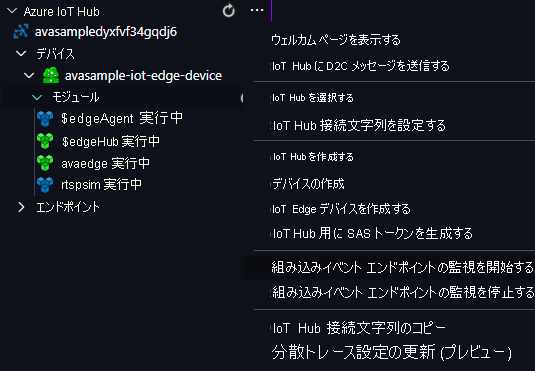

Video Analyzer エッジ モジュールを使用して、受信したライブ ビデオ ストリーム内で動きを検出し、イベントを IoT Hub に送信します。 それらのイベントを確認するには、次の手順に従います。

1. Visual Studio Code の [エクスプローラー] ペインを開き、左下隅にある [Azure IoT Hub] を探します。
1. **[デバイス]** ノードを展開します。
1. **avasample-iot-edge-device** を右クリックし、 **[組み込みイベント エンドポイントの監視を開始します]** を選択します。

   

    [!INCLUDE [provide-builtin-endpoint](../../common-includes/provide-builtin-endpoint.md)]
