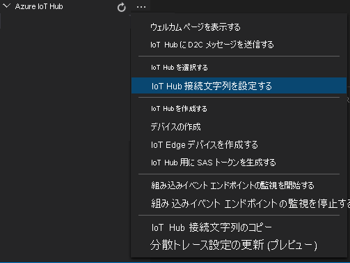

エッジ デバイスにデプロイされるモジュールは、配置マニフェストによって定義されます。 また、これらのモジュールの構成設定も定義されます。

マニフェストをテンプレート ファイルから生成して、エッジ デバイスにデプロイするには、これらの手順に従います。

1. Visual Studio Code を開きます。
1. **[Azure IoT Hub]** ペインの横にある **[その他のアクション]** アイコンを選択して、IoT Hub 接続文字列を設定します。 この文字列は、_src/cloud-to-device-console-app/appsettings.json_ ファイルからコピーすることができます。

   

   [!INCLUDE [provide-builtin-endpoint](../../common-includes/provide-builtin-endpoint.md)]
1. **src/edge/deployment.template.json** を右クリックして、 **[Generate IoT Edge deployment manifest]\(IoT Edge 配置マニフェストの生成\)** を選択します。

   

   このアクションによって、_deployment.amd64.json_ という名前のマニフェスト ファイルが _src/edge/config_ フォルダーに作成されます。
1. **src/edge/config/deployment.amd64.json** を右クリックして、 **[Create Deployment for Single Device]\(単一デバイスのデプロイの作成\)** を選択し、エッジ デバイスの名前を選択します。

   
1. IoT Hub デバイスを選択するよう求められたら、ドロップダウン メニューから **avasample-iot-edge-device** を選択します。
1. 約 30 秒後に、ウィンドウの左下隅で Azure IoT Hub を最新の情報に更新します。 エッジ デバイスには、次のデプロイ済みモジュールが表示されます。

    - Azure Video Analyzer (モジュール名 `avaedge`)
    - リアルタイム ストリーミング プロトコル (RTSP) シミュレーター (モジュール名 `rtspsim`)
