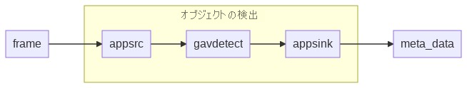
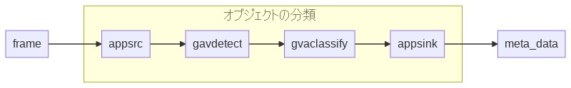
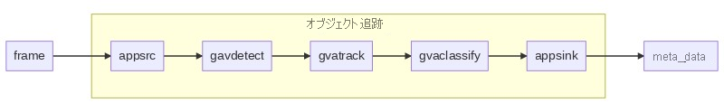
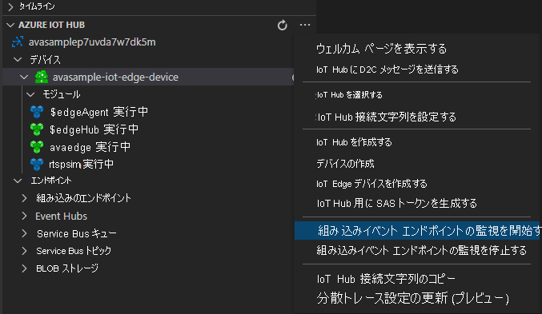

# <a name="tutorial-analyze-live-video-with-intel-openvino-dl-streamer--edge-ai-extension"></a>チュートリアル: Intel OpenVINO™ DL Streamer – Edge AI Extension を使用してライブ ビデオを分析する 

[!INCLUDE [header](includes/edge-env.md)]

このチュートリアルでは、Intel OpenVINO™ DL Streamer – Edge AI Extension を使用して、(シミュレートされた) IP カメラからのライブ ビデオ フィードを分析する方法について説明します。 この推論サーバーで、オブジェクト (人物、車両、バイク) を検出するためのさまざまなモデル、オブジェクトの分類 (車両の属性)、オブジェクト (人物、車両、バイク) 追跡用のモデルを利用する方法を見ていきます。 gRPC モジュールとの統合により、ビデオ フレームを AI 推論サーバーに送信できます。 結果は IoT Edge ハブに送信されます。 この推論サービスを Azure Video Analyzer と同じ計算ノードで実行すると、共有メモリを通じたビデオ データ送信を活用できます。 これにより、ライブ ビデオ フィードのフレーム レート (30 フレーム/秒) で推論を実行できます。 

このチュートリアルでは、シミュレートされた IoT Edge デバイスとして Azure VM を使用し、そこではシミュレートされたライブ ビデオ ストリームを使用します。 これは、C# で記述されたサンプル コードに基づいており、クイックスタート「[モーションの検出とイベントの生成](detect-motion-emit-events-quickstart.md)」を基に構築されています。

[!INCLUDE [use-x86-64](./includes/common-includes/use-x86-64.md)]

## <a name="prerequisites"></a>前提条件

[!INCLUDE [prerequisites](./includes/common-includes/csharp-prerequisites.md)]

## <a name="set-up-azure-resources"></a>Azure リソースの設定

[](https://aka.ms/ava-click-to-deploy)

[!INCLUDE [resources](./includes/common-includes/azure-resources.md)]

## <a name="review-the-sample-video"></a>サンプル ビデオを確認する

Azure リソースを設定する際に、駐車場の短いビデオが、IoT Edge デバイスとして使用している、Azure の Linux VM にコピーされます。 このチュートリアルでは、このビデオ ファイルを使用してライブ ストリームをシミュレートします。

[VLC メディア プレーヤー](https://www.videolan.org/vlc/)などのアプリケーションを開きます。 Ctrl キーを押しながら N キーを押し、リンクを[ビデオ](https://lvamedia.blob.core.windows.net/public/lots_015.mkv)に貼り付けて、再生を開始します。 駐車場にある車両の映像が表示されます。ほどんどの車両は停車していますが、1 台は動いています。

> [!VIDEO https://www.microsoft.com/videoplayer/embed/RE4LUbN]

このチュートリアルでは、Intel の Intel OpenVINO™ DL Streamer – Edge AI Extension と共に Video Analyzer を使用して、車両などのオブジェクトの検出、それらの車両の分類、または車両、人物、バイクの追跡を行います。 その結果として得られた推論イベントを IoT Edge ハブに発行します。

## <a name="overview"></a>概要

> [!div class="mx-imgBorder"]
> :::image type="content" source="./media/use-intel-openvino-tutorial/grpc-vas-extension-with-vino.png" alt-text="Intel DL Streamer Edge AI モジュールを使用した Azure Video Analyzer パイプラインの概要。":::

この図は、このチュートリアルでのシグナルの流れを示しています。 [エッジ モジュール](https://github.com/Azure/video-analyzer/tree/main/edge-modules/sources/rtspsim-live555)は、リアルタイム ストリーミング プロトコル (RTSP) サーバーをホストする IP カメラをシミュレートします。 [RTSP ソース](../pipeline.md#rtsp-source) ノードは、このサーバーからビデオ フィードをプルし、[gRPC 拡張プロセッサ](../pipeline.md#grpc-extension-processor) ノードにビデオ フレームを送信します。 

gRPC 拡張プロセッサ ノードは、デコードされたビデオ フレームを入力として受け取り、そのようなフレームを、gRPC サーバーによって公開される [gRPC](../terminology.md#grpc) エンドポイントにリレーします。 ノードでは、[共有メモリ](https://en.wikipedia.org/wiki/Shared_memory)を使用したデータの転送や、gRPC メッセージの本文へのコンテンツの直接埋め込みをサポートします。 また、ノードには、ビデオ フレームを gRPC エンドポイントにリレーする前に、スケールおよびエンコードするための組み込みのイメージ フォーマッタがあります。 スケーラーには、画像の縦横比を維持、埋め込み、または拡張するオプションがあります。 イメージ エンコーダーでは、jpeg、png、bmp 形式がサポートされています。 プロセッサの詳細については、[こちら](../pipeline.md#grpc-extension-processor)をご覧ください。

## <a name="about-intel-openvino-dl-streamer--edge-ai-extension-module"></a>Intel OpenVINO™ DL Streamer – Edge AI Extension モジュールの概要


OpenVINO™ DL Streamer – Edge AI Extension モジュールは、OpenVINO™ DL Streamer を使用して構築されたビデオ分析パイプラインを提供する Intel Video Analytics Serving (VA Serving) に基づくマイクロサービスです。 開発者は、検出、分類、または追跡を実行して結果を返す AI 拡張機能モジュールに、デコードされたビデオ フレームを送信できます。 AI 拡張機能モジュールは、Microsoft の Azure Video Analyzer など、ビデオ分析プラットフォームと互換性のある gRPC API を公開します。

複雑なハイパフォーマンスのビデオ分析ソリューションを構築するには、Azure Video Analyzer モジュールに、エッジのスケールを活かせる強力な推論エンジンを組み合わせる必要があります。 このチュートリアルでは、Azure Video Analyzer と連動するように設計されたエッジ モジュールである Intel OpenVINO™ DL Streamer – Edge AI Extension に推論要求が送信されます。

この推論サーバーの初期リリースでは、次の[モデル](https://github.com/intel/video-analytics-serving/tree/master/samples/ava_ai_extension#edge-ai-extension-module-options)を利用できます。

- person_vehicle_bike_detection のための object_detection 

- vehicle_attributes_recognition のための object_classification 

- person_vehicle_bike_tracking のための object_tracking 

すぐに開始できるように、物体検出、オブジェクト分類、オブジェクト追跡のプリロード済みパイプラインを使用します。 また、プリロード済みの [person-vehicle-bike-detection-crossroad-0078](https://github.com/openvinotoolkit/open_model_zoo/blob/master/models/intel/person-vehicle-bike-detection-crossroad-0078/README.md) および [vehicle-attributes-recognition-barrier-0039 モデル](https://github.com/openvinotoolkit/open_model_zoo/blob/master/models/intel/vehicle-attributes-recognition-barrier-0039/README.md)が用意されています。

> [!NOTE]
> エッジ モジュール (Intel の OpenVINO™ DL Streamer – Edge AI Extension とそこに含まれるソフトウェア) をダウンロードして利用したことをもって、ユーザーは[ライセンス契約](https://www.intel.com/content/www/us/en/legal/terms-of-use.html)のご契約条件に同意したものと見なされます。
> Intel は人権を尊重すること、および人権侵害の共謀を回避することに全力で取り組んでいます。 [Intel のグローバルな人権の原則](https://www.intel.com/content/www/us/en/policy/policy-human-rights.html)に関するページを参照してください。 Intel の製品やソフトウェアは、国際的に認知された人権への侵害の原因となったり侵害に寄与したりすることのないアプリケーションでの使用のみを意図しています。

デプロイ テンプレートのパイプライン環境変数を変更するだけで、お客様固有のユース ケースに合わせてさまざまなパイプラインを柔軟に使用できます。 これにより、パイプライン モデルを迅速に変更できます。Azure Video Analyzer と組み合わせると、メディア パイプラインと推論モデルの変更は数秒で済みます。

このチュートリアルでは、次のことについて説明します。

1. 使用する開発環境を設定する。
1. 必要なエッジ モジュールをデプロイする。
1. ライブ パイプラインを作成してデプロイする。
1. 結果を解釈する。
1. リソースをクリーンアップする。

## <a name="set-up-your-development-environment"></a>開発環境を設定する
[!INCLUDE [setup development environment](./includes/set-up-dev-environment/csharp/csharp-set-up-dev-env.md)]

## <a name="deploy-the-required-modules"></a>必要なモジュールをデプロイする

1. Visual Studio Code で、*src/edge/deployment.openvino.grpc.template.json* ファイルを右クリックし、 **[Generate IoT Edge Deployment Manifest]\(IoT Edge 配置マニフェストの生成\)** を選択します。

    > [!div class="mx-imgBorder"]
    > :::image type="content" source="./media/analyze-live-video-use-your-model-http/generate-deployment-manifest.png" alt-text="IoT Edge 配置マニフェストの生成":::
1. *deployment.openvino.grpc.amd64.json* マニフェスト ファイルが *src/edge/config* フォルダーに作成されます。
1. *src/edge/config/deployment.openvino.grpc.amd64.json* を右クリックし、 **[Create Deployment for Single Device]\(単一デバイスのデプロイの作成\)** を選択します。

    > [!div class="mx-imgBorder"]
    > :::image type="content" source="./media/analyze-live-video-use-your-model-http/deployment-single-device.png" alt-text= "Create Deployment for a Single Device":::
1. IoT Hub デバイスを選択するように求めるメッセージが表示されたら、 **[avasample-iot-edge-device]** を選択します。
1. 約 30 秒後に、ウィンドウの左下隅で Azure IoT Hub を最新の情報に更新します。 エッジ デバイスには、次のデプロイ済みモジュールが表示されます。

    * **avaedge** という名前の Video Analyzer エッジ モジュール。
    * **rtspsim** モジュール。RTSP サーバーをシミュレートし、ライブ ビデオ フィードのソースとして機能します。 
    * **avaextension** モジュール。コンピューター ビジョンをイメージに適用し、複数のオブジェクトの種類のクラスを返す、オブジェクトの検出、分類、および追跡モデルを備えた Intel OpenVINO DL Streamer モジュールです。

        > [!div class="mx-imgBorder"]
        > :::image type="content" source="./media/vscode-common-screenshots/avaextension.png" alt-text= "OpenVINO object detection model":::

> [!NOTE]
> また、Intel OpenVINO DL Streamer - Edge AI Extension モジュール向けの CPU、VPU、GPU サポートを (デバイスで利用可能な場合に) 有効にする *deployment.openvino.grpc.xpu.template.json* テンプレートも用意されています。 これらのテンプレートでは Intel の Docker ハブ イメージを参照します。

### <a name="prepare-to-monitor-events"></a>イベントの監視の準備をする

Azure Video Analyzer デバイスを右クリックし、 **[組み込みイベント エンドポイントの監視を開始します]** を選択します。 この手順は、Visual Studio Code の **[出力]** ウィンドウで、IoT Hub イベントを監視するために必要です。

 

### <a name="run-the-sample-program-to-detect-vehicles-persons-or-bike"></a>サンプル プログラムを実行して車両、人物、またはバイクを検出する
ブラウザーでこのチュートリアルの [パイプライン トポロジ](https://raw.githubusercontent.com/Azure/video-analyzer/main/pipelines/live/topologies/grpcExtensionOpenVINO/topology.json)を開くと、`grpcExtensionAddress` の値が `tcp://avaExtension:5001` に設定されていることがわかります。*httpExtensionOpenVINO* チュートリアルとは対照的に、URL を gRPC サーバーに変更する必要はありません。 代わりに、操作ファイルの `extensionConfiguration` によって特定のパイプラインを実行するようモジュールに指示します。 指定しない場合、既定では "person_vehicle_bike_detection" を表す "object_detection" になります。 サポートされている他のパイプラインで実験することができます。

1. *operations.json* ファイルを編集します。
    * ライブ パイプライン トポロジへのリンクを変更します。

        `"pipelineTopologyUrl" : "https://raw.githubusercontent.com/Azure/video-analyzer/main/pipelines/live/topologies/grpcExtensionOpenVINO/topology.json"`

    * `pipelineTopologySet` で、上記のリンクの値と一致するようにライブ パイプライン トポロジの名前を編集します。

      `"topologyName" : "InferencingWithOpenVINOgRPC"`

    * `pipelineTopologyDelete` で、名前を編集します。

      `"name": "InferencingWithOpenVINOgRPC"`
    
    * `rtspUrl` で、URLを `"value": "rtsp://rtspsim:554/media/lots_015.mkv"` に編集します。

次の extensionConfiguration を rtsp params の後に追加します。

```
{
    "name": "extensionConfiguration",
    "value": "{\"pipeline\":{\"name\":\"object_detection\",\"version\":\"person_vehicle_bike_detection\"}}"
}
```


`operations.json` は次のようになります。

```
{
  "apiVersion": "1.1,
  "operations": [
      {
          "opName": "pipelineTopologyList",
          "opParams": {}
      },
      {
          "opName": "WaitForInput",
          "opParams": {
              "message": "Press Enter to continue."
          }
      },
      {
          "opName": "livePipelineList",
          "opParams": {}
      },
      {
          "opName": "WaitForInput",
          "opParams": {
              "message": "Press Enter to continue. This is start the activating steps."
          }
      },
      {
          "opName": "pipelineTopologySet",
          "opParams": {
              "pipelineTopologyUrl": "https://raw.githubusercontent.com/Azure/video-analyzer/main/pipelines/live/topologies/grpcExtensionOpenVINO/topology.json"
          }
      },
      {
          "opName": "livePipelineSet",
          "opParams": {
              "name": "Sample-Pipeline-1",
              "properties": {
                  "topologyName": "InferencingWithOpenVINOgRPC",
                  "description": "Sample pipeline description",
                  "parameters": [
                      {
                          "name": "rtspUrl",
                          "value": "rtsp://rtspsim:554/media/lots_015.mkv"
                      },
                      {
                          "name": "rtspUserName",
                          "value": "testuser"
                      },
                      {
                          "name": "rtspPassword",
                          "value": "testpassword"
                      },
                      {
                        "name": "extensionConfiguration",
                        "value": "{\"pipeline\":{\"name\":\"object_detection\",\"version\":\"person_vehicle_bike_detection\"}}"
                      }
                  ]
              }
          }
      },
      {
          "opName": "livePipelineActivate",
          "opParams": {
              "name": "Sample-Pipeline-1"
          }
      },
      {
          "opName": "WaitForInput",
          "opParams": {
              "message": "Press Enter to continue. This is start the deactivating steps."
          }
      },
      {
          "opName": "livePipelineDeactivate",
          "opParams": {
              "name": "Sample-Pipeline-1"
          }
      },
      {
          "opName": "livePipelineDelete",
          "opParams": {
              "name": "Sample-Pipeline-1"
          }
      },
      {
          "opName": "livePipelineList",
          "opParams": {}
      },
      {
          "opName": "pipelineTopologyDelete",
          "opParams": {
              "name": "InferencingWithOpenVINOgRPC"
          }
      },
      {
          "opName": "pipelineTopologyList",
          "opParams": {}
      }
  ]
}
```

`extensionConfiguration` を使用すると、データの文字列を Intel DL Streamer - Edge AI モジュールに渡すことができます。 正しいデータを使用して、パイプラインごとに特定のモデルを使用するように Edge AI モジュールに指示できます。 たとえば、上で使用した "object_detection" モデルを、分類や追跡などの、サポートされている他のモデルに置き換えることができます。 これを行うには、下の例を使用します。

分類: 
```
{
    "name": "extensionConfiguration",
    "value": "{\"pipeline\":{\"name\":\"object_classification\",\"version\":\"vehicle_attributes_recognition\"}}"
}
```

追跡:
```
{
    "name": "extensionConfiguration",
    "value": "{\"pipeline\":{\"name\":\"object_tracking\",\"version\":\"person_vehicle_bike_tracking\"}}"
}
```

1. Visual Studio Code で **[拡張機能]** タブを開き (または Ctrl + Shift + X キーを押し)、Azure IoT Hub を検索します。
1. マウスの右ボタンをクリックし、 **[拡張機能の設定]** を選択します。

    > [!div class="mx-imgBorder"]
    > :::image type="content" source="./media/run-program/extensions-tab.png" alt-text="拡張機能の設定":::
1. [Show Verbose Message]\(詳細メッセージの表示\) を検索して有効にします。

    > [!div class="mx-imgBorder"]
    > :::image type="content" source="./media/run-program/show-verbose-message.png" alt-text="詳細メッセージの表示":::
1. デバッグ セッションを開始するには、F5 キーを押します。 **[ターミナル]** ウィンドウにメッセージが出力されるのを確認できます。
1. *operations.json* コードは、ダイレクト メソッド `pipelineTopologyList` および `livePipelineList` の呼び出しから始まります。 前のクイックスタートまたはチュートリアルを完了した後にリソースをクリーンアップしている場合は、このプロセスにより空のリストが返されてから、一時停止します。 続行するには、Enter キーを押します。

    **[ターミナル]** ウィンドウに、次の一連のダイレクト メソッド呼び出しが表示されます。

     * 前の `topologyUrl` を使用する `pipelineTopologySet` の呼び出し
     * 次の本文を使用する `livePipelineSet` の呼び出し。

         ```
         {
           "@apiVersion": "1.1",
           "name": "Sample-Pipeline-1",
           "properties": {
             "topologyName": "InferencingWithGrpcExtension",
             "description": "Sample pipeline description",
             "parameters": [
               {
                 "name": "rtspUrl",
                 "value": "rtsp://rtspsim:554/media/lots_015.mkv"
               },
               {
                 "name": "rtspUserName",
                 "value": "testuser"
               },
               {
                 "name": "rtspPassword",
                 "value": "testpassword"
               },
               {
                 "name": "grpcExtensionAddress",
                 "value": "tcp://avaextension:5001"
               },
               {
                 "name": "extensionConfiguration",
                 "value": "{\"pipeline\":{\"name\":\"object_detection\",\"version\":\"person_vehicle_bike_detection\"}}"
               }
             ]
           }
         }
         ```

     * パイプラインとビデオのフローを開始する `livePipelineActivate` の呼び出し。
1. **[ターミナル]** ウィンドウの出力は `Press Enter to continue` プロンプトで一時停止します。 Enter キーはまだ押さないでください。 上へスクロールして、呼び出したダイレクト メソッドの JSON 応答のペイロードを確認します。
1. Visual Studio Code の **[出力]** ウィンドウに切り替えます。 Video Analyzer モジュールから IoT ハブに送信されているメッセージが表示されます。 このチュートリアルの次のセクションでは、これらのメッセージについて説明します。
1. ライブ パイプラインは引き続き実行され、結果が出力されます。 RTSP シミュレーターによって、ソース ビデオがループ処理され続けます。 ライブ パイプラインを停止するには、 **[ターミナル]** ウィンドウに戻り、Enter キーを押します。 

    次の一連の呼び出しによって、リソースがクリーンアップされます。
      * `livePipelineDeactivate` の呼び出しによって、パイプラインが非アクティブ化されます。
      * `livePipelineDelete` の呼び出しによって、パイプラインが削除されます。
      * `pipelineTopologyDelete` の呼び出しによって、トポロジが削除されます。
      * `pipelineTopologyList` の最後の呼び出しによって、リストが空であることが示されます。

## <a name="interpret-results"></a>結果を解釈する

ライブ パイプラインを実行すると、gRPC 拡張プロセッサ ノードから IoT Hub メッセージ シンク ノードを介して IoT ハブに結果が渡されます。 **[出力]** ウィンドウに表示されるメッセージには、`body` セクションが含まれています。 詳細については、「[IoT Hub メッセージを作成し、読み取る](../../../iot-hub/iot-hub-devguide-messages-construct.md)」を参照してください。

次のメッセージでは、Video Analyzer モジュールで本文のコンテンツが定義されます。 

### <a name="mediasessionestablished-event"></a>MediaSessionEstablished イベント

ライブ パイプラインがアクティブ化されると、RTSP ソース ノードによって、rtspsim-live555 コンテナーで実行されている RTSP サーバーへの接続が試行されます。 接続に成功すると、次のイベントが出力されます。

```
[IoTHubMonitor] [10:51:34 AM] Message received from [avasample-iot-edge-device/avaedge]:
{
  "sdp&quot;: &quot;SDP:\nv=0\r\no=- 1620204694595500 1 IN IP4 xxx.xxx.xxx.xxx\r\ns=Matroska video+audio+(optional)subtitles, streamed by the LIVE555 Media Server\r\ni=media/camera-300s.mkv\r\nt=0 0\r\na=tool:LIVE555 Streaming Media v2020.08.19\r\na=type:broadcast\r\na=control:*\r\na=range:npt=0-300.000\r\na=x-qt-text-nam:Matroska video+audio+(optional)subtitles, streamed by the LIVE555 Media Server\r\na=x-qt-text-inf:media/camera-300s.mkv\r\nm=video 0 RTP/AVP 96\r\nc=IN IP4 0.0.0.0\r\nb=AS:500\r\na=rtpmap:96 H264/90000\r\na=fmtp:96 packetization-mode=1;profile-level-id=4D0029;sprop-parameter-sets=Z00AKeKQCgC3YC3AQEBpB4kRUA==,aO48gA==\r\na=control:track1\r\n"
}
```

前の出力は、次のような内容を表します。 

* このメッセージは、診断イベント `MediaSessionEstablished` です。 これは、RTSP ソース ノード (subject) が RTSP シミュレーターと接続され、(シミュレートされた) ライブ フィードの受信を開始したことを示します。
* `sdp` セクションには、診断イベントに関するデータが含まれています。 このケースでは、データは[セッション記述プロトコル (SDP)](https://en.wikipedia.org/wiki/Session_Description_Protocol) の詳細で構成されています。

### <a name="inference-event"></a>推論イベント

gRPC 拡張プロセッサ ノードが Intel OpenVINO™ DL Streamer – Edge AI Extension から推論の結果を受け取ります。 次に、IoT Hub メッセージ シンク ノードを介して、推論イベントとして結果が出力されます。 

これらのイベントの種類は `entity` に設定されており、それが車やトラックなどのエンティティであることを示しています。 

次の例では、車両が検出され、信頼度の値は 0.9 を超えています。

```
[IoTHubMonitor] [3:10:23 PM] Message received from [avasample-iot-edge-device/avaedge]:
{
  "timestamp": 145819820073974,
  "inferences": [
    {
      "type": "entity",
      "subtype": "vehicleDetection",
      "entity": {
        "tag": {
          "value": "vehicle",
          "confidence": 0.9147264
        },
        "box": {
          "l": 0.6853116,
          "t": 0.5035262,
          "w": 0.04322505,
          "h": 0.03426218
        }
      }
    }
```

メッセージでは、次の詳細に注目します。

* `body` セクションには、分析イベントに関するデータが含まれています。 このケースでは、イベントは推論イベントであるため、本文には `inferences` データが含まれています。
* `inferences` セクションは、`type` が `entity` であることを示しています。 このセクションには、エンティティに関する追加のデータが含まれています。

## <a name="clean-up-resources"></a>リソースをクリーンアップする

他のクイックスタートまたはチュートリアルに取り組む場合は、作成したリソースをそのまま残しておきます。 それ以外の場合は、Azure portal にアクセスして、ご利用のリソース グループに移動し、このチュートリアルを実行したリソース グループを選択して、そのリソースをすべて削除してください。

## <a name="next-steps"></a>次のステップ

上級ユーザー向けのその他の課題を確認します。

* RTSP シミュレーターを使用する代わりに、RTSP をサポートする [IP カメラ](https://en.wikipedia.org/wiki/IP_camera)を使用します。 RTSP をサポートする IP カメラは、[ONVIF 準拠製品](https://www.onvif.org/conformant-products/)のページで検索できます。 プロファイル G、S、または T に準拠しているデバイスを探します。
* Azure Linux VM ではなく、Intel x64 Linux デバイスを使用します。 このデバイスは、IP カメラと同じネットワーク内にある必要があります。 [Linux への Azure IoT Edge ランタイムのインストール](../../../iot-edge/how-to-install-iot-edge.md)に関するページの手順を参照できます。 次に、「[初めての IoT Edge モジュールを Linux 仮想デバイスにデプロイする](../../../iot-edge/quickstart-linux.md)」の手順に従って、デバイスを Azure IoT Hub に登録します。
