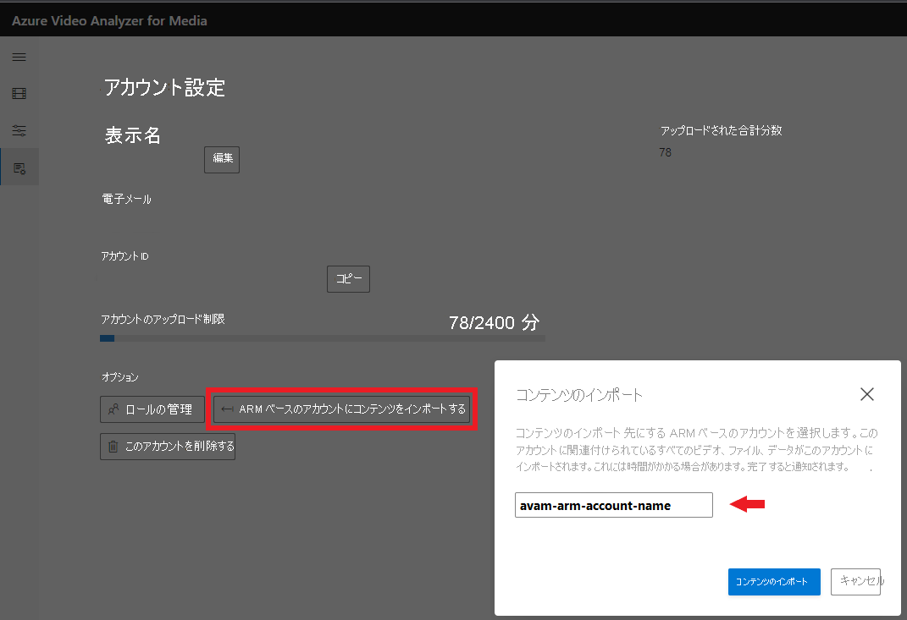

# メディア アカウント用の Video Analyzer を作成する

Azure Video Analyzer for Media (旧称 Video Indexer) アカウントを作成する際は、無料試用アカウント (一定分数の無料インデックス作成を利用可能) または有料オプション (クォータによる制限なし) を選択することができます。 無料試用版では、Azure Video Analyzer for Media は、ユーザーに最大 600 分の無料インデックス作成を提供し、[開発者ポータル](https://aka.ms/avam-dev-portal)で Azure Video Analyzer API をサブスクライブしているユーザーに最大 2400 分の無料インデックス作成を提供します。 有料オプションを使用すると、Azure Video Analyzer for Media では、クラシック アカウント (一般提供) と ARM ベースのアカウント (パブリック プレビュー) という 2 種類のアカウントが提供されます。 2 つの主な違いは、アカウント管理プラットフォームです。 クラシック アカウントは API Management 上に構築されていますが、ARM ベースのアカウント管理は Azure 上に構築されているので、ロールベースのアクセス制御 (Azure RBAC) を使用して、すべてのサービスへのアクセス制御をネイティブで適用できます。

* Azure Video Analyzer for Media **クラシック** アカウントは、[API](https://aka.ms/avam-dev-portal) を介して作成できます。

* 次のいずれかを使用して、**ARM ベース** の Azure Video Analyzer for Media アカウントを作成できます。

  1.  [Azure Video Analyzer for Media ポータル](https://aka.ms/vi-portal-link)

  2.  [Azure Portal](https://ms.portal.azure.com/#home)

  3.  [ARM テンプレートのクイックスタート](https://github.com/Azure-Samples/media-services-video-indexer/tree/master/ARM-Samples/Create-Account)

### **新しい ARM ベース** の Azure Video Analyzer for Media アカウントを作成する方法について詳しくは、こちらの [記事](create-video-analyzer-for-media-account.md)をご覧ください。

## クラシック アカウントを作成する方法
この記事では、Azure Video Analyzer for Media クラシック アカウントを作成する方法について説明します。 このトピックでは、自動 (既定) フローを使用して Azure に接続する手順について説明します。 また、手動で Azure に接続する方法 (上級) についても説明します。

*試用版* から *有料版の ARM ベース* の Azure Video Analyzer for Media アカウントに移行する場合、ビデオとモデルのカスタマイズをすべて新しいアカウントにコピーすることを選択できます。詳細は「[試用版アカウントからコンテンツをインポートする](#import-your-content-from-the-trial-account)」セクションにあります。

この記事では、[Azure Government への Video Analyzer for Media アカウントのリンク](#video-analyzer-for-media-in-azure-government)についても説明します。

## Azure に接続するための前提条件

* Azure サブスクリプション。

    Azure サブスクリプションがまだない場合は、[Azure 無料試用版](https://azure.microsoft.com/free/)にサインアップしてください。
* Azure Active Directory (Azure AD) ドメイン。

    Azure AD ドメインがない場合は、Azure サブスクリプションを使用して作成してください。 詳細については、[Azure AD のカスタム ドメイン名の管理](../../active-directory/enterprise-users/domains-manage.md)に関する記事を参照してください。
* **アプリケーション管理者** のロールを持つ、Azure AD ドメイン内のユーザー。 このメンバーは、Video Analyzer for Media アカウントを Azure に接続するときに使用します。

    このユーザーは、職場または学校アカウントを持つ Azure AD ユーザーである必要があります。 個人アカウント (outlook.com、live.com、hotmail.com など) は使用しないでください。

    

### 自動フローのその他の前提条件

* Azure AD ドメインのユーザーとメンバー。

    このメンバーは、Video Analyzer for Media アカウントを Azure に接続するときに使用します。

    このユーザーは、**所有者** ロール、または **共同作成者** ロールと **ユーザー アクセス管理者** ロールの両方が割り当てられた Azure サブスクリプションのメンバーである必要があります。 1 人のユーザーが 2 つのロールを持つ場合は 2 回追加できます。 共同作成者ロールで 1 回、ユーザー アクセス管理者ロールで 1 回です。 詳細については、「[Azure リソースに対するユーザーのアクセス権を表示する](../../role-based-access-control/check-access.md)」を参照してください。

    

### 手動フローのその他の前提条件

* Azure portal を使用して EventGrid リソース プロバイダーを登録します。

    [Azure portal](https://portal.azure.com/) で **[サブスクリプション]** 、[subscription]、 **[ResourceProviders]** に移動します。

    **Microsoft.Media** と **Microsoft.EventGrid** を探します。 "登録済み" 状態でない場合は、 **[登録]** をクリックします。 登録には数分かかります。

    

## Azure に手動で接続する (上級者向けオプション)

Azure への接続に失敗する場合は、手動で接続して問題の解決を試みることができます。

> [!NOTE]
> Azure Video Analyzer for Media アカウント、それと接続している Media Services アカウント、同じ Media Services アカウントに接続されている Azure Storage アカウントの 3 つのアカウントは、同じリージョン内に置くことが必須です。

### Media Services アカウントの作成と構成

1. [アカウントの作成](../../media-services/previous/media-services-portal-create-account.md)に関するページに従って、[Azure](https://portal.azure.com/) portal を使用して Azure Media Services アカウントを作成します。

     Media Services アカウントがクラシック API で作成されていることを確認します。 
 
    

    Media Services アカウント用にストレージ アカウントを作成する場合は、アカウントの種類に **StorageV2**、レプリケーション フィールドに **geo 冗長** (GRS) を選択します。

    

    > [!NOTE]
    > Media Services リソースとアカウント名を書き留めてください。 次のセクションの手順で必要になります。

1. Video Analyzer for Media Web アプリでビデオを再生するには、新しい Media Services アカウントの既定の **ストリーミング エンドポイント** を起動しておく必要があります。

    新しい Media Services アカウントで **[ストリーミング エンドポイント]** を選択します。 次に、ストリーミング エンドポイントを選択し、[開始] を押します。

    
4. Video Analyzer for Media が Media Services API を使用して認証するには、AD アプリを作成する必要があります。 次に、「[Azure ポータルで Azure AD 認証を開始する](../../media-services/previous/media-services-portal-get-started-with-aad.md)」で説明されている Azure AD 認証プロセスについて、手順を追って説明します。

    1. 新しい Media Services アカウントで **[API アクセス]** をクリックします。
    2. [サービス プリンシパルの認証方法](../../media-services/previous/media-services-portal-get-started-with-aad.md)を選択します。
    3. クライアント ID とクライアント シークレットを取得する

        **[設定]** -> **[キー]** を選択してから **[説明]** を追加し、 **[保存]** を押すと、キー値が設定されます。

        キーの有効期限が切れた場合、アカウント所有者は Video Analyzer for Media のサポートに連絡してキーを更新する必要があります。

        > [!NOTE]
        > 必ずキー値とアプリケーション ID を書き留めてください。 次のセクションの手順で必要になります。

### 手動で接続する

[Video Analyzer for Media](https://www.videoindexer.ai/) ページの **[Azure サブスクリプションで新しいアカウントを作成する]** ダイアログで、 **[手動構成に切り替える]** リンクを選択します。

このダイアログに次の情報を入力します。

|設定|Description|
|---|---|
|Video Analyzer for Media アカウント リージョン|Video Analyzer for Media アカウント リージョンの名前 パフォーマンスの向上とコストの削減を実現するために、Azure Media Services リソースと Azure Storage アカウントがあるリージョンの名前を指定するよう強くお勧めします。 |
|Azure AD テナント|Azure AD テナントの名前 (例: "contoso.onmicrosoft.com")。 テナント情報は Azure Portal から取得できます。 右上隅のサインインしているユーザーの名前にカーソルを合わせます。 **[ドメイン]** の右側に名前が表示されます。|
|サブスクリプション ID|この接続を作成先にする Azure サブスクリプション。 サブスクリプション ID は Azure portal から取得できます。 左側のウィンドウで **[すべてのサービス]** を選択し、「サブスクリプション」と検索します。 **[サブスクリプション]** を選択して、サブスクリプションの一覧から目的の ID を選択します。|
|Azure Media Services のリソース グループ名|Media Services アカウントを作成したリソース グループの名前。|
|Media Services リソース名|前のセクションで作成した Azure Media Services アカウントの名前。|
|アプリケーション ID|前のセクションで作成した (指定した Media Services アカウントのアクセス許可を持つ) Azure AD アプリケーション ID。|
|アプリケーション キー|前のセクションで作成した Azure AD アプリケーション キー。 |

### "*試用版*" アカウントからコンテンツをインポートする

新しい **ARM ベース** のアカウントを作成する場合は、*試用版* アカウントから新しい **ARM ベース** の無料アカウントにコンテンツをインポートするオプションがあります。
> [!NOTE]
> * 試用版からのインポートは、試用アカウントごとに 1 回だけ実行できます。
> * インポートが割り当てられる前に、ターゲットの ARM ベースのアカウントを作成して使用できるようにする必要があります。  
> * ターゲットの ARM ベースのアカウントは、空のアカウントである必要があります (メディア ファイルのインデックスが作成されたことがない)。

データをインポートするには、次の手順に従います。
 1. [Azure Video Analyzer for Media ポータル](https://aka.ms/vi-portal-link)に移動します。
 2. 試用版のアカウントを選択し、 *[アカウント設定]* ページに移動します。
 3. *[Import content to an ARM-based account]\(コンテンツを ARM ベースのアカウントにインポートする\)* をクリックします。
 4. ドロップダウン メニューから、データのインポート先となる ARM ベースのアカウントを選択します。
   * アカウント ID が表示されていない場合は、Azure Video Analyzer for Media ポータルのサイド ブレードで Azure portal またはアカウント一覧からアカウント ID をコピーして貼り付けることができます。
 5. **[Import content]\(コンテンツをインポートする\)** をクリックします。  

すべてのメディアおよびコンテンツ モデルのカスタマイズは、*試用* アカウントから新しい ARM ベースのアカウントにコピーされます。

> [!NOTE]
>
> "*試用版*" アカウントは、Azure Government クラウドでは利用できません。

## Azure Media Services に関する考慮事項

Azure Media Services に関する次の考慮事項が適用されます。

* 既存の Media Services アカウントに接続する予定の場合は、Media Services アカウントがクラシック API で作成されていることをご確認ください。 
 
    
* 既存の Media Services アカウントに接続した場合、Video Analyzer for Media で既存メディアの **[予約ユニット]** の構成は変更されません。

   予想される負荷に従って、メディアの [予約ユニット] の種類と数を調整する必要があります。 負荷が高く、ユニットや速度が十分ではない場合は、ビデオ処理でタイムアウト エラーが発生する可能性がある点に注意してください。
* 新しい Media Services アカウントに接続した場合、Video Analyzer for Media は、既定の **ストリーミング エンドポイント** を自動的に起動します。

    

    ストリーミング エンドポイントの起動には時間がかかります。 そのため、アカウントを Azure に接続してから Video Analyzer for Media Web アプリでビデオをストリーミングして視聴できるようになるまでに数分かかることがあります。
* 既存の Media Services アカウントに接続した場合、Video Analyzer for Media で既定のストリーミング エンドポイントの構成は変更されません。 実行中の **ストリーミング エンドポイント** がない場合、この Media Services アカウントから、または Video Analyzer for Media でビデオを視聴できません。
* 自動的に接続されると、Video Analyzer for Media によってメディアの **[予約ユニット]** は 10 S3 ユニットに設定されます。

    
    
## Video Analyzer for Media アカウントの作成を自動化する

アカウント作成の自動化は、2 つの手順から成るプロセスです。
 
1. Azure Resource Manager を使用して、Azure Media Services アカウントと Azure AD アプリケーションを作成します。

    [Media Services アカウント作成テンプレート](https://github.com/Azure-Samples/media-services-v3-arm-templates)の例を参照してください。
1. [Media Services と Azure AD アプリケーションで Create-Account](https://videoindexer.ai.azure.us/account/login?source=apim) を呼び出します。

## Azure Government での Video Analyzer for Media

### Azure Government に接続するための前提条件

-   [Azure Government](../../azure-government/index.yml) の Azure サブスクリプション。
- Azure Government の Azure AD アカウント。
- 「[Azure に接続するための前提条件](#prerequisites-for-connecting-to-azure)」で前述したアクセス許可とリソースの前提条件すべて。 「[自動フローのその他の前提条件](#additional-prerequisites-for-automatic-flow)」と「[手動フローのその他の前提条件](#additional-prerequisites-for-manual-flow)」を必ずご確認ください。

### Azure Government ポータルを使用して新しいアカウントを作成する

> [!NOTE]
> Azure Government クラウドには、Video Analyzer for Media の "*試用版*" エクスペリエンスが含まれていません。

Video Analyzer for Media ポータルを使用して有料アカウントを作成するには、次のようにします。

1. [https://resources.azure.com](https://videoindexer.ai.azure.us) に移動します 
1. Azure Government の Azure AD アカウントでログインします。
1.  自分が所有者または共同作成者である Video Analyzer for Media アカウントが Azure Government にない場合は、アカウントの作成を開始できる空のエクスペリエンスが表示されます。 

    フローの残りの部分は、上記で説明したとおりです。選択肢となるリージョンのみが、Video Analyzer for Media が使用できる Government リージョンになります 

    自分が既に Azure Government 内の既存の 1 つ以上の Video Analyzer for Media アカウントの共同作成者または管理者である場合は、そのアカウントに誘導され、前述の説明に従って、必要に応じて追加のアカウントを作成するためのフォロー手順を開始できます。
    
### Azure Government で API を使用して新しいアカウントを作成する

Azure Government で有料アカウントを作成するには、[Create-Paid-Account]() の手順に従います。 この API エンド ポイントには、Government クラウドのリージョンのみが含まれます。

### Azure Government の Video Analyzer for Media の制限

*   Government クラウドでは、手動によるコンテンツ モデレーションを利用できません。 

    パブリック クラウドでは、コンテンツがコンテンツ モデレーションに基づいて不快であると見なされる場合に、顧客はそのコンテンツの調査を人に依頼して、その判定を取り消せる可能性があります。  
*   試用版アカウントはありません。 
* Bing の説明 - Government クラウド では、識別される有名人および名前付きエンティティの説明は表示されません。 これは UI 機能のみです。 

## リソースをクリーンアップする

このチュートリアルを完了したら、使用する予定がないリソースを削除します。

### Video Analyzer for Media アカウントを削除する

Video Analyzer for Media アカウントを削除する場合は、Video Analyzer for Media Web サイトからアカウントを削除できます。 アカウントを削除するには、所有者である必要があります。

アカウントを選択し、 **[設定]**  ->  **[このアカウントを削除する]** の順にクリックします。 

アカウントは 90 日後に完全に削除されます。

## ファイアウォール

[ファイアウォールの内側にあるストレージ アカウント](faq.yml#can-a-storage-account-connected-to-the-media-services-account-be-behind-a-firewall)に関する記事を参照してください。

## 次のステップ

[API の使用](video-indexer-use-apis.md)に関するページの手順に従って、試用アカウントや Azure に接続されている Video Analyzer for Media アカウントをプログラムで操作することができます。

Azure への接続時に使用したものと同じ Azure AD ユーザーを使用する必要があります。
