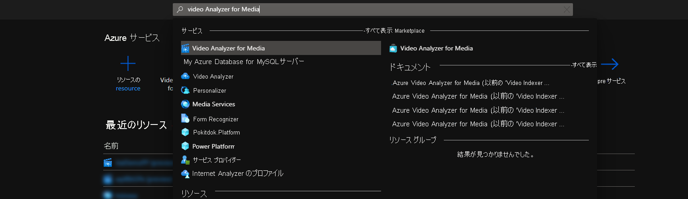
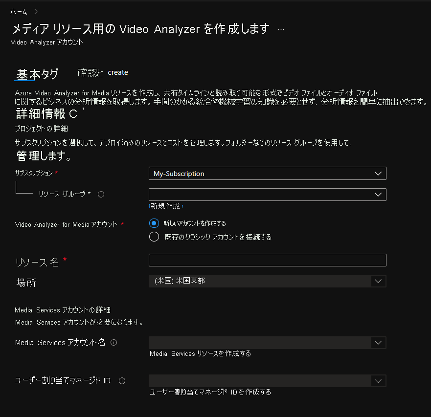
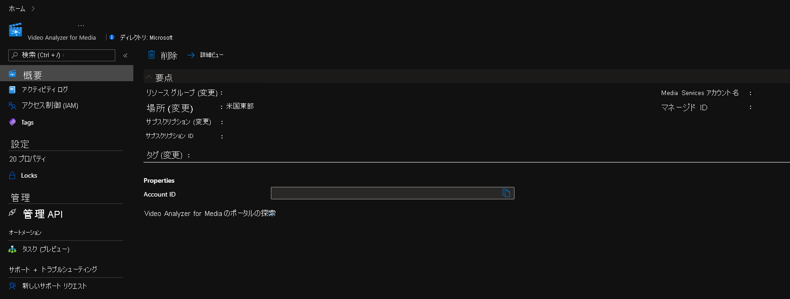
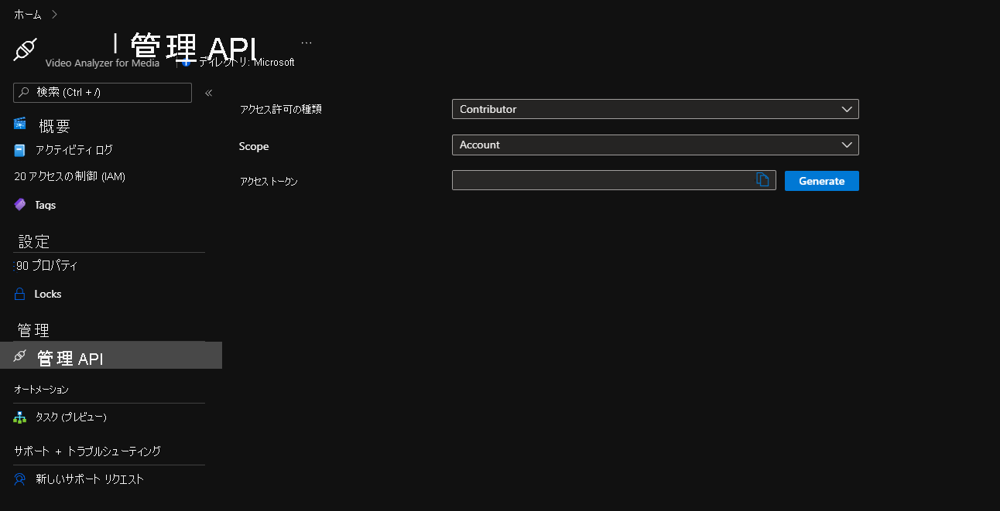

# Azure portal の Azure Video Analyzer for Media の概要

このクイックスタートでは、Azure Video Analyzer for Media の基本的な操作手順について説明します。 Azure portal を使用して、Azure Video Analyzer for Media アカウントとそれに付随するリソースを作成します。

Azure Video Analyzer for Media の使用を開始するには、Video Analyzer for Media アカウントを作成する必要があります。 アカウントは、[Media Services][docs-ms] リソースと[ユーザー割り当てマネージド ID][docs-uami] に関連付けられている必要があります。 マネージド ID には、Media Services に対する共同作成者アクセス許可ロールが必要になります。

## 前提条件
> [!NOTE]
> Azure サブスクリプションがあり、このサブスクリプションで、新しいリソースを作成するリソース グループに対する共同作成者ロールとユーザー アクセス管理者ロールの両方と、Azure Media Services とユーザー割り当てマネージド ID の両方に対する共同作成者ロールにアクセスできる必要があります。 適切なアクセス許可がない場合は、これらのアクセス許可を付与してもらうようアカウント管理者に依頼してください。 関連した Azure Media Services は、Video Analyzer for Media アカウントと同じリージョンになければなりません。

## Azure portal

### Azure Portal で Video Analyzer for Media アカウントを作成する

1. [Azure portal](https://portal.azure.com/) にサインインします。
1. 上部にある検索バーを使用して、 **"Video Analyzer for Media"** と入力します。
1. *[サービス]* の下の *[Video Analyzer for Media]* をクリックします。

    

1. **Create** をクリックしてください。
1. **[Video Analyzer for Media リソースの作成]** セクションで、必要な値を入力します。

    

 
| 名前 | 説明 |
| ---|---|
|**サブスクリプション**|Video Analyzer for Media アカウントを作成するために使用しているサブスクリプションを選びます。|
|**リソース グループ**|Video Analyzer for Media アカウントを作成しているリソース グループを選ぶか、 **[新規作成]** を選択してリソース グループを作成します。|
|**Video Analyzer for Media アカウント**|*[新しいアカウントを作成する]* オプションを選択します。|
|**リソース名**|新しい Video Analyzer for Media アカウントの名前を入力します。名前には文字、数字、ダッシュを使用でき、スペースはいれません。|
|**場所**|Video Analyzer for Media アカウントをデプロイするために使用する地理的リージョンを選択します。 場所は、選択した **リソース グループの場所** と一致します。選択した場所を変更する場合は、選択したリソース グループを変更するか、優先する場所に新しいリソース グループを作成します。 [Video Analyzer for Media が利用可能な Azure リージョン](https://azure.microsoft.com/global-infrastructure/services/?products=cognitive-services&regions=all)|
|**Media Services アカウント名**|新しい Video Analyzer for Media アカウントがビデオを処理するために使用する Media Services を選択します。 既存の Media Services を選択するか、新しく作成します。 Media Services は、選択した場所と同じ場所になければなりません。| 
|**ユーザー割り当てマネージド ID**|新しい Video Analyzer for Media アカウントが Media Services にアクセスするために使用するユーザー割り当てマネージド ID を選択します。 既存のユーザー割り当てマネージド ID を選択することも、新しい ID を作成することもできます。 ユーザー割り当てマネージド ID には、Media Services に対する共同作成者ロールの役割が割り当てられます。|

1. フォームの下部にある **[確認と作成]** をクリックします。

### デプロイされているリソースを確認する

Azure portal を使用して Azure Video Analyzer for Media アカウントや作成された他のリソースを検証できます。 デプロイが完了したら、 **[リソースに移動]** を選択すると新しい Video Analyzer for Media アカウントが表示されます。

### 概要

*[Video Analyzer for Media のポータルの探索]* をクリックして、[Azure Video Analyzer for Media ポータル](https://aka.ms/vi-portal-link)で新しいアカウントを表示します

### 管理 API

*[管理 API]* タブを使用して、アカウントのアクセス トークンを手動で生成します。
このトークンを使用して、このアカウントでの API 呼び出しを認証することができます。 各トークンの有効期間は 1 時間です。

以下について選択します。
* アクセス許可の種類: **共同作成者** あるいは **閲覧者**
* スコープ: **アカウント**、**プロジェクト**、または **ビデオ**
    * **プロジェクト** または **ビデオ** の場合は、一致する ID も挿入する必要があります
* **[生成]** をクリックします

---

### 次のステップ

[C# を使用してビデオをアップロード](https://github.com/Azure-Samples/media-services-video-indexer/tree/master/ApiUsage/ArmBased)する方法について確認する。

<!-- links -->
[docs-uami]: ../../active-directory/managed-identities-azure-resources/overview.md
[docs-ms]: ../../media-services/latest/media-services-overview.md
[docs-role-contributor]: ../../role-based-access-control/built-in-roles.md#contibutor
[docs-contributor-on-ms]: ./add-contributor-role-on-the-media-service.md
