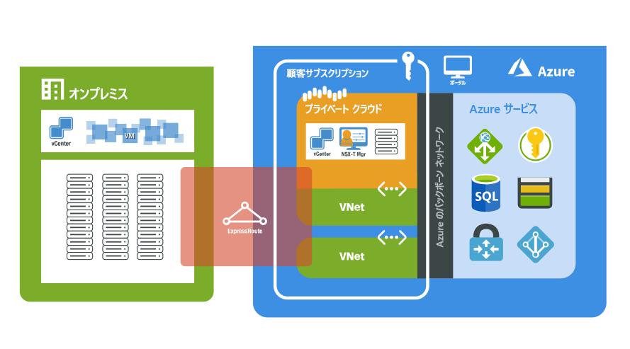

# Azure VMware Solution とは

Azure VMware Solution は、専用のベアメタル Azure インフラストラクチャから構築された vSphere クラスターを含むプライベート クラウドを提供します。 最小の初期デプロイは 3 ホストですが、クラスターあたり最大 16 ホストまで、ホストを 1 つずつ追加できます。  プロビジョニングされたすべてのプライベート クラウドに、vCenter Server、vSAN、vSphere、NSX-T が含まれています。 オンプレミス環境からワークロードを移行し、新しい仮想マシン (VM) をデプロイして、プライベート クラウドから Azure サービスを利用できます。

Azure VMware Solution は、VMware によって検証されたソリューションで、拡張機能とアップグレードが継続的に検証およびテストされます。 プライベート クラウドのインフラストラクチャとソフトウェアの管理と保守は Microsoft が行います。 そのため、ユーザーはプライベート クラウドでのワークロードの開発と実行に専念できます。 

次の図は、Azure、Azure サービス、オンプレミス環境におけるプライベート クラウドと VNet の隣接関係を示しています。 プライベート クラウドから Azure サービスまたは VNet へのネットワーク アクセスにより、SLA に基づく Azure サービス エンドポイントの統合が提供されます。 ExpressRoute Global Reach では、オンプレミス環境を Azure VMware Solution のプライベート クラウドに接続します。 

## ホスト、クラスター、およびプライベート クラウド

Azure VMware Solution プライベート クラウドとクラスターは、ベアメタルのハイパーコンバージド Azure インフラストラクチャ ホストから構築されます。 ハイエンドのホストには、576 GB の RAM と 2 基の Intel 18 コア 2.3 GHz プロセッサが搭載されています。 HE ホストには、2 つの vSAN ディスクグループがあり、15.36 TB (SSD) の未加工の vSAN 容量階層と 3.2 TB (NVMe) の vSAN キャッシュ階層があります。

新しいプライベート クラウドは、Azure portal または Azure CLI を介してデプロイされます。

## ネットワーク

[!INCLUDE [avs-networking-description](includes/azure-vmware-solution-networking-description.md)]

詳細については、[ネットワークの概念](concepts-networking.md)に関する記事をご覧ください。

## アクセスとセキュリティ

Azure VMware Solution プライベート クラウドでは、セキュリティを強化するために、vSphere のロールベースのアクセス制御が使用されます。 vSphere SSO LDAP 機能は、Azure Active Directory と統合できます。 詳細については、[アクセスと ID の概念](concepts-identity.md)に関する記事をご覧ください。  

vSAN の保存データの暗号化は既定で有効になっており、vSAN データストアのセキュリティを提供するために使用されます。 詳細については、[ストレージの概念](concepts-storage.md)に関する記事をご覧ください。

## ホストとソフトウェアのライフサイクル メンテナンス

Azure VMware Solution プライベート クラウドと VMware ソフトウェアを定期的にアップグレードすることによって、プライベート クラウドで最新のセキュリティ、安定性、機能セットが確保されます。 詳細については、[プライベート クラウドの更新とアップグレード](concepts-upgrades.md)に関する記事をご覧ください。

## プライベート クラウドの監視

Azure VMware Solution をサブスクリプションにデプロイすると、[Azure Monitor ログ](../azure-monitor/overview.md)が自動的に生成されます。 

プライベート クラウドでは、次のことが可能です。
- 各 VM でログを収集する。
- Linux および Windows VM に [MMA エージェントをダウンロードしてインストールする](../azure-monitor/agents/log-analytics-agent.md#installation-options)。
- [Azure Diagnostics 拡張機能](../azure-monitor/agents/diagnostics-extension-overview.md)を有効にする。
- [新しいクエリを作成して実行する](../azure-monitor/logs/data-platform-logs.md#log-queries)。
- VM で通常実行するものと同じクエリを実行する。

Azure VMware Solution における監視パターンは、IaaS プラットフォーム内の Azure VM に似ています。 詳細と操作方法については、[Azure Monitor を使用した Azure VM の監視](../azure-monitor/vm/monitor-vm-azure.md)に関する記事をご覧ください。

## 顧客とのコミュニケーション
[!INCLUDE [customer-communications](includes/customer-communications.md)]

## 次のステップ

次の手順では、重要な[プライベート クラウドとクラスターの概念](concepts-private-clouds-clusters.md)について学習します。

<!-- LINKS - external -->

<!-- LINKS - internal -->
[concepts-private-clouds-clusters]: ./concepts-private-clouds-clusters.md

