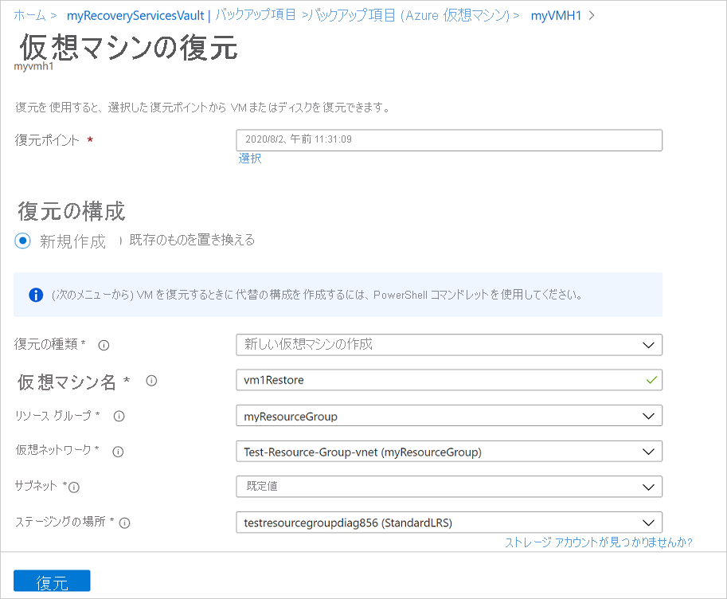
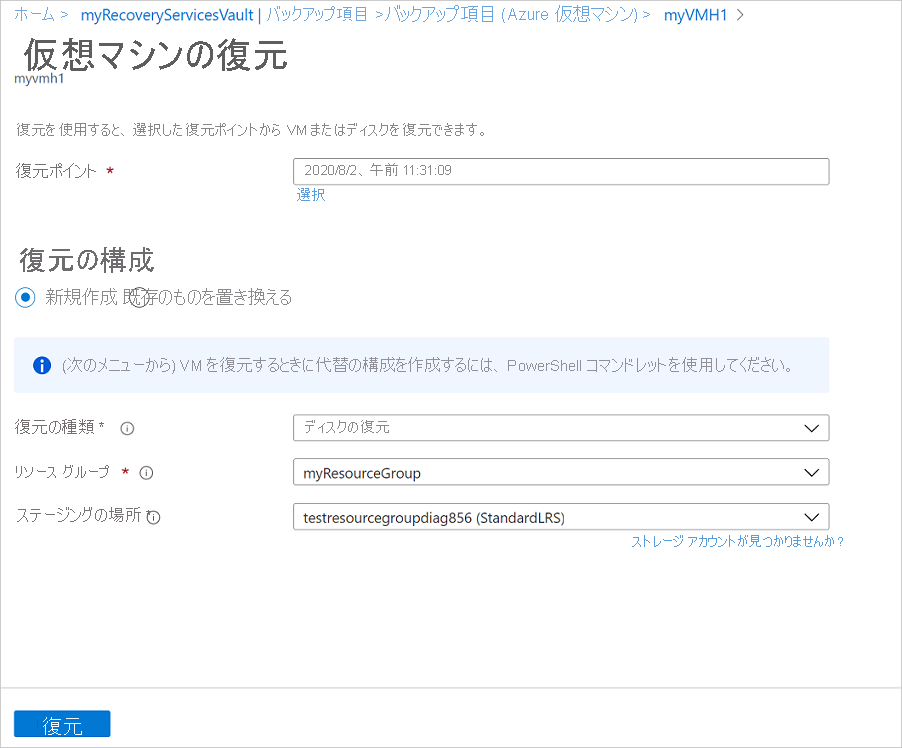
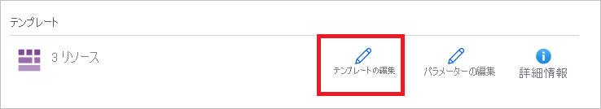
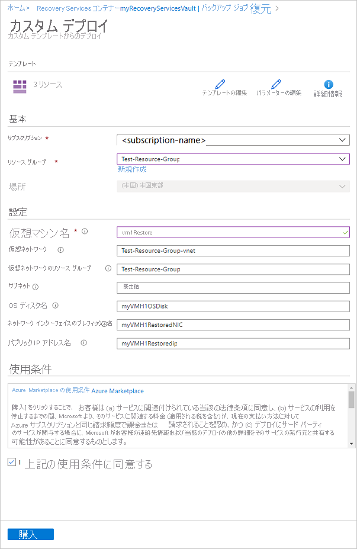
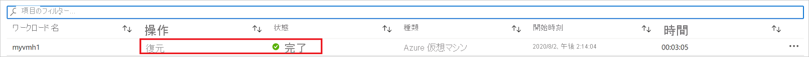

# Azure VM の復元

この記事では、[Azure Backup](backup-overview.md) Recovery Services コンテナーに格納されている復旧ポイントから Azure VM データを復元する方法について説明します。

## 復元オプション

Azure Backup は、VM を復元するためのさまざまな方法を提供します。

**復元オプション** | **詳細**
--- | ---
**新しい VM を作成する** | 基本的な VM を復元ポイントからすばやく作成し、起動して実行します。   VM の名前を指定し、配置先のリソース グループと仮想ネットワーク (VNet) を選択して、復元された VM のストレージ アカウントを指定することができます。
**ディスクを復元する** | 後で新しい VM を作成するために使用できる VM ディスクを復元します。   Azure Backup は、VM のカスタマイズと作成に役立つテンプレートを提供します。    復元ジョブによって生成されるテンプレートをダウンロードして使用することで、カスタム VM 設定を指定したり、VM を作成したりできます。   ディスクは、指定したストレージ アカウントにコピーされます。   ディスクを既存の VM に接続するか、または PowerShell を使用して新しい VM を作成することもできます。   このオプションは、VM をカスタマイズする場合、バックアップの時点では存在していなかった構成設定を追加する場合、テンプレートまたは PowerShell を使用して構成する必要がある設定を追加する場合などに役立ちます。
**既存の以下のものを置き換えます** | ディスクを復元し、それを使用して既存の VM 上のディスクを置き換えることができます。   現在の VM が存在する必要があります。 削除されている場合、このオプションは使用できません。   ディスクを交換する前に、Azure Backup によって既存の VM のスナップショットが取得され、指定したステージングの場所に格納されます。 VM に接続されている既存のディスクが、選択した復元ポイントを使用して置き換えられます。   スナップショットはコンテナーにコピーされ、アイテム保持ポリシーに従って保持されます。    既存のものの置き換えは、暗号化されていないマネージド VM でサポートされています。 アンマネージド ディスク、[汎用化された VM](https://docs.microsoft.com/azure/virtual-machines/windows/capture-image-resource)、または[カスタム イメージを使用して作成された](https://azure.microsoft.com/resources/videos/create-a-custom-virtual-machine-image-in-azure-resource-manager-with-powershell/) VM では、サポートされていません。   復元ポイントにあるディスクの数が現在の VM よりも多い (または少ない) 場合、復元ポイントのディスク数だけが VM 構成に反映されます。  

> [!NOTE]
> Azure VM 上の特定のファイルとフォルダーを復旧することもできます。 [詳細情報](backup-azure-restore-files-from-vm.md)。
>
> Azure VM 用の Azure Backup の (インスタント リストアと呼ばれる) [最新バージョン](backup-instant-restore-capability.md)を実行している場合、スナップショットは最大 7 日間保持され、バックアップ データがコンテナーに送信される前にスナップショットから VM を復元できます。 過去 7 日間のバックアップから VM を復元する場合、コンテナーからではなくスナップショットから復元する方が高速です。

## ストレージ アカウント

ストレージ アカウントの詳細を次に示します。

- **VM の作成**:作成した新しい VM は、指定したストレージ アカウントに配置されます。
- **ディスクの復元**: 復元したディスクは、指定したストレージ アカウントにコピーされます。 復元ジョブによって生成されるテンプレートをダウンロードして使用することで、カスタム VM 設定を指定できます。 このテンプレートは、指定したストレージ アカウントに配置されます。
- **ディスクの交換**: 既存の VM でディスクを交換するとき、ディスク交換の前に Azure Backup によって既存の VM のスナップショットが取得されます。 スナップショットは指定したステージング場所 (ストレージ アカウント) に格納されます。 このストレージ アカウントは、復元プロセス中、スナップショットを一時的に格納するときに使用されます。後で簡単に削除できるように、このためのアカウントを新しく作成することをお勧めします。
- **ストレージ アカウントの場所**: ストレージ アカウントは、コンテナーと同じリージョンに存在する必要があります。 これらのアカウントのみが表示されます。 その場所にストレージ アカウントがない場合は、作成する必要があります。
- **ストレージの種類**: Blob Storage はサポートされていません。
- **ストレージ冗長**: ゾーン冗長ストレージ (ZRS) はサポートされていません。 アカウントのレプリケーションおよび冗長性の情報は、アカウント名の後のかっこ内に表示されます。 
- **Premium Storage**:
    - Premium 以外の VM を復元する場合、Premium Storage アカウントはサポートされません。
    - マネージド VM を復元する場合、ネットワーク ルールで構成されている Premium Storage アカウントはサポートされません。

## 開始する前に

VM を復元する (新しい VM を作成する) には、VM の復元操作のための正しい RBAC (ロールベースのアクセス制御) [アクセス許可](backup-rbac-rs-vault.md#mapping-backup-built-in-roles-to-backup-management-actions)があることを確認してください。

アクセス許可がない場合は、[ディスクを復元し](#restore-disks)、ディスクが復元された後、復元操作の一部として生成された[テンプレートを使用して](#use-templates-to-customize-a-restored-vm)新しい VM を作成できます。

## 復元ポイントを選択

1. 復元する VM に関連付けられているコンテナーで、 **[バックアップ アイテム]**  >  **[Azure 仮想マシン]** をクリックします。
2. VM をクリックします。 既定では、VM ダッシュボードには過去 30 日間の復旧ポイントが表示されます。 30 日前よりも古い復旧ポイントを表示する、または、日付、時間範囲、スナップショット整合性の種類をフィルターにして復旧ポイントを探すことができます。
3. VM を復元するには、 **[VM の復元]** をクリックします。

    

4. 復旧に使用する復元ポイントを選択します。

## VM の復元の構成を選択する

1. **[復元の構成]** で、復元オプションを選択します:
    - **新規作成**: 新しい VM を作成する場合、このオプションを使用します。 単純な設定で VM を作成することも、ディスクを復元して、カスタマイズされた VM を作成することもできます。
    - **既存の以下のものを置き換えます**:既存の VM 上のディスクを置き換える場合、このオプションを使用します。

        

2. 選択した復元オプションの設定を指定します。

## VM の作成

[復元オプション](#restore-options)の 1 つであり、基本的な設定を使用して復元ポイントから VM をすばやく作成できます。

1. **[復元の構成]**  >  **[新規作成]**  >  **[復元の種類]** で、 **[仮想マシンの作成]** を選択します。
2. **[仮想マシン名]** で、サブスクリプションに存在しない VM を指定します。
3. **[リソース グループ]** で、新しい VM の既存のリソース グループを選択するか、グローバルに一意の名前を持つ新しいリソース グループを作成します。 既に存在している名前を割り当てると、Azure は VM と同じ名前をグループに割り当てます。
4. **[仮想ネットワーク]** で、VM が配置される VNet を選択します。 サブスクリプションに関連付けられているすべての VNet が表示されます。 サブネットを選択します。 最初のサブネットが既定で選択されています。
5. **[ストレージの場所]** で、VM のストレージ アカウントを指定します。 [詳細情報](#storage-accounts)。

    

6. **[復元の構成]** で、 **[OK]** をクリックします。 **[復元]** で **[復元]** をクリックして、復元操作を開始します。

## ディスクを復元する

[復元オプション](#restore-options)の 1 つであり、復元ポイントからディスクを作成できます。 その後、ディスクを使用して次のいずれかを実行できます:

- 復元操作の間に生成されるテンプレートを使用して設定をカスタマイズし、VM のデプロイを開始します。 既定のテンプレート設定を編集し、VM デプロイのテンプレートを送信します。
- 既存の VM に、[復元されたディスクをアタッチ](https://docs.microsoft.com/azure/virtual-machines/windows/attach-managed-disk-portal)します。
- PowerShell を使用して、復元されたディスクから[新しい VM を作成](https://docs.microsoft.com/azure/backup/backup-azure-vms-automation#create-a-vm-from-restored-disks)します。

1. **[復元の構成]**  >  **[新規作成]**  >  **[復元の種類]** で、 **[ディスクの復元]** を選択します。
2. **[リソース グループ]** で、復元されたディスクの既存のリソース グループを選択するか、グローバルに一意の名前を持つ新しいリソース グループを作成します。
3. **[ストレージ アカウント]** で、VHD のコピー先のアカウントを指定します。 [詳細情報](#storage-accounts)。

    

4. **[復元の構成]** で、 **[OK]** をクリックします。 **[復元]** で **[復元]** をクリックして、復元操作を開始します。

VM の復元中、Azure Backup はストレージ アカウントを使用しません。 ただし、**ディスクの復元**や**インスタント リストア**の場合は、テンプレートを格納するためにストレージ アカウントが使用されます。

### テンプレートを使用して復元 VM をカスタマイズする

ディスクが復元された後に、復元操作の一環として生成されたテンプレートを使用して、新しい VM をカスタマイズおよび作成します:

1. 関連するジョブの **[Restore Job Details]\(復元ジョブの詳細\)** を開きます。

2. **[Restore Job Detail]\(復元ジョブの詳細\)** で、 **[テンプレートのデプロイ]** を選択して、テンプレートのデプロイを開始します。

    

3. テンプレートで提供されている VM 設定をカスタマイズするには、 **[テンプレートの編集]** をクリックします。 さらにカスタマイズを追加する場合は、 **[パラメーターの編集]** をクリックします。
    - カスタム テンプレートからのリソースのデプロイに関する[詳細情報](../azure-resource-manager/resource-group-template-deploy-portal.md#deploy-resources-from-custom-template)。
    - テンプレートの作成に関する[詳細情報](../azure-resource-manager/resource-group-authoring-templates.md)。

   

4. VM のカスタム値を入力し、**利用規約**を受諾して **[購入]** をクリックします。

   

## 既存のディスクの置き換え

[復元オプション](#restore-options)の 1 つであり、選択した復元ポイントで既存の VM ディスクを置き換えることができます。 すべての復元オプションを[確認](#restore-options)します。

1. **[復元の構成]** で、 **[既存の以下のものを置き換えます]** をクリックします。
2. **[リストアの種類]** で、 **[Replace disk/s]\(ディスクの交換\)** を選択します。 これは、既存の VM ディスクを置き換えるために使用される復元ポイントです。
3. **[ステージングの場所]** で、復元プロセス中に現在のマネージド ディスクのスナップショットを保存する場所を指定します。 [詳細情報](#storage-accounts)。

   ![復元の構成ウィザードの [既存の以下のものを置き換えます]](./media/backup-azure-arm-restore-vms/restore-configuration-replace-existing.png)

## 特別な構成を持つ VM を復元する

VM の復元が必要になることがある、一般的なシナリオはいくつかあります。

**シナリオ** | **ガイダンス**
--- | ---
**Hybrid Use Benefit を使用して VM を復元する** | Windows VM が [Hybrid Use Benefit (HUB) ライセンス](../virtual-machines/windows/hybrid-use-benefit-licensing.md)を使用している場合、ディスクを復元し、提供されているテンプレート ( **[ライセンスの種類]** を **Windows_Server** に設定)、または PowerShell を使用して新しい VM を作成します。  この設定は、VM の設定後にも適用できます。
**Azure データ センターでの障害発生時に VM を復元する** | コンテナーで GRS を使用しており、VM のプライマリ データセンターがダウンした場合、Azure Backup では、バックアップされた VM を、ペアのデータセンターに復元することができます。 ペアのデータセンターでストレージ アカウントを選択し、通常どおりに復元します。 Azure Backup は、ペアの場所のコンピューティング サービスを使用して、復元された VM を作成します。 データセンターの回復性に関する[詳細情報](../resiliency/resiliency-technical-guidance-recovery-loss-azure-region.md)。
**単一ドメイン内の単一ドメイン コントローラー VM を復元する** | 他の VM と同様に VM を復元します。 以下の点に注意してください。   Active Directory の観点からは、Azure VM は他の VM と同様です。   ディレクトリ サービス復元モード (DSRM) も利用できるので、Active Directory の復元シナリオはすべて実行可能です。 仮想化ドメイン コントローラーのバックアップと復元の考慮事項に関する[詳細情報](https://docs.microsoft.com/windows-server/identity/ad-ds/get-started/virtual-dc/virtualized-domain-controllers-hyper-v)。
**単一ドメイン内の複数のドメイン コントローラー VM を復元する** | 同じドメイン内の他のドメイン コントローラーにネットワーク経由で到達できる場合は、VM と同様にそのドメイン コントローラーを復元できます。 これがドメイン内の最後のドメイン コントローラーである場合や、分離されたネットワークでの復旧を実行している場合は、[フォレストの復旧](https://docs.microsoft.com/windows-server/identity/ad-ds/manage/ad-forest-recovery-single-domain-in-multidomain-recovery)を使用します。
**1 つのフォレスト内の複数のドメインを復元する** | [フォレストの復旧](https://docs.microsoft.com/windows-server/identity/ad-ds/manage/ad-forest-recovery-single-domain-in-multidomain-recovery)をお勧めします。
**ベア メタル回復** | Azure VM とオンプレミスのハイパーバイザーの大きな違いは、Azure では VM コンソールが使用できないことです。 コンソールは、ベア メタル回復 (BMR) タイプのバックアップを使用して回復するといった特定のシナリオで必要です。 ただし、コンテナーからの VM の復元が、BMR の代わりとなります。
**特別なネットワーク構成を持つ VM を復元する** | 特別なネットワーク構成に含まれるものとしては、内部または外部の負荷分散を使用する VM、複数の NIC の使用、または複数の予約済み IP アドレスがあります。 これらの VM は、[ディスクの復元オプション](#restore-disks)を使用して復元します。 このオプションでは、指定されたストレージ アカウントに VHD のコピーを作成した後、構成に応じて、[内部](https://azure.microsoft.com/documentation/articles/load-balancer-internal-getstarted/)または[外部](https://azure.microsoft.com/documentation/articles/load-balancer-internet-getstarted/)のロード バランサー、[複数の NIC](../virtual-machines/windows/multiple-nics.md)、または[複数の予約済み IP アドレス](../virtual-network/virtual-network-multiple-ip-addresses-powershell.md)を使用して VM を作成できます。
**NIC/サブネットでのネットワーク セキュリティ グループ (NSG)** | Azure VM バックアップは、vnet、サブネット、および NIC レベルでの NSG 情報のバックアップと復元をサポートします。
**ゾーンにピン留めされた VM** | Azure Backup は、ゾーンにピン留めされた VM のバックアップと復元をサポートしています。 [詳細情報](https://azure.microsoft.com/global-infrastructure/availability-zones/)

## 復元操作を追跡する
復元操作をトリガーすると、追跡用のジョブがバックアップ サービスによって作成されます。 Azure Backup は、ジョブに関する通知をポータルに表示します。 表示されていない場合、**通知**シンボルをクリックして表示します。

 次のように復元を追跡します:

1. ジョブの操作を表示するには、通知のハイパーリンクをクリックします。 または、コンテナーで **[バックアップ ジョブ]** をクリックしてから、関連する VM をクリックします。

    

2. 復元の進行状況を監視するには、ステータスが **[進行中]** である任意の復元ジョブをクリックします。 復元の進行状況に関する情報が進行状況バーに表示されます:

    - **[Estimated time of restore]\(復元の推定時間\)** :最初は、復元操作の完了にかかる時間を示します。 操作の進行に伴って所要時間が減り、復元操作が終了するとゼロになります。
    - **[Percentage of restore]\(復元率\)** 。 実行された復元操作の割合を示します。
    - **[転送バイト数]** :新しい VM を作成することによって復元している場合、転送予定の合計バイト数に対する転送されたバイト数を示します。

## 復元後の手順

VM を復元した後の注意点がいくつかあります:

- バックアップの構成の間に存在した拡張機能はインストールされますが、有効にはされません。 問題がある場合は、拡張機能を再インストールしてください。
- バックアップされた VM が静的 IP アドレスを持っていた場合、復元された VM は競合を回避するために動的 IP アドレスを持つことになります。 [復元された VM に静的 IP アドレスを追加する](../virtual-network/virtual-networks-reserved-private-ip.md#how-to-add-a-static-internal-ip-to-an-existing-vm)ことができます。
- 復元された VM には可用性セットがありません。 ディスクの復元オプションを使用する場合、提供されているテンプレートまたは PowerShell を使用してディスクから VM を作成するときに[可用性セットを指定する](../virtual-machines/windows/tutorial-availability-sets.md)ことができます。
- Ubuntu など cloud-init ベースの Linux ディストリビューションを使用している場合、セキュリティ上の理由から、復元後にパスワードがブロックされます。 復元した VM で VMAccess 拡張機能を使用して、[パスワードをリセット](../virtual-machines/linux/reset-password.md)してください。 これらのディストリビューションでは SSH キーを使用することを推奨しているため、復元後にパスワードをリセットする必要はありません。

## 復元された VM のバックアップ

- 最初にバックアップされた VM と同じ名前で同じリソース グループに VM を復元した場合、復元後も VM に対するバックアップは引き続き行われます。
- 別のリソース グループに VM を復元した場合、または復元された VM に別の名前を指定した場合、復元された VM のバックアップをセットアップする必要があります。

## 次の手順

- 復元処理中に問題が発生した場合は、一般的な問題とエラーを[確認](backup-azure-vms-troubleshoot.md#restore)してください。
- VM が復元されたら、[仮想マシンの管理](backup-azure-manage-vms.md)について理解します
