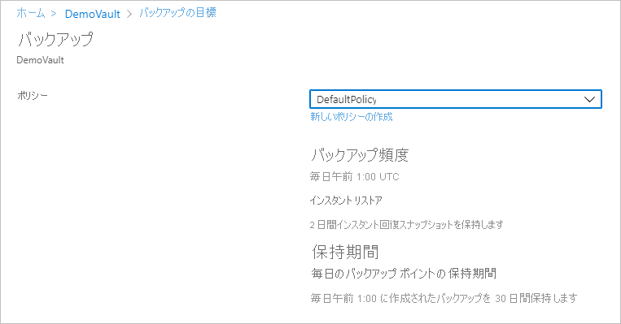
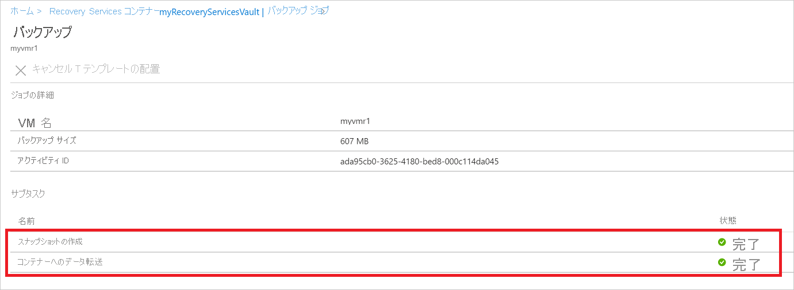

# <a name="back-up-azure-vms-in-a-recovery-services-vault"></a>Recovery Services コンテナーに Azure VM をバックアップする

この記事では、[Azure Backup](backup-overview.md) サービスを使用して Recovery Services コンテナーに Azure VM をバックアップする方法について説明します。

この記事では、次のことについて説明します。

> [!div class="checklist"]
> * Azure VM を準備する。
> * コンテナーを作成する。
> * VM を検出し、バックアップ ポリシーを構成する。
> * Azure VM のバックアップを有効にする。
> * 初回バックアップを実行する。


> [!NOTE]
> この記事では、コンテナーの設定方法およびバックアップする VM の選択方法について説明します。 これは複数の VM をバックアップする場合に便利です。 また、VM の設定から直接 [1 つの Azure VM をバックアップする](backup-azure-vms-first-look-arm.md)こともできます。

## <a name="before-you-start"></a>開始する前に


- Azure VM のバックアップ アーキテクチャを[確認する](backup-architecture.md#architecture-direct-backup-of-azure-vms)。
- Azure VM のバックアップとバックアップ拡張機能の[詳細を確認](backup-azure-vms-introduction.md)する。
- バックアップを構成する前に、[サポート マトリックスを確認](backup-support-matrix-iaas.md)する。

さらに、状況によっては、いくつか行う必要があることがあります。

- **VM に VM エージェントをインストールする**: Azure Backup では、マシンで実行されている Azure VM エージェントに拡張機能をインストールすることで、Azure VM がバックアップされます。 VM が Azure Marketplace のイメージから作成されている場合は、エージェントがインストールされ、実行されます。 カスタム VM を作成する場合、またはオンプレミスのマシンを移行する場合は、[手動でのエージェントのインストール](#install-the-vm-agent)が必要な場合があります。
- **発信アクセスを明示的に許可する**: 一般に、Azure VM が Azure Backup と通信するために、発信ネットワーク アクセスを明示的に許可する必要はありません。 ただし、一部の VM では、接続しようとすると、接続に関する問題が発生する場合があり、**ExtensionSnapshotFailedNoNetwork** エラーが表示されます。 これが発生した場合、Azure Backup の拡張機能でバックアップ トラフィックのために Azure パブリック IP アドレスと通信できるように、[明示的に発信アクセスを許可](#explicitly-allow-outbound-access)する必要があります。


## <a name="create-a-vault"></a>コンテナーの作成

 コンテナーには、経時的に作成されたバックアップと復旧ポイントと、バックアップしたマシンに関連付けられたバックアップ ポリシーが格納されます。 次の手順に従ってコンテナーを作成します。

1. [Azure Portal](https://portal.azure.com/) にサインインします。
2. 検索で、「**Recovery Services**」と入力します。 **[サービス]** の **[Recovery Services コンテナー]** をクリックします。

      <br/>

3. **[Recovery Services コンテナー]** メニューの **[+追加]** をクリックします。

     

4. **[Recovery Services コンテナー]** に、コンテナーを識別するフレンドリ名を入力します。
    - 名前は Azure サブスクリプションに対して一意である必要があります。
    - 2 から 50 文字を含めることができます。
    - 名前の先頭にはアルファベットを使用する必要があります。また、名前に使用できるのはアルファベット、数字、ハイフンのみです。
5. Azure サブスクリプションとリソース グループ、およびコンテナーを作成する必要のある geography 型のリージョンを選択します。 **[Create]** をクリックします。
    - コンテナーが作成されるまで時間がかかることがあります。
    - ポータルの右上の領域で、状態の通知を監視します。


 コンテナーが作成されると、Recovery Services コンテナーの一覧に表示されます。 コンテナーが表示されない場合は、 **[最新の情報に更新]** を選択します。


> [!NOTE]
> Azure Backup サービスでは、スナップショットを格納するために別のリソース グループ (VM のリソース グループ以外) が作成されます。名前の形式は **AzureBackupRG_geography_number** です (例:AzureBackupRG_northeurope_1)。 このリソース グループ内のデータは、Azure Virtual Machine Backup ポリシーの *[Retain instant recovery snapshot]\(インスタント リカバリ スナップショットの保存\)* セクションに指定されている日数の期間保持されます。  このリソース グループにロックを適用すると、バックアップが失敗する可能性があります。<br>
制限ポリシーによってリソース ポイント コレクションの作成がブロックされ、この場合もバックアップが失敗するため、このリソース グループも名前/タグの制限から除外する必要があります。


### <a name="modify-storage-replication"></a>ストレージ レプリケーションを変更する

既定では、コンテナーには [geo 冗長ストレージ (GRS)](https://docs.microsoft.com/azure/storage/common/storage-redundancy-grs) が使用されます。

- コンテナーをプライマリ バックアップ メカニズムとする場合は、GRS を使用することをお勧めします。
- コストを抑えるオプションとして[ローカル冗長ストレージ (LRS)](https://docs.microsoft.com/azure/storage/common/storage-redundancy-lrs?toc=%2fazure%2fstorage%2fblobs%2ftoc.json) を使用できます。

ストレージ レプリケーションの種類を変更にするには、次の手順に従います。

1. 新しいコンテナーで、 **[設定]** セクションの **[プロパティ]** をクリックします。
2. **[プロパティ]** で、 **[バックアップ構成]** の **[更新]** をクリックします。
3. ストレージのレプリケーションの種類を選択し、 **[保存]** をクリックします。

      
> [!NOTE]
   > コンテナーを設定してバックアップ項目を格納した後で、ストレージ レプリケーションの種類を変更することはできません。 これを行う場合は、コンテナーを再作成する必要があります。

## <a name="apply-a-backup-policy"></a>バックアップ ポリシーを適用する

コンテナー用のバックアップ ポリシーを構成します。

1. コンテナーで、 **[概要]** セクションの **[+バックアップ]** をクリックします。

   ![[バックアップ] ボタン](./media/backup-azure-arm-vms-prepare/backup-button.png)


2. **[バックアップの目標]**  >  **[ワークロードはどこで実行されていますか?]** で **[Azure]** を選択します。 **[何をバックアップしますか]** で、 **[仮想マシン]**  >   **[OK]** の順に選択します。 これにより、VM 拡張機能がコンテナーに登録されます。

   ![[バックアップ] ウィンドウと [バックアップの目標] ウィンドウ](./media/backup-azure-arm-vms-prepare/select-backup-goal-1.png)

3. **[バックアップ ポリシー]** で、コンテナーに関連付けるポリシーを選択します。
    - 既定のポリシーでは、1 日に 1 回、VM がバックアップされます。 毎日のバックアップは 30 日間保持されます。 インスタント回復スナップショットは 2 日間保持されます。
    - 既定のポリシーを使用する必要がない場合は、 **[新規作成]** を選択し、次の手順に従ってカスタム ポリシーを作成します。

      

4. **[仮想マシンの選択]** で、ポリシーを使用してバックアップを作成したい VM を選択します。 次に、 **[OK]** をクリックします

   - 選択した VM が検証されます。
   - コンテナーと同じリージョンにある VM のみを選択できます。
   - VM は、1 つのコンテナーでのみバックアップできます。

     ![[仮想マシンの選択] ウィンドウ](./media/backup-azure-arm-vms-prepare/select-vms-to-backup.png)

5. **[バックアップ]** で、 **[バックアップの有効化]** をクリックします。 これにより、ポリシーがコンテナーと VM にデプロイされ、Azure VM で実行されている VM エージェントにバックアップ拡張機能がインストールされます。

     ![[バックアップの有効化] ボタン](./media/backup-azure-arm-vms-prepare/vm-validated-click-enable.png)

バックアップの有効化後:

- バックアップ拡張機能は、VM が実行されているかどうかにかかわらず、Backup サービスによってインストールされます。
- バックアップ スケジュールに従って初回バックアップが実行されます。
- バックアップの実行時には、次の点に注意してください。
    - 実行されている VM では、アプリケーション整合性復旧ポイントが取り込まれる可能性が最も高くなります。
    - ただし、VM がオフになっている場合でも、VM はバックアップされます。 このような VM はオフライン VM と呼ばれます。 この場合、復旧ポイントは、クラッシュ整合性復旧ポイントになります。


### <a name="create-a-custom-policy"></a>カスタム ポリシーの作成

新しいバックアップ ポリシーを作成するように選択した場合は、ポリシー設定を入力します。

1. **[ポリシー名]** で、わかりやすい名前を指定します。
2. **[バックアップ スケジュール]** で、バックアップを作成するタイミングを指定します。 Azure VM について毎日または毎週のバックアップを作成できます。
2. **[インスタント リストア]** で、インスタント リストアに備えてスナップショットをローカルで保持する期間を指定します。
    - 復元の際は、バックアップされた VM ディスクが、ストレージからネットワーク経由で復旧ストレージの場所にコピーされます。 インスタント リストアを使用すれば、バックアップ ジョブ中に作成されローカルに格納されたスナップショットを活用できるので、バックアップ データがコンテナーに転送されるのを待たずに済みます。
    - インスタント リストア用のスナップショットは、1 日から 5 日間、保持することができます。 既定値は 2 日間です。
3. **[保有期間の範囲]** で、毎日または毎週のバックアップのポイントを保持する期間を指定します。
4. **[毎月のバックアップ ポイントの保持期間]** で、毎日または毎週のバックアップの毎月のバックアップを保持するかどうかを指定します。
5. **[OK]** をクリックしてポリシーを保存します。

    

> [!NOTE]
   > Azure Backup では、Azure VM バックアップの夏時間変更に対する時計の自動調整はサポートされていません。 時間の変更が行われたら、必要に応じて手動でバックアップ ポリシーを変更します。

## <a name="trigger-the-initial-backup"></a>初回バックアップをトリガーする

初回バックアップはスケジュールに従って実行されますが、次のようにすぐに実行することもできます。

1. コンテナー メニューで **[バックアップ アイテム]** をクリックします。
2. **[バックアップ アイテム]** で、 **[Azure Virtual Machines]** をクリックします。
3. **[バックアップ アイテム]** の一覧で、省略記号 [...] をクリックします。
4. **[今すぐバックアップ]** をクリックします。
5. **[今すぐバックアップ]** で、カレンダー コントロールを使用して復旧ポイントを保持する最終日を選択します。 次に、 **[OK]** をクリックします
6. ポータルの通知を監視します。 コンテナー ダッシュボードの **[バックアップ ジョブ]**  >  **[進行中]** でジョブの進行状況を監視できます。 VM のサイズによっては、最初のバックアップの作成に時間がかかる場合があります。

## <a name="verify-backup-job-status"></a>バックアップ ジョブの状態を確認する

各 VM バックアップのバックアップ ジョブの詳細は、**スナップショット** フェーズとその後の**コンテナーへのデータ転送**フェーズの 2 つのフェーズで構成されます。<br/>
スナップショット フェーズは、**インスタント リストア**用のディスクと共に格納される復旧ポイントの可用性を保証し、ユーザーによって構成されるスナップショットの保持期間に応じて最大 5 日間使用できます。 コンテナーへのデータ転送では、長期の保持期間のためにコンテナー内に復旧ポイントを作成します。 コンテナーへのデータ転送は、スナップショット フェーズが完了した後でのみ開始されます。

  

バックエンドで実行されている 2 つの**サブタスク**があり、1 つは、下に示すように **[バックアップ ジョブ]** 詳細ブレードから確認できるフロント エンド バックアップ ジョブ用です。

  

**コンテナーへのデータ転送**フェーズは、ディスクのサイズ、ディスクごとのチャーン、その他のいくつかの要因に応じて、完了するまでに数日かかる場合があります。

ジョブの状態は、次のシナリオによって異なることがあります。

**スナップショット** | **コンテナーへのデータ転送** | **ジョブの状態**
--- | --- | ---
完了 | 進行中 | 進行中
完了 | Skipped | 完了
完了 | 完了 | 完了
完了 | 失敗 | 警告で完了
失敗 | 失敗 | 失敗


この機能により、同じ VM に対して 2 つのバックアップを並列に実行できるようになりましたが、どちらのフェーズ (スナップショット、コンテナーへのデータ転送) でも実行できるのは 1 つのサブタスクだけです。 この分離機能により、進行中のバックアップ ジョブが翌日のバックアップになって失敗するシナリオは回避されます。 次の日のバックアップは、前の日のバックアップ ジョブが進行中の状態にある場合、**コンテナーへのデータ転送**がスキップされた状態でスナップショットを完了できます。
コンテナーで作成された増分型の復旧ポイントは、コンテナーで作成された最後の復旧ポイントからのすべてのチャーンをキャプチャします。 ユーザーへのコストの影響はありません。


## <a name="optional-steps-install-agentallow-outbound"></a>オプションの手順 (エージェントをインストールする/送信を許可する)
### <a name="install-the-vm-agent"></a>VM エージェントのインストール

Azure Backup では、マシンで実行されている Azure VM エージェントに拡張機能をインストールすることで、Azure VM がバックアップされます。 VM が Azure Marketplace のイメージから作成されている場合は、エージェントがインストールされ、実行されます。 カスタム VM を作成する場合、またはオンプレミスのマシンを移行する場合は、表に示すように、エージェントを手動でインストールする必要があります。

**VM** | **詳細**
--- | ---
**Windows** | 1.エージェント MSI ファイルを[ダウンロードしてインストール](https://go.microsoft.com/fwlink/?LinkID=394789&clcid=0x409)します。<br/><br/> 2.マシンでの管理者権限でインストールします。<br/><br/> 手順 3.インストールを確認します。 VM 上の *C:\WindowsAzure\Packages* で、**WaAppAgent.exe** >  を右クリックして、 **[プロパティ]** を選択します。 **[詳細]** タブで、 **[製品バージョン]** が 2.6.1198.718 以降であることを確認します。<br/><br/> エージェントを更新する場合は、バックアップ操作が実行されていないことを確認し、[エージェントを再インストール](https://go.microsoft.com/fwlink/?LinkID=394789&clcid=0x409)します。
**Linux** | ディストリビューションのパッケージのリポジトリから、RPM または DEB パッケージを使用してインストールします。 これは、Azure Linux エージェントのインストールおよびアップグレードとしてお勧めする方法です。 すべての[動作保証済みディストリビューション プロバイダー](https://docs.microsoft.com/azure/virtual-machines/linux/endorsed-distros)Azure Linux エージェント パッケージをイメージとリポジトリに統合します。 エージェントは [GitHub](https://github.com/Azure/WALinuxAgent) から入手できますが、そこからインストールすることはお勧めできません。<br/><br/> エージェントを更新する場合は、バックアップ操作が実行されていないことを確認し、バイナリを更新します。

### <a name="explicitly-allow-outbound-access"></a>発信アクセスを明示的に許可する

VM で実行されているバックアップ拡張機能には、Azure パブリック IP アドレスへの発信アクセスが必要です。

- 一般に、Azure VM が Azure Backup と通信するために、発信ネットワーク アクセスを明示的に許可する必要はありません。
- VM の接続で問題が発生した場合、または接続しようとするとエラー **ExtensionSnapshotFailedNoNetwork** が表示された場合は、バックアップ拡張機能がバックアップ トラフィック用の Azure パブリック IP アドレスに通信できるように、明示的にアクセスを許可する必要があります。 アクセス方法を次の表にまとめて示します。


**オプション** | **アクション** | **詳細**
--- | --- | ---
**NSG ルールを設定する** | [Azure データセンターの IP 範囲](https://www.microsoft.com/download/details.aspx?id=41653)を許可します。<br/><br/> すべてのアドレス範囲を許可して管理するのではなく、[サービス タグ](backup-azure-arm-vms-prepare.md#set-up-an-nsg-rule-to-allow-outbound-access-to-azure)を使用して Azure Backup サービスへのアクセスを許可するルールを追加することができます。 | サービス タグについての[詳細](../virtual-network/security-overview.md#service-tags)を参照してください。<br/><br/> サービス タグを使用すれば、アクセス管理を簡略化できます。追加のコストはかかりません。
**プロキシをデプロイする** | トラフィックをルーティングする HTTP プロキシ サーバーをデプロイする。 | Storage だけでなく、Azure 全体へのアクセスを提供することになる。<br/><br/> ストレージ URL に対する詳細な制御が可能。<br/><br/> VM に対するインターネット アクセスを単一の場所で実現。<br/><br/> プロキシの追加のコスト。
**Azure Firewall を設定する** | Azure Backup サービスの FQDN タグを使用して、VM で Azure Firewall を経由したトラフィックを許可します | VNet サブネットで Azure Firewall が設定されている場合は、簡単に使用できる。<br/><br/> 独自の FQDN タグを作成したり、タグで FQDN を変更したりすることはできない。<br/><br/> ご利用の Azure VM にマネージド ディスクが含まれる場合、ファイアウォール上で追加のポート (8443) を開くことが必要な場合があります。

#### <a name="establish-network-connectivity"></a>ネットワーク接続を確立する

NSG を使用するか、プロキシまたはファイアウォールを介して接続を確立する

##### <a name="set-up-an-nsg-rule-to-allow-outbound-access-to-azure"></a>Azure への発信アクセスを許可する NSG ルールを設定する

VM のアクセス権が NSG によって管理される場合は、バックアップ ストレージに対する送信アクセスを、必要な範囲とポートに許可します。

1. VM のプロパティで **[ネットワーク]** 、 **[送信ポートの規則を追加する]** の順に選択します。
2. **[送信セキュリティ規則の追加]** で、 **[詳細]** を選択します。
3. **[ソース]** で **[VirtualNetwork]** を選択します。
4. **[ソース ポート範囲]** で、任意のポートからの発信アクセスを許可するアスタリスク (*) を入力します。
5. **[宛先]** で **[サービス タグ]** を選択します。 一覧から、**Storage.region** を選択します。 リージョンはコンテナーと、バックアップする VM が配置されている場所です。
6. **[宛先ポート範囲]** でポートを選択します。
    - アンマネージド VM と暗号化されていないストレージ アカウント:80
    - アンマネージド VM と暗号化されているストレージ アカウント:443 (既定の設定)
    - マネージド VM:8443
7. **[プロトコル]** で、 **[TCP]** を選択します。
8. **[優先度]** で、上位の拒否ルールより低い優先度値を指定します。

   アクセスを拒否するルールがある場合、新しい許可ルールを上位にする必要があります。 たとえば、優先順位 1000 で **Deny_All** (すべて拒否) ルール セットがある場合、新しいルールは、1000 未満に設定する必要があります。
9. ルールの名前と説明を指定して、 **[OK]** を選択します。

NSG ルールを複数の VM に適用して、発信アクセスを許可することができます。 このビデオでは、その手順について説明します。

>[!VIDEO https://www.youtube.com/embed/1EjLQtbKm1M]


##### <a name="route-backup-traffic-through-a-proxy"></a>プロキシ経由のバックアップ トラフィックのルーティング

プロキシ経由でバックアップ トラフィックをルーティングし、必要な Azure 範囲へのプロキシ アクセスを付与できます。 次を許可するように、プロキシ VM を構成します。

- Azure VM は、パブリック インターネット宛てのすべての HTTP トラフィックをプロキシ VM 経由でルーティングする必要があります。
- 該当する仮想ネットワーク内の VM からの受信トラフィックがプロキシによって許可される必要があります。
- NSG **NSF ロックダウン**には、プロキシ VM からの発信インターネット トラフィックを許可するルールが必要です。

###### <a name="set-up-the-proxy"></a>プロキシを設定する

システム アカウントのプロキシがない場合は、次の手順で設定します。

1. [PsExec](https://technet.microsoft.com/sysinternals/bb897553) をダウンロードします。
2. **PsExec.exe -i -s cmd.exe** を実行して、システム アカウントでコマンド プロンプトを実行します。
3. システム コンテキストでブラウザーを実行します。 例: **%PROGRAMFILES%\Internet Explorer\iexplore.exe** を使用します (Internet Explorer の場合)。  
4. プロキシ設定を定義します。
   - Linux マシンで:
     - **/etc/environment** ファイルに次の行を追加します。
       - **http_proxy=http:\//proxy IP address:proxy port**
     - **/etc/waagent.conf** ファイルに次の行を追加します。
         - **HttpProxy.Host=proxy IP address**
         - **HttpProxy.Port=proxy port**
   - Windows マシンのブラウザー設定で、プロキシを使用する必要があることを指定します。 ユーザー アカウントで現在、プロキシを使用している場合、次のスクリプトを使用してシステム アカウント レベルで設定を適用することができます。
       ```powershell
      $obj = Get-ItemProperty -Path Registry::"HKEY_CURRENT_USER\Software\Microsoft\Windows\CurrentVersion\Internet Settings\Connections"
      Set-ItemProperty -Path Registry::"HKEY_USERS\S-1-5-18\Software\Microsoft\Windows\CurrentVersion\Internet Settings\Connections" -Name DefaultConnectionSettings -Value $obj.DefaultConnectionSettings
      Set-ItemProperty -Path Registry::"HKEY_USERS\S-1-5-18\Software\Microsoft\Windows\CurrentVersion\Internet Settings\Connections" -Name SavedLegacySettings -Value $obj.SavedLegacySettings
      $obj = Get-ItemProperty -Path Registry::"HKEY_CURRENT_USER\Software\Microsoft\Windows\CurrentVersion\Internet Settings"
      Set-ItemProperty -Path Registry::"HKEY_USERS\S-1-5-18\Software\Microsoft\Windows\CurrentVersion\Internet Settings" -Name ProxyEnable -Value $obj.ProxyEnable
      Set-ItemProperty -Path Registry::"HKEY_USERS\S-1-5-18\Software\Microsoft\Windows\CurrentVersion\Internet Settings" -Name Proxyserver -Value $obj.Proxyserver

       ```

###### <a name="allow-incoming-connections-on-the-proxy"></a>プロキシで着信接続を許可する

プロキシ設定で着信接続を許可します。

1. Windows ファイアウォールで、**セキュリティが強化された Windows ファイアウォール**を開きます。
2. **[受信の規則]** を右クリックし、 >  **[新しい規則]** をクリックします。
3. **[規則の種類]** で、 **[カスタム]**  >  **[次へ]** の順に選択します。
4. **[プログラム]** で、 **[すべてのプログラム]**  >  **[次へ]** を選択します。
5. **[プロトコルおよびポート]** で、次を実行します。
   - 種類を **[TCP]** に設定する。
   - **[ローカル ポート]** を **[特定のポート]** に設定する。
   - **[リモート ポート]** を **[すべてのポート]** に設定する。

6. ウィザードを終了し、ルールの名前を指定します。

###### <a name="add-an-exception-rule-to-the-nsg-for-the-proxy"></a>プロキシの NSG に例外規則を追加する

NSG **NSF ロックダウン**で、10.0.0.5 の任意のポートから、ポート 80 (HTTP) または 443 (HTTPS) 上の任意のインターネット アドレスへのトラフィックを許可します。

次の PowerShell スクリプトでは、トラフィックを許可する例を示します。
すべてのパブリック インターネット アドレスへの送信を許可する代わりに、IP アドレス範囲を指定する (`-DestinationPortRange`) ことも、storage.region サービス タグを使用することもできます。   

```powershell
Get-AzureNetworkSecurityGroup -Name "NSG-lockdown" |
Set-AzureNetworkSecurityRule -Name "allow-proxy " -Action Allow -Protocol TCP -Type Outbound -Priority 200 -SourceAddressPrefix "10.0.0.5/32" -SourcePortRange "*" -DestinationAddressPrefix Internet -DestinationPortRange "80-443"
```

##### <a name="allow-firewall-access-with-an-fqdn-tag"></a>FQDN タグを使用してファイアウォール アクセスを許可する

Azure Backup へのネットワーク トラフィックの送信アクセスを許可するように Azure Firewall を設定することができます。

- Azure Firewall のデプロイに関する[詳細情報を参照してください](https://docs.microsoft.com/azure/firewall/tutorial-firewall-deploy-portal)。
- FQDN タグについて[お読みください](https://docs.microsoft.com/azure/firewall/fqdn-tags)。


## <a name="next-steps"></a>次の手順

- [Azure VM エージェント](backup-azure-troubleshoot-vm-backup-fails-snapshot-timeout.md)または [Azure VM バックアップ](backup-azure-vms-troubleshoot.md)で発生する問題のトラブルシューティング。
- Azure VM の[復元](backup-azure-arm-restore-vms.md)。
