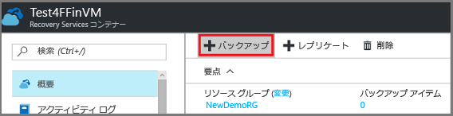
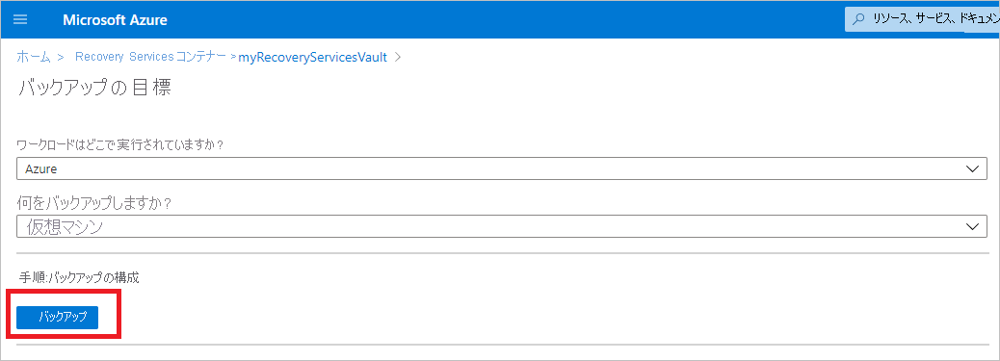
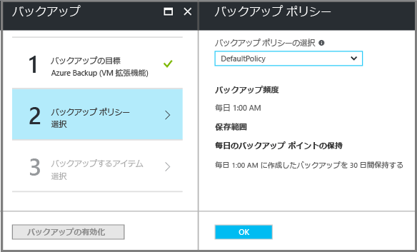

# <a name="prepare-your-environment-to-back-up-resource-manager-deployed-virtual-machines"></a>Resource Manager でデプロイされた仮想マシンをバックアップする環境の準備
> [!div class="op_single_selector"]
> * [Resource Manager モデル](backup-azure-arm-vms-prepare.md)
> * [クラシック モデル](backup-azure-vms-prepare.md)
>
>

この記事では、Resource Manager でデプロイされた仮想マシン (VM) をバックアップできるように環境を準備する手順について説明します。 手順の各ステップでは、Azure ポータルを使用します。  

Azure Backup サービスでは、VM を保護するために 2 種類のコンテナー (バックアップ コンテナーと Recovery Services コンテナー) を用意しています。 バックアップ コンテナーでは、クラシック デプロイメント モデルを使用してデプロイされた VM を保護します。 Recovery Services コンテナーでは、**クラシック デプロイメント モデルでデプロイされた VM と Resource Manager でデプロイされた VM の両方**を保護します。 Resource Manager でデプロイされた VM を保護するには、Recovery Services コンテナーを使用する必要があります。

> [!NOTE]
> Azure には、リソースの作成と操作に関して 2 種類のデプロイメント モデルがあります。[Resource Manager デプロイメント モデルとクラシック デプロイメント モデル](../azure-resource-manager/resource-manager-deployment-model.md)です。 クラシック デプロイメント モデル VM の操作方法の詳細については、「[Azure 仮想マシンをバックアップする環境の準備](backup-azure-vms-prepare.md)」をご覧ください。
>
>

Resource Manager でデプロイされた仮想マシン (VM) の保護またはバックアップを行うには、事前に次の前提条件を満たしておく必要があります。

* *VM と同じ場所に*Recovery Services コンテナーを作成します (または、既存の Recovery Services コンテナーを識別します)。
* シナリオを選択し、バックアップ ポリシーを定義し、保護する項目を定義します。
* 仮想マシンに VM エージェントがインストールされていることを確認します。
* ネットワーク接続を確認します。
* Linux VM の場合、アプリケーション整合性バックアップのバックアップ環境をカスタマイズする場合は、[プリスナップショット スクリプトおよびポストスナップショット スクリプトを構成するための手順](https://docs.microsoft.com/azure/backup/backup-azure-linux-app-consistent)を実行してください。

これらの条件が既に環境内で満たされている場合は、 [VM のバックアップに関する記事](backup-azure-vms.md)に進んでください。 これらの前提条件のいずれかをセットアップまたは確認する必要がある場合は、この記事に前提条件を満たすための手順が説明されているので参照してください。

##<a name="supported-operating-system-for-backup"></a>バックアップでサポートされるオペレーティング システム
 * **Linux**: Azure Backup は、 [Azure で承認されている一連のディストリビューション](../virtual-machines/virtual-machines-linux-endorsed-distros.md?toc=%2fazure%2fvirtual-machines%2flinux%2ftoc.json) をサポートしています (Core OS Linux を除く)。 _他の個人所有の Linux ディストリビューションも、仮想マシン上で VM エージェントが動作し、かつ Python がサポートされていれば使用できます。ただし、それらのディストリビューションのバックアップは保証されません。_
 * **Windows Server**: Windows Server 2008 R2 より前のバージョンはサポートされていません。

## <a name="limitations-when-backing-up-and-restoring-a-vm"></a>VM のバックアップと復元に関する制限
環境を準備する前に、制限事項を把握してください。

* 16 台以上のデータ ディスクを搭載した仮想マシンのバックアップはサポートされません。
* 予約済み IP アドレスはあるがエンドポイントが定義されていない仮想マシンのバックアップはサポートされません。
* BEK だけを使って暗号化された VM のバックアップはサポートされません。 LUKS 暗号化を使って暗号化された Linux VM のバックアップはサポートされません。
* Docker 拡張機能を持つ Linux 仮想マシンのバックアップはサポートされません。
* バックアップ データには、ネットワーク経由でマウントされて VM に接続されているドライブは含まれません。
* 復元中に既存の仮想マシンを置き換えることはサポートされません。 VM が存在している場合に VM の復元を試みると、復元操作は失敗します。
* リージョン間のバックアップと復元はサポートされません。
* Azure のすべてのパブリック リージョンに仮想マシンをバックアップすることができます (サポートされているリージョンの [チェックリスト](https://azure.microsoft.com/regions/#services) を参照してください)。 目的のリージョンが現在サポートされていない場合は、資格情報コンテナーの作成時にドロップダウン リストに表示されません。
* マルチ DC 構成の一部であるドメイン コントローラー (DC) VM の復元は、PowerShell を通じてのみサポートされます。 [マルチ DC ドメイン コントローラーの復元](backup-azure-restore-vms.md#restoring-domain-controller-vms)の詳細をご覧ください。
* 次のような特殊なネットワーク構成を持つ仮想マシンの復元は、PowerShell でのみサポートされています。 復元操作の完了後、UI の復元ワークフローを使用して作成された VM には、これらのネットワーク構成は含まれません。 詳細については、「 [特別なネットワーク構成を持つ VM の復元](backup-azure-restore-vms.md#restoring-vms-with-special-network-configurations)」を参照してください。
  * ロード バランサー構成 (内部および外部の) での仮想マシン
  * 複数の予約済み IP アドレスを持つ仮想マシン
  * 複数のネットワーク アダプターを持つ仮想マシン

## <a name="create-a-recovery-services-vault-for-a-vm"></a>VM 用の Recovery Services コンテナーを作成する
Recovery Services コンテナーは、経時的に作成されたバックアップと復旧ポイントを格納するエンティティです。 Recovery Services コンテナーには、保護される仮想マシンに関連付けられたバックアップ ポリシーも含まれます。

Recovery Services コンテナーを作成するには、次の手順に従います。

1. [Azure ポータル](https://portal.azure.com/)にサインインします。
2. ハブ メニューで **[参照]** をクリックし、リソースの一覧で「**Recovery Services**」と入力します。 入力を始めると、入力内容に基づいて、一覧がフィルター処理されます。 **[Recovery Services コンテナー]**をクリックします。

    ![[参照] ボタンをクリックし、「Recovery Services」と入力します。 [Recovery Services コンテナー] というオプションが表示されたら、これをクリックして [Recovery Services コンテナー] ブレードを開きます。](./media/backup-azure-arm-vms-prepare/browse-to-rs-vaults-updated.png) <br/>

    Recovery Services コンテナーの一覧が表示されます。
3. **[Recovery Services コンテナー]** メニューの **[追加]** をクリックします。

    

    [Recovery Services コンテナー] ブレードが開き、**[名前]**、**[サブスクリプション]**、**[リソース グループ]**、**[場所]** を指定するよう求められます。

    
4. **[名前]**ボックスに、コンテナーを識別する表示名を入力します。 名前は Azure サブスクリプションに対して一意である必要があります。 2 ～ 50 文字の名前を入力します。 名前の先頭にはアルファベットを使用する必要があります。また、名前に使用できるのはアルファベット、数字、ハイフンのみです。
5. **[サブスクリプション]** をクリックして、使用可能なサブスクリプションの一覧を表示します。 どのサブスクリプションを使用すればよいかがわからない場合は、既定 (または推奨) のサブスクリプションを使用してください。 組織のアカウントが複数の Azure サブスクリプションに関連付けられている場合に限り、複数の選択肢が存在します。
6. **[リソース グループ]** をクリックして、使用可能なリソース グループを表示するか、**[新規]** をクリックして、新しいリソース グループを作成します。 リソース グループの詳細については、「[Azure Resource Manager の概要](../azure-resource-manager/resource-group-overview.md)」をご覧ください。
7. **[場所]** をクリックして、コンテナーの地理的リージョンを選択します。 コンテナーは、保護する仮想マシンと同じリージョンにある **必要があります** 。

   > [!IMPORTANT]
   > VM がどの場所に存在するかが不明な場合は、コンテナーを作成するダイアログを閉じて、ポータルで仮想マシンの一覧に移動します。 複数のリージョンに仮想マシンがある場合は、各リージョンで Recovery Services コンテナーを作成する必要があります。 最初の場所でコンテナーを作成してから、次の場所に移動してください。 バックアップ データを格納するストレージ アカウントを指定する必要はありません。これは、Recovery Services コンテナーと Azure Backup サービスにより自動的に処理されます。
   >
   >

8. **[作成]**をクリックします。 Recovery Services コンテナーの作成に時間がかかることがあります。 ポータルの右上隅で、状態の通知を監視します。 コンテナーが作成されると、Recovery Services コンテナーの一覧に表示されます。 コンテナーが表示されない場合は、**[最新の情報に更新]** をクリックします。

    

    これで、コンテナーが作成されました。次は、ストレージ レプリケーションを設定する方法について説明します。

## <a name="set-storage-replication"></a>ストレージ レプリケーションの設定
ストレージ レプリケーション オプションでは、geo 冗長ストレージとローカル冗長ストレージのどちらかを選択できます。 既定では、コンテナーには geo 冗長ストレージがあります。 プライマリ バックアップの場合は、オプションが geo 冗長ストレージに設定されているままにします。 冗長性を犠牲にしても低コストなバックアップが必要な場合は、ローカル冗長ストレージを選択します。

ストレージ レプリケーション設定を編集するには、次の手順を実行します。

1. **[Recovery Services コンテナー]** ブレードでコンテナーを選択します。
    コンテナーをクリックすると、設定ブレード (*上部にコンテナー名が表示*) とコンテナーの詳細ブレードが開きます。

    

2. **[設定]**ブレードで縦向きのスライダーを使用して、**[管理]** セクションまでスクロールします。 **[バックアップ インフラストラクチャ]** をクリックしてブレードを開きます。 **[全般]** セクションで **[構成のバックアップ]** をクリックしてブレードを開きます。 **[バックアップ構成]** ブレードで、コンテナーのストレージ レプリケーション オプションを選択します。 既定では、コンテナーには geo 冗長ストレージがあります。 ストレージのレプリケーション タイプを変更するには、**[保存]** をクリックします。

    

     プライマリ バックアップ ストレージ エンドポイントとして Azure を使用している場合は、引き続き geo 冗長ストレージを使用します。 プライマリ以外のバックアップ ストレージ エンドポイントとして Azure を使用している場合は、ローカル冗長ストレージを選択します。 [geo 冗長](../storage/storage-redundancy.md#geo-redundant-storage)ストレージ オプションと[ローカル冗長](../storage/storage-redundancy.md#locally-redundant-storage)ストレージ オプションの詳細については、[Azure Storage のレプリケーションの概要](../storage/storage-redundancy.md)に関する記事をご覧ください。
    コンテナーのストレージ オプションを選択したら、VM をコンテナーに関連付けることができます。 関連付けを開始するには、Azure 仮想マシンを検出して登録する必要があります。

## <a name="select-a-backup-goal-set-policy-and-define-items-to-protect"></a>バックアップの目標を選択し、ポリシーを設定し、保護する項目の定義する
VM をコンテナーに登録する前に、サブスクリプションに追加された新しい仮想マシンが特定されるように検出プロセスを実行してください。 このプロセスでは、サブスクリプションに含まれる仮想マシンの一覧を、クラウド サービス名、リージョンなどの追加情報と共に Azure に照会します。 Azure ポータルのシナリオは、Recovery Services コンテナーに何を格納するのかを指しています。 ポリシーは、復旧ポイントを作成する頻度と時期のスケジュールです。 ポリシーには、復旧ポイントの保持期間も含まれます。

1. 既に Recovery Services コンテナーが開かれている場合は、手順 2. に進みます。 Recovery Services コンテナーが開かれていない場合は、[Azure Portal](https://portal.azure.com/) を開き、ハブ メニューの **[その他のサービス]**をクリックします。

   * リソース ボックスに「 **Recovery Services**」と入力します。
   * 入力を始めると、入力内容に基づいて、一覧がフィルター処理されます。 **[Recovery Services コンテナー]**が表示されたら、それをクリックします。

      <br/>

     Recovery Services コンテナーの一覧が表示されます。 サブスクリプション内にコンテナーがない場合、この一覧は空になります。

    

   * Recovery Services コンテナーの一覧で、コンテナーを選択して、そのダッシュボードを開きます。

     [設定] ブレードと、選択したコンテナーのコンテナー ダッシュボードが開きます。

     
2. コンテナーのダッシュボード メニューの **[バックアップ]** をクリックして、[バックアップ] ブレードを開きます。

    

    [バックアップ] ブレードと [バックアップの目標] ブレードが開きます。

    

3. [バックアップの目標] ブレードで、**[Where is your workload running (ワークロードの実行場所)]** を [Azure] に、**[What do you want to backup (バックアップ対象)]** を [仮想マシン] に設定し、**[OK]** をクリックします。

    これにより、VM 拡張機能がコンテナーに登録されます。 [バックアップの目標] ブレードが閉じ、**[バックアップ ポリシー]** ブレードが開きます。

    
4. [バックアップ ポリシー] ブレードで、コンテナーに適用するバックアップ ポリシーを選択します。

    

    既定のポリシーの詳細がドロップダウン メニューの下に一覧表示されます。 新しいポリシーを作成する場合は、ドロップダウン メニューの **[新規作成]** を選択します。 バックアップ ポリシーを定義する手順については、「 [バックアップ ポリシーの定義](backup-azure-vms-first-look-arm.md#defining-a-backup-policy)」を参照してください。
    **[OK]** をクリックして、バックアップ ポリシーをコンテナーに関連付けます。

    [バックアップ ポリシー] ブレードが閉じ、**[仮想マシンの選択]** ブレードが開きます。
5. **[仮想マシンの選択]** ブレードで、指定したポリシーに関連付ける仮想マシンを選択し、 **[OK]** をクリックします。

    

    選択した仮想マシンが検証されます。 予期していた仮想マシンが表示されない場合は、Recovery Services コンテナーと同じ Azure の場所にその仮想マシンが存在すること、および別のコンテナーで既に保護されていないことを確認します。 Recovery Services コンテナーの場所は、コンテナーのダッシュボードに表示されます。

6. コンテナーの設定をすべて定義したところで、[バックアップ] ブレードで、**[バックアップの有効化]** をクリックします。 これにより、ポリシーがコンテナーと VM にデプロイされます。 このとき、仮想マシンの最初の回復ポイントは作成されません。

    ![[バックアップの有効化]](./media/backup-azure-arm-vms-prepare/vm-validated-click-enable.png)

バックアップが有効になると、バックアップ ポリシーがスケジュールに従って実行されます。 仮想マシンをすぐにバックアップするオンデマンド バックアップ ジョブを生成するには、「[バックアップ ジョブのトリガー](./backup-azure-arm-vms.md#triggering-the-backup-job)」をご覧ください。

仮想マシンの登録に問題がある場合は、VM エージェントのインストールやネットワーク接続に関するこの後の情報を参照してください。 Azure によって作成された仮想マシンを保護している場合、次の情報はおそらく必要ないでしょう。 ただし、仮想マシンを Azure に移行した場合は、VM エージェントを正しくインストールしていることと、仮想マシンが仮想ネットワークで通信できることを確認してください。

## <a name="install-the-vm-agent-on-the-virtual-machine"></a>仮想マシンに VM エージェントをインストールする
バックアップ拡張機能を動作させるには、Azure VM エージェントを Azure 仮想マシンにインストールする必要があります。 VM を Azure ギャラリーから作成した場合、VM エージェントは既に仮想マシンに存在します。 この情報は、使用している VM が Azure ギャラリーから作成したものでは " *なく* "、たとえば、オンプレミスのデータ センターから移行したものである場合に適用されます。 このような場合、仮想マシンを保護するためには VM エージェントをインストールする必要があります。 詳しくは、「[Windows および Linux 用 Azure VM エージェント](../virtual-machines/windows/classic/agents-and-extensions.md#azure-vm-agents-for-windows-and-linux)」をご覧ください。

Azure VM のバックアップで問題が発生する場合は、Azure VM エージェントが仮想マシンに正しくインストールされていることを確認してください (次の表を参照)。 次の表に、Windows VM と Linux VM の VM エージェントに関する追加情報をまとめています。

| **操作** | **Windows** | **Linux** |
| --- | --- | --- |
| VM エージェントのインストール |[エージェント MSI](http://go.microsoft.com/fwlink/?LinkID=394789&clcid=0x409)をダウンロードしてインストールします。 インストールを実行するには、管理者特権が必要です。 |<li> 最新の [Linux エージェント](../virtual-machines/virtual-machines-linux-agent-user-guide.md)をインストールします。 インストールを実行するには、管理者特権が必要です。 ディストリビューション リポジトリからエージェントをインストールすることをお勧めします。 github から直接 Linux VM エージェントをインストールすることは**お勧めしません**。  |
| VM エージェントの更新 |VM エージェントを更新するには、単純に [VM エージェント バイナリ](http://go.microsoft.com/fwlink/?LinkID=394789&clcid=0x409)を再インストールします。 <br>VM エージェントの更新中にバックアップ操作が実行されないようにする必要があります。 |[Linux VM エージェントの更新 ](../virtual-machines/virtual-machines-linux-update-agent.md?toc=%2fazure%2fvirtual-machines%2flinux%2ftoc.json)に関する手順に従います。 ディストリビューション リポジトリからエージェントを更新することをお勧めします。 github から直接 Linux VM エージェントを更新することは**お勧めしません**。<br>VM エージェントの更新中にバックアップ操作が実行されないようにする必要があります。 |
| VM エージェントのインストールの検証 |<li>Azure VM で *C:\WindowsAzure\Packages* フォルダーに移動します。 <li>WaAppAgent.exe ファイルを探します。<li> このファイルを右クリックして **[プロパティ]** をクリックし、**[詳細]** タブを選択します。 [製品バージョン] が 2.6.1198.718 以上であることを確認します。 |該当なし |

### <a name="backup-extension"></a>バックアップ拡張機能
VM エージェントが仮想マシンにインストールされると、Azure Backup サービスによって VM エージェントにバックアップ拡張機能がインストールされます。 Azure Backup サービスは、バックアップ拡張機能のアップグレードと修正プログラムの適用をシームレスに実行します。

バックアップ拡張機能は、VM が実行されているかどうかにかかわらず、Backup サービスによってインストールされます。 VM が実行されている場合は、アプリケーション整合性復旧ポイントを取得できる可能性が最も高くなります。 ただし、Azure Backup サービスは、VM がオフになっている場合でも VM のバックアップを続行しますが、拡張機能はインストールされない可能性があります。 これはオフライン VM と呼ばれます。 この場合、復旧ポイントは、" *クラッシュ整合性*" 復旧ポイントになります。

## <a name="network-connectivity"></a>ネットワーク接続
拡張機能が VM スナップショットを管理するためには、Azure のパブリック IP アドレスへの接続が必要です。 適切なインターネット接続を利用できない場合、VM からの HTTP 要求はタイムアウトになり、バックアップ操作は失敗します。 (たとえば、ネットワーク セキュリティ グループ (NSG) を使用して) デプロイにアクセス制限が適用されている場合は、次のいずれかのオプションを選択して、バックアップ トラフィックの明確なパスを指定する必要があります。

* [Azure データ センターの IP の範囲をホワイトリストに登録する](http://www.microsoft.com/en-us/download/details.aspx?id=41653) - IP アドレスをホワイトリストに登録する手順に関する記事を参照してください。
* トラフィックをルーティングする HTTP プロキシ サーバーをデプロイする。

どのオプションを使用するか決める場合は、次に示す管理の容易さ、細かな制御、およびコストの間のトレードオフを考慮します。

| オプション | 長所 | 短所 |
| --- | --- | --- |
| IP 範囲をホワイトリストに登録する |追加のコストが発生しない。<br><br>NSG でアクセスを開くには、<i>Set-AzureNetworkSecurityRule</i> コマンドレットを使用する。 |影響を受ける IP の範囲が時間の経過と共に変化するため、管理が複雑である。<br><br>Storage だけでなく、Azure 全体へのアクセスを提供することになる。 |
| HTTP プロキシ |許可するストレージ URL をプロキシで詳細に制御可能。<br>VM に対するインターネット アクセスを単一の場所で実現。<br>Azure の IP アドレスの変更の影響を受けない。 |プロキシ ソフトウェアで VM を実行するための追加のコストが発生する。 |

### <a name="whitelist-the-azure-datacenter-ip-ranges"></a>Azure データ センターの IP の範囲をホワイトリストに登録する
Azure データ センターの IP 範囲をホワイトリストに登録する場合、IP 範囲の詳細と手順については、[Azure の Web サイト](http://www.microsoft.com/en-us/download/details.aspx?id=41653)を参照してください。

### <a name="using-an-http-proxy-for-vm-backups"></a>VM のバックアップに HTTP プロキシを使用する
VM をバックアップする際、バックアップ拡張機能は HTTPS API を使用してスナップショット管理コマンドを Azure Storage に送信します。 パブリック インターネットにアクセスできるように構成されたコンポーネントは HTTP プロキシのみであるため、HTTP プロキシ経由でバックアップ拡張機能のトラフィックをルーティングします。

> [!NOTE]
> 使用するプロキシ ソフトウェアについて推奨事項はありません。 以降の構成手順と互換性があるプロキシを選択してください。
>
>

次の図は、HTTP プロキシを使用するために必要な 3 つの構成手順を示しています。

* アプリケーション VM は、パブリック インターネット宛てのすべての HTTP トラフィックをプロキシ VM 経由でルーティングします。
* プロキシ VM では、仮想ネットワーク内の VM からの着信トラフィックを許可します。
* NSF ロックダウンと呼ばれるネットワーク セキュリティ グループ (NSG) には、プロキシ VM からの発信インターネット トラフィックを許可するセキュリティ規則が必要です。


HTTP プロキシを使用してパブリック インターネットとの通信を行うには、次の手順を実行します。

#### <a name="step-1-configure-outgoing-network-connections"></a>手順 1. 発信方向のネットワーク接続を構成する
###### <a name="for-windows-machines"></a>Windows マシンの場合
次の手順により、ローカル システム アカウントのプロキシ サーバー構成が設定されます。

1. [PsExec](https://technet.microsoft.com/sysinternals/bb897553)
2. 管理者特権のプロンプトで、次のコマンドを実行します。

     ```
     psexec -i -s "c:\Program Files\Internet Explorer\iexplore.exe"
     ```
     Internet Explorer のウィンドウが開きます。
3. [ツール]、[インターネット オプション]、[接続]、[LAN の設定] の順に進みます。
4. システム アカウントのプロキシ設定を確認します。 プロキシの IP アドレスとポートを設定します。
5. Internet Explorer を閉じます。

これにより、コンピューター全体のプロキシ構成が設定され、すべての発信 HTTP/ HTTPS トラフィックに使用されます。

現在のユーザー アカウント (ローカル システム アカウントではなく) にプロキシ サーバーを設定した場合は、次のスクリプトを使用して、SYSTEMACCOUNT にそれらを適用します。

```
   $obj = Get-ItemProperty -Path Registry::”HKEY_CURRENT_USER\Software\Microsoft\Windows\CurrentVersion\Internet Settings\Connections"
   Set-ItemProperty -Path Registry::”HKEY_USERS\S-1-5-18\Software\Microsoft\Windows\CurrentVersion\Internet Settings\Connections" -Name DefaultConnectionSettings -Value $obj.DefaultConnectionSettings
   Set-ItemProperty -Path Registry::”HKEY_USERS\S-1-5-18\Software\Microsoft\Windows\CurrentVersion\Internet Settings\Connections" -Name SavedLegacySettings -Value $obj.SavedLegacySettings
   $obj = Get-ItemProperty -Path Registry::”HKEY_CURRENT_USER\Software\Microsoft\Windows\CurrentVersion\Internet Settings"
   Set-ItemProperty -Path Registry::”HKEY_USERS\S-1-5-18\Software\Microsoft\Windows\CurrentVersion\Internet Settings" -Name ProxyEnable -Value $obj.ProxyEnable
   Set-ItemProperty -Path Registry::”HKEY_USERS\S-1-5-18\Software\Microsoft\Windows\CurrentVersion\Internet Settings" -Name Proxyserver -Value $obj.Proxyserver
```

> [!NOTE]
> プロキシ サーバーのログに "(407) プロキシ認証が必要です" というメッセージが記録されている場合は、認証が正しく設定されているか確認します。
>
>

###### <a name="for-linux-machines"></a>Linux マシンの場合
次の行を ```/etc/environment``` ファイルに追加します。

```
http_proxy=http://<proxy IP>:<proxy port>
```

次の行を ```/etc/waagent.conf``` ファイルに追加します。

```
HttpProxy.Host=<proxy IP>
HttpProxy.Port=<proxy port>
```

#### <a name="step-2-allow-incoming-connections-on-the-proxy-server"></a>手順 2. プロキシ サーバーで着信接続を許可する
1. プロキシ サーバーで Windows ファイアウォールを開きます。 ファイアウォールにアクセスする最も簡単な方法は、"セキュリティが強化された Windows ファイアウォール" を検索することです。

    
2. [Windows ファイアウォール] ダイアログ ボックスで、**[受信の規則]** を右クリックし、**[新しい規則...]** をクリックします。

    
3. **新規の受信の規則ウィザード**の **[規則の種類]** で **[カスタム]** を選択し、**[次へ]** をクリックします。
4. **プログラム**の選択ページで、**[すべてのプログラム]** を選択し、**[次へ]** をクリックします。
5. **[プロトコルおよびポート]** ページで、次の情報を入力して、**[次へ]** をクリックします。

    

   * *[プロトコルの種類]* では、*[TCP]* を選択します。
   * *[ローカル ポート]* では、*[特定のポート]* を選択し、下にあるフィールドで、構成済みの ```<Proxy Port>``` を指定します。
   * *[リモート ポート]* では、*[すべてのポート]* を選択します。

     ウィザードの残りの部分では、[次へ] をクリックして最後まで進んだら、この規則に名前を付けます。

#### <a name="step-3-add-an-exception-rule-to-the-nsg"></a>手順 3. NSG に例外の規則を追加する
Azure PowerShell コマンド プロンプトで、次のコマンドを入力します。

次のコマンドは、例外を NSG に追加します。 この例外により、10.0.0.5 の任意のポートから、ポート 80 (HTTP) または 443 (HTTPS) 上の任意のインターネット アドレスに TCP トラフィックを送信できます。 パブリック インターネットで特定のポートが必要な場合は、必ずそのポートも ```-DestinationPortRange``` に追加します。

```
Get-AzureNetworkSecurityGroup -Name "NSG-lockdown" |
Set-AzureNetworkSecurityRule -Name "allow-proxy " -Action Allow -Protocol TCP -Type Outbound -Priority 200 -SourceAddressPrefix "10.0.0.5/32" -SourcePortRange "*" -DestinationAddressPrefix Internet -DestinationPortRange "80-443"
```


*これらの手順では、この例の特定の名前と値を使用しています。実際のコードに対して詳細の入力、切り取り、貼り付けを行う場合は、実際のデプロイの名前と値を使用してください。*

これでネットワークに接続できることがわかったので、VM をいつでもバックアップすることができます。 [Resource Manager でデプロイされた VM のバックアップ](backup-azure-arm-vms.md)に関するページをご覧ください。

## <a name="questions"></a>疑問がある場合
ご不明な点がある場合や今後搭載を希望する機能がある場合は、 [フィードバックをお送りください](http://aka.ms/azurebackup_feedback)。

## <a name="next-steps"></a>次のステップ
これで VM をバックアップするために環境の準備が整いました。次のステップとして、バックアップの作成を行ってください。 計画に関する記事で、VM のバックアップについて詳細を説明します。

* [仮想マシンのバックアップ](backup-azure-vms.md)
* [VM のバックアップ インフラストラクチャの計画](backup-azure-vms-introduction.md)
* [仮想マシンのバックアップを管理する](backup-azure-manage-vms.md)

