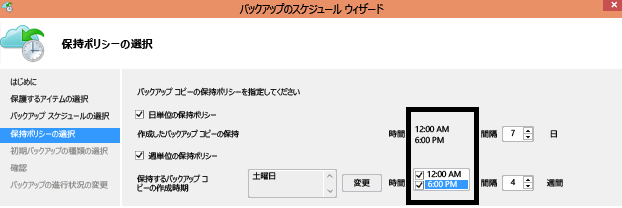

# Azure Backup サービスについての質問
この記事では、Azure Backup のコンポーネントについてよくある質問の回答を示します。 一部の回答は、より詳しい情報を扱った記事にリンクされています。 Azure Backup について質問するには、**[コメント]** (右側) をクリックします。 コメントは、この記事の下部に表示されます。 コメントするには、Livefyre アカウントが必要です。 また、 [ディスカッション フォーラム](https://social.msdn.microsoft.com/forums/azure/home?forum=windowsazureonlinebackup)でも、Azure Backup サービスに関する質問を投稿できます。

この記事の各セクションの内容をひととおり確認するには、右側の「**この記事の内容**」にあるリンクをご利用ください。

## Recovery Services コンテナー

### 各 Azure サブスクリプションで作成できるコンテナーの数に制限はありますか。  
はい。 各サブスクリプションでサポートされている Azure Backup のリージョンあたり最大 500 個の Recovery Services コンテナーを作成できます。 コンテナーがさらに必要な場合は、追加のサブスクリプションを作成してください。

### 各コンテナーに登録できるサーバーやマシンの数に制限はありますか。  
コンテナーあたり最大 1000 の Azure 仮想マシンを登録できます。 MAB エージェントを使用している場合は、コンテナーあたり、最大 50 の MAB エージェントを登録できます。 1 つのコンテナーには、50 の MAB サーバー/DPM サーバーを登録できます。

### REST API を使用して、コンテナー内の保護されている項目のサイズを照会できますか。  
はい。[使用法 - コンテナー別一覧](https://t.co/2lgIrIaF0J)の記事に、Recovery Services コンテナーから取得できる情報が示されています。

### 組織で所有しているコンテナーが 1 つの場合、データを復元する際に特定のサーバーのデータを別のサーバーから分離するには、どうすればよいですか。 
同じコンテナーに登録されたサーバーはどれもが、 *同じパスフレーズを使用する*他のサーバーによってバックアップされたデータを復元できます。 サーバーのバックアップ データを組織内の他のサーバーから分離する必要がある場合は、これらのサーバーごとに指定したパスフレーズを使用します。 たとえば、人事部門のサーバーで特定の暗号化パスフレーズを使用し、経理部門のサーバーで 2 番目、ストレージ サーバーで 3 番目の暗号化パスフレーズを使用することができます。

### サブスクリプション間でコンテナーを "移行" することはできますか?  
いいえ。 コンテナーはサブスクリプション レベルで作成されるため、別のサブスクリプションに再割り当てすることはできません。

### バックアップ データを別のコンテナーに移行できますか?  
いいえ。 コンテナーに保存されているバックアップ データを別のコンテナーに移行することはできません。

### Recovery Services コンテナーは Resource Manager に基づいています。 Backup コンテナーは引き続きサポートされますか。  
Backup コンテナーは Recovery Services コンテナーに変換されています。 ご自身で Backup コンテナーを Recovery Services コンテナーに変換していない場合は、自動的に Backup コンテナーが Recovery Services コンテナーに変換されます。 

### Backup コンテナーを Recovery Services コンテナーに移行することはできますか。  
すべての Backup コンテナーは Recovery Services コンテナーに変換されています。 ご自身で Backup コンテナーを Recovery Services コンテナーに変換していない場合は、自動的に Backup コンテナーが Recovery Services コンテナーに変換されます。

## Azure Backup エージェント
[Azure ファイル フォルダー バックアップに関する FAQ](backup-azure-file-folder-backup-faq.md) に一連の質問が掲載されています。

## Azure VM バックアップ
[Azure VM バックアップに関する FAQ](backup-azure-vm-backup-faq.md) に一連の質問が掲載されています。

## VMware サーバーのバックアップ

### VMware vCenter サーバーを Azure にバックアップできますか。

はい。 Azure Backup Server を使用して、Azure に VMware vCenter および ESXi をバックアップすることができます。 サポートされている VMware バージョンについては、「[Azure Backup Server の保護マトリックス](backup-mabs-protection-matrix.md)」を参照してください。 詳細な手順については、「[Azure Backup Server を使用した VMware サーバーのバックアップ](backup-azure-backup-server-vmware.md)」を参照してください。

### DPM または Azure Backup Server から完全なオンプレミスの VMware/Hyper-V クラスターを復旧するには、個別のライセンスが必要ですか。 
VMware/Hyper-V を保護するために個別のライセンスは必要ありません。 System Center のお客様の場合、VMware VM を保護するには、DPM を使用します。 System Center のお客様でない場合、VMware VM を保護するには、Azure Backup Server (従量課金制) を使用できます。

## Azure Backup Server と System Center Data Protection Manager
### Azure Backup Server を使用して、物理サーバーのベア メタル回復 (BMR) バックアップを作成できますか。  
はい。

### 自分の DPM サーバーを複数のコンテナーに登録できますか。  
いいえ。 DPM または MABS サーバーは 1 つのコンテナーにしか登録できません。

### System Center Data Protection Manager は、どのバージョンがサポートされていますか。

[最新版](http://aka.ms/azurebackup_agent)の Azure Backup エージェントを System Center Data Protection Manager (DPM) の最新の更新プログラムのロールアップ (UR) にインストールすることをお勧めします。 
- System Center DPM 2012 R2 の場合は、[更新プログラム ロールアップ 14](https://support.microsoft.com/help/4043315/update-rollup-14-for-system-center-2012-r2-data-protection-manager) が最新の更新プログラムです。
- System Center DPM 2016 の場合は、[更新プログラム ロールアップ 2](https://support.microsoft.com/en-us/help/3209593) が最新の更新プログラムです。

### ファイルとフォルダーを保護するために Azure Backup エージェントをインストールしました。 Azure に転送するオンプレミスのアプリケーション/VM ワークロードを保護するために、System Center DPM をインストールすることはできますか。

はい。 ただし、System Center Data Protection Manager (DPM) と共に Azure Backup を使用するには、まず DPM をインストールしてから Azure Backup エージェントをインストールします。 この順序で Azure Backup のコンポーネントをインストールすることで、Azure Backup エージェントが DPM と連携します。 DPM をインストールする前に Azure Backup エージェントをインストールする方法は推奨されておらず、サポートもされていません。

### DPM を使用して Azure Stack でアプリをバックアップすることはできますか。

いいえ。 Azure Backup を使用して Azure Stack を保護することはできますが、Azure Backup では現在、DPM を使用する Azure Stack でのアプリのバックアップはサポートされていません。

## Azure Backup の動作
### バックアップを開始した後でバックアップ ジョブを取り消すと、転送されたバックアップ データは削除されますか。  
いいえ。 バックアップ ジョブを取り消す前にコンテナーに転送されたすべてのデータは、コンテナーに残ります。 Azure Backup では、チェックポイント メカニズムを使用して、バックアップ中に随時バックアップ データにチェックポイントを追加します。 バックアップ データにチェックポイントがあることで、次回のバックアップ処理でファイルの整合性を検証できます。 次のバックアップ ジョブは、これまでバックアップしたデータの増分になります。 増分バックアップでは、新しいデータまたは変更されたデータのみが転送され、帯域幅の使用状況が向上します。

Azure VM のバックアップ ジョブを取り消した場合、転送済みのデータは無視されます。 次のバックアップ ジョブでは、最後に成功したバックアップ ジョブから増分データが転送されます。

### バックアップ ジョブをスケジュール設定できる時刻や回数に制限はありますか。 
はい。 Windows Server または Windows ワークステーションでは、1 日に最大 3 回バックアップ ジョブを実行できます。 System Center DPM では、1 日に最大 2 回バックアップ ジョブを実行できます。 IaaS VM では、1 日に 1 回バックアップ ジョブを実行できます。 Windows Server または Windows ワークステーションのスケジューリング ポリシーを使用して毎日または毎週のスケジュールを指定することができます。 System Center DPM を使用した場合、スケジュールには毎日、毎週、毎月、毎年を指定できます。

### Recovery Services コンテナーに転送されたデータのサイズが、バックアップしたデータよりも小さいのはなぜでしょうか。 
 Azure Backup エージェント、SCDPM、または Azure Backup Server からバックアップしたすべてのデータは、圧縮および暗号化されてから転送されます。 圧縮と暗号化が適用されると、Recovery Services コンテナー内のデータは 30 ～ 40% 小さくなります。

### コンテナー内の復旧ポイントから個々のファイルを削除できますか。 
いいえ。Azure Backup では、保存されているバックアップからの個々の項目の削除または消去はサポートしていません。

## バックアップできるデータについて
### Azure Backup でサポートされるオペレーティング システムを教えてください。  
Azure Backup では、ファイルとフォルダーのほか、Azure Backup Server と System Center Data Protection Manager (DPM) を使用して保護されたワークロード アプリケーションのバックアップについて、次の一覧のオペレーティング システムがサポートされています。

| オペレーティング システム | プラットフォーム | SKU |
|:--- | --- |:--- |
| Windows 8 と最新 SP |64 ビット |Enterprise、Pro |
| Windows 7 と最新 SP |64 ビット |Ultimate、Enterprise、Professional、Home Premium、Home Basic、Starter |
| Windows 8.1 と最新 SP |64 ビット |Enterprise、Pro |
| Windows 10 |64 ビット |Enterprise、Pro、Home |
| Windows Server 2016 |64 ビット |Standard、Datacenter、Essentials |
| Windows Server 2012 R2 と最新 SP |64 ビット |Standard、Datacenter、Foundation |
| Windows Server 2012 と最新 SP |64 ビット |Datacenter、Foundation、Standard |
| Windows Storage Server 2016 と最新 SP |64 ビット |Standard、Workgroup | 
| Windows Storage Server 2012 R2 と最新 SP |64 ビット |Standard、Workgroup |
| Windows Storage Server 2012 と最新 SP |64 ビット |Standard、Workgroup |
| Windows Server 2012 R2 と最新 SP |64 ビット |Essential |
| Windows Server 2008 R2 SP1 |64 ビット |Standard、Enterprise、Datacenter、Foundation |

**Azure VM バックアップのサポート:**

* **Linux**: Azure Backup は、 [Azure で承認されている一連のディストリビューション](../virtual-machines/linux/endorsed-distros.md) をサポートしています (Core OS Linux を除く)。  他の個人所有の Linux ディストリビューションも、仮想マシン上で VM エージェントが動作し、かつ Python がサポートされていれば使用できます。
* **Windows Server**: Windows Server 2008 R2 より前のバージョンはサポートされていません。

### バックアップされる各データ ソースのサイズに制限はありますか。  
Azure Backup には、データ ソースの最大サイズが適用されますが、ソースの制限サイズは小さくありません。 2015 年 8 月時点における、サポートされているオペレーティング システム別のデータ ソースの最大サイズは次のとおりです。

| No. | オペレーティング システム | データ ソースの最大サイズ |
|:---:|:--- |:--- |
| 1 |Windows Server 2012 またはそれ以降 |54,400 GB |
| 2 |Windows 8 以降 |54,400 GB |
| 3 |Windows Server 2008、Windows Server 2008 R2 |1,700 GB |
| 4 |Windows 7 |1,700 GB |

次の表では、各データ ソースのサイズが決定される方法について説明しています。

| データソース | 詳細 |
|:---:|:--- |
| ボリューム |サーバーまたはクライアント コンピューターの 1 つのボリュームからバックアップされるデータの量 |
| Hyper-V 仮想マシン |バックアップ対象の仮想マシンのすべての VHD のデータの合計 |
| Microsoft SQL Server データベース |バックアップ対象の 1 つの SQL データベースのサイズ |
| Microsoft SharePoint |バックアップ対象の SharePoint ファーム内のコンテンツと構成データベースの合計 |
| Microsoft Exchange |バックアップ対象の Exchange サーバー内のすべての Exchange データベースの合計 |
| BMR/システム状態 |バックアップ対象のコンピューターの BMR またはシステム状態の個々のコピー |

Azure IaaS 仮想マシンのバックアップあたり、VM では最大 16 個のデータ ディスクを使用でき、各データ ディスクの最大容量は 4095 GB です。

### Recovery Services コンテナーに保持できるデータ量に制限はありますか。
Recovery Services コンテナーにバックアップできるデータ量に制限はありません。

## 保持ポリシーと復旧ポイント
### DPM と Windows Server/クライアント (DPM がインストールされていない Windows Server) の保持ポリシーには違いがありますか。 
いいえ。DPM と Windows Server/クライアントのどちらの場合でも、リテンション期間ポリシーに毎日、毎週、毎月、毎年を指定できます。

### 週単位と日単位を指定し、年単位と月単位を指定しないなど、保持ポリシーを選択的に構成することはできますか。 
はい。Azure Backup の保有構造では、要件に合わせて保有ポリシーを柔軟に定義できます。

### 午後 6 時に "バックアップのスケジュールを設定" し、別の時刻に保持ポリシーを指定することはできますか。 
いいえ。 保有ポリシーは、バックアップ ポイントにのみ適用できます。 次の画像では、午前 0 時と午後 6 時にバックアップが行われるように保持ポリシーが指定されています。  

 

### バックアップを長期にわたって保持した場合、データ ポイントが古いほど復元に時間がかかるのでしょうか。  
いいえ。最古のデータ ポイントも最新のデータ ポイントも復元に要する時間は同じです。 それぞれの回復ポイントは、完全なポイントと同じように動作します。

### それぞれの回復ポイントが完全なポイントと同じように機能する場合、それは課金対象のバックアップ ストレージの合計に影響するのでしょうか。 
一般的に、回復ポイントのリテンション期間が長い製品では、バックアップ データが完全なポイントとして格納されます。 完全なポイントは、ストレージ効率は *悪く* なりますが、簡単かつ迅速に復元できます。 一方で増分コピーは、ストレージ効率は *良く* なりますが、データのチェーンを復元する必要があり、復旧時間に影響します。 Azure Backup のストレージ アーキテクチャを使用すると、高速に復元するためにデータの格納を最適化し、ストレージ コストを低く抑えることで、両方の長所を生かすことができます。 このようなデータ ストレージ手法を通じて、送受信の帯域幅が効率的に使用されています。 データ ストレージの量とデータ回復にかかる時間がどちらも最小限に抑えられます。 増分バックアップによる効率的なしくみの詳細については、[こちら](https://azure.microsoft.com/blog/microsoft-azure-backup-save-on-long-term-storage/)を参照してください。

### 作成できる回復ポイント数に制限はありますか。 
保護されているインスタンスごとに作成できる復旧ポイントは最大 9,999 個です。 保護されているインスタンスとは、データを Azure にバックアップするように構成されているコンピューター、サーバー (物理または仮想)、またはワークロードです。 詳細については、「[バックアップと保持](./backup-introduction-to-azure-backup.md#backup-and-retention)」および「[保護されているインスタンスとは](./backup-introduction-to-azure-backup.md#what-is-a-protected-instance)」をご覧ください。

### Azure にバックアップされたデータで実行できる回復の回数は何回ですか。 
Azure Backup からの回復の数に制限はありません。

### データを復元している間に発生する Azure からのエグレス トラフィックには料金が発生するのでしょうか。  
いいえ。 回復は無料ですので、送信トラフィックに対しては課金されません。

### バックアップ ポリシーを変更した場合どうなりますか。
新しいポリシーが適用されると、新しいポリシーのスケジュールとリテンション期間が適用されます。 リテンション期間が延長された場合、既にある復旧ポイントは、新しいポリシーに従って保存するようにマーキングされます。 リテンション期間が短縮された場合、次回のクリーンアップ ジョブで排除対象としてマーキングされて、その後削除されます。

## Azure Backup の暗号化
### Azure に送信されるデータは暗号化されますか。  
はい。 データは、オンプレミスのサーバー / クライアント / SCDPM コンピューターで AES256 を使用して暗号化され、セキュリティで保護された HTTPS リンク経由で送信されます。

### Azure 上のバックアップ データも暗号化されますか。 
はい。 Azure に送信されるデータは、暗号化された状態で保存されます。 マイクロソフトは、どの時点でもバックアップ データの暗号化を解除しません。 Azure VM をバックアップする場合、Azure Backup では仮想マシンの暗号化が使用されます。 たとえば、Azure Disk Encryption や他の暗号化テクノロジを使用して VM が暗号化されている場合、Azure Backup はその暗号化を使用してデータをセキュリティ保護します。

### バックアップ データの暗号化に使用される暗号化キーの最小の長さはどれくらいですか。  
Azure Backup エージェントを使用する場合、暗号化キーは 16 文字以上である必要があります。 Azure VM に関しては、Azure Key Vault で使用されるキーの長さに制限はありません。 

### 暗号化キーを紛失した場合はどうなりますか? 自分でデータを回復できますか。または Microsoft でデータを回復してもらうことはできますか。  
バックアップ データの暗号化に使用されるキーは、お客様のオンプレミスにのみ存在します。 マイクロソフトは Azure にコピーを保持していませんし、キーにもアクセスできません。 お客様がキーを紛失した場合、マイクロソフトはバックアップ データを回復できません。
