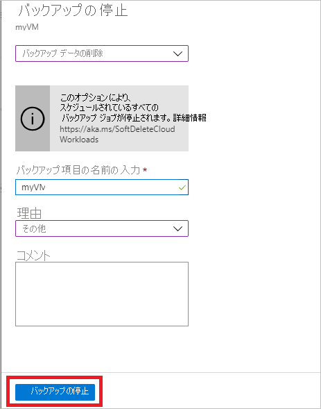

# Azure VM のバックアップを管理する

この記事では、[Azure Backup サービス](backup-overview.md)を使用してバックアップされている Azure 仮想マシン (VM) を管理する方法を説明します。 また、コンテナーのダッシュボードで確認できるバックアップ情報の概要も示します。

Azure portal では、Recovery Services コンテナーのダッシュボードで、次のようなコンテナー情報にアクセスできます。

* 最新のバックアップ (最新の復元ポイントでもあります)。
* バックアップ ポリシー。
* すべてのバックアップ スナップショットの合計サイズ。
* バックアップが有効になっている VM の数。

ダッシュボードを使用し、個々の VM にドリルダウンして、バックアップを管理できます。 マシンのバックアップを開始するには、ダッシュボードでコンテナーを開きます。

## ダッシュボードで VM を表示する

コンテナー ダッシュボードに VM を表示するには、次の手順を実行します。

1. [Azure Portal](https://portal.azure.com/) にサインインします。
2. [ハブ] メニューで、 **[参照]** を選択します。 リソース ボックスに「 **Recovery Services**」と入力します。 入力すると、入力内容に基づいて、一覧がフィルター処理されます。 **[Recovery Services コンテナー]** を選択します。

    

3. 使いやすいように、コンテナーを右クリックして、 **[ダッシュボードにピン留めする]** を選択します。
4. コンテナー ダッシュボードを開きます。

    

5. **[バックアップ項目]** タイルで、 **[Azure Virtual Machines]** を選択します。

    ![[バックアップ項目] タイルを開く](./media/backup-azure-manage-vms/contoso-vault-1606.png)

6.  **[バックアップ項目]**   ブレードでは、保護されている VM の一覧を表示することができます。 この例では、コンテナーは 1 つの仮想マシン、demobackup を保護します。  

    ![[バックアップ項目] ブレードを表示する](./media/backup-azure-manage-vms/backup-items-blade-select-item.png)

7. コンテナー項目のダッシュボードでは、バックアップ ポリシーの変更、オンデマンド バックアップの実行、VM の保護の停止と再開、バックアップ データの削除、復旧ポイントの表示、復元の実行を行います。

    ![バックアップ項目のダッシュボードと [設定] ブレード](./media/backup-azure-manage-vms/item-dashboard-settings.png)

## VM のバックアップ ポリシーを管理する

バックアップ ポリシーを管理するには、次の手順を実行します。

1. [Azure Portal](https://portal.azure.com/) にサインインします。 コンテナー ダッシュボードを開きます。
2. **[バックアップ項目]** タイルで、 **[Azure Virtual Machines]** を選択します。

    ![[バックアップ項目] タイルを開く](./media/backup-azure-manage-vms/contoso-vault-1606.png)

3.  **[バックアップ項目]**   ブレードでは、保護されている VM と、最新の復旧ポイントの時点の最後のバックアップの状態の一覧を表示することができます。

    ![[バックアップ項目] ブレードを表示する](./media/backup-azure-manage-vms/backup-items-blade-select-item.png)

4. コンテナー項目のダッシュボードでは、バックアップ ポリシーを選択できます。

   * ポリシーを切り替えるには、別のポリシーを選択し、 **[保存]** を選択します。 すぐに、新しいポリシーがコンテナーに適用されます。

     

## オンデマンド バックアップを実行する
保護を設定した後、VM のオンデマンド バックアップを実行できます。 以下の詳細を考慮してください。

- 初回バックアップがまだ実行されていない場合、オンデマンド バックアップを実行すると、VM の完全なコピーが Recovery Services コンテナーに作成されます。
- 初回バックアップが完了している場合、オンデマンド バックアップによって Recovery Services コンテナーに送信されるのは、前回のスナップショット以降の変更だけです。 つまり、以降のバックアップでは、増分のみが送信対象となります。
- オンデマンド バックアップのリテンション期間は、バックアップをトリガーするタイミングを指定するリテンション期間の値です。

オンデマンド バックアップをトリガーするには:

1. [コンテナー項目のダッシュボード](#view-vms-on-the-dashboard)の **[保護された項目]** で、 **[バックアップ項目]** を選択します。

    ![[今すぐバックアップ] オプション](./media/backup-azure-manage-vms/backup-now-button.png)

2. **[バックアップの管理の種類]** で、 **[Azure Virtual Machine]** を選択します。 **[バックアップ項目 (Azure Virtual Machin)]** ブレードが表示されます。
3. VM を選択し、 **[今すぐバックアップ]** を選択してオンデマンド バックアップを作成します。 **[今すぐバックアップ]** ブレードが表示されます。
4. **[バックアップの保持]** フィールドに、バックアップが保持される日付を指定します。

    ![[今すぐバックアップ] のカレンダー](./media/backup-azure-manage-vms/backup-now-check.png)

5. **[OK]** を選択してバックアップ ジョブを実行します。

ジョブの進行状況を追跡するには、コンテナーのダッシュボードで **[バックアップ ジョブ]** タイルを選択します。

## VM の保護を停止する

VM の保護を停止するには、次の 2 つの方法があります。

* **保護を停止してバックアップ データを保持します**。 このオプションでは、将来のすべてのバックアップ ジョブによる VM の保護を停止します。ただし、Azure Backup サービスは、バックアップ済みの復旧ポイントを保持します。  コンテナーの復旧ポイントを保持するには、料金を支払う必要があります (詳細については、[Azure Backup の料金に関するページ](https://azure.microsoft.com/pricing/details/backup/)を参照してください)。 必要な場合は、VM を復元することができます。 VM の保護を再開する場合は、*バックアップの再開*オプションを使用できます。
* **保護を停止してバックアップ データを削除します**。 このオプションでは、将来のすべてのバックアップ ジョブによる VM の保護を停止し、すべての復元ポイントを削除します。 VM の復元も、*バックアップの再開*オプションも使用することはできません。

>[!NOTE]
>バックアップを停止しないでデータ ソースを削除すると、新しいバックアップは失敗します。 古い復旧ポイントはポリシーに従って期限切れになりますが、最後の 1 つの復旧ポイントを、ユーザーがバックアップを停止してデータを削除するまで、常に保持されます。
>

### 保護を停止してバックアップ データを保持する

保護を停止して VM のバックアップ データを保持するには、次の手順を実行します。

1. [コンテナー項目のダッシュボード](#view-vms-on-the-dashboard)で **[バックアップの停止]** を選択します。
2. **[バックアップ データの保持]** を選択し、必要に応じて選択内容を確認します。 必要に応じてコメントを追加します。 項目の名前がわからない場合は、感嘆符にマウス カーソルを合わせると名前が表示されます。

    

バックアップ ジョブが停止したことを示す通知が表示されます。

### 保護を停止してバックアップ データを削除する

保護を停止して VM のデータを削除するには、次の手順を実行します。

1. [コンテナー項目のダッシュボード](#view-vms-on-the-dashboard)で **[バックアップの停止]** を選択します。
2. **[バックアップ データの削除]** を選択し、必要に応じて選択内容を確認します。 バックアップ項目の名前を入力し、必要に応じてコメントを追加します。

    

## VM の保護を再開する

VM の保護を停止する際に[保護を停止してバックアップ データを保持する](#stop-protection-and-retain-backup-data)オプションを選択した場合は、**バックアップの再開**を使用できます。 このオプションは、[保護を停止してバックアップ データを削除する](#stop-protection-and-delete-backup-data)オプション、または[バックアップ データを削除する](#delete-backup-data)を選択した場合は使用できません。

VM の保護を再開するには、次の手順を実行します。

1. [コンテナー項目のダッシュボード](#view-vms-on-the-dashboard)で **[バックアップの再開]** を選択します。

2. [バックアップ ポリシーの管理](#manage-backup-policy-for-a-vm)に関するトピックの手順に従って、VM のポリシーを割り当てます。 VM の初期の保護ポリシーを選択する必要はありません。
3. VM にバックアップ ポリシーを適用した後、次のメッセージが表示されます。

    

## バックアップ データの削除

VM のバックアップ データを削除する方法は 2 つあります。

- コンテナー項目のダッシュ ボードから [バックアップの停止] を選択し、[保護を停止してバックアップ データを削除する](#stop-protection-and-delete-backup-data)オプションの手順に従います。

  ![[バックアップの停止] を選択する](./media/backup-azure-manage-vms/stop-backup-buttom.png)

- コンテナー項目のダッシュボードから [バックアップ データの削除] を選択します。 VM の保護を停止する際に[保護を停止してバックアップ データを保持する](#stop-protection-and-retain-backup-data)オプションを選択した場合は、このオプションが有効になります。

  

  - [コンテナー項目のダッシュボード](#view-vms-on-the-dashboard)で **[バックアップ データの削除]** を選択します。
  - バックアップ項目の名前を入力して、復旧ポイントを削除してもよいことを確認します。

    

  - 項目のバックアップ データを削除するには、 **[削除]** を選択します。 バックアップ データが削除されたことを示す通知メッセージが表示されます。

  > [!NOTE]
  > バックアップ データを削除すると、関連付けられている復旧ポイントもすべて削除されます。 特定の復旧ポイントを選択して削除することはできません。

## 次の手順
- [VM の設定から Azure VM をバックアップする](backup-azure-vms-first-look-arm.md)方法を確認します。
- [VM を復元する](backup-azure-arm-restore-vms.md)方法を確認します。
- [Azure VM のバックアップを監視する](backup-azure-monitor-vms.md)方法を確認します。
