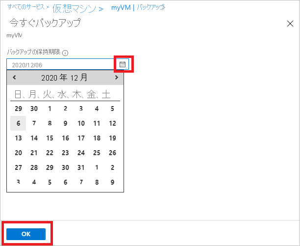

# Azure 仮想マシンのバックアップの管理

この記事では、VM のバックアップ管理に関するガイダンスを提供するほか、ポータルのダッシュボードで使用できるバックアップ アラート情報について説明します。 この記事のガイダンスは、Recovery Services コンテナーと組み合わせて VM を使用するケースを想定しています。 この記事で仮想マシンの作成や仮想マシンの保護については取り上げていません。 Azure Resource Manager によって Azure にデプロイされた VM を Recovery Services コンテナーで保護する方法についての基本的な情報については、「 [最初に: ARM VM の Recovery Services コンテナーへのバックアップ](backup-azure-vms-first-look-arm.md)」を参照してください。

## コンテナーと保護された仮想マシンの管理
Azure ポータルから Recovery Services コンテナーのダッシュボードにアクセスすると、コンテナーに関して次のような情報を確認できます。

* 最新のバックアップ スナップショット (最新の復元ポイントでもあります)
* バックアップ ポリシー
* すべてのバックアップ スナップショットの合計サイズ
* コンテナーで保護されている仮想マシンの数

仮想マシンのバックアップに伴う管理タスクは多くの場合、ダッシュボードでコンテナーを開くことから始まります。 ただし Recovery Services コンテナーを使った保護は、複数の項目 (または複数の VM) が対象となる場合があるため、特定の VM の詳細を表示するには、そのコンテナー項目のダッシュボードを開きます。 以降の手順では、*コンテナーのダッシュボード*と*コンテナー項目のダッシュボード*の開き方について順に説明しています。 2 つの手順では、コンテナーとコンテナー項目を Azure ダッシュボードに追加する方法について、[ダッシュボードにピン留めする] コマンドを使用した "ヒント" を紹介しています。 "ダッシュボードにピン留めする" は、コンテナーまたはコンテナー項目へのショートカットの作成手段となります。 このショートカットから使用頻度の高いコマンドを実行することもできます。

> [!TIP]
> 複数のダッシュボードまたはブレードが開いている場合は、ウィンドウの一番下にある濃い青色のスライダーを使用して、Azure ダッシュボードを左右にスライドさせます。
>
>

### Recovery Services コンテナーをダッシュボードから開く
1. [Azure Portal](https://portal.azure.com/) にサインインします。
2. ハブ メニューで **[参照]** をクリックし、リソースの一覧で「**Recovery Services**」と入力します。 入力を始めると、入力内容に基づいて、一覧がフィルター処理されます。 **[Recovery Services コンテナー]** をクリックします。

    

    Recovery Services コンテナーの一覧が表示されます。

    

   > [!TIP]
   > Azure ダッシュボードにコンテナーをピン留めすると、Azure ポータルを開いてすぐにコンテナーにアクセスすることができます。 ダッシュボードにコンテナーをピン留めするには、コンテナーの一覧で目的のコンテナーを右クリックし、 **[ダッシュボードにピン留めする]** を選択します。
   >
   >
3. コンテナーの一覧から、いずれかのコンテナーを選択して、そのダッシュボードを開きます。 コンテナーを選択すると、そのコンテナーのダッシュボードと **[設定]** ブレードが表示されます。 次の画像では、 **Contoso-vault** ダッシュボードが強調表示されています。

    

### コンテナー項目のダッシュボードを開く
前の手順では、コンテナーのダッシュボードを開きました。 コンテナー項目のダッシュボードを開くには、次の手順に従います。

1. コンテナーのダッシュボードにある **[バックアップ項目]** タイルで、**[Azure Virtual Machines]** をクリックします。

    

    **[バックアップ項目]** ブレードに、項目ごとの最新のバックアップ ジョブが一覧表示されます。 この例では、このコンテナーによって保護されている仮想マシンが 1 つ存在します (demovm-markgal)。  

    

   > [!TIP]
   > コンテナー項目は、アクセスしやすいように、Azure ダッシュボードにピン留めすることができます。 コンテナー項目をピン留めするには、コンテナー項目の一覧で目的の項目を右クリックし、 **[ダッシュボードにピン留めする]** を選択します。
   >
   >
2. **[バックアップ項目]** ブレードで目的の項目をクリックして、コンテナー項目のダッシュボードを開きます。

    

    コンテナー項目のダッシュボードとその **[設定]** ブレードが表示されます。

    

    コンテナー項目のダッシュボードから、多くの重要な管理作業を実行できます。その例を次に示します。

   * ポリシーの変更または新しいバックアップ ポリシーの作成
   * 復元ポイントとその整合状態の確認
   * オンデマンドでの仮想マシンのバックアップ
   * 仮想マシンの保護を停止する
   * 仮想マシンの保護の再開
   * バックアップ データ (または復旧ポイント) の削除
   * [バックアップ ディスクの復元](backup-azure-arm-restore-vms.md#restore-backed-up-disks)

次の手順は、コンテナー項目のダッシュボードを表示したところから始めます。

## バックアップ ポリシーを管理する
1. [コンテナー項目のダッシュボード](backup-azure-manage-vms.md#open-a-vault-item-dashboard)で、**[すべての設定]** をクリックして **[設定]** ブレードを開きます。

    
2. **[設定]** ブレードの **[バックアップ ポリシー]** をクリックして対応するブレードを開きます。

    表示されたブレードに、バックアップの頻度とリテンション期間が詳しく表示されます。

    
3. **[バックアップ ポリシーの選択]** メニューから次の手順を実行します。

   * ポリシーを変更するには、別のポリシーを選択し、 **[保存]** をクリックします。 すぐに、新しいポリシーがコンテナーに適用されます。
   * ポリシーを作成するには、 **[新規作成]** を選択します。

     

     バックアップ ポリシーを作成する手順については、「 [バックアップ ポリシーの定義](backup-azure-manage-vms.md#defining-a-backup-policy)」を参照してください。

[!INCLUDE [backup-create-backup-policy-for-vm](../../includes/backup-create-backup-policy-for-vm.md)]

> [!NOTE]
> バックアップ ポリシーを管理する際には、最適なバックアップ パフォーマンスを確保するための[ベスト プラクティス](backup-azure-vms-introduction.md#best-practices)に従ってください。
>
>

## オンデマンドでの仮想マシンのバックアップ
仮想マシンに保護が構成されていれば、その仮想マシンについてオンデマンド バックアップを作成できます。 初回バックアップがまだ実行されていない場合、オンデマンド バックアップを実行すると、仮想マシンの完全なコピーが Recovery Services コンテナーに作成されます。 初回バックアップが完了している場合、オンデマンド バックアップによって Recovery Services コンテナーに送信されるのは、前回のスナップショット以降の変更だけです。 つまり、以降のバックアップでは、増分のみが送信対象となります。

> [!NOTE]
> オンデマンド バックアップのリテンション期間は、ポリシーの中で日単位のバックアップ ポイントに対して指定されたリテンション期間の値となります。 日単位のバックアップ ポイントが選択されていない場合は、週単位のバックアップ ポイントが使用されます。
>
>

仮想マシンのオンデマンド バックアップをトリガーするには、次の手順に従います。

* [コンテナー項目のダッシュボード](backup-azure-manage-vms.md#open-a-vault-item-dashboard)で **[今すぐバックアップ]** をクリックします。

    

    オンデマンド バックアップ ジョブを開始してよいかどうかを確認するメッセージが表示されます。 バックアップ ジョブを開始する場合は **[はい]** をクリックします。

    

    バックアップ ジョブによって、復旧ポイントが作成されます。 復旧ポイントのリテンション期間は、仮想マシンに関連付けられているポリシーで指定されるリテンション期間と同じです。 ジョブの進行状況を追跡するには、コンテナーのダッシュボードで **[バックアップ ジョブ]** タイルをクリックします。  

## 仮想マシンの保護を停止する
仮想マシンの保護を中止するように選択した場合、復旧ポイントを保持するかどうかを確認するメッセージが表示されます。 仮想マシンの保護を中止する方法は 2 つあります。

* 将来のバックアップ ジョブをすべて停止したうえで、すべての復旧ポイントを削除する方法と、
* 将来のバックアップ ジョブをすべて停止して、復旧ポイントを保持する方法です。

復旧ポイントを記憶域に保持するためにはコストが発生します。 一方、復旧ポイントを保持する利点は、仮想マシンを必要に応じて後から復元できることです。 復旧ポイントを保持するためのコストについては、「[価格の詳細](https://azure.microsoft.com/pricing/details/backup/)」を参照してください。 すべての復旧ポイントを削除するように選択した場合、仮想マシンを復元することはできません。

仮想マシンに対する保護を停止するには、次の手順に従います。

1. [コンテナー項目のダッシュボード](backup-azure-manage-vms.md#open-a-vault-item-dashboard)で **[バックアップの停止]** をクリックします。

    

    [バックアップの停止] ブレードが開きます。

    
2. **[バックアップの停止]** ブレードで、バックアップ データを保持するか削除するかを選択します。 選択内容についての詳しい説明が、情報ボックスに表示されます。

    
3. バックアップ データを保持するように選択した場合は、手順 4. に進みます。 バックアップ データを削除するように選択した場合は、バックアップ ジョブの停止と復旧ポイントの削除についての意思確認をします。対象となる項目の名前を入力してください。

    

    項目名がわからない場合は、感嘆符にマウス カーソルを合わせると名前が表示されます。 また、 **[バックアップの停止]** ブレードのタイトルの下にも項目の名前が表示されます。
4. 必要に応じて、**[理由]** または **[コメント]** に入力します。
5. 現在の項目のバックアップ ジョブを停止するには、![[バックアップの停止] ボタン](./media/backup-azure-manage-vms/stop-backup-button-blue.png) をクリックします。

    バックアップ ジョブが停止したことを示す通知メッセージが表示されます。

    

## 仮想マシンの保護の再開
仮想マシンの保護を停止するときに **[バックアップ データの保持]** オプションを選択した場合、保護を再開することができます。 **[バックアップ データを削除]** オプションを選択した場合は、仮想マシンの保護を再開できません。

仮想マシンの保護を再開するには

1. [コンテナー項目のダッシュボード](backup-azure-manage-vms.md#open-a-vault-item-dashboard)で **[バックアップの再開]** をクリックします。

    

    [バックアップ ポリシー] ブレードが開きます。

   > [!NOTE]
   > 仮想マシンを再保護する場合は、最初に仮想マシンを保護するために使用いたポリシー以外のポリシーを選択できます。
   >
   >
2. [バックアップ ポリシーの管理](backup-azure-manage-vms.md#manage-backup-policies)に関するトピックの手順に従って、仮想マシンのポリシーを割り当てます。

    仮想マシンにバックアップ ポリシーが適用されると、次のメッセージが表示されます。

    

## [バックアップ データを削除]
仮想マシンに関連付けられているバックアップ データは、 **バックアップの停止** ジョブの実行中やバックアップ ジョブが完了した後にいつでも削除することができます。 数日または数週間待ってから復旧ポイントを削除する方が便利な場合もあります。 復旧ポイントの復元とは異なり、バックアップ データを削除するときは、特定の復旧ポイントを削除対象として選択することができません。 バックアップ データを削除するように選択すると、その項目に関連付けられている復旧ポイントもすべて削除されます。

以降の手順は、仮想マシンのバックアップ ジョブが停止済みであるか、無効にされていることを前提としています。 バックアップ ジョブを無効にしたら、**[バックアップの再開]** オプションと **[バックアップ データの削除]** オプションが、コンテナー項目のダッシュボードに表示されます。

" *バックアップを無効*" にした状態の仮想マシンでバックアップ データを削除するには:

1. [コンテナー項目のダッシュボード](backup-azure-manage-vms.md#open-a-vault-item-dashboard)で **[バックアップ データの削除]** をクリックします。

    

    **[バックアップ データを削除]** ブレードが開きます。

    
2. 項目の名前を入力して、復旧ポイントを削除してもよいことを確認します。

    

    項目名がわからない場合は、感嘆符にマウス カーソルを合わせると名前が表示されます。 また、 **[バックアップ データを削除]** ブレードのタイトルの下にも項目の名前が表示されます。
3. 必要に応じて、**[理由]** または **[コメント]** に入力します。
4. 現在の項目のバックアップ データを削除するには、![[バックアップの停止] ボタン](./media/backup-azure-manage-vms/delete-button.png) をクリックします。

    バックアップ データが削除されたことを示す通知メッセージが表示されます。

## 次の手順
復旧ポイントからの仮想マシンの再作成については、 [Azure VM の復元](backup-azure-arm-restore-vms.md)に関するページをご覧ください。 仮想マシンの保護については、 [Recovery Services コンテナーへの VM のバックアップ](backup-azure-vms-first-look-arm.md)に関するページをご覧ください。 イベントの監視については、「 [Monitor alerts for Azure virtual machine backups (Azure 仮想マシンのバックアップ アラートの監視)](backup-azure-monitor-vms.md)」を参照してください。
