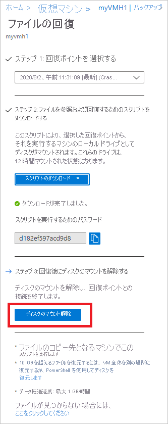

# <a name="recover-files-from-azure-virtual-machine-backup"></a>Azure 仮想マシンのバックアップからファイルを回復する

Azure Backup は、[Azure 仮想マシン (VM) とディスク](./backup-azure-arm-restore-vms.md)を Azure VM のバックアップ (復旧ポイントとも呼ばれる) から復元する機能を提供します。 この記事では、Azure VM のバックアップからファイルやフォルダーを回復する方法について説明します。 ファイルやフォルダーを回復する機能は、Resource Manager モデルを使用してデプロイされ、Recovery Services コンテナーに保護されている Azure VM に対してのみ使用できます。

> [!Note]
> この機能は、Resource Manager モデルを使用してデプロイされ、Recovery Services コンテナーに保護されている Azure VM に対して使用できます。
> 暗号化された VM バックアップからのファイルの回復はサポートされていません。
>

## <a name="mount-the-volume-and-copy-files"></a>ボリュームをマウントしてファイルをコピーする

復旧ポイントからファイルまたはフォルダーを復元するには、仮想マシンに移動し、目的の復旧ポイントを選択します。

1. [Azure Portal](http://portal.Azure.com) にサインインし、左側のウィンドウで **[仮想マシン]** をクリックします。 仮想マシンの一覧から、仮想マシンを選択して、その仮想マシンのダッシュボードを開きます。

2. 仮想マシンのメニューで、**[バックアップ]** をクリックし、[バックアップ] ダッシュボードを開きます。

    

3. [バックアップ] ダッシュボード メニューで、**[ファイルの回復]** をクリックし、そのメニューを開きます。

    ![[ファイルの回復] メニュー](./media/backup-azure-restore-files-from-vm/file-recovery-blade.png)

4. **[回復ポイントの選択]** ドロップ ダウン メニューから、目的のファイルを含む回復ポイントを選択します。 既定では、最新の回復ポイントが既に選択されています。

5. 回復ポイントからファイルをコピーするために使用するソフトウェアをダウンロードするには、**[実行可能ファイルのダウンロード]** (Windows Azure VM の場合) または **[スクリプトのダウンロード]** (Linux Azure VM の場合) をクリックします。

    

    Azure は、実行可能ファイルまたはスクリプトをローカル コンピューターにダウンロードします。

    

    実行可能ファイルまたはスクリプトを管理者として実行するには、ダウンロード データをコンピューターに保存することをお勧めします。

6. 実行可能ファイルまたはスクリプトは、パスワードで保護されているため、パスワードが必要です。 **[ファイルの回復]** メニューで、コピー ボタンをクリックしてパスワードをメモリに読み込みます。

    

7. ダウンロードの場所 (通常は [ダウンロード] フォルダー) で、実行可能ファイルまたはスクリプトを右クリックし、管理者の資格情報を使用して実行します。 メッセージが表示されたら、パスワードを入力するか、またはメモリからのパスワードを貼り付けて、Enter キーを押します。 有効なパスワードが入力されると、スクリプトが復旧ポイントに接続されます。

    ![[ファイルの回復] メニュー](./media/backup-azure-restore-files-from-vm/executable-output.png)

    アクセスが制限されたコンピューターでスクリプトを実行する場合は、以下にアクセスできることを確認します。

    - download.microsoft.com
    - リカバリ サービスの URL (geo 名はリカバリ サービス コンテナーが存在するリージョンを表します)
        - <https://pod01-rec2.geo-name.backup.windowsazure.com> (Azure の パブリック地域用)
        - <https://pod01-rec2.geo-name.backup.windowsazure.cn> (Azure China 用)
        - <https://pod01-rec2.geo-name.backup.windowsazure.us> (Azure US Government 用)
        - <https://pod01-rec2.geo-name.backup.windowsazure.de> (Azure Germany 用)
    - 送信ポート 3260

    Linux の場合、スクリプトによって復旧ポイントに接続するには "open-iscsi" および "lshw" コンポーネントが必要です。 スクリプトを実行するコンピューターに目的のコンポーネントが存在しない場合は、コンポーネントをインストールするためのアクセス許可をスクリプトから求められます。 同意して、必要なコンポーネントをインストールします。

    スクリプトを実行するコンピューターと復旧ポイントのデータの間にセキュリティで保護されたチャネルを構築するために使われるコンポーネントをダウンロードするには、download.microsoft.com へのアクセスが必要です。

    バックアップされた VM と同じ (または互換性のある) オペレーティング システムを使用する任意のマシンでスクリプトを実行できます。 互換性のあるオペレーティング システムについては、「[互換性のある OS](backup-azure-restore-files-from-vm.md#system-requirements)」の表を参照してください。 保護されている Azure 仮想マシンで Windows 記憶域スペース (Windows Azure VM の場合) または LVM/RAID アレイ (Linux VM の場合) を使用している場合、その仮想マシンで実行可能ファイルまたはスクリプトを実行することはできません。 代わりに、互換性のあるオペレーティング システムを使用する他のマシンで実行可能ファイルまたはスクリプトを実行します。

### <a name="identifying-volumes"></a>ボリュームの識別

#### <a name="for-windows"></a>Windows の場合

実行可能ファイルを実行すると、オペレーティング システムは新しいボリュームをマウントし、ドライブ文字を割り当てます。 Windows エクスプローラーまたはファイル エクスプローラーを使用してそれらのドライブを参照できます。 ボリュームに割り当てられるドライブ文字は、元の仮想マシンと同じ文字にならない可能性がありますが、ボリューム名は保持されます。 たとえば、元の仮想マシン上のボリュームが "データ ディスク (E:`\`)" であった場合、そのボリュームは、ローカル コンピューターに "データ ディスク ('任意のドライブ文字':`\`)" としてアタッチされる可能性があります。 ファイルまたはフォルダーが表示されるまで、スクリプトの出力に示されているすべてのボリュームを参照します。  

   ![[ファイルの回復] メニュー](./media/backup-azure-restore-files-from-vm/volumes-attached.png)

#### <a name="for-linux"></a>Linux の場合

Linux では、復旧ポイントのボリュームはスクリプトが実行されるフォルダーにマウントされます。 それに応じて、接続されたディスク、ボリューム、対応するマウント パスが示されます。 これらのマウント パスは、ルート レベルのアクセス権を持つユーザーに表示されます。 スクリプトの出力に示されたボリュームを参照します。

  ![Linux の [ファイルの回復] メニュー](./media/backup-azure-restore-files-from-vm/linux-mount-paths.png)
  
## <a name="closing-the-connection"></a>接続を閉じる

ファイルを識別してローカル ストレージの場所にコピーした後、追加ドライブを削除 (またはマウント解除) します。 ドライブをマウント解除するには、Azure Portal の **[ファイルの回復]** メニューで **[ディスクのマウント解除]** をクリックします。



ディスクがマウント解除されると、操作が成功したことを通知するメッセージが表示されます。 接続を更新してディスクを解除できるようになるまで数分かかることがあります。

Linux では、復旧ポイントへの接続が切断された後、OS によって対応するマウント パスが自動的に削除されるわけではありません。 マウント パスは "孤立" ボリュームとして存在し、表示されていますが、ファイルへのアクセスや書き込みを行うと、エラーがスローされます。 マウント パスは手動で削除できます。 実行時に、スクリプトは以前の復旧ポイントから存在するこのようなボリュームを特定し、同意を得たうえでクリーンアップします。

## <a name="special-configurations"></a>特殊な構成

### <a name="dynamic-disks"></a>ダイナミック ディスク

次のいずれかまたは両方の特性を持つボリュームが保護された Azure VM に含まれている場合、その VM では実行可能スクリプトを実行することはできません。

    - 複数のディスクにまたがるボリューム (スパンおよびストライプ ボリューム)
    - ダイナミック ディスク上のフォールト トレラント ボリューム (ミラー化および RAID 5 ボリューム)

代わりに、互換性のあるオペレーティング システムを使用する他のコンピューターで実行可能スクリプトを実行します。

### <a name="windows-storage-spaces"></a>Windows 記憶域スペース

Windows 記憶域スペースは、記憶域を仮想化できるようにする Windows テクノロジです。 Windows 記憶域スペースを使用すると、業界標準のディスクを記憶域プールにグループ化することができます。 そのような記憶域プール内の有効な領域を使用して、記憶域スペースと呼ばれる仮想ディスクを作成します。

保護された Azure VM で Windows 記憶域スペースが使用されている場合、その VM で実行可能スクリプトを実行することはできません。 代わりに、互換性のあるオペレーティング システムを使用する他のマシンで実行可能スクリプトを実行します。

### <a name="lvmraid-arrays"></a>LVM/RAID アレイ

Linux では、論理ボリューム マネージャー (LVM) やソフトウェア RAID アレイを使用して、複数のディスクの論理ボリュームを管理します。 保護された Linux VM で LVM/RAID アレイを使用している場合、その VM でスクリプトを実行することはできません。 代わりに、保護された VM のファイル システムをサポートする、互換性のある OS を使用し、任意の他のマシンでスクリプトを実行します。

次のスクリプトの出力には、LVM/RAID アレイのディスク、ボリューム、パーティションの種類が表示されます。

   

これらのパーティションをオンラインにするには、次のセクションにあるコマンドを実行します。

#### <a name="for-lvm-partitions"></a>LVM パーティションの場合

物理ボリュームのボリューム グループ名を表示するには、次のコマンドを使用します。

```bash
#!/bin/bash
$ pvs <volume name as shown above in the script output>
```

ボリューム グループのすべての論理ボリューム、名前、パスを表示するには、次のコマンドを使用します。

```bash
#!/bin/bash
$ lvdisplay <volume-group-name from the pvs command’s results>
```

このコマンドは、論理ボリュームを任意のパスにマウントします。

```bash
#!/bin/bash
$ mount <LV path> </mountpath>
```

#### <a name="for-raid-arrays"></a>RAID アレイの場合

このコマンドは、すべての RAID ディスクの詳細を表示します。

```bash
#!/bin/bash
$ mdadm –detail –scan
```

 関連する RAID ディスクは `/dev/mdm/<RAID array name in the protected VM>` と表示されます。

RAID ディスクに物理ボリュームがある場合は、mount コマンドを使用します。

```bash
#!/bin/bash
$ mount [RAID Disk Path] [/mountpath]
```

RAID ディスクに別の LVM が構成されている場合は、前に説明した手順を LVM パーティションにも使用します。ただし、RAID ディスク名の代わりに、ボリューム名を使用します。

## <a name="system-requirements"></a>システム要件

### <a name="for-windows-os"></a>Windows OS の場合

次の表は、サーバーとコンピューターのオペレーティング システムの互換性を示しています。 ファイルを回復する場合、オペレーティング システムの以前のバージョンまたは以降のバージョンにファイルを復元することはできません。 たとえば、Windows Server 2016 VM から Windows Server 2012 または Windows 8 コンピューターにファイルを復元することはできません。 VM からは、同じサーバー オペレーティング システムへ、または互換性のあるクライアント オペレーティング システムへファイルを復元できます。

|サーバー OS | 互換性のあるクライアント OS  |
| --------------- | ---- |
| Windows Server 2016    | Windows 10 |
| Windows Server 2012 R2 | Windows 8.1 |
| Windows Server 2012    | Windows 8  |
| Windows Server 2008 R2 | Windows 7   |

### <a name="for-linux-os"></a>Linux OS の場合

Linux では、ファイルの復元に使用するコンピューターの OS が、保護された仮想マシンのファイル システムをサポートしている必要があります。 スクリプトを実行するコンピューターを選択する場合は、コンピューターに互換性のある OS がインストールされていること、かつ、次の表に示すバージョンのいずれかが使用されていることを確認します。

|Linux OS | バージョン  |
| --------------- | ---- |
| Ubuntu | 12.04 以降 |
| CentOS | 6.5 以降  |
| RHEL | 6.7 以降 |
| Debian | 7 以降 |
| Oracle Linux | 6.4 以降 |
| SLES | 12 以降 |
| openSUSE | 42.2 以降 |

スクリプトを実行し、復旧ポイントに安全に接続するには、Python および Bash コンポーネントも必要となります。

|コンポーネント | Version  |
| --------------- | ---- |
| Bash | 4 以降 |
| Python | 2.6.6 以降  |
| TLS | 1.2 がサポートされている必要があります。  |

## <a name="troubleshooting"></a>トラブルシューティング

仮想マシンからのファイルの回復中に問題が発生した場合は、次の表で追加情報を確認してください。

| エラー メッセージ/シナリオ | 考えられる原因 | 推奨される操作 |
| ------------------------ | -------------- | ------------------ |
| 実行の出力: "*Exception connecting to the target (ターゲットへの接続例外)*" |スクリプトが回復ポイントにアクセスできません    | コンピューターが前述のアクセス要件を満たしているかどうかを確認します。 |  
| 実行の出力: "*ターゲットは iSCSI セッション経由で既にログインされています。*" | スクリプトは同じコンピューターで既に実行され、ドライブがアタッチされています | 回復ポイントのボリュームは既にアタッチされています。 ボリュームは、元の VM と同じドライブ文字でマウントされないことがあります。 ファイル エクスプローラーで、使用可能なすべてのボリュームを参照してファイルを探してください。 |
| 実行の出力: "*This script is invalid because the disks have been dismounted via portal/exceeded the 12-hr limit. (ディスクがポータルからマウント解除されているか、12 時間制限を超過しているため、 このスクリプトは無効です。)Download a new script from the portal. (ポータルから新しいスクリプトをダウンロードしてください。)*" |    ディスクがポータルからマウント解除されているか、12 時間制限を超過しています | この特定の実行可能ファイルは、現在無効であり、実行できません。 その回復ポイントインタイムのファイルにアクセスする場合は、ポータルで新しい実行可能ファイルを取得してください。|
| 実行可能ファイルが実行されたコンピューターで: 新しいボリュームが [マウント解除] ボタンをクリックしてもマウント解除されない | コンピューター上の iSCSI イニシエーターがターゲットへの接続に応答しないか、接続が更新されず、キャッシュが維持されています |    [マウント解除] ボタンを押した後、数分待ちます。 それでも新しいボリュームがマウント解除されない場合は、すべてのボリュームを参照してください。 これにより、イニシエーターが接続を更新し、ボリュームがマウント解除され、ディスクが使用できないことを示すエラー メッセージが表示されます。|
| 実行の出力: スクリプトは正常に実行されるが、スクリプトの出力で "New volumes attached (新しいボリュームがアタッチされました)" が表示されない |    これは一時的なエラーです    | ボリュームは既にアタッチされています。 エクスプローラーを開いて参照します。 同じコンピューターでスクリプトを毎回実行している場合は、マシンの再起動を検討してください。次回の実行可能ファイルの実行時に一覧が表示されます。 |
| Linux 固有: 目的のボリュームを表示できない | スクリプトを実行するマシンの OS が、保護された VM の基になるファイル システムを認識していない可能性があります | 復旧ポイントがクラッシュ整合性とファイル整合性のどちらであるかを確認します。 ファイル整合性の場合、OS が保護された VM のファイル システムを認識する別のマシンでスクリプトを実行します。 |
| Windows 固有: 目的のボリュームを表示できない | ディスクはアタッチされている可能性がありますが、ボリュームが構成されていません | ディスクの管理画面から、復旧ポイントに関連する追加のディスクを識別します。 それらのディスクのいずれかがオフライン状態の場合は、そのディスクを右クリックし、[オンライン] をクリックしてオンライン状態にします。|
