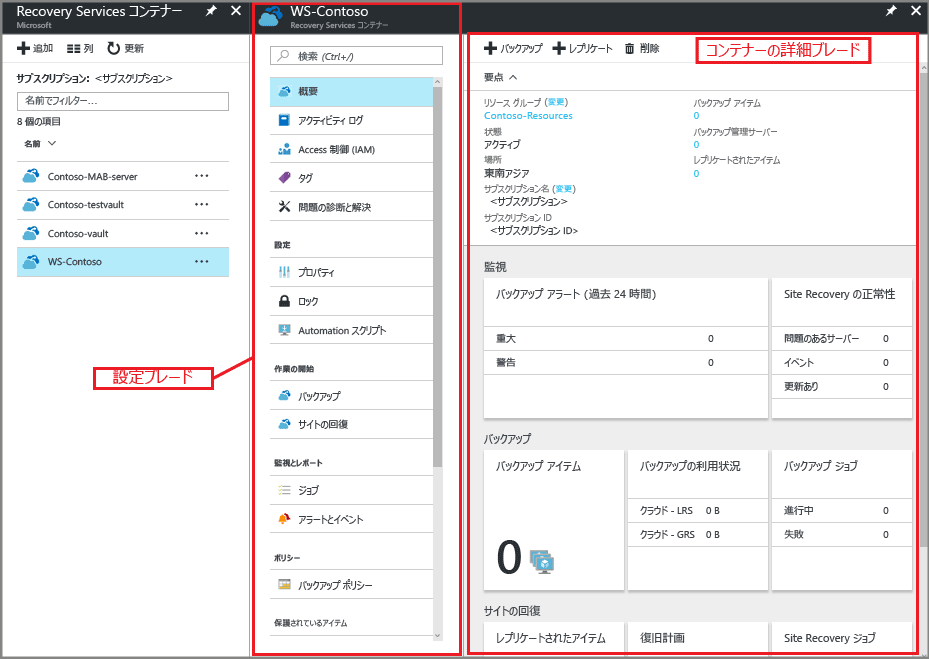
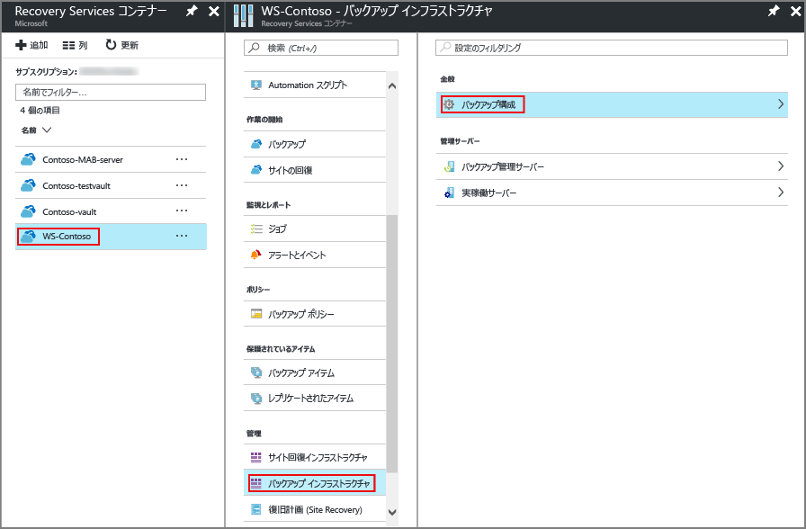
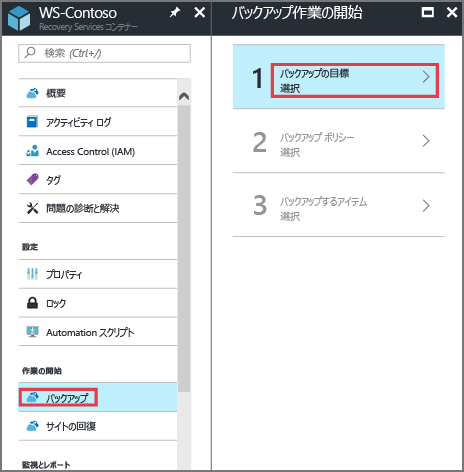
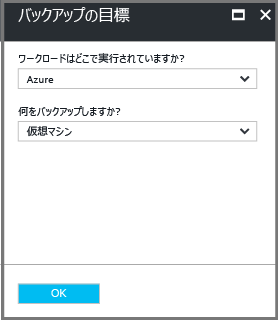
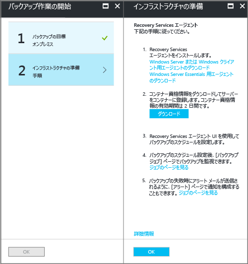
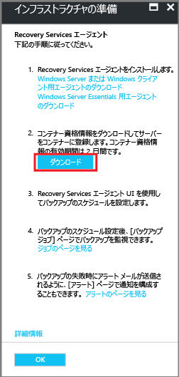
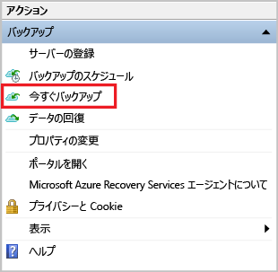

# Windows のシステム状態を Resource Manager デプロイメントにバックアップする

この記事では、Windows Server のシステム状態を Azure にバックアップする方法について説明します。 ここでは基本事項について説明します。

Azure Backup の詳細については、こちらの [概要記事](backup-overview.md)を参照してください。

Azure サブスクリプションがない場合は、すべての Azure サービスにアクセスできる [無料アカウント](https://azure.microsoft.com/free/) を作成します。

## Recovery Services コンテナーの作成

Windows Server のシステム状態をバックアップするには、データを保存するリージョンに Recovery Services コンテナーを作成する必要があります。 また、ストレージのレプリケート方法を決定する必要もあります。

### Recovery Services コンテナーを作成するには

1. まだサインインしていない場合は、Azure サブスクリプションを使用して [Azure Portal](https://portal.azure.com/) にサインインします。
2. ハブ メニューの **[すべてのサービス]** をクリックし、リソースの一覧で「**Recovery Services**」と入力して、 **[Recovery Services コンテナー]** をクリックします。

    

    サブスクリプションに Recovery Services コンテナーがある場合は、そのコンテナーが一覧表示されます。
3. **[Recovery Services コンテナー]** メニューの **[追加]** をクリックします。

    

    [Recovery Services コンテナー] ブレードが開き、 **[名前]** 、 **[サブスクリプション]** 、 **[リソース グループ]** 、 **[場所]** を指定するよう求められます。

    

4. **[名前]** ボックスに、コンテナーを識別する表示名を入力します。 名前は Azure サブスクリプションに対して一意である必要があります。 2 ～ 50 文字の名前を入力します。 名前の先頭にはアルファベットを使用する必要があります。また、名前に使用できるのはアルファベット、数字、ハイフンのみです。

5. **[サブスクリプション]** セクションで、ドロップダウン メニューを使用して Azure サブスクリプションを選択します。 サブスクリプションが 1 つのみの場合は、そのサブスクリプションが表示されるので、次の手順に進んでください。 どのサブスクリプションを使用すればよいかがわからない場合は、既定 (または推奨) のサブスクリプションを使用してください。 組織のアカウントが複数の Azure サブスクリプションに関連付けられている場合に限り、複数の選択肢が存在します。

6. **[リソース グループ]** セクションで、次のことを行います。

    * リソース グループを作成する場合は、 **[新規作成]** を選択します。
    または
    * 使用可能なリソース グループの一覧を表示するには、 **[既存のものを使用]** を選択し、ドロップダウン メニューをクリックします。

   リソース グループの詳細については、「[Azure Resource Manager の概要](../azure-resource-manager/management/overview.md)」をご覧ください。

7. **[場所]** をクリックして、コンテナーの地理的リージョンを選択します。 この選択により、バックアップ データの送信先となるリージョンが決まります。

8. [Recovery Services コンテナー] ブレードの下部にある **[作成]** をクリックします。

    Recovery Services コンテナーの作成には数分かかることがあります。 ポータルの右上の領域に状態が通知され、確認することが出来ます。 コンテナーが作成されると、Recovery Services コンテナーの一覧に表示されます。 数分経過してもコンテナーが表示されない場合は、 **[最新の情報に更新]** をクリックしてください。

    ![[最新の情報に更新] ボタンをクリックする](./media/backup-try-azure-backup-in-10-mins/refresh-button.png) 

    Recovery Services コンテナーの一覧にコンテナーが表示されたら、ストレージ冗長性を設定する準備が整いました。

### コンテナーのストレージ冗長性を設定する

Recovery Services コンテナーを作成する際は、必要に応じてストレージの冗長性が構成されるようにしてください。

1. **[Recovery Services コンテナー]** ブレードで、新しいコンテナーをクリックします。

    

    コンテナーを選択すると、 **[Recovery Services コンテナー]** ブレードが縮小され、"*上部にコンテナー名が表示された*" 設定ブレードとコンテナーの詳細ブレードが開きます。

    
2. 新しいコンテナーの設定ブレードで、垂直スライドを使って下へスクロールして [管理] セクションに移動し、 **[バックアップ インフラストラクチャ]** をクリックします。
    [バックアップ インフラストラクチャ] ブレードが開きます。
3. [バックアップ インフラストラクチャ] ブレードで、 **[バックアップ構成]** をクリックして **[バックアップ構成]** ブレードを開きます。

    
4. コンテナーの適切なストレージ レプリケーション オプションを選択します。

    

    既定では、コンテナーには geo 冗長ストレージがあります。 プライマリ バックアップ ストレージ エンドポイントとして Azure を使用する場合は、引き続き **[geo 冗長]** を使用します。 プライマリ バックアップ ストレージ エンドポイントとして Azure を使用しない場合、 **[ローカル冗長]** を選択します。これにより、Azure Storage のコストを削減できます。 [geo 冗長](../storage/common/storage-redundancy-grs.md)ストレージと[ローカル冗長](../storage/common/storage-redundancy-lrs.md)ストレージのオプションの詳細については、こちらの[ストレージ冗長性の概要](../storage/common/storage-redundancy.md)を参照してください。

コンテナーを作成したら、Windows のシステム状態をバックアップするための構成を行います。

## コンテナーの構成

1. Recovery Services コンテナー (先ほど作成したコンテナー) のブレードの [作業の開始] セクションで **[バックアップ]** をクリックし、 **[バックアップ作業の開始]** ブレードで、 **[バックアップの目標]** を選択します。

    

    **[バックアップの目標]** ブレードが開きます。

    

2. **[ワークロードはどこで実行されていますか?]** ボックスの一覧の **[オンプレミス]** を選択します。

    Windows Server または Windows コンピューターが Azure にない物理マシンであるため、 **[オンプレミス]** を選択します。

3. **[何をバックアップしますか?]** メニューの **[システム状態]** を選択し、 **[OK]** をクリックします。

    

    [OK] をクリックすると、 **[バックアップの目標]** の横にチェックマークが表示され、 **[インフラストラクチャの準備]** ブレードが開きます。

    

4. **[インフラストラクチャの準備]** ブレードで、 **[Windows Server または Windows クライアント用エージェントのダウンロード]** をクリックします。

    ![[Download Agent for Windows Server or Windows Client]](./media/backup-try-azure-backup-in-10-mins/choose-agent-for-server-client.png)

    Windows Server Essentials を使用している場合は、Windows Server Essentials 用エージェントのダウンロードを選択します。 MARSAgentInstaller.exe を実行するか、保存するかをたずねるポップアップ メニューが表示されます。

    

5. ダウンロードのポップアップ メニューで、 **[保存]** をクリックします。

    既定では、 **MARSagentinstaller.exe** ファイルがダウンロード フォルダーに保存されます。 インストーラーのダウンロードが完了すると、インストーラーを実行するかフォルダーを開くかをたずねるポップアップが表示されます。

    ![[Download Agent for Windows Server or Windows Client]](./media/backup-try-azure-backup-in-10-mins/mars-installer-complete.png)

    まだ、エージェントをインストールする必要はありません。 エージェントはコンテナー資格情報をダウンロードした後にインストールできます。

6. **[インフラストラクチャの準備]** ブレードで、 **[ダウンロード]** をクリックします。

    

    コンテナー資格情報は、ダウンロード フォルダーにダウンロードされます。 コンテナー資格情報のダウンロードが完了すると、資格情報を開くか保存するかをたずねるポップアップが表示されます。 **[保存]** をクリックします。 誤って **[開く]** をクリックすると、コンテナー資格情報を開こうとして失敗します。 コンテナー資格情報を開くことはできません。 次の手順に進みます。 コンテナー資格情報はダウンロード フォルダーにあります。

    
   > [!NOTE]
   > コンテナー資格情報は、エージェントを使用する予定の Windows Server に対してローカルな場所にのみ保存する必要があります。
   >

[!INCLUDE [backup-upgrade-mars-agent.md](../../includes/backup-upgrade-mars-agent.md)]

## エージェントをインストールして登録する

> [!NOTE]
> Azure Portal を使用してバックアップを有効にすることはまだできません。 Microsoft Azure Recovery Services エージェントを使用して、Windows Server のシステム状態をバックアップしてください。
>

1. ダウンロード フォルダー (または他の保存場所) で **MARSagentinstaller.exe** を見つけて、ダブルクリックします。

    インストーラーは一連のメッセージを表示しながら、Recovery Services エージェントの抽出、インストール、登録を実行します。

    

2. Microsoft Azure Recovery Services エージェント セットアップ ウィザードを実行します。 ウィザードでは以下のことを行う必要があります。

   * インストールとキャッシュ フォルダーの場所を選択します。
   * プロキシ サーバーを使用してインターネットに接続する場合は、プロキシ サーバーの情報を指定します。
   * 認証済みのプロキシを使用する場合は、ユーザー名とパスワードの詳細を入力します。
   * ダウンロードしたコンテナーの資格情報を指定します。
   * 暗号化パスフレーズを安全な場所に保存します。

     > [!NOTE]
     > パスフレーズを紛失または忘れた場合、Microsoft はバックアップ データの回復を支援することはできません。 安全な場所にファイルを保存してください。 バックアップを復元するために必要です。
     >
     >

エージェントがインストールされ、コンピューターがコンテナーに登録されました。 バックアップを構成してスケジュールする準備ができました。

## Windows Server のシステム状態のバックアップ

初回バックアップには、次の 2 つのタスクが含まれています。

* バックアップのスケジュール
* 初めてのシステム状態のバックアップ

初回バックアップを実行するには、Microsoft Azure Recovery Services エージェントを使用します。

> [!NOTE]
> Windows Server 2016 を使用して、Windows Server 2008 R2 のシステム状態をバックアップできます。 クライアント SKU では、システム状態のバックアップはサポートされていません。 システム状態は、Windows クライアント、または Windows Server 2008 SP2 マシンのオプションとしては表示されません。
>
>

### バックアップ ジョブのスケジュールを設定するには

1. Microsoft Azure Recovery Services エージェントを開きます。 エージェントは、コンピューターで **Microsoft Azure Backup**を検索すると見つかります。

    

2. Recovery Services エージェントで、 **[バックアップのスケジュール]** をクリックします。

    

3. バックアップのスケジュール ウィザードの [作業の開始] ページで、 **[次へ]** をクリックします。

4. [バックアップする項目の選択] 画面で、 **[項目の追加]** をクリックします。

5. **[システム状態]** を選択し、 **[OK]** をクリックします。

6. **[次へ]** をクリックします。

7. 後続のページで、必要なバックアップの頻度およびシステム状態のバックアップの保持ポリシーを選択します。

8. [確認] ページで情報を確認し、 **[完了]** をクリックします。

9. ウィザードでバックアップ スケジュールの作成が完了したら、 **[閉じる]** をクリックします。

### 初めて Windows Server のシステム状態をバックアップするには

1. Windows Server に、再起動を伴う保留中の更新が存在しないことを確認します。

2. Recovery Services エージェントで **[今すぐバックアップ]** をクリックして、ネットワーク経由での最初のシード処理を完了します。

    

3. 表示される **[Select Backup Item]\(バックアップ項目の選択)** 画面で **[システム状態]** を選択し、 **[次へ]** をクリックします。

4. [確認] ページで、今すぐバックアップ ウィザードによってコンピューターのバックアップに使用される設定を確認します。 次に、 **[バックアップ]** をクリックします。

5. **[閉じる]** をクリックしてウィザードを閉じます。 バックアップ プロセスが完了する前にウィザードを閉じても、ウィザードはバックグラウンドで引き続き実行されます。
    > [!NOTE]
    > MARS エージェントは、各システム状態のバックアップの前に、事前チェックの一部として SFC /verifyonly をトリガーします。 これは、システム状態の一部としてバックアップされるファイルが、Windows のバージョンに対応する正しいバージョンを持つことを確認するためのものです。 システム ファイル チェッカー (SFC) の詳細については [こちらの記事](https://docs.microsoft.com/windows-server/administration/windows-commands/sfc)を参照してください。
    >

初回バックアップが完了すると、 **[ジョブは完了しました]** 状態が Backup コンソールに表示されます。

  

## 疑問がある場合

ご不明な点がある場合や今後搭載を希望する機能がある場合は、 [フィードバックをお送りください](https://aka.ms/azurebackup_feedback)。

## 次のステップ

* [Windows コンピューターのバックアップ](backup-configure-vault.md)の詳細を参照してください。
* Windows Server のシステム状態をバックアップしたので、[コンテナーとサーバーを管理](backup-azure-manage-windows-server.md)できます。
* バックアップを復元する必要がある場合は、 [Windows コンピューターへのファイルの復元](backup-azure-restore-windows-server.md)に関する記事を参照してください。
