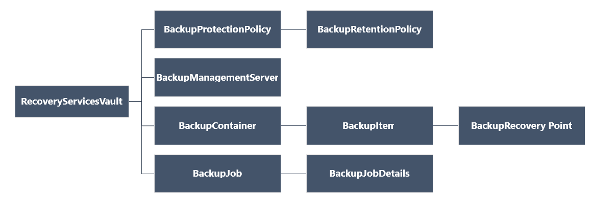

# <a name="back-up-and-restore-azure-vms-with-powershell"></a>PowerShell を使用して Azure VM をバックアップおよび復元する

この記事では、PowerShell コマンドレットを使用して [Azure Backup](backup-overview.md) Recovery Services コンテナーの Azure VM をバックアップおよび復元する方法を説明します。

この記事では、次の方法について説明します。

> [!div class="checklist"]
> * Recovery Services のコンテナーを作成し、コンテナーのコンテキストを設定する。
> * バックアップ ポリシーを定義する
> * 複数の仮想マシンを保護するバックアップ ポリシーを適用する
> * 保護された仮想マシン用のオンデマンドのバックアップ ジョブをトリガーする 仮想マシンをバックアップ (または保護) する前に、[前提条件](backup-azure-arm-vms-prepare.md)をすべて満たして、VM を保護するための環境を準備する必要があります。

## <a name="before-you-start"></a>開始する前に

- Recovery Services コンテナーについての[詳細情報](backup-azure-recovery-services-vault-overview.md)を確認します。
- Azure VM バックアップのアーキテクチャを[確認](backup-architecture.md#architecture-direct-backup-of-azure-vms)して、バックアップ プロセスについて[学び](backup-azure-vms-introduction.md)、サポート、制限、および前提条件を[確認](backup-support-matrix-iaas.md)します。
- Recovery Services の PowerShell オブジェクト階層を確認します。

## <a name="recovery-services-object-hierarchy"></a>Recovery Services オブジェクトの階層

オブジェクト階層の概要を次の図に示します。



Azure ライブラリに含まれる **Az.RecoveryServices** [コマンドレット リファレンス](https://docs.microsoft.com/powershell/module/Az.RecoveryServices/?view=azps-1.4.0)のリファレンスを確認します。

## <a name="set-up-and-register"></a>設定して登録する

[!INCLUDE [updated-for-az](../../includes/updated-for-az.md)]

開始するには

1. [最新バージョンの PowerShell をダウンロードします](https://docs.microsoft.com/powershell/azure/install-az-ps)。

2. 以下のコマンドを入力して、使用可能な Azure Backup の PowerShell コマンドレットを検索します。

    ```powershell
    Get-Command *azrecoveryservices*
    ```

    Azure Backup、Azure Site Recovery、Recovery Services コンテナーのエイリアスとコマンドレットが表示されます。 次の画像は表示例です。 コマンドレットの完全な一覧ではありません。

    

3. **Connect-AzAccount** を使用して Azure アカウントにサインインします。 このコマンドレットを実行すると、アカウントの資格情報を入力する Web ページが表示されます。

    * または、 **-Credential** パラメーターを使用して、**Connect-AzAccount** コマンドレットのパラメーターとしてアカウントの資格情報を含められます。
    * CSP パートナーがテナントの代理としてサインインする場合は、その顧客をテナントとして指定します。該当するテナント ID またはテナントのプライマリ ドメイン名で指定してください。 例: **Connect-AzAccount -Tenant "fabrikam.com"**

4. 1 つのアカウントが複数のサブスクリプションを持つことができるため、使用するサブスクリプションをアカウントに関連付けます。

    ```powershell
    Select-AzSubscription -SubscriptionName $SubscriptionName
    ```

5. Azure Backup を初めて使用する場合、 **[Register-AzResourceProvider](https://docs.microsoft.com/powershell/module/az.resources/register-azresourceprovider)** コマンドレットを使って Azure Recovery Services プロバイダーをサブスクリプションに登録する必要があります。

    ```powershell
    Register-AzResourceProvider -ProviderNamespace "Microsoft.RecoveryServices"
    ```

6. 次のコマンドを使用して、プロバイダーが正しく登録されたことを確認できます。

    ```powershell
    Get-AzResourceProvider -ProviderNamespace "Microsoft.RecoveryServices"
    ```

    コマンドの出力では、**RegistrationState** が **Registered** に変更されるはずです。 そうでない場合は、 **[Register-AzResourceProvider](https://docs.microsoft.com/powershell/module/az.resources/register-azresourceprovider)** コマンドレットをもう一度実行してください。


## <a name="create-a-recovery-services-vault"></a>Recovery Services コンテナーを作成する

次の手順では、Recovery Services コンテナーの作成について説明します。 Recovery Services コンテナーは Backup コンテナーとは異なります。

1. Recovery Services コンテナーは Resource Manager リソースであるため、リソース グループ内に配置する必要があります。 既存のリソース グループを使用することも、 **[New-AzResourceGroup](https://docs.microsoft.com/powershell/module/az.resources/new-azresourcegroup)** コマンドレットを使ってリソース グループを作成することもできます。 新しいリソース グループを作成するときは、リソース グループの名前と場所を指定します。  

    ```powershell
    New-AzResourceGroup -Name "test-rg" -Location "West US"
    ```
2. [New-AzRecoveryServicesVault](https://docs.microsoft.com/powershell/module/az.recoveryservices/new-azrecoveryservicesvault?view=azps-1.4.0) コマンドレットを使用して Recovery Services コンテナーを作成します。 リソース グループに使用したのと同じコンテナーの場所を指定してください。

    ```powershell
    New-AzRecoveryServicesVault -Name "testvault" -ResourceGroupName "test-rg" -Location "West US"
    ```
3. 使用するストレージ冗長性の種類を指定します。[ローカル冗長ストレージ (LRS)](../storage/common/storage-redundancy-lrs.md) または [geo 冗長ストレージ (GRS)](../storage/common/storage-redundancy-grs.md) を使用できます。 次に示す例では、testvault の -BackupStorageRedundancy オプションが GeoRedundant に設定されています。

    ```powershell
    $vault1 = Get-AzRecoveryServicesVault -Name "testvault"
    Set-AzRecoveryServicesBackupProperty  -Vault $vault1 -BackupStorageRedundancy GeoRedundant
    ```

   > [!TIP]
   > Azure Backup コマンドレットの多くは、入力として Recovery Services コンテナー オブジェクトを必要としています。 このため、Backup Recovery Services コンテナー オブジェクトを変数に格納すると便利です。
   >
   >

## <a name="view-the-vaults-in-a-subscription"></a>サブスクリプション内のコンテナーの表示

サブスクリプション内のコンテナーをすべて表示するには、[Get-AzRecoveryServicesVault](https://docs.microsoft.com/powershell/module/az.recoveryservices/get-azrecoveryservicesvault?view=azps-1.4.0) を使用します。

```powershell
Get-AzRecoveryServicesVault
```

出力は次のサンプルのようなものになります。関連する ResourceGroupName と Location が指定されていることに注目してください。

```
Name              : Contoso-vault
ID                : /subscriptions/1234
Type              : Microsoft.RecoveryServices/vaults
Location          : WestUS
ResourceGroupName : Contoso-docs-rg
SubscriptionId    : 1234-567f-8910-abc
Properties        : Microsoft.Azure.Commands.RecoveryServices.ARSVaultProperties
```


## <a name="back-up-azure-vms"></a>Azure VM のバックアップ

Recovery Services コンテナーを使用して仮想マシンを保護します。 保護を適用する前に、資格情報コンテナーのコンテキスト (資格情報コンテナーで保護されているデータの種類) を設定し、保護ポリシーを確認します。 保護ポリシーは、バックアップ ジョブが実行される時間と各バックアップ スナップショットの保持期間を設定するスケジュールです。

### <a name="set-vault-context"></a>コンテナーのコンテキストの設定

VM 上の保護を有効にする前に、[Set-AzRecoveryServicesVaultContext](https://docs.microsoft.com/powershell/module/az.recoveryservices/set-azrecoveryservicesvaultcontext?view=azps-1.4.0) を使用してコンテナーのコンテキストを設定します。 コンテナーのコンテキストを設定すると、後続のすべてのコマンドレットに適用されます。 次の例は、コンテナー *testvault* のコンテナーのコンテキストを設定します。

```powershell
Get-AzRecoveryServicesVault -Name "testvault" | Set-AzRecoveryServicesVaultContext
```

### <a name="modifying-storage-replication-settings"></a>ストレージ レプリケーションの設定を変更する

LRS/GRS に対するコンテナーのストレージ レプリケーションの構成を設定するには、[Set-AzRecoveryServicesBackupProperty](https://docs.microsoft.com/powershell/module/az.recoveryservices/Set-AzRecoveryServicesBackupProperty) コマンドを使用します。

```powershell
$vault= Get-AzRecoveryServicesVault -name "testvault"
Set-AzRecoveryServicesBackupProperty -Vault $vault -BackupStorageRedundancy GeoRedundant/LocallyRedundant
```

> [!NOTE]
> 記憶域冗長は、コンテナーに保護されているバックアップ項目がない場合にのみ変更できます。

### <a name="create-a-protection-policy"></a>保護ポリシーの作成

Recovery Services コンテナーの作成時に、既定の保護およびアイテム保持ポリシーも付属しています。 既定の保護ポリシーは、毎日指定した時刻にバックアップ ジョブをトリガーします。 既定のアイテム保持ポリシーは、毎日の復旧ポイントを 30 日間保持します。 既定のポリシーを使用すると、VM を迅速に保護することができ、後で異なる詳細な内容にポリシーを編集することもできます。

**[Get-AzRecoveryServicesBackupProtectionPolicy](https://docs.microsoft.com/powershell/module/az.recoveryservices/get-azrecoveryservicesbackupprotectionpolicy)** を使用し、コンテナーで利用できる保護ポリシーを表示します。 このコマンドレットを使用して、特定のポリシーを取得したり、ワークロードの種類に関連付けられているポリシーを表示したりできます。 次の例では、ワークロードの種類 AzureVM のポリシーを取得します。

```powershell
Get-AzRecoveryServicesBackupProtectionPolicy -WorkloadType "AzureVM"
```

出力は次の例のようになります。

```
Name                 WorkloadType       BackupManagementType BackupTime                DaysOfWeek
----                 ------------       -------------------- ----------                ----------
DefaultPolicy        AzureVM            AzureVM              4/14/2016 5:00:00 PM
```

> [!NOTE]
> PowerShell の BackupTime フィールドのタイムゾーンは UTC です。 ただし、Azure ポータルにバックアップ時刻が表示されるとき、時刻はローカル タイムゾーンに調整されます。
>
>

バックアップ保護ポリシーは、少なくとも 1 つのアイテム保持ポリシーと関連付けられます。 アイテム保持ポリシーでは、復旧ポイントが削除される前に保持される期間を定義します。

- 既定のアイテム保持ポリシーを表示するには、[Get-AzRecoveryServicesBackupRetentionPolicyObject](https://docs.microsoft.com/powershell/module/az.recoveryservices/get-azrecoveryservicesbackupretentionpolicyobject) を使用します。
- 同様に [Get-AzRecoveryServicesBackupSchedulePolicyObject](https://docs.microsoft.com/powershell/module/az.recoveryservices/get-azrecoveryservicesbackupschedulepolicyobject) を使用して、既定のスケジュール ポリシーを取得できます。
- [New-AzRecoveryServicesBackupProtectionPolicy](https://docs.microsoft.com/powershell/module/az.recoveryservices/get-azrecoveryservicesbackupprotectionpolicy) コマンドレットは、バックアップ ポリシー情報を保持する PowerShell オブジェクトを作成します。
- スケジュール ポリシーとアイテム保持ポリシー オブジェクトは、New-AzRecoveryServicesBackupProtectionPolicy コマンドレットへの入力として使用されます。

既定では、開始時刻はスケジュール ポリシー オブジェクトで定義されます。 開始時刻を希望の時刻に変更するには、次の例を使用します。 希望の開始時刻も、UTC で指定する必要があります。 次の例では、毎日のバックアップの希望の開始時刻が午前 01:00 UTC であるものとします。

```powershell
$schPol = Get-AzRecoveryServicesBackupSchedulePolicyObject -WorkloadType "AzureVM"
$UtcTime = Get-Date -Date "2019-03-20 01:00:00Z"
$UtcTime = $UtcTime.ToUniversalTime()
$schpol.ScheduleRunTimes[0] = $UtcTime
```

次の例では、スケジュール ポリシーとアイテム保持ポリシーを変数に格納します。 次の例では、これらの変数を使用して、保護ポリシー *NewPolicy* の作成時にパラメーターを定義します。

```powershell
$retPol = Get-AzRecoveryServicesBackupRetentionPolicyObject -WorkloadType "AzureVM"
New-AzRecoveryServicesBackupProtectionPolicy -Name "NewPolicy" -WorkloadType "AzureVM" -RetentionPolicy $retPol -SchedulePolicy $schPol
```

出力は次の例のようになります。

```
Name                 WorkloadType       BackupManagementType BackupTime                DaysOfWeek
----                 ------------       -------------------- ----------                ----------
NewPolicy           AzureVM            AzureVM              4/24/2016 1:30:00 AM
```

### <a name="enable-protection"></a>保護を有効にする

保護ポリシーを定義したら、アイテムのポリシーも有効にする必要があります。 [Enable-AzRecoveryServicesBackupProtection](https://docs.microsoft.com/powershell/module/az.recoveryservices/enable-azrecoveryservicesbackupprotection) を使用して、保護を有効にします。 保護を有効にするには、アイテムとポリシーの 2 つのオブジェクトが必要です。 ポリシーがコンテナーに関連付けられると、ポリシーのスケジュールで定義された時刻にバックアップのワークフローが開始されます。

以下の例では、ポリシー NewPolicy を使用してアイテム V2VM の保護を有効にします。 例は、VM が暗号化されるかどうか、暗号化の種類によって異なります。

**暗号化されていない Resource Manager VM** で保護を有効にするには:

```powershell
$pol = Get-AzRecoveryServicesBackupProtectionPolicy -Name "NewPolicy"
Enable-AzRecoveryServicesBackupProtection -Policy $pol -Name "V2VM" -ResourceGroupName "RGName1"
```

暗号化された VM (BEK と KEK を使用して暗号化) で保護を有効にするには、キーとシークレットをキー コンテナーから読み取るためのアクセス許可を Azure Backup サービスに付与する必要があります。

```powershell
Set-AzKeyVaultAccessPolicy -VaultName "KeyVaultName" -ResourceGroupName "RGNameOfKeyVault" -PermissionsToKeys backup,get,list -PermissionsToSecrets get,list -ServicePrincipalName 262044b1-e2ce-469f-a196-69ab7ada62d3
$pol = Get-AzRecoveryServicesBackupProtectionPolicy -Name "NewPolicy"
Enable-AzRecoveryServicesBackupProtection -Policy $pol -Name "V2VM" -ResourceGroupName "RGName1"
```

**暗号化された VM (BEK だけを使用して暗号化)** で保護を有効にするには、シークレットをキー コンテナーから読み取るためのアクセス許可を Azure Backup サービスに付与する必要があります。

```powershell
Set-AzKeyVaultAccessPolicy -VaultName "KeyVaultName" -ResourceGroupName "RGNameOfKeyVault" -PermissionsToSecrets backup,get,list -ServicePrincipalName 262044b1-e2ce-469f-a196-69ab7ada62d3
$pol = Get-AzRecoveryServicesBackupProtectionPolicy -Name "NewPolicy"
Enable-AzRecoveryServicesBackupProtection -Policy $pol -Name "V2VM" -ResourceGroupName "RGName1"
```

> [!NOTE]
> Azure Government クラウドを使用している場合は、[Set-AzKeyVaultAccessPolicy](https://docs.microsoft.com/powershell/module/az.keyvault/set-azkeyvaultaccesspolicy) コマンドレットの -ServicePrincipalName パラメーターで、値 ff281ffe-705c-4f53-9f37-a40e6f2c68f3 を使用します。
>

## <a name="monitoring-a-backup-job"></a>バックアップ ジョブの監視

Azure ポータルを使用せず、バックアップ ジョブなどの実行時間の長い操作を監視できます。 進行中のジョブの状態を取得するには、[Get-AzRecoveryservicesBackupJob](https://docs.microsoft.com/powershell/module/az.recoveryservices/get-azrecoveryservicesbackupjob) コマンドレットを使用します。 このコマンドレットは、特定のコンテナーのバックアップ ジョブを取得し、そのコンテナーはコンテナーのコンテキストで指定されます。 次の例では、配列として進行中のジョブの状態を取得し、状態を $joblist 変数に格納します。

```powershell
$joblist = Get-AzRecoveryservicesBackupJob –Status "InProgress"
$joblist[0]
```

出力は次の例のようになります。

```
WorkloadName     Operation            Status               StartTime                 EndTime                   JobID
------------     ---------            ------               ---------                 -------                   ----------
V2VM             Backup               InProgress            4/23/2016                5:00:30 PM                cf4b3ef5-2fac-4c8e-a215-d2eba4124f27
```

完了確認のためにこれらのジョブをポーリングすると、不要な追加コードが発生します。そのため、代わりに [Wait-AzRecoveryServicesBackupJob](https://docs.microsoft.com/powershell/module/az.recoveryservices/wait-azrecoveryservicesbackupjob) コマンドレットを使用します。 このコマンドレットは、ジョブが完了するまで、または指定したタイムアウト値に到達するまで、実行を一時停止します。

```powershell
Wait-AzRecoveryServicesBackupJob -Job $joblist[0] -Timeout 43200
```

## <a name="manage-azure-vm-backups"></a>Azure VM のバックアップを管理する

### <a name="modify-a-protection-policy"></a>保護ポリシーの変更

保護ポリシーを変更するには、[Set-AzRecoveryServicesBackupProtectionPolicy](https://docs.microsoft.com/powershell/module/az.recoveryservices/set-azrecoveryservicesbackupprotectionpolicy) を使用して SchedulePolicy または RetentionPolicy オブジェクトを変更します。

#### <a name="modifying-scheduled-time"></a>スケジュールされた時間を変更する

保護ポリシーを作成するときに、開始時刻が既定で割り当てられます。 次の例では、保護ポリシーの開始時刻を変更する方法を示します。

````powershell
$SchPol = Get-AzRecoveryServicesBackupSchedulePolicyObject -WorkloadType "AzureVM"
$UtcTime = Get-Date -Date "2019-03-20 01:00:00Z" (This is the time that the customer wants to start the backup)
$UtcTime = $UtcTime.ToUniversalTime()
$SchPol.ScheduleRunTimes[0] = $UtcTime
$pol = Get-AzRecoveryServicesBackupProtectionPolicy -Name "NewPolicy"
Set-AzRecoveryServicesBackupProtectionPolicy -Policy $pol  -SchedulePolicy $SchPol
````

#### <a name="modifying-retention"></a>リテンション期間を変更する

次の例では、復旧ポイントのリテンション期間を 365 日に変更します。

```powershell
$retPol = Get-AzRecoveryServicesBackupRetentionPolicyObject -WorkloadType "AzureVM"
$retPol.DailySchedule.DurationCountInDays = 365
$pol = Get-AzRecoveryServicesBackupProtectionPolicy -Name "NewPolicy"
Set-AzRecoveryServicesBackupProtectionPolicy -Policy $pol  -RetentionPolicy $RetPol
```

#### <a name="configuring-instant-restore-snapshot-retention"></a>インスタント リストア スナップショットの保持期間を構成する

> [!NOTE]
> Az PS バージョン 1.6.0 以降では、PowerShell を使用して、ポリシーのインスタント リストアのスナップショット保持期間を更新できます

````powershell
PS C:\> $bkpPol = Get-AzureRmRecoveryServicesBackupProtectionPolicy -WorkloadType "AzureVM"
$bkpPol.SnapshotRetentionInDays=7
PS C:\> Set-AzureRmRecoveryServicesBackupProtectionPolicy -policy $bkpPol
````

既定値は 2 で、ユーザーが最小 1 から最大 5 の範囲で設定できます。 毎週のバックアップ ポリシーの場合は、期間は 5 に設定されていて、変更することはできません。

### <a name="trigger-a-backup"></a>バックアップをトリガーする

バックアップ ジョブをトリガーするには、[Backup-AzRecoveryServicesBackupItem](https://docs.microsoft.com/powershell/module/az.recoveryservices/backup-azrecoveryservicesbackupitem) を使用します。 初回バックアップの場合、完全バックアップが行われます。 以後のバックアップは、増分コピーとなります。 次の例では、60 日間保持される VM のバックアップが作成されます。

```powershell
$namedContainer = Get-AzRecoveryServicesBackupContainer -ContainerType "AzureVM" -Status "Registered" -FriendlyName "V2VM"
$item = Get-AzRecoveryServicesBackupItem -Container $namedContainer -WorkloadType "AzureVM"
$endDate = (Get-Date).AddDays(60).ToUniversalTime()
$job = Backup-AzRecoveryServicesBackupItem -Item $item -VaultId $targetVault.ID -ExpiryDateTimeUTC $endDate
```

出力は次の例のようになります。

```
WorkloadName     Operation            Status               StartTime                 EndTime                   JobID
------------     ---------            ------               ---------                 -------                   ----------
V2VM              Backup              InProgress          4/23/2016                  5:00:30 PM                cf4b3ef5-2fac-4c8e-a215-d2eba4124f27
```

> [!NOTE]
> PowerShell での StartTime フィールドと EndTime フィールドのタイムゾーンは UTC です。 ただし、Azure ポータルに時刻が表示されるとき、時刻はローカル タイムゾーンに調整されます。
>
>

### <a name="change-policy-for-backup-items"></a>バックアップ項目のポリシーを変更する

ユーザーは既存のポリシーを変更したり、バックアップ対象項目のポリシーを Policy1 から Policy2 に変えたりすることができます。 バックアップ対象項目のポリシーを切り替えるには、該当するポリシーとバックアップ項目をフェッチして、バックアップ項目をパラメーターに指定して [Enable-AzRecoveryServices](https://docs.microsoft.com/powershell/module/az.recoveryservices/Enable-AzRecoveryServicesBackupProtection?view=azps-1.5.0) コマンドを使用します。

````powershell
$TargetPol1 = Get-AzRecoveryServicesBackupProtectionPolicy -Name <PolicyName>
$anotherBkpItem = Get-AzRecoveryServicesBackupItem -WorkloadType AzureVM -BackupManagementType AzureVM -Name "<BackupItemName>"
Enable-AzRecoveryServicesBackupProtection -Item $anotherBkpItem -Policy $TargetPol1
````

このコマンドは、バックアップの構成が完了するまで待機してから、次の出力を返します。

```powershell
WorkloadName     Operation            Status               StartTime                 EndTime                   JobID
------------     ---------            ------               ---------                 -------                   -----
TestVM           ConfigureBackup      Completed            3/18/2019 8:00:21 PM      3/18/2019 8:02:16 PM      654e8aa2-4096-402b-b5a9-e5e71a496c4e
```

### <a name="stop-protection"></a>保護の停止

#### <a name="retain-data"></a>データの保持

ユーザーが保護を停止しようとするとき、[Disable-AzRecoveryServicesBackupProtection](https://docs.microsoft.com/powershell/module/az.recoveryservices/Disable-AzRecoveryServicesBackupProtection?view=azps-1.5.0) PS コマンドレットを使用できます。 これによって、スケジュールされているバックアップは停止されますが、それまでにバックアップされたデータは永続的に保持されます。

````powershell
$bkpItem = Get-AzRecoveryServicesBackupItem -BackupManagementType AzureVM -WorkloadType AzureVM -Name "<backup item name>" -VaultId $targetVault.ID
Disable-AzRecoveryServicesBackupProtection -Item $bkpItem -VaultId $targetVault.ID
````

#### <a name="delete-backup-data"></a>バックアップ データの削除

コンテナーに格納されたバックアップ データを完全に削除するには、[保護を無効にするコマンド](#retain-data)に -RemoveRecoveryPoints フラグ/スイッチを付けるだけです。

````powershell
Disable-AzRecoveryServicesBackupProtection -Item $bkpItem -VaultId $targetVault.ID -RemoveRecoveryPoints
````

## <a name="restore-an-azure-vm"></a>Azure VM の復元

VM の復元に Azure ポータルを使用した場合と PowerShell を使用した場合の間には重要な違いがあります。 PowerShell の場合、復旧ポイントからディスクと構成情報が作成されたら、復元操作は完了します。 復元操作で仮想マシンは作成されません。 ディスクから仮想マシンを作成するには、「[復元されたディスクからの VM の作成](backup-azure-vms-automation.md#create-a-vm-from-restored-disks)」を参照してください。 VM 全体を復元しないが、Azure VM バックアップからいくつかのファイルを復元または復旧する場合は、[ファイルの回復に関するセクション](backup-azure-vms-automation.md#restore-files-from-an-azure-vm-backup)を参照してください。

> [!Tip]
> 復元操作で仮想マシンは作成されません。
>
>

次の図には、RecoveryServicesVault から BackupRecoveryPoint までのオブジェクト階層が示されています。


バックアップ データを復元するには、バックアップ項目と、復元する特定の時点のデータを保持する復旧ポイントを特定します。 [Restore-AzRecoveryServicesBackupItem](https://docs.microsoft.com/powershell/module/az.recoveryservices/restore-azrecoveryservicesbackupitem) を使用し、コンテナーからアカウントにデータを復元します。

Azure VM を復元する基本的な手順は次のとおりです。

* VM を選択します。
* 復元ポイントを選択します。
* ディスクを復元します。
* 保存されたディスクから VM を作成します。

### <a name="select-the-vm"></a>VM の選択

バックアップする正しいアイテムを特定する PowerShell オブジェクトを取得するには、資格情報コンテナー内のコンテナーから開始し、オブジェクト階層の上から下に進みます。 VM を表すコンテナーを選択するには、[Get-AzRecoveryServicesBackupContainer](https://docs.microsoft.com/powershell/module/az.recoveryservices/get-azrecoveryservicesbackupcontainer) コマンドレットを使用し、[Get-AzRecoveryServicesBackupItem](https://docs.microsoft.com/powershell/module/az.recoveryservices/get-azrecoveryservicesbackupitem) コマンドレットへのパイプとして使用します。

```powershell
$namedContainer = Get-AzRecoveryServicesBackupContainer  -ContainerType "AzureVM" -Status "Registered" -FriendlyName "V2VM"
$backupitem = Get-AzRecoveryServicesBackupItem -Container $namedContainer  -WorkloadType "AzureVM"
```

### <a name="choose-a-recovery-point"></a>復元ポイントの選択

[Get-AzRecoveryServicesBackupRecoveryPoint](https://docs.microsoft.com/powershell/module/az.recoveryservices/get-azrecoveryservicesbackuprecoverypoint) コマンドレットを使用して、バックアップ項目のすべての復旧ポイントを一覧表示します。 その後、復元に使用する復旧ポイントを選択します。 使用する復旧ポイントがわからない場合、一覧にある最新の RecoveryPointType = AppConsistent ポイントを選択することをお勧めします。

次のスクリプトでは、 **$rp** 変数が、過去 7 日間に選択したバックアップ項目の復旧ポイントの配列になっています。 この配列は時間の逆順で並べ替えられています。最新の復旧ポイントのインデックスは 0 です。 標準の PowerShell 配列のインデックスを使用して、復旧ポイントを選択します。 次の例では、$rp[0] は最新の復旧ポイントを選択します。

```powershell
$startDate = (Get-Date).AddDays(-7)
$endDate = Get-Date
$rp = Get-AzRecoveryServicesBackupRecoveryPoint -Item $backupitem -StartDate $startdate.ToUniversalTime() -EndDate $enddate.ToUniversalTime()
$rp[0]
```

出力は次の例のようになります。

```powershell
RecoveryPointAdditionalInfo :
SourceVMStorageType         : NormalStorage
Name                        : 15260861925810
ItemName                    : VM;iaasvmcontainer;RGName1;V2VM
RecoveryPointId             : /subscriptions/XX/resourceGroups/ RGName1/providers/Microsoft.RecoveryServices/vaults/testvault/backupFabrics/Azure/protectionContainers/IaasVMContainer;iaasvmcontainer;RGName1;V2VM/protectedItems/VM;iaasvmcontainer; RGName1;V2VM/recoveryPoints/15260861925810
RecoveryPointType           : AppConsistent
RecoveryPointTime           : 4/23/2016 5:02:04 PM
WorkloadType                : AzureVM
ContainerName               : IaasVMContainer;iaasvmcontainer; RGName1;V2VM
ContainerType               : AzureVM
BackupManagementType        : AzureVM
```

### <a name="restore-the-disks"></a>ディスクの復元

[Restore-AzRecoveryServicesBackupItem](https://docs.microsoft.com/powershell/module/az.recoveryservices/restore-azrecoveryservicesbackupitem) コマンドレットを使用して、復旧ポイントまでバックアップ項目のデータと構成を復元します。 復旧ポイントを特定したら、それを **-RecoveryPoint** パラメーターの値として使用します。 上のサンプルでは、使用する復旧ポイントとして **$rp[0]** が選択されていました。 次のサンプル コードでは、 **$rp[0]** をディスクの復元に使用する復旧ポイントとして指定しています。

ディスクと構成情報を復元するには、次のコマンドを実行します。

```powershell
$restorejob = Restore-AzRecoveryServicesBackupItem -RecoveryPoint $rp[0] -StorageAccountName "DestAccount" -StorageAccountResourceGroupName "DestRG"
$restorejob
```

#### <a name="restore-managed-disks"></a>マネージド ディスクの復元

> [!NOTE]
> バックアップされた VM でマネージド ディスクが使用されている場合、それらをマネージド ディスクとして復元できるよう、Azure PowerShell RM モジュール バージョン 6.7.0 以降には新機能が導入されています。
>
>

追加のパラメーター **TargetResourceGroupName** で、マネージド ディスクの復元先とする RG を指定できます。

> [!NOTE]
> パフォーマンスが大幅に向上するため、マネージド ディスクを復元する場合は **TargetResourceGroupName** を使用することを強くお勧めします。 また、Azure Powershell Az モジュール 1.0 以降では、マネージド ディスクを復元する場合、このパラメーターは必須です
>
>


```powershell
$restorejob = Restore-AzRecoveryServicesBackupItem -RecoveryPoint $rp[0] -StorageAccountName "DestAccount" -StorageAccountResourceGroupName "DestRG" -TargetResourceGroupName "DestRGforManagedDisks"
```

**VMConfig.JSON** ファイルはストレージ アカウントに復元され、マネージド ディスクは指定したターゲット RG に復元されます。

出力は次の例のようになります。

```powershell
WorkloadName     Operation          Status               StartTime                 EndTime            JobID
------------     ---------          ------               ---------                 -------          ----------
V2VM              Restore           InProgress           4/23/2016 5:00:30 PM                        cf4b3ef5-2fac-4c8e-a215-d2eba4124f27
```

[Wait-AzRecoveryServicesBackupJob](https://docs.microsoft.com/powershell/module/az.recoveryservices/wait-azrecoveryservicesbackupjob) コマンドレットを使用して、復元ジョブが完了するまで待機します。

```powershell
Wait-AzRecoveryServicesBackupJob -Job $restorejob -Timeout 43200
```

復元ジョブが完了したら、[Get-AzRecoveryServicesBackupJobDetails](https://docs.microsoft.com/powershell/module/az.recoveryservices/wait-azrecoveryservicesbackupjob) コマンドレットを使用して復元操作の詳細を取得します。 JobDetails プロパティには、VM を再構築するために必要な情報が含まれています。

```powershell
$restorejob = Get-AzRecoveryServicesBackupJob -Job $restorejob
$details = Get-AzRecoveryServicesBackupJobDetails -Job $restorejob
```

ディスクを復元したら、次のセクションに移動して VM を作成します。

## <a name="replace-disks-in-azure-vm"></a>Azure VM でディスクを置き換える

ディスクと構成情報を置き換えるには、次の手順を行います。

- 手順 1:[ディスクを復元する](backup-azure-vms-automation.md#restore-the-disks)
- 手順 2:[PowerShell を使用してデータ ディスクをデタッチする](https://docs.microsoft.com/azure/virtual-machines/windows/detach-disk#detach-a-data-disk-using-powershell)
- 手順 3:[PowerShell を使用してデータ ディスクを Windows VM にアタッチする](https://docs.microsoft.com/azure/virtual-machines/windows/attach-disk-ps)


## <a name="create-a-vm-from-restored-disks"></a>復元されたディスクからの VM の作成

ディスクを復元したら、次の手順でディスクから仮想マシンを作成し、構成します。

> [!NOTE]
> 復元されたディスクから暗号化された VM を作成するには、Azure のロールに **Microsoft.KeyVault/vaults/deploy/action** の実行が許可されている必要があります。 ロールにこのアクセス許可がない場合は、この操作でカスタム ロールを作成します。 詳細については、「[Azure RBAC のカスタム ロール](../role-based-access-control/custom-roles.md)」をご覧ください。
>
>

> [!NOTE]
> ディスクを復元した後、新しい VM の作成に直接使用できるデプロイ テンプレートを取得できます。 暗号化された/暗号化されていないマネージド/アンマネージド VM を作成するための別の PS コマンドレットはこれ以上なくなりました。

結果のジョブの詳細には、クエリを実行してデプロイできるテンプレート URI が示されます。

```powershell
   $properties = $details.properties
   $templateBlobURI = $properties["Template Blob Uri"]
```

[ここ](https://docs.microsoft.com/azure/azure-resource-manager/resource-group-template-deploy)で説明しているように、テンプレートをデプロイするだけで新しい VM が作成されます。

```powershell
New-AzResourceGroupDeployment -Name ExampleDeployment ResourceGroupName ExampleResourceGroup -TemplateUri $templateBlobURI -storageAccountType Standard_GRS
```

次のセクションでは、"VMConfig" ファイルを使用して VM を作成するために必要な手順を示します。

> [!NOTE]
> VM を作成するには、上記で詳しく説明したデプロイ テンプレートを使用することを強くお勧めします。 このセクション (ポイント 1 ～ 6) は、まもなく非推奨となる予定です。

1. 復元されたディスクのプロパティに対し、ジョブの詳細を照会します。

   ```powershell
   $properties = $details.properties
   $storageAccountName = $properties["Target Storage Account Name"]
   $containerName = $properties["Config Blob Container Name"]
   $configBlobName = $properties["Config Blob Name"]
   ```

2. Azure Storage コンテキストを設定し、JSON 構成ファイルを復元します。

   ```powershell
   Set-AzCurrentStorageAccount -Name $storageaccountname -ResourceGroupName "testvault"
   $destination_path = "C:\vmconfig.json"
   Get-AzStorageBlobContent -Container $containerName -Blob $configBlobName -Destination $destination_path
   $obj = ((Get-Content -Path $destination_path -Raw -Encoding Unicode)).TrimEnd([char]0x00) | ConvertFrom-Json
   ```

3. JSON 構成ファイルを使用して VM 構成を作成します。

   ```powershell
   $vm = New-AzVMConfig -VMSize $obj.'properties.hardwareProfile'.vmSize -VMName "testrestore"
   ```

4. OS ディスクとデータ ディスクを接続します。 この手順では、さまざまな管理対象/暗号化 VM 構成の例を提示します。 自分の VM 構成に最適なサンプルを利用してください。

   * **管理対象外の暗号化されていない VM** - 管理対象外の暗号化されていない VM には、次のサンプルを使用します。

       ```powershell
       Set-AzVMOSDisk -VM $vm -Name "osdisk" -VhdUri $obj.'properties.StorageProfile'.osDisk.vhd.Uri -CreateOption "Attach"
       $vm.StorageProfile.OsDisk.OsType = $obj.'properties.StorageProfile'.OsDisk.OsType
       foreach($dd in $obj.'properties.StorageProfile'.DataDisks)
       {
        $vm = Add-AzVMDataDisk -VM $vm -Name "datadisk1" -VhdUri $dd.vhd.Uri -DiskSizeInGB 127 -Lun $dd.Lun -CreateOption "Attach"
       }
       ```

   * **管理対象外の Azure AD を使用して暗号化された VM (BEK のみ)** - 管理対象外の Azure AD を使用して暗号化された VM (BEK のみを使用して暗号化) では、ディスクをアタッチする前に、キー コンテナーにシークレットを復元する必要があります。 詳細については、[Azure Backup 復旧ポイントから暗号化された仮想マシンの復元](backup-azure-restore-key-secret.md)に関する記事を参照してください。 次の例では、暗号化された VM の OS とデータ ディスクをアタッチする方法を示します。 OS ディスクの設定時には、関連する OS の種類が示されていることを確認してください。

      ```powershell
      $dekUrl = "https://ContosoKeyVault.vault.azure.net:443/secrets/ContosoSecret007/xx000000xx0849999f3xx30000003163"
      $dekUrl = "/subscriptions/abcdedf007-4xyz-1a2b-0000-12a2b345675c/resourceGroups/ContosoRG108/providers/Microsoft.KeyVault/vaults/ContosoKeyVault"
      Set-AzVMOSDisk -VM $vm -Name "osdisk" -VhdUri $obj.'properties.storageProfile'.osDisk.vhd.uri -DiskEncryptionKeyUrl $dekUrl -DiskEncryptionKeyVaultId $keyVaultId -CreateOption "Attach" -Windows/Linux
      $vm.StorageProfile.OsDisk.OsType = $obj.'properties.storageProfile'.osDisk.osType
      foreach($dd in $obj.'properties.storageProfile'.dataDisks)
      {
       $vm = Add-AzVMDataDisk -VM $vm -Name "datadisk1" -VhdUri $dd.vhd.Uri -DiskSizeInGB 127 -Lun $dd.Lun -CreateOption "Attach"
      }
      ```

   * **管理対象外の Azure AD を使用して暗号化された VM (BEK と KEK)** - 管理対象外の Azure AD を使用して暗号化された VM (BEK と KEK を使用して暗号化) では、ディスクをアタッチする前に、キー コンテナーにキーとシークレットを復元します。 詳細については、[Azure Backup 復旧ポイントから暗号化された仮想マシンの復元](backup-azure-restore-key-secret.md)に関する記事を参照してください。 次の例では、暗号化された VM の OS とデータ ディスクをアタッチする方法を示します。

      ```powershell
      $dekUrl = "https://ContosoKeyVault.vault.azure.net:443/secrets/ContosoSecret007/xx000000xx0849999f3xx30000003163"
      $kekUrl = "https://ContosoKeyVault.vault.azure.net:443/keys/ContosoKey007/x9xxx00000x0000x9b9949999xx0x006"
      $keyVaultId = "/subscriptions/abcdedf007-4xyz-1a2b-0000-12a2b345675c/resourceGroups/ContosoRG108/providers/Microsoft.KeyVault/vaults/ContosoKeyVault"
      Set-AzVMOSDisk -VM $vm -Name "osdisk" -VhdUri $obj.'properties.storageProfile'.osDisk.vhd.uri -DiskEncryptionKeyUrl $dekUrl -DiskEncryptionKeyVaultId $keyVaultId -KeyEncryptionKeyUrl $kekUrl -KeyEncryptionKeyVaultId $keyVaultId -CreateOption "Attach" -Windows
      $vm.StorageProfile.OsDisk.OsType = $obj.'properties.storageProfile'.osDisk.osType
      foreach($dd in $obj.'properties.storageProfile'.dataDisks)
     {
     $vm = Add-AzVMDataDisk -VM $vm -Name "datadisk1" -VhdUri $dd.vhd.Uri -DiskSizeInGB 127 -Lun $dd.Lun -CreateOption "Attach"
     }
      ```

   * **管理対象外の Azure AD を使用して暗号化された VM (BEK のみ)** - 管理対象外の Azure AD を使用して暗号化された VM (BEK のみを使用して暗号化) では、元の **keyVault/シークレットを使用できない**場合、[Azure Backup 復旧ポイントから暗号化された仮想マシンの復元](backup-azure-restore-key-secret.md)に関する記事にある手順に従って、シークレットをキー コンテナーに復元します。 次のスクリプトを実行して、復元された OS BLOB に暗号化の詳細を設定します (この手順はデータ BLOB には必要ありません)。 復元された keyVault から $dekurl をフェッチすることができます。<br>

   次のスクリプトは、元の keyVault/シークレットを利用できない場合にのみ実行する必要があります。

      ```powershell
      $dekUrl = "https://ContosoKeyVault.vault.azure.net/secrets/ContosoSecret007/xx000000xx0849999f3xx30000003163"
      $keyVaultId = "/subscriptions/abcdedf007-4xyz-1a2b-0000-12a2b345675c/resourceGroups/ContosoRG108/providers/Microsoft.KeyVault/vaults/ContosoKeyVault"
      $encSetting = "{""encryptionEnabled"":true,""encryptionSettings"":[{""diskEncryptionKey"":{""sourceVault"":{""id"":""$keyVaultId""},""secretUrl"":""$dekUrl""}}]}"
      $osBlobName = $obj.'properties.StorageProfile'.osDisk.name + ".vhd"
      $osBlob = Get-AzStorageBlob -Container $containerName -Blob $osBlobName
      $osBlob.ICloudBlob.Metadata["DiskEncryptionSettings"] = $encSetting
      $osBlob.ICloudBlob.SetMetadata()
      ```

    **シークレットが使用できる**ようになり、暗号化の詳細も OS BLOB に設定されたら、次のスクリプトを使用してディスクをアタッチします。<br>

    元の keyVault/シークレットが利用できる場合、上記のスクリプトを実行する必要はありません。

      ```powershell
      Set-AzVMOSDisk -VM $vm -Name "osdisk" -VhdUri $obj.'properties.StorageProfile'.osDisk.vhd.Uri -CreateOption "Attach"
      $vm.StorageProfile.OsDisk.OsType = $obj.'properties.StorageProfile'.OsDisk.OsType
      foreach($dd in $obj.'properties.StorageProfile'.DataDisks)
      {
      $vm = Add-AzVMDataDisk -VM $vm -Name "datadisk1" -VhdUri $dd.vhd.Uri -DiskSizeInGB 127 -Lun $dd.Lun -CreateOption "Attach"
      }
      ```

   * **管理対象外の Azure AD を使用して暗号化された VM (BEK および KEK)** - 管理対象外の Azure AD を使用して暗号化された VM (BEK および KEK を使用して暗号化) では、元の **keyVault/キー/シークレットを使用できない**場合、[Azure Backup 復旧ポイントから暗号化された仮想マシンの復元](backup-azure-restore-key-secret.md)に関する記事にある手順に従って、キーとシークレットをキー コンテナーに復元します。 次のスクリプトを実行して、復元された OS BLOB に暗号化の詳細を設定します (この手順はデータ BLOB には必要ありません)。 復元された keyVault から $dekurl と $kekurl をフェッチすることができます。

   次のスクリプトは、元の keyVault/キー/シークレットを利用できない場合にのみ実行する必要があります。

    ```powershell
      $dekUrl = "https://ContosoKeyVault.vault.azure.net/secrets/ContosoSecret007/xx000000xx0849999f3xx30000003163"
      $kekUrl = "https://ContosoKeyVault.vault.azure.net/keys/ContosoKey007/x9xxx00000x0000x9b9949999xx0x006"
      $keyVaultId = "/subscriptions/abcdedf007-4xyz-1a2b-0000-12a2b345675c/resourceGroups/ContosoRG108/providers/Microsoft.KeyVault/vaults/ContosoKeyVault"
      $encSetting = "{""encryptionEnabled"":true,""encryptionSettings"":[{""diskEncryptionKey"":{""sourceVault"":{""id"":""$keyVaultId""},""secretUrl"":""$dekUrl""},""keyEncryptionKey"":{""sourceVault"":{""id"":""$keyVaultId""},""keyUrl"":""$kekUrl""}}]}"
      $osBlobName = $obj.'properties.StorageProfile'.osDisk.name + ".vhd"
      $osBlob = Get-AzStorageBlob -Container $containerName -Blob $osBlobName
      $osBlob.ICloudBlob.Metadata["DiskEncryptionSettings"] = $encSetting
      $osBlob.ICloudBlob.SetMetadata()
      ```
   **キー/シークレットが使用できる**ようになり、暗号化の詳細が OS BLOB に設定されたら、次のスクリプトを使用してディスクをアタッチします。

    元の keyVault/キー/シークレットが利用できる場合、上記のスクリプトを実行する必要はありません。

    ```powershell
      Set-AzVMOSDisk -VM $vm -Name "osdisk" -VhdUri $obj.'properties.StorageProfile'.osDisk.vhd.Uri -CreateOption "Attach"
      $vm.StorageProfile.OsDisk.OsType = $obj.'properties.StorageProfile'.OsDisk.OsType
      foreach($dd in $obj.'properties.StorageProfile'.DataDisks)
      {
      $vm = Add-AzVMDataDisk -VM $vm -Name "datadisk1" -VhdUri $dd.vhd.Uri -DiskSizeInGB 127 -Lun $dd.Lun -CreateOption "Attach"
      }
      ```

   * **管理対象の暗号化されていない VM** - 管理対象の暗号化されていない VM では、復元されたマネージド ディスクをアタッチします。 詳細については、[PowerShell を使用して Windows VM にデータ ディスクを接続する](../virtual-machines/windows/attach-disk-ps.md)に関する記事を参照してください。

   * **管理対象の Azure AD を使用して暗号化された VM (BEK のみ)** - 管理対象の Azure AD を使用して暗号化された VM (BEK のみを使用して暗号化) では、復元されたマネージド ディスクをアタッチします。 詳細については、[PowerShell を使用して Windows VM にデータ ディスクを接続する](../virtual-machines/windows/attach-disk-ps.md)に関する記事を参照してください。

   * **管理対象の Azure AD を使用して暗号化された VM (BEK および KEK)** - 管理対象の Azure AD を使用して暗号化された VM (BEK および KEK を使用して暗号化) では、復元されたマネージド ディスクをアタッチします。 詳細については、[PowerShell を使用して Windows VM にデータ ディスクを接続する](../virtual-machines/windows/attach-disk-ps.md)に関する記事を参照してください。

   * **管理対象の Azure AD を使用して暗号化された VM (BEK のみ)** - 管理対象の Azure AD を使用して暗号化された VM (BEK のみを使用して暗号化) では、元の **keyVault/シークレットを使用できない**場合、[Azure Backup 復旧ポイントから暗号化された仮想マシンの復元](backup-azure-restore-key-secret.md)に関する記事にある手順に従って、シークレットをキー コンテナーに復元します。次のスクリプトを実行して、復元された OS ディスクに暗号化の詳細を設定します (この手順はデータ ディスクには必要ありません)。 復元された keyVault から $dekurl をフェッチすることができます。

     次のスクリプトは、元の keyVault/シークレットを利用できない場合にのみ実行する必要があります。  

     ```powershell
      $dekUrl = "https://ContosoKeyVault.vault.azure.net/secrets/ContosoSecret007/xx000000xx0849999f3xx30000003163"
      $keyVaultId = "/subscriptions/abcdedf007-4xyz-1a2b-0000-12a2b345675c/resourceGroups/ContosoRG108/providers/Microsoft.KeyVault/vaults/ContosoKeyVault"
      $diskupdateconfig = New-AzDiskUpdateConfig -EncryptionSettingsEnabled $true
      $diskupdateconfig = Set-AzDiskUpdateDiskEncryptionKey -DiskUpdate $diskupdateconfig -SecretUrl $dekUrl -SourceVaultId $keyVaultId  
      Update-AzDisk -ResourceGroupName "testvault" -DiskName $obj.'properties.StorageProfile'.osDisk.name -DiskUpdate $diskupdateconfig
      ```

     シークレットが使用できるようになり、暗号化の詳細が OS ディスクに設定されたら、「[PowerShell を使用して Windows VM にデータ ディスクを接続する](../virtual-machines/windows/attach-disk-ps.md)」を参照して、復元されたマネージド ディスクをアタッチします。

   * **管理対象の Azure AD を使用して暗号化された VM (BEK および KEK)** - 管理対象の Azure AD を使用して暗号化された VM (BEK および KEK を使用して暗号化) では、元の **keyVault/キー/シークレットを使用できない**場合、[Azure Backup 復旧ポイントから暗号化された仮想マシンの復元](backup-azure-restore-key-secret.md)に関する記事にある手順に従って、キーとシークレットをキー コンテナーに復元します。 次のスクリプトを実行して、復元された OS ディスクに暗号化の詳細を設定します (この手順はデータディスクには必要ありません)。 復元された keyVault から $dekurl と $kekurl をフェッチすることができます。

   次のスクリプトは、元の keyVault/キー/シークレットを利用できない場合にのみ実行する必要があります。

   ```powershell
     $dekUrl = "https://ContosoKeyVault.vault.azure.net/secrets/ContosoSecret007/xx000000xx0849999f3xx30000003163"
     $kekUrl = "https://ContosoKeyVault.vault.azure.net/keys/ContosoKey007/x9xxx00000x0000x9b9949999xx0x006"
     $keyVaultId = "/subscriptions/abcdedf007-4xyz-1a2b-0000-12a2b345675c/resourceGroups/ContosoRG108/providers/Microsoft.KeyVault/vaults/ContosoKeyVault"
     $diskupdateconfig = New-AzDiskUpdateConfig -EncryptionSettingsEnabled $true
     $diskupdateconfig = Set-AzDiskUpdateDiskEncryptionKey -DiskUpdate $diskupdateconfig -SecretUrl $dekUrl -SourceVaultId $keyVaultId  
     $diskupdateconfig = Set-AzDiskUpdateKeyEncryptionKey -DiskUpdate $diskupdateconfig -KeyUrl $kekUrl -SourceVaultId $keyVaultId  
     Update-AzDisk -ResourceGroupName "testvault" -DiskName $obj.'properties.StorageProfile'.osDisk.name -DiskUpdate $diskupdateconfig
    ```

    キー/シークレットが使用できるようになり、暗号化の詳細が OS ディスクに設定されたら、「[PowerShell を使用して Windows VM にデータ ディスクを接続する](../virtual-machines/windows/attach-disk-ps.md)」を参照して、復元されたマネージド ディスクをアタッチします。

5. ネットワーク設定を設定します。

    ```powershell
    $nicName="p1234"
    $pip = New-AzPublicIpAddress -Name $nicName -ResourceGroupName "test" -Location "WestUS" -AllocationMethod Dynamic
    $virtualNetwork = New-AzVirtualNetwork -ResourceGroupName "test" -Location "WestUS" -Name "testvNET" -AddressPrefix 10.0.0.0/16
    $virtualNetwork | Set-AzVirtualNetwork
    $vnet = Get-AzVirtualNetwork -Name "testvNET" -ResourceGroupName "test"
    $subnetindex=0
    $nic = New-AzNetworkInterface -Name $nicName -ResourceGroupName "test" -Location "WestUS" -SubnetId $vnet.Subnets[$subnetindex].Id -PublicIpAddressId $pip.Id
    $vm=Add-AzVMNetworkInterface -VM $vm -Id $nic.Id
    ```

6. 仮想マシンを作成します。

    ```powershell  
    New-AzVM -ResourceGroupName "test" -Location "WestUS" -VM $vm
    ```

7. ADE 拡張子をプッシュします。

   * **Azure AD を使用した VM の場合** -データ ディスクの暗号化を手動で有効にするには、次のコマンドを使用します。  

     **BEK のみ**

      ```powershell  
      Set-AzVMDiskEncryptionExtension -ResourceGroupName $RG -VMName $vm -AadClientID $aadClientID -AadClientSecret $aadClientSecret -DiskEncryptionKeyVaultUrl $dekUrl -DiskEncryptionKeyVaultId $keyVaultId -VolumeType Data
      ```

     **BEK と KEK**

      ```powershell  
      Set-AzVMDiskEncryptionExtension -ResourceGroupName $RG -VMName $vm -AadClientID $aadClientID -AadClientSecret $aadClientSecret -DiskEncryptionKeyVaultUrl $dekUrl -DiskEncryptionKeyVaultId $keyVaultId  -KeyEncryptionKeyUrl $kekUrl -KeyEncryptionKeyVaultId $keyVaultId -VolumeType Data
      ```

   * **Azure AD を使用しない VM の場合** -データ ディスクの暗号化を手動で有効にするには、次のコマンドを使用します。

     コマンドの実行中に、AADClientID の入力を求められたら、Azure PowerShell を更新する必要があります。

     **BEK のみ**

      ```powershell  
      Set-AzVMDiskEncryptionExtension -ResourceGroupName $RG -VMName $vm -DiskEncryptionKeyVaultUrl $dekUrl -DiskEncryptionKeyVaultId $keyVaultId -SkipVmBackup -VolumeType "All"
      ```

      **BEK と KEK**

      ```powershell  
      Set-AzVMDiskEncryptionExtension -ResourceGroupName $RG -VMName $vm -DiskEncryptionKeyVaultUrl $dekUrl -DiskEncryptionKeyVaultId $keyVaultId -KeyEncryptionKeyUrl $kekUrl -KeyEncryptionKeyVaultId $keyVaultId -SkipVmBackup -VolumeType "All"
      ```


## <a name="restore-files-from-an-azure-vm-backup"></a>Azure VM バックアップからのファイルの復元

Azure VM バックアップからは、ディスクを復元するだけでなく、個々のファイルを復元することもできます。 ファイルの復元機能では、復旧ポイントのすべてのファイルにアクセスできます。 通常のファイルの場合と同様に、ファイル エクスプローラーを使用してファイルを管理します。

Azure VM バックアップからファイルを復元する基本的な手順は次のとおりです。

* VM の選択
* 復元ポイントの選択
* 復旧ポイントのディスクのマウント
* 必要なファイルのコピー
* ディスクのマウント解除

### <a name="select-the-vm"></a>VM の選択

バックアップする正しいアイテムを特定する PowerShell オブジェクトを取得するには、資格情報コンテナー内のコンテナーから開始し、オブジェクト階層の上から下に進みます。 VM を表すコンテナーを選択するには、[Get-AzRecoveryServicesBackupContainer](https://docs.microsoft.com/powershell/module/az.recoveryservices/get-azrecoveryservicesbackupcontainer) コマンドレットを使用し、[Get-AzRecoveryServicesBackupItem](https://docs.microsoft.com/powershell/module/az.recoveryservices/get-azrecoveryservicesbackupitem) コマンドレットへのパイプとして使用します。

```powershell
$namedContainer = Get-AzRecoveryServicesBackupContainer  -ContainerType "AzureVM" -Status "Registered" -FriendlyName "V2VM"
$backupitem = Get-AzRecoveryServicesBackupItem -Container $namedContainer  -WorkloadType "AzureVM"
```

### <a name="choose-a-recovery-point"></a>復元ポイントの選択

[Get-AzRecoveryServicesBackupRecoveryPoint](https://docs.microsoft.com/powershell/module/az.recoveryservices/get-azrecoveryservicesbackuprecoverypoint) コマンドレットを使用して、バックアップ項目のすべての復旧ポイントを一覧表示します。 その後、復元に使用する復旧ポイントを選択します。 使用する復旧ポイントがわからない場合、一覧にある最新の RecoveryPointType = AppConsistent ポイントを選択することをお勧めします。

次のスクリプトでは、 **$rp** 変数が、過去 7 日間に選択したバックアップ項目の復旧ポイントの配列になっています。 この配列は時間の逆順で並べ替えられています。最新の復旧ポイントのインデックスは 0 です。 標準の PowerShell 配列のインデックスを使用して、復旧ポイントを選択します。 次の例では、$rp[0] は最新の復旧ポイントを選択します。

```powershell
$startDate = (Get-Date).AddDays(-7)
$endDate = Get-Date
$rp = Get-AzRecoveryServicesBackupRecoveryPoint -Item $backupitem -StartDate $startdate.ToUniversalTime() -EndDate $enddate.ToUniversalTime()
$rp[0]
```

出力は次の例のようになります。

```powershell
RecoveryPointAdditionalInfo :
SourceVMStorageType         : NormalStorage
Name                        : 15260861925810
ItemName                    : VM;iaasvmcontainer;RGName1;V2VM
RecoveryPointId             : /subscriptions/XX/resourceGroups/ RGName1/providers/Microsoft.RecoveryServices/vaults/testvault/backupFabrics/Azure/protectionContainers/IaasVMContainer;iaasvmcontainer;RGName1;V2VM/protectedItems/VM;iaasvmcontainer; RGName1;V2VM/recoveryPoints/15260861925810
RecoveryPointType           : AppConsistent
RecoveryPointTime           : 4/23/2016 5:02:04 PM
WorkloadType                : AzureVM
ContainerName               : IaasVMContainer;iaasvmcontainer; RGName1;V2VM
ContainerType               : AzureVM
BackupManagementType        : AzureVM
```

### <a name="mount-the-disks-of-recovery-point"></a>復旧ポイントのディスクのマウント

[Get-AzRecoveryServicesBackupRPMountScript](https://docs.microsoft.com/powershell/module/az.recoveryservices/get-azrecoveryservicesbackuprpmountscript) コマンドレットを使用して、スクリプトで復旧ポイントのすべてのディスクをマウントします。

> [!NOTE]
> ディスクは、iSCSI に接続されたディスクとして、スクリプトが実行されているマシンにマウントされます。 マウントはすぐに行われます。課金は発生しません。
>
>

```powershell
Get-AzRecoveryServicesBackupRPMountScript -RecoveryPoint $rp[0]
```

出力は次の例のようになります。

```powershell
OsType  Password        Filename
------  --------        --------
Windows e3632984e51f496 V2VM_wus2_8287309959960546283_451516692429_cbd6061f7fc543c489f1974d33659fed07a6e0c2e08740.exe
```

ファイルの回復先となるマシンでこのスクリプトを実行します。 スクリプトを実行するには、与えられたパスワードを入力する必要があります。 ディスクが接続されたら、エクスプローラーを使用し、新しいボリュームとファイルを参照します。 詳細については、「[Azure 仮想マシンのバックアップからファイルを回復する](backup-azure-restore-files-from-vm.md)」というバックアップに関する記事を参照してください。

### <a name="unmount-the-disks"></a>ディスクのマウント解除

必要なファイルがコピーされたら、[Disable-AzRecoveryServicesBackupRPMountScript](https://docs.microsoft.com/powershell/module/az.recoveryservices/disable-azrecoveryservicesbackuprpmountscript) を使用してディスクのマウントを解除します。 復旧ポイントのファイルへのアクセスが削除されるように、必ずディスクのマウントを解除してください。

```powershell
Disable-AzRecoveryServicesBackupRPMountScript -RecoveryPoint $rp[0]
```

## <a name="next-steps"></a>次の手順

PowerShell を使用して Azure リソースを操作する場合は、[Windows Server のバックアップのデプロイと管理](backup-client-automation.md)に関する PowerShell の記事をご覧ください。 DPM バックアップを管理する場合は、記事「[DPM 用の Backup のデプロイと管理](backup-dpm-automation.md)」を参照してください。
