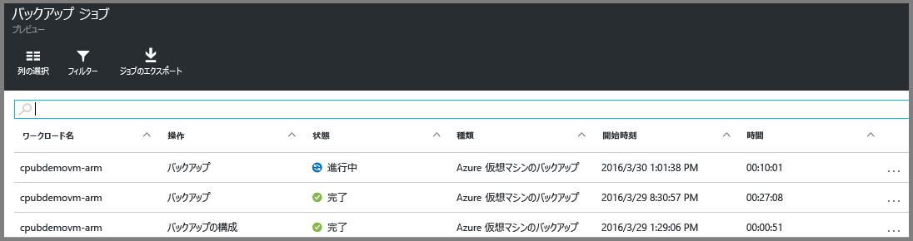

<properties
	pageTitle="Resource Manager でデプロイされた VM を Azure Backup を使用して保護する | Microsoft Azure"
	description="Resource Manager でデプロイされた VM を Azure Backup サービスを使用して保護します。Resource Manager でデプロイされた VM と Premium Storage VM のバックアップを使用してデータを保護します。Recovery Services コンテナーを作成および登録します。Azure で VM の登録、ポリシーの作成、VM の保護を行います。"
	services="backup"
	documentationCenter=""
	authors="markgalioto"
	manager="cfreeman"
	editor=""
	keyword="backups; vm backup"/>

<tags
	ms.service="backup"
	ms.workload="storage-backup-recovery"
	ms.tgt_pltfrm="na"
	ms.devlang="na"
	ms.topic="hero-article"
	ms.date="06/03/2016"
	ms.author="markgal; jimpark"/>

# 最初に: Resource Manager でデプロイされた VM の Recovery Services コンテナーへのバックアップ

> [AZURE.SELECTOR]
- [Resource Manager でデプロイされた VM をバックアップする](backup-azure-vms-first-look-arm.md)
- [クラシック モード VM のバックアップ](backup-azure-vms-first-look.md)

このチュートリアルでは、Recovery Services コンテナーの作成と Azure 仮想マシン (VM) のバックアップの手順について説明します。Recovery Services コンテナーの保護:

- Azure Resource Manager でデプロイされた VM
- クラシック VM
- Standard Storage VM
- Premium Storage VM

Premium Storage VM の保護の詳細については、[Premium Storage VM のバックアップと復元](backup-introduction-to-azure-backup.md#back-up-and-restore-premium-storage-vms)のセクションを参照してください。

>[AZURE.NOTE] このチュートリアルでは、既に Azure サブスクリプション内に VM があることと、バックアップ サービスが VM にアクセスできるようにしてあることを前提としています。Azure には、リソースの作成と操作に関して 2 種類のデプロイメント モデルがあります。[Resource Manager デプロイメント モデルとクラシック デプロイメント モデル](../resource-manager-deployment-model.md)です。この記事は、Resource Manager と Resource Manager でデプロイされた VM を使用するためのものです。

手順の概要は次のとおりです。

1. VM 用の Recovery Services コンテナーを作成する。
2. Azure ポータルを使用して、シナリオの選択、ポリシーの設定、および保護する項目の特定を行う。
3. 初回バックアップを実行する。

## 手順 1. VM 用の Recovery Services コンテナーを作成する

Recovery Services コンテナーは、経時的に作成されたすべてのバックアップと復旧ポイントを格納するエンティティです。Recovery Services コンテナーには、保護される VM に適用されるバックアップ ポリシーも含まれます。

>[AZURE.NOTE] VM のバックアップはローカルの処理です。ある場所から別の場所にある Recovery Services コンテナーに VM をバックアップすることはできません。そのため、バックアップする VM がある Azure の場所ごとに、少なくとも 1 つの Recovery Services コンテナーが存在する必要があります。

Recovery Services コンテナーを作成するには、次の手順に従います。

1. [Azure ポータル](https://portal.azure.com/)にサインインします。

2. ハブ メニューで **[参照]** をクリックし、リソースの一覧で「**Recovery Services**」と入力します。入力を始めると、入力内容に基づいて、一覧がフィルター処理されます。**[Recovery Services コンテナー]** をクリックします。

      

    Recovery Services コンテナーの一覧が表示されます。

3. **[Recovery Services コンテナー]** メニューの **[追加]** をクリックします。

    

    Recovery Services コンテナー ブレードが開き、**[名前]**、**[サブスクリプション]**、**[リソース グループ]**、および **[場所]** を指定するように求められます。

    

4. **[名前]** ボックスに、コンテナーを識別する表示名を入力します。名前は Azure サブスクリプションに対して一意である必要があります。2 ～ 50 文字の名前を入力します。名前の先頭にはアルファベットを使用する必要があります。また、名前に使用できるのはアルファベット、数字、ハイフンのみです。

5. **[サブスクリプション]** をクリックして、使用可能なサブスクリプションの一覧を表示します。どのサブスクリプションを使用すればよいかがわからない場合は、既定 (または推奨) のサブスクリプションを使用してください。組織のアカウントが複数の Azure サブスクリプションに関連付けられている場合に限り、複数の選択肢が存在します。

6. **[リソース グループ]** をクリックして、使用可能なリソース グループを表示するか、**[新規]** をクリックして、新しいリソース グループを作成します。リソース グループの詳細については、「[Azure Resource Manager の概要](../resource-group-overview.md)」を参照してください。

7. **[場所]** をクリックして、コンテナーの地理的リージョンを選択します。コンテナーは、保護する仮想マシンと同じリージョンにある**必要があります**。

    >[AZURE.IMPORTANT] VM がどの場所に存在するかが不明な場合は、コンテナーを作成するダイアログを閉じて、ポータルで仮想マシンの一覧に移動します。複数のリージョンに仮想マシンがある場合は、各リージョンで Recovery Services コンテナーを作成する必要があります。最初の場所でコンテナーを作成してから、次の場所に移動してください。バックアップ データを格納するストレージ アカウントを指定する必要はありません。これは、Recovery Services コンテナーと Azure Backup サービスにより自動的に処理されます。

8. **[作成]** をクリックします。Recovery Services コンテナーの作成に時間がかかることがあります。ポータルの右上隅で、状態の通知を監視します。コンテナーが作成されると、Recovery Services コンテナーの一覧に表示されます。

    

これで、コンテナーが作成されました。次は、ストレージ レプリケーションを設定する方法について説明します。

### ストレージ レプリケーションの設定

ストレージ レプリケーション オプションでは、geo 冗長ストレージとローカル冗長ストレージのどちらかを選択できます。既定では、コンテナーには geo 冗長ストレージがあります。プライマリ バックアップの場合は、オプションが geo 冗長ストレージに設定されているままにします。冗長性を犠牲にしても低コストなバックアップが必要な場合は、ローカル冗長ストレージを選択します。[geo 冗長](../storage/storage-redundancy.md#geo-redundant-storage)ストレージ オプションと[ローカル冗長](../storage/storage-redundancy.md#locally-redundant-storage)ストレージ オプションの詳細について、[Azure Storage のレプリケーションの概要](../storage/storage-redundancy.md)に関する記事を参照してください。

ストレージ レプリケーション設定を編集するには、次の手順を実行します。

1. コンテナーを選択して、コンテナーのダッシュボードと [設定] ブレードを開きます。**[設定]** ブレードが開かない場合は、コンテナーのダッシュボードで **[すべての設定]** をクリックします。

2. **[設定]** ブレードで、**[Backup Infrastructure]** (バックアップ インフラストラクチャ)、**[Backup Configuration]** (バックアップ構成) の順にクリックして、**[Backup Configuration]** (バックアップ構成) ブレードを開きます。**[Backup Configuration]** (バックアップ構成) ブレードで、コンテナーのストレージ レプリケーション オプションを選択します。

    

    コンテナーのストレージ オプションを選択したら、VM をコンテナーに関連付けることができます。関連付けを開始するには、Azure 仮想マシンを検出して登録する必要があります。

## 手順 2. バックアップの目標の選択、ポリシーの設定、保護する項目の定義を行う

VM をコンテナーに登録する前に、サブスクリプションに追加された新しい仮想マシンが特定されるように検出プロセスを実行してください。このプロセスでは、サブスクリプションに含まれる仮想マシンの一覧を、クラウド サービス名、リージョンなどの追加情報と共に Azure に照会します。Azure ポータルのシナリオは、Recovery Services コンテナーに何を格納するのかを指しています。ポリシーは、復旧ポイントを作成する頻度と時期のスケジュールです。ポリシーには、復旧ポイントの保持期間も含まれます。

1. 既に Recovery Services コンテナーが開かれている場合は、手順 2. に進みます。Recovery Services コンテナーが開かれていなくても、Azure ポータルが表示されている場合は、ハブ メニューの **[参照]** をクリックします。

  - リソースの一覧で「**Recovery Services**」と入力します。
  - 入力を始めると、入力内容に基づいて、一覧がフィルター処理されます。**[Recovery Services コンテナー]** が表示されたら、それをクリックします。

      

    Recovery Services コンテナーの一覧が表示されます。
  - Recovery Services コンテナーの一覧で、コンテナーを選択します。

    選択したコンテナーのダッシュボードが開きます。

    

2. コンテナーのダッシュボード メニューの **[Backup]** をクリックして、[Backup] ブレードを開きます。

    

    ブレードを開くと、Backup サービスがサブスクリプション内の新しい VM を検索します。

    

3. [Backup] ブレードで、**[Backup goal]** (バックアップの目標) をクリックして、[Backup Goal] \(バックアップの目標) ブレードを開きます。

    

4. [Backup Goal] \(バックアップの目標) ブレードで、**[Where is your workload running]** (ワークロードの実行場所) を [Azure] に、**[What do you want to backup]** (バックアップ対象) を [仮想マシン] に設定し、**[OK]** をクリックします。

    [Backup Goal] \(バックアップの目標) ブレードが閉じ、[バックアップ ポリシー] ブレードが開きます。

    

5. [バックアップ ポリシー] ブレードで、コンテナーに適用するバックアップ ポリシーを選択し、**[OK]** をクリックします。

    

    既定のポリシーの詳細が一覧表示されます。新しいポリシーを作成する場合は、ドロップダウン メニューの **[新規作成]** を選択します。このドロップダウン メニューでは、スナップショットの作成時刻を午後 7 時などに切り替えることもできます。バックアップ ポリシーを定義する手順については、「[バックアップ ポリシーの定義](backup-azure-vms-first-look-arm.md#defining-a-backup-policy)」を参照してください。**[OK]** をクリックすると、バックアップ ポリシーがコンテナーに関連付けられます。

    次に、コンテナーに関連付ける VM を選択します。

6. 指定したポリシーに関連付ける仮想マシンを選択し、**[選択]** をクリックします。

    

    目的の VM が表示されない場合は、Recovery Services コンテナーと同じ Azure の場所にその VM が存在することを確認します。

7. コンテナーの設定をすべて定義したところで、[Backup] ブレードで、ページの下部にある **[Enable Backup]** (バックアップの有効化) をクリックします。これにより、ポリシーがコンテナーと VM にデプロイされます。

    

## 手順 3. 初回バックアップを実行する

バックアップ ポリシーが仮想マシンにデプロイされても、データがバックアップされたわけではありません。既定では、(バックアップ ポリシーで定義されたように) スケジュールされた最初のバックアップが初回バックアップとなります。初回バックアップが実行されるまで、**[Backup Jobs]** (バックアップ ジョブ) ブレードの [前回のバックアップの状態] には、**[Warning(initial backup pending)]** (警告 (初回のバックアップが保留中)) と表示されます。

初回バックアップがすぐに開始される予定でない場合は、**[今すぐバックアップ]** を実行することをお勧めします。

**[今すぐバックアップ]** を実行するには、次の手順に従います。

1. コンテナー ダッシュボードの **[Backup]** タイルで、**[Azure Virtual Machines]** をクリックします。  

    **[バックアップ項目]** ブレードが開きます。

2. **[バックアップ項目]** ブレードで、バックアップするコンテナーを右クリックし、**[今すぐバックアップ]** をクリックします。

    

    バックアップ ジョブがトリガーされます。 

    

3. 初回バックアップが完了したことを確認するには、コンテナー ダッシュボードの **[Backup Jobs]** (バックアップ ジョブ) タイルで **[Azure Virtual Machines]** をクリックします。

    

    [バックアップ ジョブ] ブレードが開きます。

4. [バックアップ ジョブ] ブレードでは、すべてのジョブの状態を確認できます。

    

    >[AZURE.NOTE] Azure Backup サービスは、バックアップ操作の一部として、各仮想マシンのバックアップ拡張機能に対して、すべての書き込みをフラッシュし、整合性のあるスナップショットを作成するためのコマンドを発行します。

    バックアップ ジョブが完了すると、状態は *[完了]* になります。

[AZURE.INCLUDE [backup-create-backup-policy-for-vm](../../includes/backup-create-backup-policy-for-vm.md)]

## 仮想マシンに VM エージェントをインストールする

この情報は、必要な場合に備えて提供されます。バックアップ拡張機能を動作させるには、Azure VM エージェントを Azure 仮想マシンにインストールする必要があります。ただし、VM を Azure ギャラリーから作成した場合、VM エージェントは既に仮想マシンに存在します。オンプレミスのデータセンターから移行された VM には、VM エージェントがインストールされていません。このような場合は、VM エージェントをインストールする必要があります。Azure VM のバックアップで問題が発生する場合は、Azure VM エージェントが仮想マシンに正しくインストールされていることを確認してください (次の表を参照)。カスタム VM を作成している場合は、仮想マシンをプロビジョニングする前に、[**[VM エージェントのインストール]** チェック ボックスがオンになっていることを確認](../virtual-machines/virtual-machines-windows-classic-agents-and-extensions.md)してください。

詳細については、「[VM エージェント](https://go.microsoft.com/fwLink/?LinkID=390493&clcid=0x409)」と「[インストール方法](../virtual-machines/virtual-machines-windows-classic-manage-extensions.md)」に関するページをご覧ください。

次の表に、Windows VM と Linux VM の VM エージェントに関する追加情報をまとめています。

| **操作** | **Windows** | **Linux** |
| --- | --- | --- |
| VM エージェントのインストール | <li>[エージェント MSI](http://go.microsoft.com/fwlink/?LinkID=394789&clcid=0x409) をダウンロードしてインストールします。インストールを実行するには、管理者特権が必要です。<li>[VM プロパティを更新](http://blogs.msdn.com/b/mast/archive/2014/04/08/install-the-vm-agent-on-an-existing-azure-vm.aspx)して、エージェントがインストールされていることを示します。 | <li>GitHub から最新の [Linux エージェント](https://github.com/Azure/WALinuxAgent)をインストールします。インストールを実行するには、管理者特権が必要です。<li>[VM プロパティを更新](http://blogs.msdn.com/b/mast/archive/2014/04/08/install-the-vm-agent-on-an-existing-azure-vm.aspx)して、エージェントがインストールされていることを示します。 |
| VM エージェントの更新 | VM エージェントを更新するには、単純に [VM エージェント バイナリ](http://go.microsoft.com/fwlink/?LinkID=394789&clcid=0x409)を再インストールします。 VM エージェントの更新中にバックアップ操作が実行されないようにする必要があります。 | [Linux VM エージェントの更新](../virtual-machines-linux-update-agent.md)に関する手順に従ってください。 VM エージェントの更新中にバックアップ操作が実行されないようにする必要があります。 |
| VM エージェントのインストールの検証 | <li>Azure VM で *C:\\WindowsAzure\\Packages* フォルダーに移動します。<li>WaAppAgent.exe ファイルを探します。<li> このファイルを右クリックして、**[プロパティ]** をクリックした後、**[詳細]** タブを選択します。[製品バージョン] が 2.6.1198.718 以上であることを確認します。 | 該当なし |

### バックアップ拡張機能

VM エージェントが仮想マシンにインストールされると、Azure Backup サービスによって VM エージェントにバックアップ拡張機能がインストールされます。Azure Backup サービスは、バックアップ拡張機能のアップグレードと修正プログラムの適用をシームレスに自動実行します。

バックアップ拡張機能は、VM が実行されているかどうかにかかわらず、Backup サービスによってインストールされます。VM が実行されている場合は、アプリケーション整合性復旧ポイントを取得できる可能性が最も高くなります。Azure Backup サービスは、VM がオフになっている場合でも VM のバックアップを続行しますが、拡張機能はインストールされない可能性があります。これはオフライン VM と呼ばれます。この場合、復旧ポイントは、*クラッシュ整合性*復旧ポイントになります。

## トラブルシューティング情報
この記事のタスクを行っていて問題が発生した場合は、[トラブルシューティング ガイダンス](backup-azure-vms-troubleshoot.md)を参照してください。

## 疑問がある場合
ご不明な点がある場合や今後搭載を希望する機能がある場合は、[フィードバックをお送りください](http://aka.ms/azurebackup_feedback)。

<!---HONumber=AcomDC_0720_2016-->