# Recovery Services コンテナーへの Azure 仮想マシンのバックアップ

この記事では、仮想マシンの操作メニューまたは Recovery Services コンテナーから仮想マシンの保護を構成する方法を説明します。 Recovery Services コンテナーは次のものを保護します。

* Azure Resource Manager でデプロイされた VM
* クラシック VM
* Standard Storage VM
* Premium Storage VM
* Managed Disks で実行されている VM
* Azure Disk Encryption を使って暗号化された VM
* VSS を使用する Windows VM と、カスタム プリスナップショット スクリプトおよびポストスナップショット スクリプトを使用する Linux VM のアプリケーション整合性バックアップ

Premium Storage VM の保護の詳細については、[Premium Storage VM のバックアップと復元](backup-introduction-to-azure-backup.md#using-premium-storage-vms-with-azure-backup)に関する記事をご覧ください。 マネージド ディスク VM のサポートの詳細については、[マネージド ディスクの VM のバックアップと復元](backup-introduction-to-azure-backup.md#using-managed-disk-vms-with-azure-backup)に関するページをご覧ください。 Linux VM バックアップの事前および事後スクリプト フレームワークの詳細については、[事前スクリプトおよび事後スクリプトを使用したアプリケーション整合性 Linux VM バックアップ](https://docs.microsoft.com/azure/backup/backup-azure-linux-app-consistent)に関するページを参照してください。

バックアップできるものとバックアップできないものについて詳しくは、[Azure VM をバックアップするための環境の準備](backup-azure-arm-vms-prepare.md#limitations-when-backing-up-and-restoring-a-vm)に関する記事をご覧ください。

> [!NOTE]
> Backup サービスでは、復元ポイント コレクションを格納する VM のリソース グループとは別のリソース グループが作成されます。 Backup サービスに使用するために作成されたリソース グループはロックしないことをお勧めします。
Backup サービスによって作成されるリソース グループは、AzureBackupRG_`<Geo>`_`<number>` という形式で名前が付けられます。
 例: AzureBackupRG_northeurope_1
>
>

保護する仮想マシンの数に応じて、さまざまな開始点から開始できます。 1 回の操作で複数の仮想マシンをバックアップする場合は、Recovery Services コンテナーに移動し、[コンテナーのダッシュボードからバックアップ ジョブを開始](backup-azure-vms-first-look-arm.md#configure-the-backup-job-from-the-recovery-services-vault)します。 バックアップする仮想マシンが 1 台の場合は、[VM 操作メニューからバックアップ ジョブを開始します](backup-azure-vms-first-look-arm.md#configure-the-backup-job-from-the-vm-operations-menu)。

## VM 操作メニューからバックアップ ジョブを構成する

仮想マシン操作メニューからバックアップ ジョブを構成するには、次の手順のようにします。 この手順が適用されるのは、Azure Portal の仮想マシンのみです。

1. [Azure Portal](https://portal.azure.com/) にサインインします。
2. ハブ メニューの **[すべてのサービス]** をクリックし、[フィルター] ダイアログで「**Virtual machines**」と入力します。 入力中、リソースにフィルターが適用されます。 仮想マシンが表示されたら、それを選択します。

  ![[すべてのサービス] から仮想マシンに移動する方法を示すスクリーンショット](./media/backup-azure-vms-first-look-arm/open-vm-from-hub.png)

  サブスクリプションの仮想マシン (VM) の一覧が表示されます。

  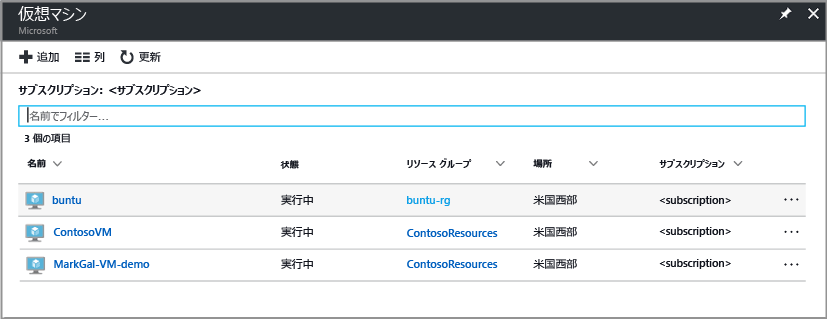

3. バックアップする VM を一覧から選択します。

  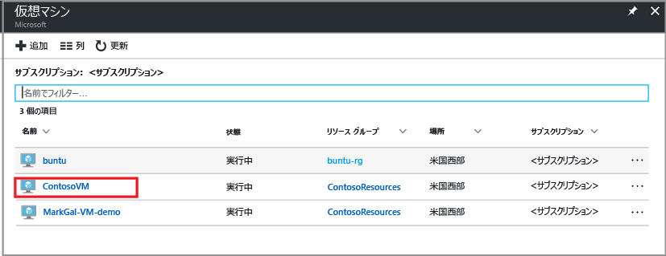

  VM を選択すると、仮想マシンの一覧が左側に移動し、仮想マシン管理メニューと仮想マシン ダッシュボードが開きます。

4. VM 管理メニューの **[操作]** セクションで、**[バックアップ]** をクリックします。  

  

  [バックアップの有効化] メニューが開きます。

  

5. [Recovery Services コンテナー] 領域で、**[既存のものを選択]** をクリックし、ドロップダウン リストからコンテナーを選びます。

  

  Recovery Services コンテナーがないか、新しいコンテナーを使用する場合は、**[新規作成]** をクリックし、新しいコンテナーの名前を指定します。 仮想マシンと同じリソース グループおよび同じリージョンに、新しいコンテナーが作成されます。 別の値で Recovery Services コンテナーを作成する場合は、[Recovery Services コンテナーを作成する](backup-azure-vms-first-look-arm.md#create-a-recovery-services-vault-for-a-vm)方法に関するセクションをご覧ください。

6. [バックアップ ポリシーの選択] メニューからポリシーを選びます。 選んだポリシーの詳細が、ドロップダウン メニューの下に表示されます。

  新しいポリシーを作成する場合、または既存のポリシーを編集する場合は、**[Create (or edit) a new policy]\(新しいポリシーを作成 (または編集) する\)** をクリックして、バックアップ ポリシー エディターを開きます。 バックアップ ポリシーを定義する手順については、「 [バックアップ ポリシーの定義](backup-azure-vms-first-look-arm.md#defining-a-backup-policy)」を参照してください。 バックアップ ポリシーへの変更を保存して、[バックアップの有効化] メニューに戻るには、**[OK]** をクリックします。

  

7. 仮想マシンに Recovery Services コンテナーとバックアップ ポリシーを適用するには、**[バックアップの有効化]** をクリックしてポリシーを展開します。 ポリシーをデプロイすることで、そのポリシーがコンテナーと仮想マシンに関連付けられます。

  ![[バックアップの有効化] ボタン](./media/backup-azure-vms-first-look-arm/vm-management-menu-enable-backup-button.png)

8. 構成の進行状況は、ポータルに表示される通知で追跡できます。 次の例は、デプロイが開始されたことを示しています。

  

9. 構成が完了したら、VM 管理メニューで **[バックアップ]** をクリックして [バックアップ] メニューを開き、使用可能な詳細を表示します。

  

  初回バックアップが完了するまで、**[前回のバックアップの状態]** には **[警告 (初回のバックアップが保留中)]** が表示されます。 次のスケジュールされたバックアップ ジョブが発生するタイミングを確認するには、**[サマリー]** でポリシーの名前をクリックします。 [バックアップ ポリシー] メニューが開き、スケジュールされたバックアップの時間が表示されます。

10. 仮想マシンを保護するには、**[今すぐバックアップ]** をクリックします。 

  ![[今すぐバックアップ] をクリックして最初のバックアップ ジョブを実行する](./media/backup-azure-vms-first-look-arm/backup-now-update.png)

  [今すぐバックアップ] メニューが開きます。 

  ![[今すぐバックアップ] ブレードが開く](./media/backup-azure-vms-first-look-arm/backup-now-blade-short.png)

11. [今すぐバックアップ] メニューでカレンダー アイコンをクリックし、カレンダー コントロールを使ってこの復旧ポイントを保持する最終日を選び、**[OK]** をクリックします。

  

  デプロイ通知で、バックアップ ジョブがトリガーされたこと、および [バックアップ ジョブ] ページでジョブの進行状況を監視できることが示されます。

## Recovery Services コンテナーからバックアップ ジョブを構成する
バックアップ ジョブを構成するには、以下の手順を実行します。

1. 仮想マシン用の Recovery Services コンテナーを作成する。
2. Azure Portal を使用して、シナリオの選択、バックアップ ポリシーの設定、保護する項目の特定を行う。
3. 初回バックアップを実行する。

## VM 用の Recovery Services コンテナーを作成する
Recovery Services コンテナーは、経時的に作成されたすべてのバックアップと復旧ポイントを格納するエンティティです。 Recovery Services コンテナーには、保護される VM に適用されるバックアップ ポリシーも含まれます。

> [!NOTE]
> VM のバックアップはローカルの処理です。 あるリージョンから別のリージョンにある Recovery Services コンテナーに VM をバックアップすることはできません。 そのため、バックアップする VM がある Azure リージョンごとに、少なくとも 1 つの Recovery Services コンテナーが存在する必要があります。
>
>

Recovery Services コンテナーを作成するには、次の手順に従います。

1. まだサインインしていない場合は、Azure サブスクリプションを使用して [Azure Portal](https://portal.azure.com/) にサインインします。
2. ハブ メニューの **[すべてのサービス]** をクリックし、[フィルター] ダイアログで「**Recovery Services**」と入力します。 入力中、リソースにフィルターが適用されます。 一覧に Recovery Services コンテナーが表示されたら、それをクリックします。

    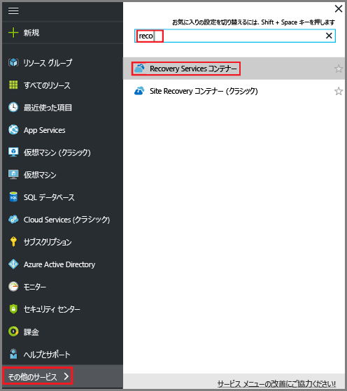  

    サブスクリプションに Recovery Services コンテナーがある場合は、そのコンテナーが一覧表示されます。

    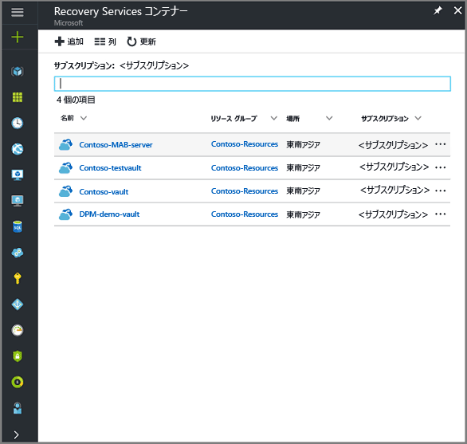
3. **[Recovery Services コンテナー]** メニューの **[追加]** をクリックします。

    

    [Recovery Services コンテナー] メニューが開き、**[名前]**、**[サブスクリプション]**、**[リソース グループ]**、**[場所]** を指定するよう求められます。

    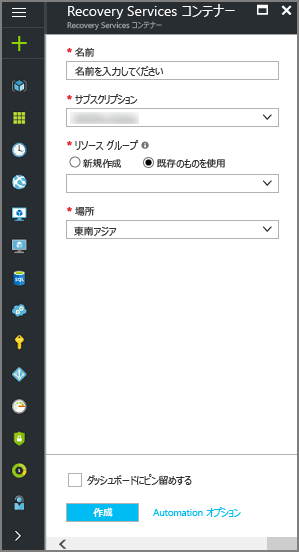

4. **[名前]** ボックスに、コンテナーを識別する表示名を入力します。 名前は Azure サブスクリプションに対して一意である必要があります。 2 ～ 50 文字の名前を入力します。 名前の先頭にはアルファベットを使用する必要があります。また、名前に使用できるのはアルファベット、数字、ハイフンのみです。

5. **[サブスクリプション]** セクションで、ドロップダウン メニューを使用して Azure サブスクリプションを選択します。 サブスクリプションが 1 つのみの場合は、そのサブスクリプションが表示されるので、次の手順に進んでください。 どのサブスクリプションを使用すればよいかがわからない場合は、既定 (または推奨) のサブスクリプションを使用してください。 組織のアカウントが複数の Azure サブスクリプションに関連付けられている場合に限り、複数の選択肢が存在します。

6. **[リソース グループ]** セクションで、次のことを行います。

    * リソース グループを作成する場合は、**[新規作成]** を選択します。
    または
    * 使用可能なリソース グループの一覧を表示するには、**[既存のものを使用]** を選択し、ドロップダウン メニューをクリックします。

  リソース グループの詳細については、「[Azure Resource Manager の概要](../azure-resource-manager/resource-group-overview.md)」をご覧ください。

7. **[場所]** をクリックして、コンテナーの地理的リージョンを選択します。 この選択により、バックアップ データの送信先となるリージョンが決まります。

  > [!IMPORTANT]
  > VM がどのリージョンに存在するかが不明な場合は、コンテナーを作成するダイアログを閉じて、ポータルで仮想マシンの一覧に移動します。 複数のリージョンに仮想マシンがある場合は、各リージョンで Recovery Services コンテナーを作成します。 最初のリージョンでコンテナーを作成してから、次のリージョンに移動してください。 バックアップ データの格納に使用するストレージ アカウントを指定する必要はありません。ストレージの処理は、Recovery Services コンテナーと Azure Backup サービスにより自動的に行われます。
  >

8. [Recovery Services コンテナー] メニューの下部にある **[作成]** をクリックします。

    Recovery Services コンテナーの作成には数分かかることがあります。 ポータルの右上の領域で、状態の通知を監視します。 コンテナーが作成されると、Recovery Services コンテナーの一覧に表示されます。 数分経過してもコンテナーが表示されない場合は、**[最新の情報に更新]** をクリックしてください。

    ![[最新の情報に更新] ボタンをクリックする](./media/backup-try-azure-backup-in-10-mins/refresh-button.png) 

    Recovery Services コンテナーの一覧にコンテナーが表示されたら、ストレージ冗長性を設定する準備が整いました。

これで、コンテナーが作成されました。次は、ストレージ レプリケーションを設定する方法について説明します。

### ストレージ レプリケーションの設定
ストレージ レプリケーション オプションでは、geo 冗長ストレージとローカル冗長ストレージのどちらかを選択できます。 既定では、コンテナーには geo 冗長ストレージがあります。 Recovery Services コンテナーがプライマリ バックアップである場合は、ストレージ レプリケーション オプションの設定を geo 冗長ストレージのままにしておいてください。 永続性を犠牲にしても低コストなバックアップが必要な場合は、ローカル冗長ストレージを選択します。 [geo 冗長](../storage/common/storage-redundancy-grs.md)ストレージ オプションと[ローカル冗長](../storage/common/storage-redundancy-lrs.md)ストレージ オプションの詳細については、[Azure Storage のレプリケーションの概要](../storage/common/storage-redundancy.md)に関する記事をご覧ください。

ストレージ レプリケーション設定を編集するには、次の手順を実行します。

1. **[Recovery Services コンテナー]** メニューで、新しいコンテナーを選択します。

  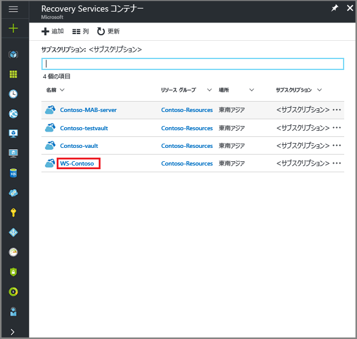

  コンテナーを選択すると、[設定] メニュー ("*上部にコンテナー名が表示されているメニュー*") とコンテナー ダッシュボードが開きます。

  

2. 新しいコンテナーの管理メニューで、垂直スライドを使って下へスクロールして [管理] セクションに移動し、**[バックアップ インフラストラクチャ]** をクリックして [バックアップ インフラストラクチャ] メニューを開きます。
 
   

3. [バックアップ インフラストラクチャ] メニューで、**[バックアップ構成]** をクリックして **[バックアップ構成]** メニューを開きます。

    
4. コンテナーの適切なストレージ レプリケーション オプションを選択します。

    

    既定では、コンテナーには geo 冗長ストレージがあります。 プライマリ バックアップ ストレージ エンドポイントとして Azure を使用する場合は、引き続き **[geo 冗長]** を使用します。 プライマリ バックアップ ストレージ エンドポイントとして Azure を使用しない場合、**[ローカル冗長]** を選択します。これにより、Azure ストレージのコストを削減できます。 [geo 冗長](../storage/common/storage-redundancy-grs.md)ストレージと[ローカル冗長](../storage/common/storage-redundancy-lrs.md)ストレージのオプションの詳細については、こちらの[ストレージ冗長性の概要](../storage/common/storage-redundancy.md)を参照してください。

## バックアップの目標を選択し、ポリシーを設定し、保護する項目の定義する
VM をコンテナーに登録する前に、サブスクリプションに追加された新しい仮想マシンが特定されるように検出プロセスを実行してください。 このプロセスでは、サブスクリプションに含まれる仮想マシンの一覧を、クラウド サービス名、リージョンなどの追加情報と共に Azure に照会します。 Azure ポータルのシナリオは、Recovery Services コンテナーに何を格納するのかを指しています。 ポリシーは、復旧ポイントを作成する頻度と時期のスケジュールです。 ポリシーには、復旧ポイントの保持期間も含まれます。

1. 既に Recovery Services コンテナーが開かれている場合は、手順 2. に進みます。 そうでない場合は、**[すべてのサービス]** をクリックします。 「**Recovery Services**」と入力し、**[Recovery Services コンテナー]** をクリックします。

      

    Recovery Services コンテナーの一覧が表示されます。

    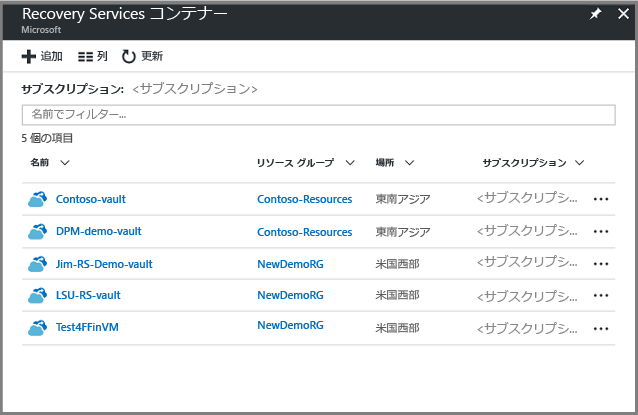

    Recovery Services コンテナーの一覧で、コンテナーを選択して、そのダッシュボードを開きます。

     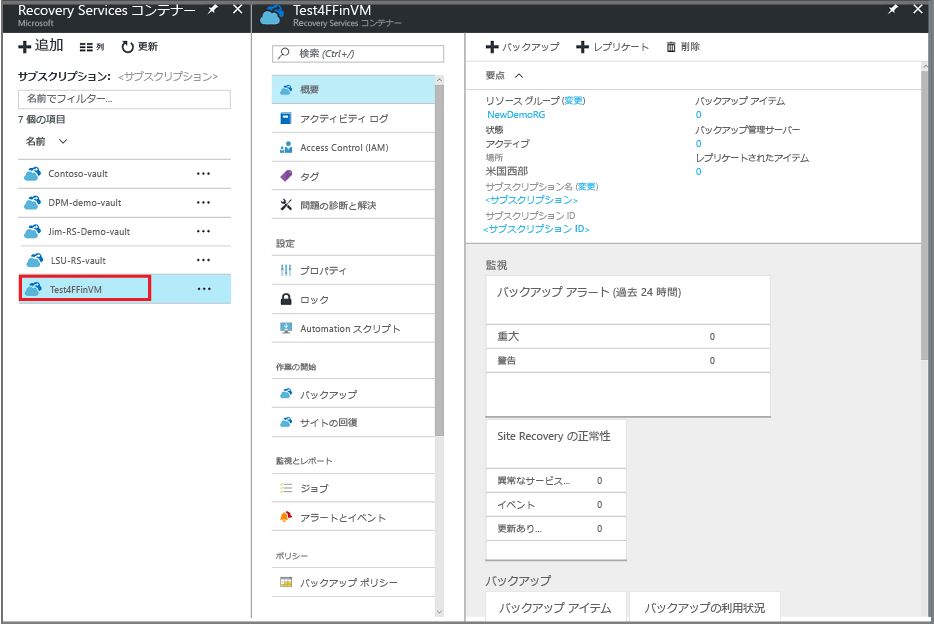

2. コンテナーのダッシュボード メニューの **[バックアップ]** をクリックして、[バックアップ] メニューを開きます。

    ![[バックアップ] メニューを開く](./media/backup-azure-arm-vms-prepare/backup-button.png)

    [バックアップ] メニューと [バックアップの目標] メニューが開きます。

    ![[シナリオ] メニューを開く](./media/backup-azure-arm-vms-prepare/select-backup-goal-1.png)
3. [バックアップの目標] メニューで、**[ワークロードはどこで実行されていますか?]** ドロップダウン メニューから [Azure] を選択します。 **[What do you want to backup (バックアップ対象)]** ドロップダウンから仮想マシンを選択し、**[OK]** をクリックします。

    これらの操作により、VM 拡張機能がコンテナーに登録されます。 [バックアップの目標] メニューが閉じ、**[バックアップ ポリシー]** メニューが開きます。

    ![[シナリオ] メニューを開く](./media/backup-azure-arm-vms-prepare/select-backup-goal-2.png)

4. [バックアップ ポリシー] メニューで、コンテナーに適用するバックアップ ポリシーを選択します。

    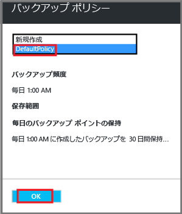

    既定のポリシーの詳細がドロップダウン メニューの下に一覧表示されます。 ポリシーを作成する場合は、ドロップダウン メニューの **[新規作成]** を選択します。 バックアップ ポリシーを定義する手順については、「 [バックアップ ポリシーの定義](backup-azure-vms-first-look-arm.md#defining-a-backup-policy)」を参照してください。
    **[OK]** をクリックして、バックアップ ポリシーをコンテナーに関連付けます。

    [バックアップ ポリシー] メニューが閉じ、**[仮想マシンの選択]** メニューが開きます。
5. **[仮想マシンの選択]** メニューで、指定したポリシーに関連付ける仮想マシンを選択し、**[OK]** をクリックします。

    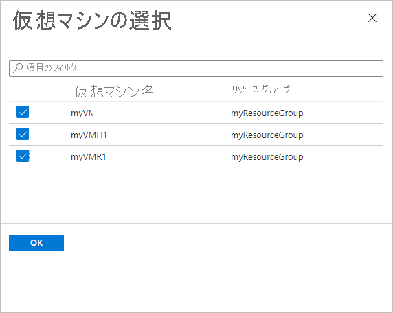

    選択した仮想マシンが検証されます。 予期していた仮想マシンが表示されない場合は、Recovery Services コンテナーと同じ Azure の場所にその仮想マシンが存在し、まだ保護されていないことを確認します。 Recovery Services コンテナーの場所は、コンテナーのダッシュボードに表示されます。

6. コンテナーの設定をすべて定義したところで、[バックアップ] メニューで **[バックアップの有効化]** をクリックし、コンテナーと VM にポリシーをデプロイします。 バックアップ ポリシーをデプロイしても、仮想マシンの最初の回復ポイントは作成されません。

    ![[バックアップの有効化]](./media/backup-azure-arm-vms-prepare/vm-validated-click-enable.png)

バックアップが有効になると、バックアップ ポリシーがスケジュールに従って実行されますが、 最初のバックアップ ジョブに進みます。

## 初回バックアップ
バックアップ ポリシーが仮想マシンにデプロイされても、データがバックアップされたわけではありません。 既定では、(バックアップ ポリシーで定義されたように) スケジュールされた最初のバックアップが初回バックアップとなります。 初回バックアップが実行されるまで、**[バックアップ ジョブ]** メニューの [前回のバックアップの状態] には、**[警告 (初回のバックアップが保留中)]** と表示されます。

初回バックアップがすぐに開始される予定でない場合は、 **[今すぐバックアップ]** を実行することをお勧めします。

最初のバックアップ ジョブを実行するには:

1. コンテナー ダッシュボードで、**[バックアップ項目]** の下の番号をクリックするか、**[バックアップ項目]** タイルをクリックします。  
  ![[設定] アイコン](./media/backup-azure-vms-first-look-arm/rs-vault-config-vm-back-up-now-1.png)

  **[バックアップ項目]** メニューが開きます。

  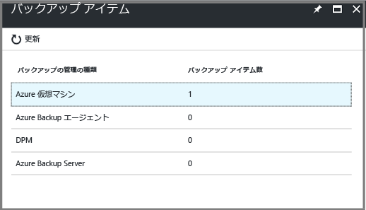

2. **[バックアップ項目]** メニューで、項目を選択します。

  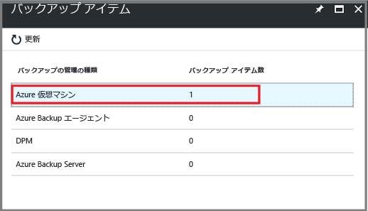

  **[バックアップ項目]** の一覧が開きます。  

  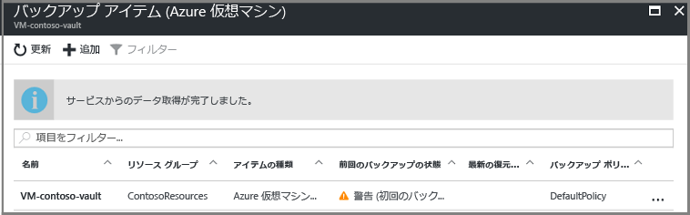

3. **[バックアップ項目]** の一覧で、省略記号 **[...]** をクリックしてコンテキスト メニューを開きます。

  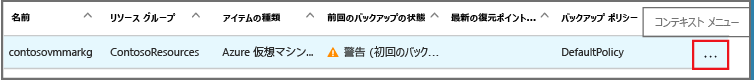

  コンテキスト メニューが表示されます。

  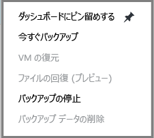

4. コンテキスト メニューで、**[今すぐバックアップ]** をクリックします。

  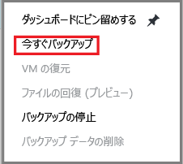

  [今すぐバックアップ] メニューが開きます。

  ![[今すぐバックアップ] メニューが開く](./media/backup-azure-vms-first-look-arm/backup-now-blade-short.png)

5. [今すぐバックアップ] メニューでカレンダー アイコンをクリックし、カレンダー コントロールを使ってこの復旧ポイントを保持する最終日を選び、**[バックアップ]** をクリックします。

  

  デプロイ通知で、バックアップ ジョブがトリガーされたこと、および [バックアップ ジョブ] ページでジョブの進行状況を監視できることが示されます。 VM のサイズによっては、最初のバックアップの作成に時間がかかる場合があります。

6. 初期バックアップの状態を表示または追跡するには、コンテナー ダッシュボードの **[バックアップ ジョブ]** タイルで **[進行中]** をクリックします。

  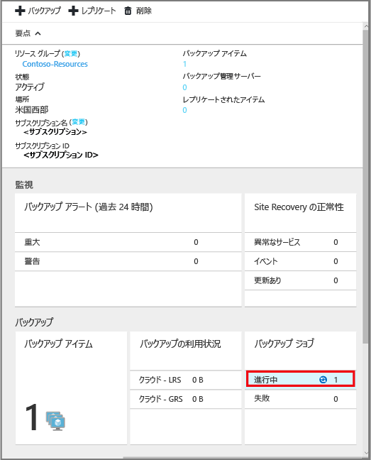

  [バックアップ ジョブ] メニューが開きます。

  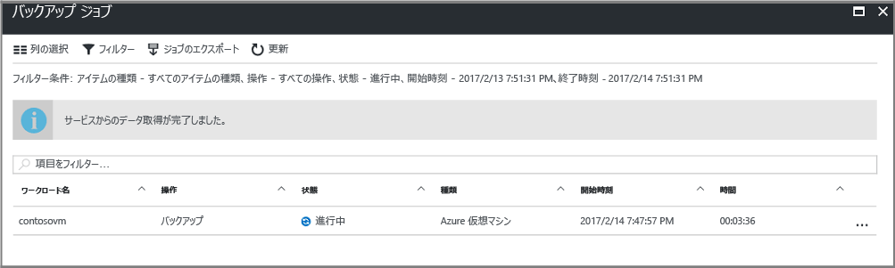

  **[バックアップ ジョブ]** メニューでは、すべてのジョブの状態を確認できます。 VM のバックアップ ジョブがまだ進行中か、または終了したかを確認します。 バックアップ ジョブが完了すると、状態は *[完了]* になります。

  > [!NOTE]
  > Azure Backup サービスは、バックアップ操作の一部として、各 VM のバックアップ拡張機能に対して、すべての書き込みをフラッシュし、整合性のあるスナップショットを作成するためのコマンドを発行します。
  >
  >

[!INCLUDE [backup-create-backup-policy-for-vm](../../includes/backup-create-backup-policy-for-vm.md)]

## 仮想マシンに VM エージェントをインストールする
この情報は、必要な場合に備えて提供されます。 バックアップ拡張機能を動作させるには、Azure VM エージェントを Azure 仮想マシンにインストールする必要があります。 ただし、VM を Azure ギャラリーから作成した場合、VM エージェントは既に仮想マシンに存在します。 オンプレミスのデータセンターから移行された VM には、VM エージェントがインストールされていません。 このような場合は、VM エージェントをインストールする必要があります。 Azure VM のバックアップで問題が発生する場合は、Azure VM エージェントが仮想マシンに正しくインストールされていることを確認してください (以下の表を参照)。 カスタム VM を作成する場合は、仮想マシンをプロビジョニングする前に、VM エージェントをインストールしてください。

詳細については、[VM エージェント](https://go.microsoft.com/fwLink/?LinkID=390493&clcid=0x409)および[インストール方法](../virtual-machines/windows/classic/manage-extensions.md?toc=%2fazure%2fvirtual-machines%2fwindows%2fclassic%2ftoc.json)に関する記事をご覧ください。

次の表に、Windows VM と Linux VM の VM エージェントに関する追加情報をまとめています。

| **操作** | **Windows** | **Linux** |
| --- | --- | --- |
| VM エージェントのインストール |<li>[エージェント MSI](http://go.microsoft.com/fwlink/?LinkID=394789&clcid=0x409)をダウンロードしてインストールします。 インストールを実行するには、管理者特権が必要です。 <li>[VM プロパティを更新](http://blogs.msdn.com/b/mast/archive/2014/04/08/install-the-vm-agent-on-an-existing-azure-vm.aspx) して、エージェントがインストールされていることを示します。 |<li> GitHub から最新の [Linux エージェント](https://github.com/Azure/WALinuxAgent) をインストールします。 インストールを実行するには、管理者特権が必要です。 <li> [VM プロパティを更新](http://blogs.msdn.com/b/mast/archive/2014/04/08/install-the-vm-agent-on-an-existing-azure-vm.aspx) して、エージェントがインストールされていることを示します。 |
| VM エージェントの更新 |VM エージェントを更新するには、単純に [VM エージェント バイナリ](http://go.microsoft.com/fwlink/?LinkID=394789&clcid=0x409)を再インストールします。  VM エージェントの更新中にバックアップ操作が実行されないようにする必要があります。 |[Linux VM エージェントの更新 ](../virtual-machines/linux/update-agent.md?toc=%2fazure%2fvirtual-machines%2flinux%2ftoc.json)に関する手順に従います。  VM エージェントの更新中にバックアップ操作が実行されないようにする必要があります。 |
| VM エージェントのインストールの検証 |<li>Azure VM で *C:\WindowsAzure\Packages* フォルダーに移動します。 <li>WaAppAgent.exe ファイルを探します。<li> このファイルを右クリックして **[プロパティ]** をクリックし、**[詳細]** タブを選択します。[製品バージョン] が 2.6.1198.718 以上であることを確認します。 |該当なし |

### バックアップ拡張機能
VM エージェントが仮想マシンにインストールされると、Azure Backup サービスによって VM エージェントにバックアップ拡張機能がインストールされます。 Azure Backup サービスは、バックアップ拡張機能のアップグレードと修正プログラムの適用をシームレスに自動実行します。

Backup サービスでは、VM が実行されていない場合でもバックアップ拡張機能がインストールされます。 VM が実行されている場合は、アプリケーション整合性復旧ポイントを取得できる可能性が最も高くなります。 ただし、Azure Backup サービスは、VM がオフになっている場合でも VM のバックアップを続行しますが、拡張機能はインストールされない可能性があります。 このような種類のバックアップはオフライン VM と呼ばれ、復旧ポイントは "*クラッシュ整合性*" の復旧ポイントとなります。

## トラブルシューティング情報
この記事のタスクを行っていて問題が発生した場合は、 [トラブルシューティング ガイダンス](backup-azure-vms-troubleshoot.md)を参照してください。

## 価格
Azure VM のバックアップ コストは、保護されているインスタンスの数によって決まります。 保護されているインスタンスの定義については、「[保護されているインスタンスとは](backup-introduction-to-azure-backup.md#what-is-a-protected-instance)」を参照してください。 仮想マシンのバックアップ コストの計算例については、[保護されているインスタンスの計算方法](backup-azure-vms-introduction.md#calculating-the-cost-of-protected-instances)に関する記事を参照してください。 Azure Backup の価格設定については、「[Backup の価格](https://azure.microsoft.com/pricing/details/backup/)」のページを参照してください。

## 疑問がある場合
ご不明な点がある場合や今後搭載を希望する機能がある場合は、 [フィードバックをお送りください](http://aka.ms/azurebackup_feedback)。
