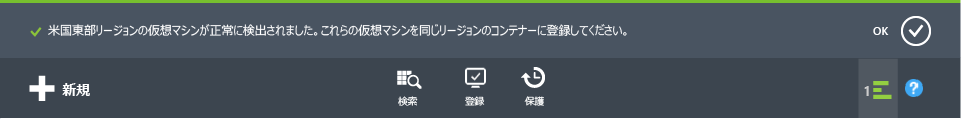

# 最初に: Azure 仮想マシンのバックアップ
> [!div class="op_single_selector"]
> * [Recovery Services コンテナーを使用した VM の保護](backup-azure-vms-first-look-arm.md)
> * [バックアップ コンテナーを使用した Azure VM の保護](backup-azure-vms-first-look.md)
>
>

このチュートリアルでは、Azure 仮想マシン (VM) を Azure のバックアップ コンテナーにバックアップする手順について説明します。 この記事では、クラシック モデルまたは Service Manager デプロイメント モデルでの VM のバックアップについて説明します。 以降の手順は、クラシック ポータルで作成されたバックアップ コンテナーのみを対象としています。 新たにデプロイする場合は、Resource Manager モデルを使用することをお勧めします。

リソース グループに属する Recovery Services コンテナーへの VM のバックアップについては、「 [最初に: Recovery Services コンテナーを使用した VM の保護](backup-azure-vms-first-look-arm.md)」を参照してください。

以降のチュートリアルは、次の条件が満たされていることを前提としています。

* Azure サブスクリプションで既に VM を作成している。
* VM が Azure パブリック IP アドレスに接続できる。 詳細については、「[ネットワーク接続](backup-azure-vms-prepare.md#network-connectivity)」を参照してください。

> [!NOTE]
> Azure には、リソースの作成と操作に関して&2; 種類のデプロイメント モデルがあります。[Resource Manager デプロイメント モデルとクラシック デプロイメント モデル](../azure-resource-manager/resource-manager-deployment-model.md)です。 このチュートリアルは、クラシック ポータルで作成された仮想マシンを対象としています。
>
>

## バックアップ資格情報コンテナーの作成
バックアップ コンテナーは、経時的に作成されたすべてのバックアップと復旧ポイントを格納するエンティティです。 バックアップ コンテナーには、バックアップ対象の仮想マシンに適用されるバックアップ ポリシーも含まれています。

> [!IMPORTANT]
> 2017 年 3 月以降、クラシック ポータルを使用してバックアップ コンテナーを作成することはできなくなります。 既にあるバックアップ コンテナーは引き続きサポートされ、[Azure PowerShell を使用してバックアップ コンテナーを作成](./backup-client-automation-classic.md#create-a-backup-vault)することが可能です。 ただし将来的な機能強化は Recovery Services コンテナーに限定されるため、Microsoft では、すべてのデプロイに関して Recovery Services コンテナーを作成することを推奨しています。

## Azure 仮想マシンの検出と登録
コンテナーに VM を登録する前に、検出プロセスを実行して新しい VM を検出します。 これにより、サブスクリプションに含まれる仮想マシンの一覧が、クラウド サービス名、リージョンなどの追加情報と共に返されます。

1. [Azure クラシック ポータル](http://manage.windowsazure.com/)
2. Azure クラシック ポータルで、 **[Recovery Services]** をクリックして Recovery Services コンテナーの一覧を開きます。
    
3. コンテナーの一覧で、VM をバックアップするコンテナーを選択します。

    コンテナーを選択すると、 **[クイック スタート]** ページが開きます。
4. コンテナーのメニューの **[登録済みの項目]**をクリックします。

    
5. **[種類]** メニューの **[Azure 仮想マシン]** を選択します。

    
6. ページの下部にある **[検出]** をクリックします。
    ![[検出] ボタン](./media/backup-azure-vms/discover-button-only.png)

    仮想マシンが集計されるまで、この検出プロセスに数分かかる場合があります。 プロセスが実行中であることを知らせる通知が画面の下部に表示されます。

    

    プロセスが完了すると、通知が変更されます。

    
7. ページの下部にある **[登録]** をクリックします。
    ![[登録] ボタン](./media/backup-azure-vms-first-look/register-icon.png)
8. **[項目の登録]** ショートカット メニューで、登録する仮想マシンを選択します。

   > [!TIP]
   > 一度に複数の仮想マシンを登録することができます。
   >
   >

    選択した仮想マシンごとにジョブが作成されます。
9. 通知内の **[ジョブの表示]** をクリックして **[ジョブ]** ページに移動します。

    

    仮想マシンが登録済みの項目の一覧にも、登録操作の状態と共に表示されます。

    

    操作が完了すると、状態が変更され、" *登録済み* " 状態が反映されます。

    

## 仮想マシンに VM エージェントをインストールする
バックアップ拡張機能を動作させるには、Azure VM エージェントを Azure 仮想マシンにインストールする必要があります。 VM を Azure ギャラリーから作成した場合、VM エージェントは既に VM に存在します。[VM の保護](backup-azure-vms-first-look.md#create-the-backup-policy)に進むことができます。

オンプレミス データセンターから VM を移行した場合、VM にはおそらく VM エージェントがインストールされていません。 VM の保護に進む前に、仮想マシンに VM エージェントをインストールする必要があります。 VM エージェントをインストールする詳しい手順については、 [VM のバックアップに関する記事の VM エージェントのセクション](backup-azure-vms-prepare.md#vm-agent)をご覧ください。

## バックアップ ポリシーの作成
最初のバックアップ ジョブをトリガーする前に、バックアップ スナップショットの取得スケジュールを設定します。 バックアップ スナップショットの取得スケジュールと、スナップショットのリテンション期間は、バックアップ ポリシーです。 リテンション期間情報は、祖父-父-子バックアップ ローテーション スキームに基づいています。

1. Azure クラシック ポータルの **[Recovery Services]** にあるバックアップ コンテナーに移動し、**[登録済みの項目]** をクリックします。
2. ドロップダウン メニューから **[Azure 仮想マシン]** を選択します。

    
3. ページの下部にある **[保護]** をクリックします。
    ![[保護] をクリック](./media/backup-azure-vms-first-look/protect-icon.png)

    **項目の保護ウィザード** が表示され、登録済みで保護されていない仮想マシン " *のみ* " が一覧表示されます。

    
4. 保護する仮想マシンを選択します。

    同じ名前の仮想マシンが&2; つ以上ある場合は、クラウド サービスを使用して仮想マシンを区別します。
5. **[保護の構成]** メニューで、特定した仮想マシンを保護するための既存のポリシーを選択するか、新しいポリシーを作成します。

    新しいバックアップ コンテナーには、コンテナーに関連付けられている既定のポリシーがあります。 このポリシーでは 1 日 1 回夜間にスナップショットを取得し、そのスナップショットを 30 日間保持します。 各バックアップ ポリシーには、複数の仮想マシンを関連付けることができます。 ただし、仮想マシンは同時に&1; つのポリシーにしか関連付けることができません。

    

   > [!NOTE]
   > バックアップ ポリシーには、スケジュールされたバックアップの保持スキーマが含まれています。 既存のバックアップ ポリシーを選択した場合は、次の手順で保持期間オプションを変更することができません。
   >
   >
6. **[リテンション期間]** で、特定のバックアップ ポイントの日、週、月、および年単位の期間を定義します。

    

    バックアップを保存する期間は保持ポリシーで指定します。 バックアップが作成されたタイミングに応じて異なる保持ポリシーを指定することができます。
7. **[ジョブ]** をクリックすると、**[保護の構成]** ジョブの一覧が表示されます。

    

    ポリシーを確立したら、次の手順に進み、初回のバックアップを実行します。

## 初回バックアップ
ポリシーを使用して仮想マシンが保護されると、その関係が **[保護された項目]** タブに表示されます。 初回バックアップが行われるまで、**[保護の状態]** には **[Protected - (pending initial backup) (保護済み (初回のバックアップが保留中))]** と表示されます。 既定では、スケジュールされた最初のバックアップが *初回バックアップ*となります。

初回バックアップをすぐに開始するには、次の操作を行います。

1. **[保護された項目]** ページの下部にある **[今すぐバックアップ]** をクリックします。
    ![[今すぐバックアップ] アイコン](./media/backup-azure-vms-first-look/backup-now-icon.png)

    Azure Backup サービスによって、初回バックアップ操作用にバックアップ ジョブが作成されます。
2. **[ジョブ]** タブをクリックしてジョブの一覧を表示します。

    

    初回バックアップが完了すると、 **[保護された項目]** タブの仮想マシンの状態が *[保護済み]*になります。

    

   > [!NOTE]
   > 仮想マシンのバックアップはローカルな処理です。 あるリージョンの仮想マシンを別のリージョンのバックアップ コンテナーにバックアップすることはできません。 そのため、バックアップが必要な VM がある Azure リージョンごとに、そのリージョン内に少なくとも&1; つのバックアップ コンテナーを作成する必要があります。
   >
   >

## 次のステップ
これで、VM が正常にバックアップされました。さらに、関心がありそうなステップがいくつかあります。 最も論理的な手順は、VM にデータを復元する処理に慣れることです。 一方、データを安全に保管し、コストを最小限に抑える方法を理解できる管理タスクもあります。

* [仮想マシンの管理と監視](backup-azure-manage-vms.md)
* [仮想マシンの復元](backup-azure-restore-vms.md)
* [トラブルシューティング ガイダンス](backup-azure-vms-troubleshoot.md)

## 疑問がある場合
ご不明な点がある場合や今後搭載を希望する機能がある場合は、 [フィードバックをお送りください](http://aka.ms/azurebackup_feedback)。

