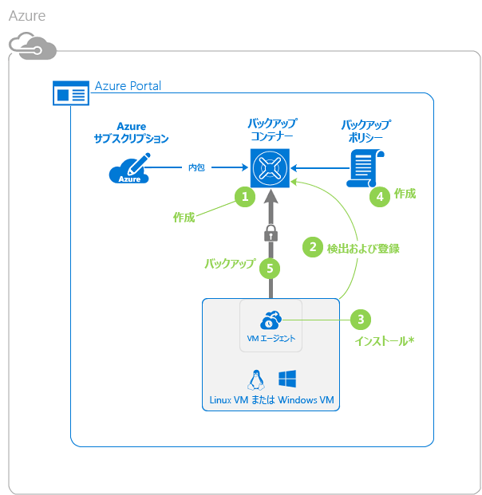
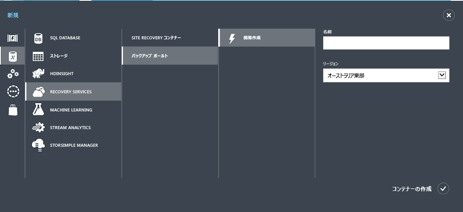
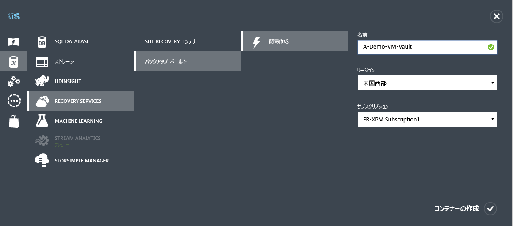
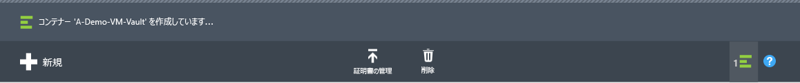
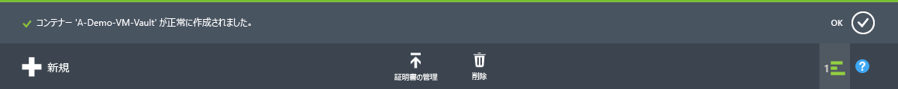
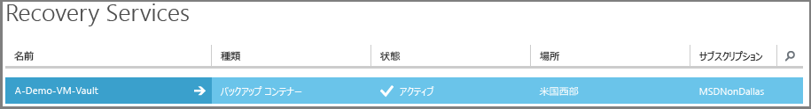
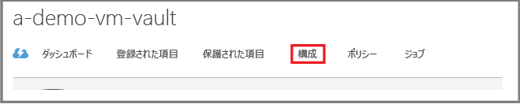
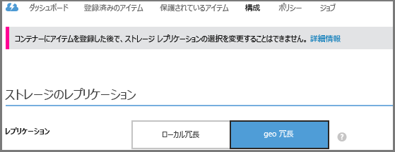

<properties
	pageTitle="Azure Backup を使用して Azure の VM を保護する | Microsoft Azure"
	description="Azure Backup サービスを使用して Azure VM を保護します。チュートリアルでは、Azure におけるコンテナーの作成、VM の登録、ポリシーの作成、VM の保護について説明します。"
	services="backup"
	documentationCenter=""
	authors="markgalioto"
	manager="jwhit"
	editor=""/>

<tags
	ms.service="backup"
	ms.workload="storage-backup-recovery"
	ms.tgt_pltfrm="na"
	ms.devlang="na"
	ms.topic="hero-article"
	ms.date="04/12/2016"
	ms.author="markgal; jimpark"/>

# 最初に: Azure 仮想マシンのバックアップ

> [AZURE.SELECTOR]
- [ARM VM のバックアップ](backup-azure-vms-first-look-arm.md)
- [クラシック モード VM のバックアップ](backup-azure-vms-first-look.md)

このチュートリアルでは、Azure Virtual Machines (VM) をバックアップする手順について説明します。このチュートリアルを完了するには、次の前提条件を満たしている必要があります。

- Azure サブスクリプションで既に VM を作成している。
- Backup サービスから仮想マシンにアクセスできる。

チュートリアルの手順の概要は次のとおりです。

1. バックアップ コンテナーを作成するか、*VM と同じリージョン*にある既存のバックアップ コンテナーを特定します。
2. Azure ポータルを使用して、仮想マシンを検索し、サブスクリプションに登録します。
3. 仮想マシンに VM エージェントをインストールします (Azure ギャラリーから作成した VM を使用している場合は、VM エージェントが既に存在します)。
4. 仮想マシンを保護するためのポリシーを作成します。
5. バックアップを実行します。

>[AZURE.NOTE] Azure には、リソースの作成と操作に関して 2 種類のデプロイ モデルがあります。[Resource Manager デプロイ モデルとクラシック デプロイ モデル](../resource-manager-deployment-model.md)です。Azure Backup サービスは、Azure Resource Manager (ARM) ベースの VM (IaaS V2 VM とも呼ばれます) をサポートしています。このチュートリアルは、Azure クラシック ポータルで作成できる VM 向けです。

## 手順 1. VM 用のバックアップ コンテナーの作成

バックアップ コンテナーは、経時的に作成されたすべてのバックアップと復旧ポイントを格納するエンティティです。バックアップ コンテナーには、バックアップ対象の仮想マシンに適用されるバックアップ ポリシーも含まれています。

次の図は、さまざまな Azure Backup エンティティの関係を示しています。

バックアップ資格情報コンテナーを作成するには:

1. [Azure ポータル](http://manage.windowsazure.com/)にサインインします。

2. Azure ポータルの左下にある **[新規]** をクリックします。

    ![[新しいメニュー] のクリック](./media/backup-azure-vms-first-look/new-button.png)

3. 簡易作成ウィザードで、**[Data Services]**、**[Recovery Services]**、**[バックアップ コンテナー]**、**[簡易作成]** の順にクリックします。

    

    **[名前]** と **[リージョン]** の入力を求められます。複数のサブスクリプションを管理している場合、サブスクリプションを選択するダイアログが表示されます。

4. **[名前]** ボックスに、コンテナーを識別する表示名を入力します。名前は Azure サブスクリプションに対して一意である必要があります。2 ～ 50 文字の名前を入力します。名前の先頭にはアルファベットを使用する必要があります。また、名前に使用できるのはアルファベット、数字、ハイフンのみです。

5. **[リージョン]** ボックスで、コンテナーのリージョンを選択します。資格情報コンテナーは、保護する仮想マシンと同じリージョンにある**必要があります**。

    VM があるリージョンが不明な場合は、このウィザードを閉じ、Azure のサービス一覧から [Virtual Machines] をクリックします。[場所] 列でリージョン名を確認できます。複数のリージョンに仮想マシンがある場合は、各リージョンでバックアップ コンテナーを作成します。

6. ウィザードで **[サブスクリプション]** ダイアログが表示されない場合は、次の手順に進みます。複数のサブスクリプションを使用している場合は、[サブスクリプション] を選択して、新しいバックアップ コンテナーに関連付けます。

    

7. **[資格情報コンテナーの作成]** をクリックします。バックアップ資格情報コンテナーが作成されるまで時間がかかることがあります。ポータルの下部にある状態通知を監視します。

    

    コンテナーが正常に作成されたことを確認するメッセージが表示されます。**[Recovery Services]** ページに、コンテナーが **[アクティブ]** と表示されます。

    

8. **[Recovery Services]** ページのコンテナーの一覧で、作成したコンテナーを選択して **[クイック スタート]** ページを起動します。

    

9. **[クイック スタート]** ページで、**[構成]** をクリックして、[ストレージのレプリケーション] オプションを開きます。

10. **[ストレージのレプリケーション]** オプションで、コンテナーのレプリケーション オプションを選択します。

    

    既定では、コンテナーには geo 冗長ストレージがあります。プライマリ バックアップ ストレージ エンドポイントとして Azure を使用している場合は、引き続き geo 冗長ストレージを使用することをお勧めします。プライマリ以外のバックアップ ストレージ エンドポイントとして Azure を使用している場合は、ローカル冗長ストレージを選択することも検討してください。ローカル冗長ストレージを選択すると、Azure にデータを格納するコストが削減されます。[geo 冗長](../storage/storage-redundancy.md#geo-redundant-storage)ストレージ オプションと[ローカル冗長](../storage/storage-redundancy.md#locally-redundant-storage)ストレージ オプションの詳細については、「[Azure Storage のレプリケーション](../storage/storage-redundancy.md)」を参照してください。

コンテナーのストレージ オプションを選択したら、VM をコンテナーに関連付けることができます。関連付けを開始するには、Azure 仮想マシンを検出して登録する必要があります。

## 手順 2. Azure 仮想マシンの検出と登録
コンテナーに VM を登録する前に、検出プロセスを実行して新しい VM を検出します。このプロセスでは、サブスクリプションに含まれる仮想マシンの一覧を、クラウド サービス名、リージョンなどの追加情報と共に Azure に照会します。

1. [Azure ポータル](http://manage.windowsazure.com/)にサインインします。

2. Azure クラシック ポータルで、**[Recovery Services]** をクリックして Recovery Services コンテナーの一覧を開きます。

3. コンテナーの一覧で、VM をバックアップするコンテナーを選択します。

    コンテナーを選択すると、**[クイック スタート]** ページが開きます。

4. コンテナーのメニューの **[登録済みの項目]** をクリックします。

    

5. **[種類]** メニューの **[Azure 仮想マシン]** を選択します。

    

6. ページの下部にある **[検出]** をクリックします。

    仮想マシンが集計されるまで、この検出プロセスに数分かかる場合があります。プロセスが実行中であることを知らせる通知が画面の下部に表示されます。

    

    プロセスが完了すると、通知が変更されます。

    

7. ページの下部にある **[登録]** をクリックします。

8. **[項目の登録]** ショートカット メニューで、登録する仮想マシンを選択します。同じ名前の仮想マシンが 2 つ以上ある場合は、クラウド サービスを使用して仮想マシンを区別します。

    >[AZURE.TIP] 一度に複数の仮想マシンを登録することができます。

    選択した仮想マシンごとにジョブが作成されます。

9. 通知内の **[ジョブの表示]** をクリックして **[ジョブ]** ページに移動します。

    

    仮想マシンが登録済みの項目の一覧にも、登録操作の状態と共に表示されます。

    

    操作が完了すると、状態が変更され、*登録済み*状態が反映されます。

    

## 手順 3. 仮想マシンへの VM エージェントのインストール

バックアップ拡張機能を動作させるには、Azure VM エージェントを Azure 仮想マシンにインストールする必要があります。VM を Azure ギャラリーから作成した場合、VM エージェントは既に VM に存在します。 [VM の保護](backup-azure-vms-first-look.md#step-4---protect-azure-virtual-machines)のセクションまでスキップできます。

オンプレミス データセンターから VM を移行した場合、VM にはおそらく VM エージェントがインストールされていません。VM の保護に進む前に、仮想マシンに VM エージェントをインストールする必要があります。VM エージェントをインストールする詳しい手順については、[VM のバックアップに関する記事の VM エージェントのセクション](backup-azure-vms-prepare.md#vm-agent)を参照してください。

## 手順 4. Azure 仮想マシンの保護
この手順で、仮想マシンのバックアップおよび保持に関するポリシーを設定でます。1 回の保護操作で複数の仮想マシンを保護できます。2015 年 5 月以降に作成された Azure Backup コンテナーには、既定のポリシーが組み込まれています。この既定のポリシーには、30 日間の既定の保持期間と 1 日 1 回のバックアップ スケジュールが含まれています。

1. Azure ポータルの **[Recovery Services]** にあるバックアップ コンテナーに移動し、**[登録済みの項目]** をクリックします。
2. ドロップダウン メニューから **[Azure 仮想マシン]** を選択します。

    

3. ページの下部にある **[保護]** をクリックします。

    **項目の保護ウィザード**が表示され、登録済みで保護されていない仮想マシン*のみ*が一覧表示されます。

    

4. 保護する仮想マシンを選択します。

    同じ名前の仮想マシンが 2 つ以上ある場合は、クラウド サービスを使用して仮想マシンを区別します。

5. **[保護の構成]** メニューで、特定した仮想マシンを保護するための既存のポリシーを選択するか、新しいポリシーを作成します。

    各バックアップ ポリシーには、複数の仮想マシンを関連付けることができます。ただし、仮想マシンは同時に 1 つのポリシーにしか関連付けることができません。

    

    >[AZURE.NOTE] バックアップ ポリシーには、スケジュールされたバックアップの保持スキーマが含まれています。既存のバックアップ ポリシーを選択した場合は、次の手順で保持期間オプションを変更することができません。

6. **[リテンション期間]** で、特定のバックアップ ポイントの日、週、月、および年単位の期間を定義します。

    

    バックアップを保存する期間は保持ポリシーで指定します。バックアップが作成されたタイミングに応じて異なる保持ポリシーを指定することができます。

7. **[ジョブ]** をクリックすると、**[保護の構成]** ジョブの一覧が表示されます。

    

    ポリシーを確立したら、次の手順に進み、初回のバックアップを実行します。

## 手順 5. 初回バックアップ

ポリシーを使用して仮想マシンが保護されると、その関係が **[保護された項目]** タブに表示されます。初回バックアップが行われるまで、**[保護の状態]** には **[保護済み (初回のバックアップが保留中)]** と表示されます。既定では、スケジュールされた最初のバックアップが*初回バックアップ*となります。

保護を構成した直後に初回バックアップをトリガーするには:

1. **[保護された項目]** ページの下部にある **[今すぐバックアップ]** をクリックします。

    Azure Backup サービスによって、初回バックアップ操作用にバックアップ ジョブが作成されます。

2. **[ジョブ]** タブをクリックしてジョブの一覧を表示します。

    

    初回バックアップが完了すると、**[保護された項目]** タブの仮想マシンの状態が *[保護済み]* になります。

    

    >[AZURE.NOTE] 仮想マシンのバックアップはローカルな処理です。あるリージョンの仮想マシンを別のリージョンのバックアップ コンテナーにバックアップすることはできません。そのため、バックアップが必要な VM がある Azure リージョンごとに、そのリージョン内に少なくとも 1 つのバックアップ コンテナーを作成する必要があります。

## 次のステップ
これで、VM が正常にバックアップされました。さらに、関心がありそうなステップがいくつかあります。最も論理的な手順は、VM にデータを復元する処理に慣れることです。一方、データを安全に保管し、コストを最小限に抑える方法を理解できる管理タスクもあります。

- [仮想マシンの管理と監視](backup-azure-manage-vms.md)
- [仮想マシンの復元](backup-azure-restore-vms.md)
- [トラブルシューティング ガイダンス](backup-azure-vms-troubleshoot.md)

## 疑問がある場合
ご不明な点がある場合や今後搭載を希望する機能がある場合は、[フィードバックをお送りください](http://aka.ms/azurebackup_feedback)。

<!---HONumber=AcomDC_0420_2016-->