# Azure 仮想マシンのバックアップ (クラシック ポータル)
> [!div class="op_single_selector"]
> * [Recovery Services コンテナーへの VM のバックアップ](backup-azure-arm-vms.md)
> * [バックアップ コンテナーへの VM のバックアップ](backup-azure-vms.md)
>
>

この記事では、クラシック デプロイの Azure Virtual Machines (VM) をバックアップ コンテナーにバックアップする手順を説明しています。 Azure 仮想マシンをバックアップする前にいくつかの作業を行う必要があります。 まだそれを行っていない場合は、 [前提条件](backup-azure-vms-prepare.md) を満たして、VM をバックアップできるように環境を準備します。

詳細については、「[Azure における VM バックアップ インフラストラクチャの計画を立てる](backup-azure-vms-introduction.md)」と [Azure Virtual Machines](https://azure.microsoft.com/documentation/services/virtual-machines/) に関するページを参照してください。

> [!NOTE]
> Azure には、リソースの作成と操作に関して&2; 種類のデプロイ モデルがあります。[Resource Manager デプロイ モデルとクラシック デプロイ モデル](../azure-resource-manager/resource-manager-deployment-model.md)です。 バックアップ コンテナーで保護できるのは、クラシック モデルでデプロイされた VM だけです。 Resource Manager モデルでデプロイされた VM をバックアップ コンテナーで保護することはできません。 Recovery Services コンテナーの操作について詳しくは、[Recovery Services コンテナーへの VM のバックアップ](backup-azure-arm-vms.md)に関するページをご覧ください。
>
>

Azure 仮想マシンのバックアップには、次の&3; つの主要な手順が含まれます。

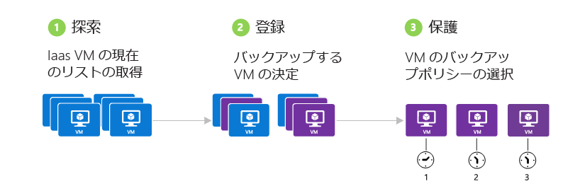

> [!NOTE]
> 仮想マシンのバックアップはローカルな処理です。 あるリージョンの仮想マシンを別のリージョンのバックアップ コンテナーにバックアップすることはできません。 そのため、各 Azure リージョン (バックアップ対象の仮想マシンが存在する) にバックアップ コンテナーを作成する必要があります。
>
>

## 手順 1. Azure 仮想マシンを検出する
サブスクリプションに追加された新しい仮想マシン (VM) が登録前に確実に識別されるようにするには、検出プロセスを実行してください。 このプロセスでは、サブスクリプションに含まれる仮想マシンの一覧を、クラウド サービス名、リージョンなどの追加情報と共に Azure に照会します。

1. [クラシック ポータル](http://manage.windowsazure.com/)
2. Azure サービスの一覧で、**[Recovery Services]** をクリックして、Backup コンテナーおよび Site Recovery コンテナーの一覧を開きます。
    
3. バックアップ コンテナーの一覧で、VM をバックアップするコンテナーを選択します。

    これが新しい資格情報コンテナーの場合、ポータルで **クイック スタート** ページが開きます。

    ![[登録済みの項目] メニューを開く](./media/backup-azure-vms/vault-quick-start.png)

    コンテナーが既に構成されている場合は、ポータルで最近使用したメニューが開きます。
4. ページの上部にある資格情報コンテナー メニューで、 **[登録済みの項目]**をクリックします。

    ![[登録済みの項目] メニューを開く](./media/backup-azure-vms/vault-menu.png)
5. **[種類]** メニューの **[Azure 仮想マシン]** を選択します。

    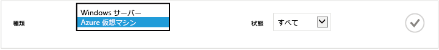
6. ページの下部にある **[検出]** をクリックします。
    ![[検出] ボタン](./media/backup-azure-vms/discover-button-only.png)

    仮想マシンが集計されるまで、この検出プロセスに数分かかる場合があります。 プロセスが実行中であることを知らせる通知が画面の下部に表示されます。

    

    プロセスが完了すると、通知が変更されます。 検出プロセスで仮想マシンが見つからなかった場合は、まず、VM が存在することを確認します。 VM が存在する場合、VM がバックアップ コンテナーと同じリージョンであることを確認します。 VM が存在し、リージョンも同じである場合は、VM がバックアップ コンテナーにまだ登録されていないことを確認します。 VM がバックアップ コンテナーに割り当てられている場合、他のバックアップ コンテナーに割り当てることはできません。

    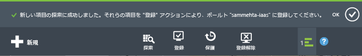

    新しい項目が検出されたら、手順 2. に進んで VM を登録します。

## 手順 2. Azure 仮想マシンを登録する
Azure Backup サービスに関連付けるために、Azure 仮想マシンを登録します。 登録は、通常、1 回限りの操作です。

1. Azure Portal の **[Recovery Services]** にあるバックアップ コンテナーに移動し、**[登録済みの項目]** をクリックします。
2. ドロップダウン メニューから **[Azure 仮想マシン]** を選択します。

    
3. ページの下部にある **[登録]** をクリックします。
    ![[登録] ボタン](./media/backup-azure-vms/register-button-only.png)
4. **[項目の登録]** ショートカット メニューで、登録する仮想マシンを選択します。 同じ名前の仮想マシンが&2; つ以上ある場合は、クラウド サービスを使用して仮想マシンを区別します。

   > [!TIP]
   > 一度に複数の仮想マシンを登録することができます。
   >
   >

    選択した仮想マシンごとにジョブが作成されます。
5. 通知内の **[ジョブの表示]** をクリックして **[ジョブ]** ページに移動します。

    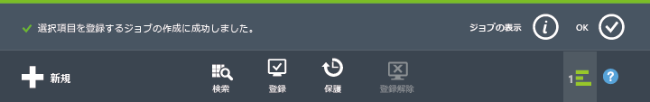

    仮想マシンが登録済みの項目の一覧にも、登録操作の状態と共に表示されます。

    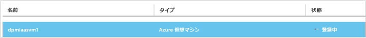

    操作が完了すると、状態が変更され、" *登録済み* " 状態が反映されます。

    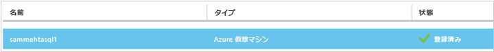

## 手順 3. Azure 仮想マシンを保護する
この手順で、仮想マシンのバックアップおよび保持に関するポリシーを設定でます。 1 回の保護操作で複数の仮想マシンを保護できます。

2015 年 5 月以降に作成された Azure Backup コンテナーには、既定のポリシーが組み込まれています。 この既定のポリシーには、30 日間の既定の保持期間と 1 日 1 回のバックアップ スケジュールが含まれています。

1. Azure Portal の **[Recovery Services]** にあるバックアップ コンテナーに移動し、**[登録済みの項目]** をクリックします。
2. ドロップダウン メニューから **[Azure 仮想マシン]** を選択します。

    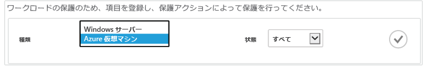
3. ページの下部にある **[保護]** をクリックします。

    **項目の保護ウィザード** が表示されます。 このウィザードには、保護されていない登録済みの仮想マシンのみが一覧表示されます。 保護する仮想マシンを選択します。

    同じ名前の仮想マシンが&2; つ以上ある場合は、クラウド サービスを使用して仮想マシンを区別します。

   > [!TIP]
   > 一度に複数の仮想マシンを保護できます。
   >
   >

    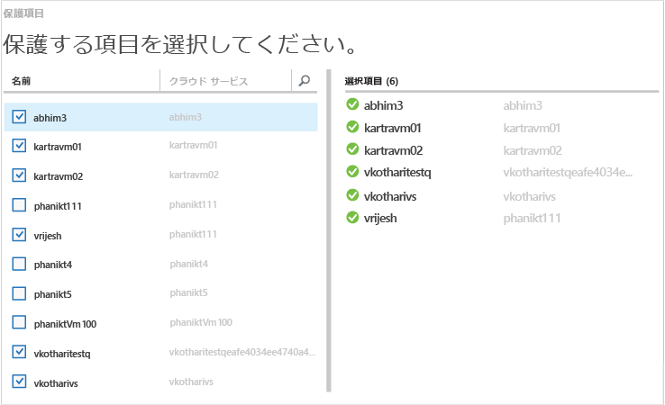

4. 選択した仮想マシンをバックアップするための **[バックアップ スケジュール]** を選択します。 既存のポリシーのセットから選択することも、新しいポリシーを定義することもできます。

    各バックアップ ポリシーには、複数の仮想マシンを関連付けることができます。 ただし、仮想マシンは常に&1; つのポリシーにしか関連付けることができません。

    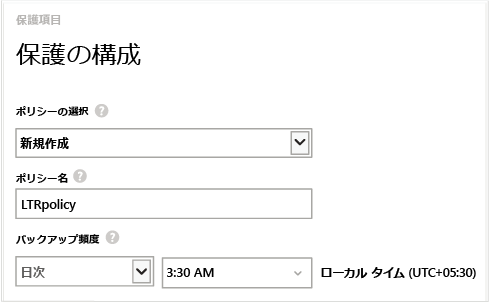

   > [!NOTE]
   > バックアップ ポリシーには、スケジュールされたバックアップの保持スキーマが含まれています。 既存のバックアップ ポリシーを選択した場合は、次の手順で保持期間オプションを変更することができません。
   >
   >

5. バックアップに関連付ける **保持期間** を選択します。

    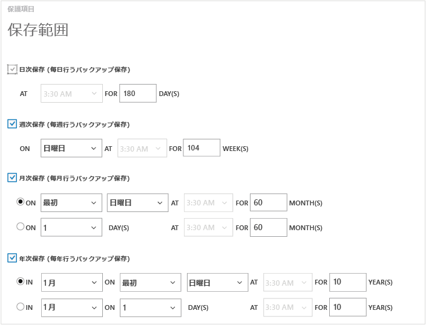

    バックアップを保存する期間は保持ポリシーで指定します。 バックアップが作成されたタイミングに応じて異なる保持ポリシーを指定することができます。 たとえば、毎日実行されるバックアップ ポイント (運用上の復旧ポイントとして機能) が 90 日間保持されるとします。 これに対して、各四半期の最後に実行されるバックアップ ポイント (監査用) は、何か月も、または何年も保持することが必要な場合があります。

    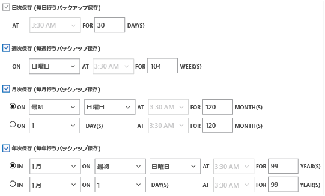

    この画像の例の場合:

   * **日ごとの保持ポリシー**: バックアップは毎日作成され、30 日間保持されます。
   * **週ごとの保持ポリシー**: バックアップは毎週日曜日に作成され、104 週間保持されます。
   * **月ごとの保持ポリシー**: バックアップは各月の最後の日曜日に作成され、120 か月保持されます。
   * **年ごとの保持ポリシー**: バックアップは毎年 1 月の最初の日曜日に作成され、99 年間保持されます。

     選択した仮想マシンごとに、保護ポリシーを構成して仮想マシンをポリシーに関連付けるためのジョブが作成されます。
6. **保護の構成**ジョブの一覧を表示するには、資格情報コンテナー メニューで **[ジョブ]** をクリックし、**[操作]** フィルターから **[保護の構成]** を選択します。

    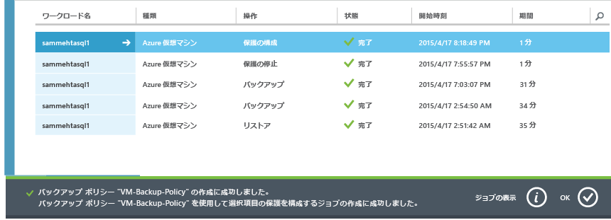

## 初回バックアップ
ポリシーを使用して保護した仮想マシンは、 **[保護された項目]** タブに表示され、保護の状態は *[保護済み (初回バックアップは完了していません)]*と表示されます。 既定では、スケジュールされた最初のバックアップが *初回バックアップ*となります。

保護を構成した直後に初回バックアップをトリガーするには:

1. **[保護された項目]** ページの下部にある **[今すぐバックアップ]** をクリックします。

    Azure Backup サービスによって、初回バックアップ操作用にバックアップ ジョブが作成されます。
2. **[ジョブ]** タブをクリックしてジョブの一覧を表示します。

    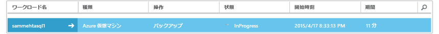

> [!NOTE]
> Azure Backup サービスは、バックアップ操作中に、各仮想マシンのバックアップ拡張機能に対して、すべての書き込みジョブをフラッシュし、整合性のあるスナップショットを作成するためのコマンドを発行します。
>
>

初回バックアップが完了すると、 **[保護された項目]** タブの仮想マシンの状態が *[保護済み]*になります。

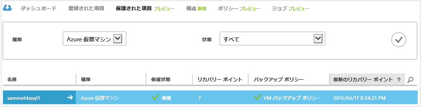

## バックアップの状態と詳細の表示
仮想マシンが保護されると、 **[ダッシュボード]** ページの概要に示される仮想マシンの数が増加します。 **[ダッシュボード]** ページには、過去 24 時間の間に "*成功したジョブ*"、"*失敗したジョブ*"、"*現在進行中のジョブ*" の数も表示されます。 **[ジョブ]** ページで、**[状態]**、**[操作]**、または **[開始]** と **[終了]** の各メニューを使用して、ジョブをフィルター処理します。

![[ダッシュボード] ページのバックアップの状態](./media/backup-azure-vms/dashboard-protectedvms.png)

ダッシュボード内の値は、24 時間に 1 度更新されます。

## エラーのトラブルシューティング
仮想マシンのバックアップ中に問題が発生した場合は、[VM のトラブルシューティングに関する記事](backup-azure-vms-troubleshoot.md)をご覧ください。

## 次のステップ
* [仮想マシンの管理と監視](backup-azure-manage-vms.md)
* [仮想マシンの復元](backup-azure-restore-vms.md)

