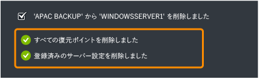

<properties 
	pageTitle="Windows Server のバックアップをすばやく簡単に行うための Azure Backup Services の構成" 
	description="このチュートリアルを使用し、Microsoft の Azure クラウド ソリューションの Backup サービスを使って、Windows Server をクラウドにバックアップする方法について学習します。" 
	services="backup" 
	documentationCenter="" 
	authors="markgalioto" 
	manager="jwhit" 
	editor="tysonn"/>

<tags 
	ms.service="backup" 
	ms.workload="storage-backup-recovery" 
	ms.tgt_pltfrm="na" 
	ms.devlang="na" 
	ms.topic="article" 
	ms.date="06/03/2015" 
	ms.author="markgal"/>

#Windows Server のバックアップをすばやく簡単に行うための Azure Backup の構成

このチュートリアルを完了するには、Azure アカウントが必要です。このチュートリアルでは、Azure のバックアップ機能を有効にする手順について説明します。
>[AZURE.NOTE]以前は、バックアップ サーバーを登録するために、X.509 v3 証明書の作成や取得が必要でした。証明書は現在でもサポートされていますが、サーバーへの Azure 資格情報コンテナーの登録を容易にするために、[クイック スタート] ページから資格情報コンテナーの資格情報を生成できます。アカウントがない場合は、無料の試用アカウントを数分で作成することができます。詳細については、[Azure の無料評価版サイト](https://azure.microsoft.com/pricing/free-trial/)を参照してください。

Azure に Windows Server のファイルとデータをバックアップするには、データを保存する地理的リージョンにバックアップ コンテナーを作成する必要があります。このチュートリアルの指示に従って。

- バックアップの格納に使用する資格情報コンテナーの作成
- 資格情報コンテナー資格情報をダウンロードします。
- バックアップ エージェントのインストール
- 管理ポータルで使用できるバックアップ管理タスクの概要

##バックアップ コンテナーの作成

1. [管理ポータル](https://manage.windowsazure.com)にサインインします。
2. **[新規]** > **[Data Services]** > **[復旧サービス]** > **[バックアップ資格情報コンテナー]** > **[簡易作成]** の順にクリックします。
3. **[名前]** ボックスに、バックアップ資格情報コンテナーを識別する表示名を入力します。
4.  **領域**, 、バックアップ コンテナーのリージョンを選択します。

    

5. **[資格情報コンテナーの作成]** をクリックします。

    バックアップ資格情報コンテナーが作成されるまで時間がかかることがあります。状態を確認するには、ポータルの下部にある通知を監視します。バックアップ コンテナーが作成された後を示すメッセージが、コンテナーが正常に作成され、復旧のサービスとしてのリソースに表示されます **Active**です。

    

6. 組織アカウントに関連付けたサブスクリプションが複数ある場合は、バックアップ資格情報コンテナーに関連付けた正しいアカウントを選択してください。

##コンテナーの資格情報のダウンロード

資格情報コンテナーの資格情報は、サーバーに Azure サービスを登録する方法として証明書に置き換わります。証明書も使用できますが、資格情報コンテナーの資格情報は、ユーザーが Azure ポータルを使用して資格情報コンテナーの資格情報を生成してダウンロードできるため、より使いやすくなっています。

1. [管理ポータル](https://manage.windowsazure.com)にサインインします。
2. **[復旧サービス]** をクリックし、サーバーに登録するバックアップ資格情報コンテナーを選択します。バックアップ資格情報コンテナーの [クイック スタート] ページが表示されます。
3.  **クイック スタート] ページ**, 、] をクリックして **コンテナー資格情報のダウンロード** 、ポータルを生成し、サーバーをバックアップ コンテナーに登録に使用する資格情報コンテナーの資格情報のダウンロードを要求します。

    ポータルは、資格情報コンテナーの名前と現在の日付の組み合わせを使用して、資格情報コンテナーの資格情報を生成します。

4. **[保存]** をクリックして、資格情報コンテナーの資格情報をローカル アカウントのダウンロード フォルダにダウンロードするか、**[保存]** メニューから **[名前を付けて保存]** を選択して、保存場所を指定します。資格情報コンテナーの資格情報は編集できないため、[開く] をクリックする必要はありません。資格情報のダウンロードが完了すると、フォルダを開くように求めるメッセージが表示されます。[**x**] をクリックしてこのメニューを閉じます。

##バックアップ エージェントのダウンロードとインストール

1. [管理ポータル](https://manage.windowsazure.com)で。
2. **[復旧サービス]** をクリックし、バックアップ資格情報コンテナーを選択して [クイック スタート] ページを表示します。
3. [クイック スタート] ページで、ダウンロードするエージェントの種類を選択します。**[Azure Backup エージェントのダウンロード]**、**[Windows Server と System Center Data Protection Manager]**、または **[Windows Server Essentials]** を選択できます。詳細情報

	* [Windows Server 2012 および System Center 2012 SP1 – Data Protection Manager 用の Azure Backup エージェントをインストールします。](http://technet.microsoft.com/library/hh831761.aspx#BKMK_installagent)
	* [Windows Server 2012 Essentials 用の Azure Backup エージェントをインストールします。](http://technet.microsoft.com/library/jj884318.aspx)

エージェントがインストールされたら、適切なローカル管理インターフェイス (Microsoft 管理コンソール スナップイン、System Center Data Protection Manager コンソール、Windows Server Essentials ダッシュボードなど) を使用して、サーバーのバックアップ ポリシーを構成できます。

##バックアップ コンテナーとサーバーの管理

1. [管理ポータル](https://manage.windowsazure.com)にサインインします。
2. **[復旧サービス]** をクリックし、バックアップ資格情報コンテナーの名前をクリックして、[クイック スタート] ページを表示します。
3. **[ダッシュボード]** をクリックしてサーバーの使用状況の概要を表示します。[ダッシュボード] の下部で、次のタスクを実行できます。

    - **証明書の管理**。証明書を使用してサーバーを登録した場合は、これを使用して証明書を更新します。資格情報コンテナーの資格情報を使用している場合は、**[証明書の管理]** を使用しないでください。
    - **削除**。現在のバックアップ コンテナーを削除します。バックアップ コンテナーがもう使用されていない場合は、そのコンテナーを削除してストレージ領域を解放できます。**[削除]** は、登録されているサーバーすべてが資格情報コンテナーから削除された場合にのみ有効になります。
    - **資格情報コンテナーの資格情報**。[概要] メニュー項目を使用して資格情報コンテナーの資格情報を構成します。

4. **[保護された項目]** をクリックして、サーバーからバックアップされた項目を表示します。この一覧は、情報の提供のみを目的としています。

    

5. **[サーバー]** をクリックして、この資格情報コンテナーに登録されたサーバーの名前を表示します。ここでは、次のタスクを実行できます。

    - **再登録を許可**。サーバーに対してこのオプションが選択されている場合、エージェントで登録ウィザードを使用して、サーバーをバックアップ コンテナーにもう一度登録できます。証明書でエラーが発生したとき、またはサーバーを再構築する必要があった場合などに、再登録が必要になる可能性があります。再登録を行えるのは、サーバー名ごとに 1 回だけです。
    - **削除**。バックアップ コンテナーからサーバーを削除します。サーバーに関連付けられている保存されたデータすべてがすぐに削除されます。

        

##次のステップ

- Azure のバックアップの詳細については、「[Azure のバックアップの概要](http://go.microsoft.com/fwlink/p/?LinkId=222425)」を参照してください。 
- [Azure のバックアップ フォーラム](http://go.microsoft.com/fwlink/p/?LinkId=290933)にアクセスします。

<!---HONumber=GIT-SubDir--> 