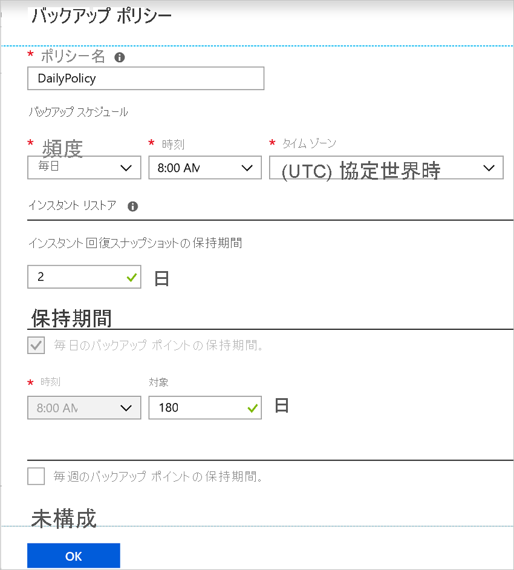

# Azure VM の作成時にバックアップを有効にする

Azure Virtual Machines (VM) をバックアップするには、Azure Backup サービスを使用します。 バックアップ ポリシーで指定されているスケジュールに従って VM がバックアップされ、バックアップから復旧ポイントが作成されます。 復旧ポイントは、Recovery Services コンテナーに格納されます。

この記事では、Azure portal で仮想マシン (VM) を作成するときにバックアップを有効にする方法について説明します。  

## 開始する前に

- VM の作成時にバックアップを有効にする場合は、どのオペレーティング システムがサポートされているかを[確認](backup-support-matrix-iaas.md#supported-backup-actions)してください。

## Azure へのサインイン

まだアカウントにサインインしていない場合は、[Azure portal](https://portal.azure.com) にサインインします。

## バックアップが構成された VM を作成する

1. Azure portal で、 **[リソースの作成]** をクリックします。

2. Azure Marketplace で **[Compute]\(コンピューティング\)** をクリックし、VM イメージを選択します。

3. [Windows](https://docs.microsoft.com/azure/virtual-machines/windows/quick-create-portal) または [Linux](https://docs.microsoft.com/azure/virtual-machines/linux/quick-create-portal) の指示に従って、VM を設定します。

4. **[管理]** タブの **[バックアップの有効化]** で **[オン]** をクリックします。
5. Azure Backup により、Recovery Services コンテナーにバックアップされます。 既存のコンテナーがない場合は、 **[新規作成]** をクリックします。
6. 提示されたコンテナー名を採用するか、独自に指定します。
7. コンテナーが配置されるリソース グループを指定するか、作成します。 リソース グループのコンテナーは、VM のリソース グループとは異なる場合があります。

    

8. 既定のバックアップ ポリシーを採用するか、設定を変更します。
    - バックアップ ポリシーでは、VM のバックアップ スナップショットを取得する頻度と、バックアップ コピーを保持する期間が指定されます。
    - 既定のポリシーでは、1 日に 1 回、VM がバックアップされます。
    - バックアップが毎日または毎週取得されるように、Azure VM の独自のバックアップ ポリシーをカスタマイズできます。
    - Azure VM のバックアップの考慮事項について詳しくは、[こちら](backup-azure-vms-introduction.md#backup-and-restore-considerations)を参照してください。
    - インスタント リストア機能について詳しくは、[こちら](backup-instant-restore-capability.md)を参照してください。

      

> [!NOTE]
> Azure Backup サービスでは、スナップショットを格納するために別のリソース グループ (VM のリソース グループ以外) が作成されます。名前の形式は **AzureBackupRG_geography_number** です (例: AzureBackupRG_northeurope_1)。 このリソース グループ内のデータは、Azure Virtual Machine Backup ポリシーの *[Retain instant recovery snapshot]\(インスタント リカバリ スナップショットの保存\)* セクションに指定されている日数の期間保持されます。  このリソース グループにロックを適用すると、バックアップが失敗する可能性があります。 
制限ポリシーによってリソース ポイント コレクションの作成がブロックされ、この場合もバックアップが失敗するため、このリソース グループも名前/タグの制限から除外する必要があります。

## VM の作成後にバックアップを開始する

VM のバックアップは、バックアップ スケジュールに従って実行されます。 ただし、初回バックアップを実行することをお勧めします。

VM が作成されたら、次の操作を行います。

1. VM のプロパティで、 **[バックアップ]** をクリックします。 初回バックアップが実行されるまで、VM の状態は [初回のバックアップが保留中] です
2. オンデマンド バックアップを実行するには、 **[今すぐバックアップ]** をクリックします。

    

## Resource Manager テンプレートを使用して保護された VM をデプロイする

前の手順では、Azure portal を使用して仮想マシンを作成し、Recovery Services コンテナーにそれを保護する方法について説明しました。 VM をすばやくデプロイし、Recovery Services コンテナーでそれを保護するには、[Windows VM をデプロイしてバックアップを有効にする](https://azure.microsoft.com/resources/templates/101-recovery-services-create-vm-and-configure-backup/)ためのテンプレートをご覧ください。

## 次の手順

VM が保護されたので、その VM を管理および復元する方法を学習してください。

- [VM の管理と監視](backup-azure-manage-vms.md)
- [VM を復元する](backup-azure-arm-restore-vms.md)

問題が発生した場合は、トラブルシューティング ガイドを[確認して](backup-azure-vms-troubleshoot.md)ください。
