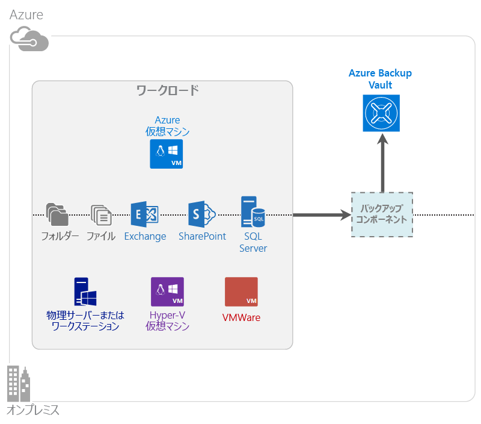

<properties
	pageTitle="Azure Backup とは | Microsoft Azure"
	description="Azure Backup と Recovery Services を利用すれば、Windows サーバー、Windows クライアント コンピューター、System Center DPM サーバー、Azure Virtual Machines のデータとアプリケーションをバックアップし、復元できます。"
	services="backup"
	documentationCenter=""
	authors="Jim-Parker"
	manager="jwhit"
	editor="tysonn"
	keywords="バックアップと復元, 復元サービス, バックアップ ソリューション"/>

<tags
	ms.service="backup"
	ms.workload="storage-backup-recovery"
	ms.tgt_pltfrm="na"
	ms.devlang="na"
	ms.topic="article"
	ms.date="02/05/2016"
	ms.author="trinadhk;jimpark"/>

# Azure Backup とは
Azure Backup は、Microsoft Cloud のデータのバックアップと復元に使用するサービスです。既存のオンプレミスまたはオフサイトのバックアップ ソリューションを、信頼性の高い、セキュリティで保護された、コスト競争力のあるクラウド ベースのソリューションに置き換えます。また、クラウド内で実行されている資産を保護できます。Azure Backup は、拡張性、持続性、高可用性に優れた世界クラスのインフラストラクチャの上に構築された Recovery Services を提供します。

[Azure Backup の概要に関するビデオ](https://azure.microsoft.com/documentation/videos/what-is-azure-backup/)

## Azure Backup を使用する理由
従来のバックアップ ソリューションは、クラウドをディスクやテープなどのエンドポイントのように扱えるように進化してきました。この方法は単純ですが、制限もあります。たとえば、基礎となるプラットフォームを最大限に活用することができません。これは、非効率的でコストの高いソリューションになります。これに対し、Azure Backup は、強力かつ低コストのクラウド バックアップ ソリューションを最大限に活用できます。Azure Backup には次のような利点があります。

| 機能 | 長所 |
| ------- | ------- |
| ストレージ管理の自動化 | オンプレミスのストレージ デバイスに対する設備投資は必要ありません。Azure Backup は、従量制課金モデルを使用して、バックアップ ストレージを自動的に割り当てて管理します。 |
| 無制限のスケーリング | 保守と監視のオーバーヘッドなしに高可用性が保証されます。Azure Backup は、基盤となる Azure クラウドの機能とスケールを使用して、非侵入型の自動スケール機能を提供します。 |
| 複数のストレージ オプション | 必要に応じてバックアップ ストレージを選択できます。<li>ローカル冗長ストレージ ブロック BLOB は、ローカル ハードウェアの障害からデータを保護しながらコスト意識の高いお客様に最適です。<li>geo レプリケーション ストレージ ブロック BLOB は、ペアリングされているデータセンターに 3 つの追加コピーを提供します。この処理によって、Azure サイトレベルの障害が発生した場合でも、バックアップ データの高可用性を確保することができます。 |
| 無制限のデータ転送 | Backup コンテナーからの復元操作時の出力 (送信) データ転送は無料です。Azure へのデータ受信も無料です。 |
| 集中管理 | Azure ポータルは簡単でわかりやすい操作です。サービスが進化すると、中央管理などの機能を使用して 1 つの場所からバックアップ インフラストラクチャを管理できるようになります。 |
| データの暗号化 | 暗号化によって、パブリック クラウドでの顧客データを安全に送信および保存できます。暗号化パスフレーズはソースに保存されます。転送されたり Azure に保存されたりすることはありません。データを復元するには暗号化キーが必要です。お客様のみがサービス内のデータにフル アクセスできます。 |  
| アプリケーションの整合性のバックアップ | Windows でのアプリケーション整合性バックアップの場合、復元時に修正は必要ありません。目標復旧時間が短縮され、ユーザーは迅速に実行状態に戻ることができます。 |
| 長期保存 | オフサイトのテープ バックアップ ソリューションにコストをかけずに、Azure にバックアップすることができます。Azure へのバックアップは、テープなどのセマンティクスと比較すると、非常に低コストで利用できるお勧めのソリューションです。 |

## Azure Backup のコンポーネント
Backup はハイブリッド バックアップ ソリューションなので、連携してエンド ツー エンドのバックアップと復元のワークフローを実現する複数のコンポーネントで構成されます。

## デプロイメント シナリオ

| コンポーネント | Azure にデプロイできる? | オンプレミスにデプロイできる? | サポートされているターゲット ストレージ|
| --- | --- | --- | --- |
| Azure Backup エージェント | 
**はい**
 
Azure Backup エージェントは、Azure で実行されている任意の Windows Server VM にデプロイできます。
 | 
**はい**
 
Backup エージェントは、任意の Windows Server VM または物理マシンにデプロイできます。
 | 
Azure Backup コンテナー
 |
| System Center Data Protection Manager (DPM) | 
**はい**
 
詳細については、[System Center DPM を使用して Azure のワークロードを保護する方法](http://blogs.technet.com/b/dpm/archive/2014/09/02/azure-iaas-workload-protection-using-data-protection-manager.aspx)を参照してください。
 | 
**はい**
 
詳細については、[自社のデータセンターのワークロードと VM を保護する方法](https://technet.microsoft.com/library/hh758173.aspx)を参照してください。
 | 
ローカルに接続されているディスク、

Azure Backup コンテナー、

テープ (オンプレミスのみ)
 |
| Azure Backup Server | 
**はい**
 
詳細については、[Azure Backup Server を使用して Azure のワークロードを保護する方法](backup-azure-microsoft-azure-backup.md)を参照してください。
 | 
**はい**
 
詳細については、[Azure Backup Server を使用して Azure のワークロードを保護する方法](backup-azure-microsoft-azure-backup.md)を参照してください。
 | 
Azure Backup コンテナー
 |
| Azure Backup (VM 拡張機能) | 
はい
 
[Azure のサービスとしてのインフラストラクチャ (IaaS) 仮想マシンのバックアップに特化しています](backup-azure-vms-introduction.md)。
 | 
**いいえ**
 
System Center DPM を使用して、データセンターの仮想マシンをバックアップします。
 | 
Azure Backup コンテナー
 |

## バックアップできるアプリケーションとワークロード

| ワークロード | ソース コンピューター | Azure Backup ソリューション |
| --- | --- |---|
| ファイルとフォルダー | Windows Server | 
[Azure Backup エージェント](backup-configure-vault.md)、

[System Center DPM](backup-azure-dpm-introduction.md)、

[Azure Backup Server](backup-azure-microsoft-azure-backup.md)
 |
| ファイルとフォルダー | Windows クライアント | 
[Azure Backup エージェント](backup-configure-vault.md)、

[System Center DPM](backup-azure-dpm-introduction.md)、

[Azure Backup Server](backup-azure-microsoft-azure-backup.md)
 |
| Hyper-V 仮想マシン (Windows) | Windows Server | 
[System Center DPM](backup-azure-backup-sql.md)、

[Azure Backup Server](backup-azure-microsoft-azure-backup.md)
 |
| Hyper-V 仮想マシン (Linux) | Windows Server | 
[System Center DPM](backup-azure-backup-sql.md)、

[Azure Backup Server](backup-azure-microsoft-azure-backup.md)
 |
| Microsoft SQL Server | Windows Server | 
[System Center DPM](backup-azure-backup-sql.md)、

[Azure Backup Server](backup-azure-microsoft-azure-backup.md)
 |
| Microsoft SharePoint | Windows Server | 
[System Center DPM](backup-azure-backup-sql.md)、

[Azure Backup Server](backup-azure-microsoft-azure-backup.md)
 |
| Microsoft Exchange | Windows Server | 
[System Center DPM](backup-azure-backup-sql.md)、

[Azure Backup Server](backup-azure-microsoft-azure-backup.md)
 |
| Azure IaaS VM (Windows)| - | [Azure Backup (VM 拡張機能)](backup-azure-vms-introduction.md) |
| Azure IaaS VM (Linux) | - | [Azure Backup (VM 拡張機能)](backup-azure-vms-introduction.md) |
## 機能
以下の 5 つの表では、各コンポーネントにおける Backup の機能の処理方法をまとめます。

### Storage

| 機能 | Azure Backup エージェント | System Center DPM | Azure Backup Server | Azure Backup (VM 拡張機能) |
| ------- | --- | --- | --- | ---- |
| Azure Backup コンテナー | ![Yes][green] | ![はい][green] | ![はい][green] | ![はい][green] |
| ディスク ストレージ | | ![はい][green] | ![はい][green] | |
| テープ ストレージ | | ![はい][green] | | |
| 圧縮 (バックアップ コンテナー) | ![はい][green] | ![はい][green]| ![はい][green] | |
| 増分バックアップ | ![はい][green] | ![はい][green] | ![はい][green] | ![Yes][green] |
| ディスクの重複除去 | | ![部分的][yellow] | ![部分的][yellow]| | |

**キー** &nbsp;&nbsp;&nbsp;&nbsp;&nbsp;&nbsp;![あり][green]= サポート対象 &nbsp;&nbsp;&nbsp;&nbsp;&nbsp;&nbsp; ![部分的][yellow]= 部分的にサポート &nbsp;&nbsp;&nbsp;&nbsp;&nbsp;&nbsp; *&lt;blank&gt;* = サポート対象外

バックアップ コンテナーは、すべてのコンポーネントの中で優先されるストレージ ターゲットです。System Center DPM と Backup Server には、ローカル ディスク コピーを作成するオプションもありますが、テープ ストレージ デバイスにデータを書き込むオプションがあるのは System Center DPM だけです。

#### 増分バックアップ
ターゲット ストレージ (ディスク、テープ、バックアップ コンテナー) とは関係なく、すべてのコンポーネントが増分バックアップをサポートします。前回のバックアップ以降の増分変更のみがターゲット ストレージに転送されるので、ストレージと時間の効率に優れたバックアップが保証されます。また、ストレージ使用量を削減するためにバックアップは圧縮されます。

圧縮を行わないコンポーネントは、VM 拡張機能です。すべてのバックアップ データは、圧縮されずに、ユーザーのストレージ アカウントから、同じリージョンにあるバックアップ コンテナーにコピーされます。使用されるストレージは若干増えますが、圧縮しないでデータを格納することにより復元時間を短縮できます。

#### 重複除去
System Center DPM と Backup Server で、[Hyper-V 仮想マシン](http://blogs.technet.com/b/dpm/archive/2015/01/06/deduplication-of-dpm-storage-reduce-dpm-storage-consumption.aspx)にデプロイする場合、重複除去がサポートされています。重複除去は、バックアップ ストレージとして仮想マシンに接続された仮想ハード ディスク (VHD) で、Windows Server の重複除去機能を利用してホスト レベルで実行されます。

>[AZURE.WARNING] Azure では、どの Backup コンポーネントについても重複除去を使用できません。System Center DPM と Backup Server が Azure にデプロイされている場合は、VM に接続されているストレージ ディスクを重複除去できません。

### セキュリティ

| 機能 | Azure Backup エージェント | System Center DPM | Azure Backup Server | Azure Backup (VM 拡張機能) |
| ------- | --- | --- | --- | ---- |
| ネットワーク セキュリティ (対 Azure) | ![Yes][green] |![はい][green] | ![Yes][green] | ![部分的][yellow]|
| ネットワーク セキュリティ (Azure 内) | ![Yes][green] |![はい][green] | ![Yes][green] | ![部分的][yellow]|

**キー** &nbsp;&nbsp;&nbsp;&nbsp;&nbsp;&nbsp;![あり][green]= サポート対象 &nbsp;&nbsp;&nbsp;&nbsp;&nbsp;&nbsp; ![部分的][yellow]= 部分的にサポート &nbsp;&nbsp;&nbsp;&nbsp;&nbsp;&nbsp; *&lt;blank&gt;* = サポート対象外

サーバーからバックアップ コンテナーまでのすべてのバックアップ トラフィックは、Advanced Encryption Standard 256 を使用して暗号化されます。データは、セキュリティで保護された HTTPS リンク上で送信されます。また、バックアップ データは、暗号化された形式でバックアップ コンテナーにも格納されます。このデータのロックを解除するパスフレーズは、お客様のみが保持します。マイクロソフトは、どの時点でもバックアップ データの暗号化を解除できせん。

>[AZURE.WARNING] バックアップ データの暗号化に使用されるキーは、ユーザーの手元にだけ存在します。マイクロソフトは Azure にコピーを保持していませんし、キーにもアクセスできません。ユーザーがキーを紛失した場合、マイクロソフトはバックアップ データを復旧できません。

Azure VM のバックアップの場合は、ユーザーが仮想マシン*内*で暗号化を明示的に設定する必要があります。Windows 仮想マシンでは BitLocker を使用し、Linux 仮想マシンでは **dm-crypt** を使用します。Azure Backup では、この経路で受け取るバックアップ データは自動的に暗号化されません。

### サポートされるワークロード

| 機能 | Azure Backup エージェント | System Center DPM | Azure Backup Server | Azure Backup (VM 拡張機能) |
| ------- | --- | --- | --- | ---- |
| Windows Server コンピューター -- ファイルとフォルダー | ![Yes][green] | ![はい][green] | ![はい][green] | |
| Windows クライアント コンピューター -- ファイルとフォルダー | ![はい][green] | ![はい][green] | ![はい][green] | |
| Hyper-V 仮想マシン (Windows) | | ![はい][green] | ![はい][green] | |
| Hyper-V 仮想マシン (Linux) | | ![はい][green] | ![はい][green] | |
| Microsoft SQL Server | | ![はい][green] | ![はい][green] | |
| Microsoft SharePoint | | ![はい][green] | ![はい][green] | |
| Microsoft Exchange | | ![はい][green] | ![はい][green] | |
| Azure 仮想マシン (Windows) | | | | ![はい][green] |
| Azure 仮想マシン (Linux) | | | | ![はい][green] |

**キー** &nbsp;&nbsp;&nbsp;&nbsp;&nbsp;&nbsp;![はい][green]= サポート対象 &nbsp;&nbsp;&nbsp;&nbsp;&nbsp;&nbsp; *&lt;blank&gt;* = サポート対象外

### ネットワーク

| 機能 | Azure Backup エージェント | System Center DPM | Azure Backup Server | Azure Backup (VM 拡張機能) |
| ------- | --- | --- | --- | ---- |
| ネットワーク圧縮 (対バックアップ サーバー) | | ![はい][green] | ![はい][green] | |
| ネットワーク圧縮 (対バックアップ コンテナー) | ![はい][green] | ![はい][green] | ![はい][green] | |
| ネットワーク プロトコル (対バックアップ サーバー) | | TCP | TCP | |
| ネットワーク プロトコル (対バックアップ コンテナー) | HTTPS | HTTPS | HTTPS | HTTPS |

**キー** &nbsp;&nbsp;&nbsp;&nbsp;&nbsp;&nbsp;![Yes][green]= サポート対象 &nbsp;&nbsp;&nbsp;&nbsp;&nbsp;&nbsp; *&lt;blank&gt;* = サポート対象外

VM 拡張機能はデータを Azure ストレージ アカウントからストレージ ネットワーク経由で直接読み取るので、このトラフィックを最適化する必要はありません。トラフィックは Azure データセンターのローカル ストレージ ネットワークを経由し、帯域幅のために圧縮が必要になることはほとんどありません。

バックアップ サーバー (System Center DPM または Backup Server) へのデータを保護する場合は、プライマリ サーバーからバックアップ サーバーへのトラフィックを圧縮して帯域幅を削減することもできます。

### バックアップと保持

| | Azure Backup エージェント | System Center DPM と Azure Backup Server | Azure Backup (VM 拡張機能) |
| --- | --- | --- | --- |
| バックアップ頻度 (対バックアップ コンテナー) | 3 バックアップ/日 | 2 バックアップ/日 | 1 バックアップ/日 |
| バックアップ頻度 (対ディスク) | 適用不可 | 
SQL Server の場合は 15 分ごと
 
他のワークロードの場合は 1 時間ごと
 | 適用不可 |
| 保持オプション | 毎日、毎週、毎月、毎年 | 毎日、毎週、毎月、毎年 | 毎日、毎週、毎月、毎年 |
| 保持期間 | 最大 99 年 | 最大 99 年 | 最大 99 年 |
| バックアップ コンテナーの回復ポイント | 無制限 | 無制限 | 無制限 |
| ローカル ディスクの回復ポイント | 適用不可 | 適用不可 | 適用不可 |
| テープの回復ポイント | 適用不可 | 適用不可 | 適用不可 |

## 資格情報コンテナーの資格情報ファイルとは

資格情報コンテナーの資格情報ファイルは、各バックアップ資格情報コンテナーごとにポータルによって生成される証明書です。ポータルは公開キーを Access Control Service (ACS) にアップロードします。ユーザーは、マシン登録ワークフローの入力として指定したワークフローの一部として、証明書の秘密キーを使用できます。これにより、コンピューターは Azure Backup サービスで識別された資格情報のコンテナーにバックアップ データを送信できるようになります。

資格情報コンテナーの資格情報は登録ワークフロー中しか使用されません。資格情報コンテナーの資格情報ファイルが漏えいしないようにするのはユーザーの責任です。悪意のあるユーザーが入手した場合、資格情報コンテナーの資格情報ファイルを使用し、同じ資格情報コンテナーに対してその他のコンピューターが登録されてしまう可能性があります。ただし、バックアップ データは顧客に属するパスフレーズを使用して暗号化されているため、既存のバックアップ データが漏えいすることはありません。この問題をなくすため、資格情報コンテナーの資格情報は 48 時間で期限切れになるよう設定されています。バックアップ資格情報コンテナーの資格情報は何回でもダウンロードできますが、登録ワークフロー時には最新の資格情報コンテナーの資格情報ファイルだけが適用できます。

## Backup と Azure Site Recovery の違い
バックアップの復元と障害復旧はよく間違われます。どちらもデータをキャプチャして復元セマンティクスを提供しますが、中核となる価値提案は異なります。

Azure Backup は、オンプレミスのデータまたはクラウド内のデータをバックアップします。Azure Site Recovery は、仮想マシンと物理サーバーのレプリケーション、フェールオーバー、フェールバックを調整します。完全な障害復旧ソリューションには、この両方が必要です。障害復旧戦略では、データの安全性と復元可能性を維持し (Backup)、*さらに*、障害が発生したときにワークロードの可用性とアクセスできる状態を維持する (Site Recovery) 必要があります。

バックアップおよび障害復旧に関する意思決定を行うには、次の重要な概念を理解していなければなりません。

| 概念 | 詳細 | バックアップ | 障害復旧 (DR) |
| ------- | ------- | ------ | ----------------- |
| 目標復旧時点 (RPO) | 復旧を行う必要がある場合に許容されるデータ損失の量。 | バックアップ ソリューションの許容されるRPO には幅があります。仮想マシンのバックアップの RPO は通常 1 日であるのに対し、データベースのバックアップの RPO は最低 15 分です。 | 障害復旧ソリューションでは、RPO は非常に低くなります。DR コピーは、数秒遅れまたは数分遅れのことがあります。 |
| 目標復旧時間 (RTO) | 復旧または復元の完了に要する時間です。 | RPO が大きくなるほど、バックアップ ソリューションで処理する必要のあるデータ量が通常は増えます。結果として RTO は長くなります。たとえば、オフサイトの場所からテープを輸送するのにかかる時間によっては、テープからのデータの復元に日単位の時間を要する場合があります。 | 障害復旧ソリューションは、よりソースと同期されているため、RTO は短くなります。必要な変更は少数です。 |
| 保持 | データを保存する必要がある期間 | 
運用の復旧を必要とするシナリオ (データの破損、不注意によるファイルの削除、OS の障害) では、通常、バックアップ データの保持期間は最大 30 日です。
 
コンプライアンスの観点から、月単位または年単位でデータを保存する必要があります。バックアップ データは、このような場合のアーカイブに最適です。
 | 障害復旧に必要なのは、運用の復旧データのみです。通常、この処理にかかる時間は数時間か、最大でも 1 日です。DR ソリューションでは詳細なデータ キャプチャが使用されるため、DR データを使用する長期的な保持はお勧めできません。 |

## 次のステップ

- [Azure Backup を試す](backup-try-azure-backup-in-10-mins.md)
- [Azure Backup サービスに関してよく寄せられる質問](backup-azure-backup-faq.md)
- [Azure Backup フォーラム](http://go.microsoft.com/fwlink/p/?LinkId=290933)にアクセスします。

[green]: ./media/backup-introduction-to-azure-backup/green.png
[yellow]: ./media/backup-introduction-to-azure-backup/yellow.png
[red]: ./media/backup-introduction-to-azure-backup/red.png

<!---HONumber=AcomDC_0211_2016-->